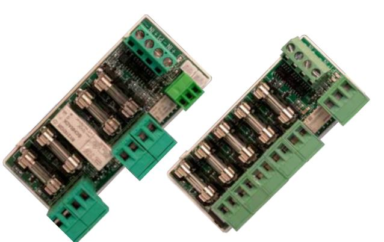
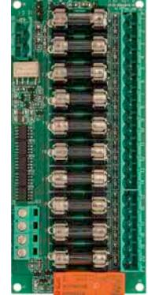
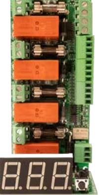

## **Avsäkringskort & Larmdonsövervakningskort**

2+2 output module 5 output module 10 output module Produktbeskrvining: **2+2 output module** Avsäkringskort utrustad med 2 st prioriterade utgångar & 2 st oprioriterade utgångar. Respektive utgång är 1-poligt avsäkrad. De oprioriterade utgångarna bryter spänningen vid ett potentiellt strömavbrott.Den oprioriterade funktionen fungerar endast om kortet ansluts till NEO Serien (5A & 10A) eller NOVA Serien. Kan monteras i ECO Medium, NEO Serien, NOVA Serien, 19 rack module holder samt möjlighet för montering på DIN skena via tillvalet; DIN module holder. **5 output module** Avsäkringskort med 5 st 1-poligt avsäkrade utgångar. Larm för utlöst lastsäkring via växlande relåutgång alt. pin list för anslutning till moderkort i Milletekniks batteribackup. Kortet är utrustad med 2x pin list för att kunna koppla vidare larmfunktion till fler tillvalskort. Kan monteras i ECO Medium, NEO Serien, NOVA Serien, 19 rack module holder samt möjlighet för montering på DIN skena via tillvalet; DIN module holder. **10 output module** Avsäkringskort utrustad med 10 st 1-poligt avsäkrade utgångar varav 3 av dem kan ställas in som oprioriterade utgångar via bygel De oprioriterade utgångarna bryter spänningen vid ett potentiellt strömavbrott. Den oprioriterade funktionen fungerar endast om kortet ansluts till NEO Serien (5A & 10A) eller NOVA Serien. Som standard levereras kortet med funktionen 10 st prioriterade utgångar. Kan monteras i NEO FLX M / L Serien, NOVA FLX M / L Serien, EN54 FLX M Serien och i 19 rack module holder. **Fire module 4 outputs** Larmövervakningsmodul har fyra individuellt styrbara utgångar med möjlighet till stjärnnät för upp till fem slingor på varje utgång. Larmfunktioner för såväl positiv som negativ logik. Larm för säkringsfel/slingfel. Display för enkel avläsning och konfigurering. Kan monteras i NEO FLX M / L Serien, NOVA FLX M / L Serien, EN54 FLX M Serien och i 19 rack module holder. Rekommenderad miljö och mått: 2+2 output module 5 output module 10 output module Fire module 4 outputs Rekommenderad miljö: Miljöklass 1, Inomhus, 20% ~ 90% relativ fuktighet Omgivningstemperatur: +5 °C - 40 °C Dimension (HxBxD): 30x40x89mm 30x40x89mm 24x55x120mm 52x55x120mm Elektrisk information: Inspänning: 24VDC 12VDC/24VDC 24VDC 24VDC Utspänning: 24VDC 12VDC/24VDC 24VDC 24VDC Antal spänningsingångar: 2 st 2 st 2 st 2 st Antal lastutgångar: 4 st 5 st 10 st 4 st Antal proriterade / oprioriterade utgångar: 2 / 2 5 / - 7 / 3 4 / - Typ av säkring som standard: 4xF2A (glas) enkelpoligt 5xF2A (glas) enkelpoligt 10xF2A (glas) enkelpoligt 4xF2A (glas) enkelpoligt Max last per utgång: 10A 10A 10A 5A Total max last: 10A 10A 16A 16A Larmfunktioner: Säkringsfel Säkringsfel Säkringsfel Säkringsfel eller slingfel Larm via: Växlande relä eller pin list Växlande relä eller pin list Växlande relä eller pin list Växlande relä eller pin list Möjlig för montering i följande produkter: ECO Serien: Medium Medium - - NEO Serien: 2x; FLX S. 3x; FLX M & FLX L 2x; FLX S. 3x; FLX M & FLX L 2x; FLX M & FLX L 2x; FLX M & FLX L NOVA Serien: 2x; FLX S. 3x; FLX M & FLX L 2x; FLX S. 3x; FLX M & FLX L 2x; FLX M & FLX L 2x; FLX M & FLX L EN54 Serien: 2x; FLX S. 3x; FLX M & FLX L 2x; FLX S. 3x; FLX M & FLX L 2x; FLX M & FLX L 2x; FLX M & FLX L Rack module holder (4U01000P00019P01) 12x 12x 4x 4x Artikelinformation: Artikelnamn: 2+2 output module 5 output module 10 output module Fire module 4 outputs Artikelnummer: A-FU00244OP01LM01 A-FU122405OP01LM01 A-FU002410OP01 A-FU002404FS01 E-nummer: 5213589 5213588 5213590 5257467 Produkten möter kraven enligt: EMC Direktivet 2014/30EU, Lågspännings direktivet: 2014/35/EU CE direktivet enligt:765/2008, Emission:EN61000-6-:2001, EN55022:1998:-A1:2000, A2:2003 Klass B, EN61000-3-2:2001. Immunity: EN61000-6-2:2005, EN61000-4-2, -3, 4, -5, -6, -11. Garantiperiod: 2 år Designad och producerad av: Milleteknik AB Ursprungsland: Sverige Fire module 4 outputs

POWER SUPPLIES - MADE IN SWEDEN

**Milleteknik AB** Ögärdesvägen 8B 433 30 Partille Sweden

För order: order@milleteknik.se För sälj support: sales@milleteknik.se För teknisk support: support@milleteknik.se Telefonnummer: +46 31 34 00 230