# BC1 Battery-Powered Camera

Used together with a base Station, the BC1 wire-free camera delivers well-rounded home protection for up to a full year on one single charge. The BC1 inherits EZVIZ's core technologies of color night vision, two-way talk, active defense, and more, showcasing unparalleled usability in any household.

### Add-on camera for expanded protection.

Color Night Vision

Defense

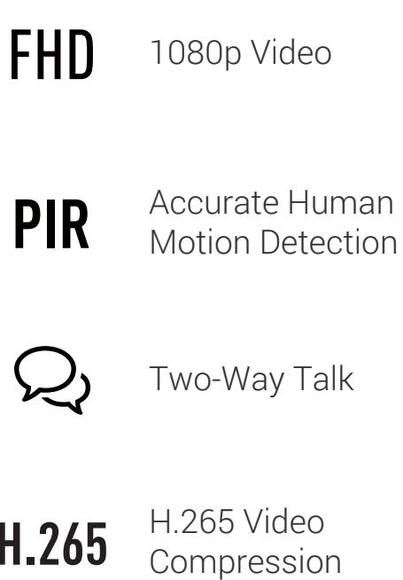

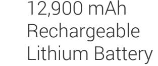

IP66 Dust and Water Protection

Must be Paired with

the Base Station

Customizable Voice Alerts

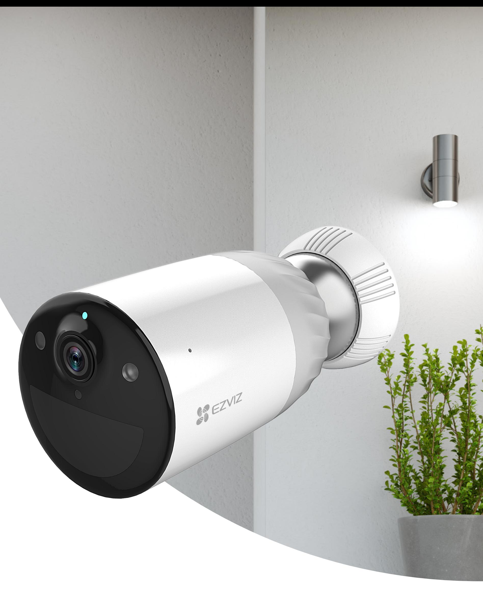

Supports 2.4 GHz Wi-Fi

Equipped with an impressive 12,900 mAh rechargeable battery, the BC1 can last for up to a year on one full battery charge, offering you 365-day* peace of mind.

### Year-long protection on a single charge.

Thanks to two built-in spotlights, the BC1 can render vivid color imaging even in pitch-black darkness. This allows you to see crucial details that would otherwise be lost.

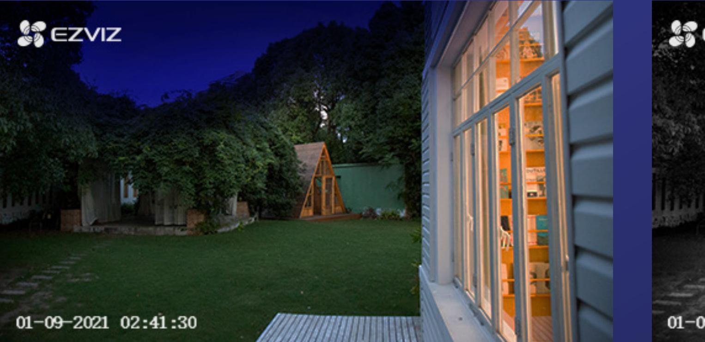

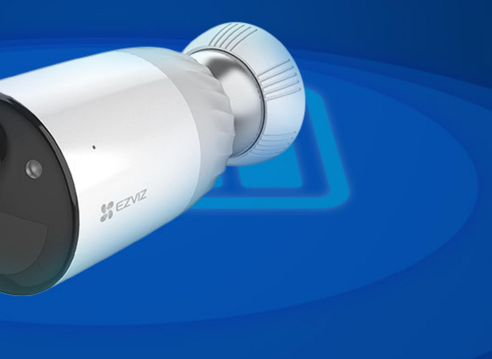

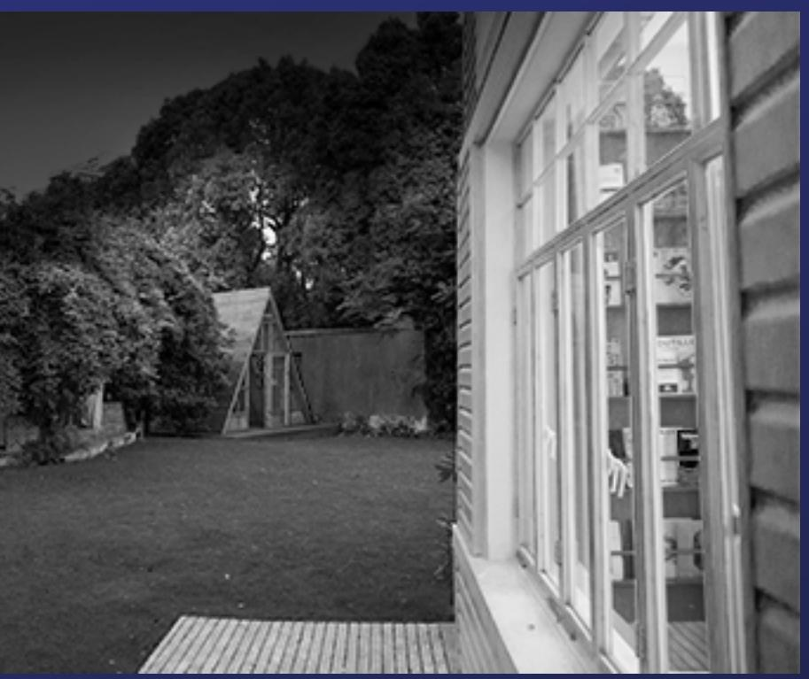

### Vivid night vision.

*Data comes from strict tests in the EZVIZ lab, under standard conditions.

Integrating a PIR sensor and the person-shape detection algorithm, the BC1 camera is intelligent enough to distinguish persons from other moving objects, keeping you safe while also reducing unwanted notifications.

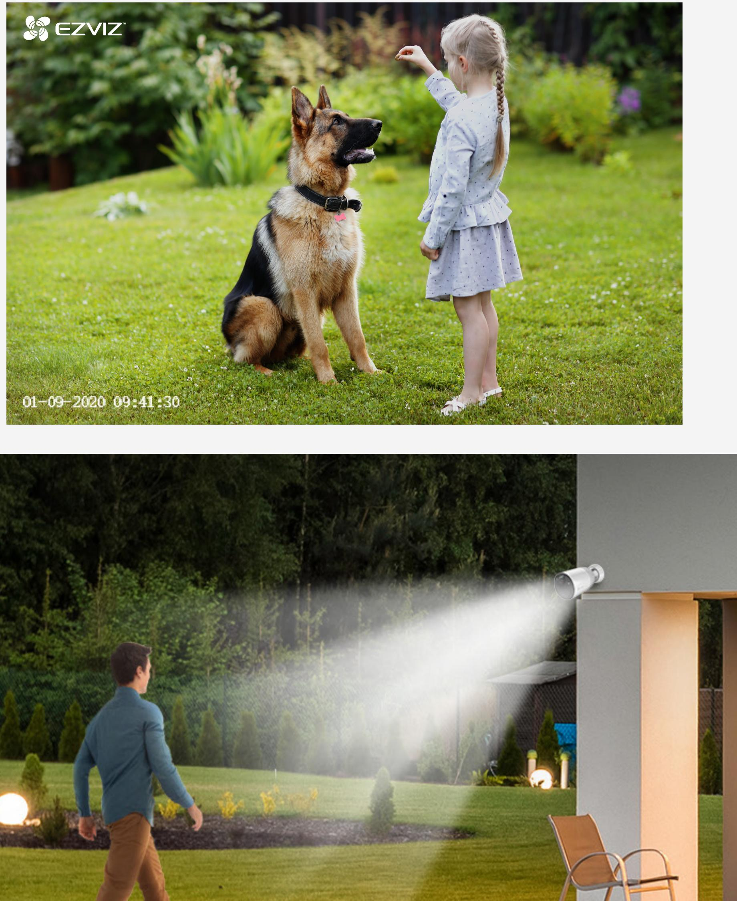

### Motion alerts are more accurate than ever.

Users can set specific time frames for detection. Once the camera detects a person-shape, the BC1 will automatically set off a siren and flash two spotlights* to let them know they have been detected.

#### A vigilant guard over your property.

*The spotlights will not flash when color night vision mode is enabled.

A thoughtful product by design, the BC1 allows you to create unique voice messages* for greeting or deterrence.

### Customizable voice messages.

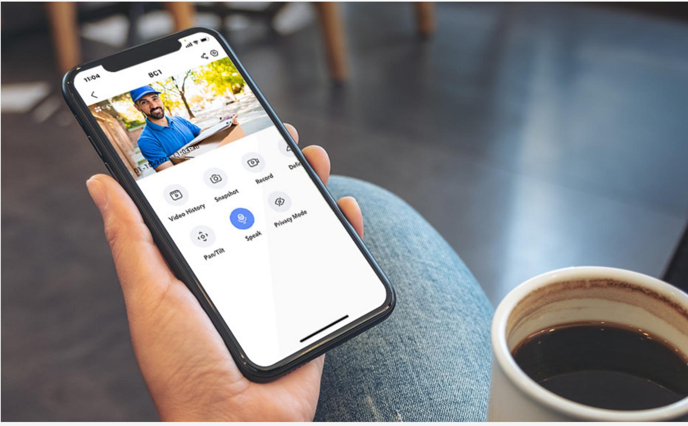

*Supports recording three 10-second audio messages.

See and hear what's going on and chat with your visitors—all with a tap on the EZVIZ App!

### Talk as if you were there.

The BC1 camera features an IP66 enclosure, offering high levels of protection against dust and water and delivering long-lasting protection in even the toughest weather conditions.

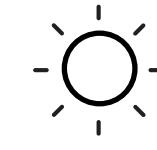

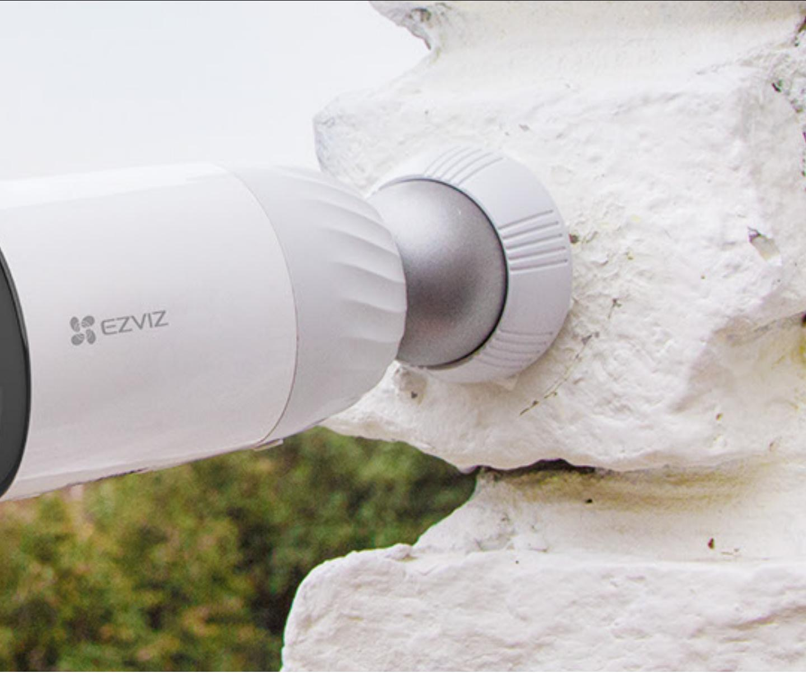

### Built to last.

Featuring a large battery, Wi-Fi connectivity, and a magnetic base, the BC1 camera requires exactly zero professional help in installation. Simply attach the camera to any metallic surface and it is good to go!

#### Fast and easy wire-free setup.

*Screw Base is also included as an additional installation option for you to screw the camera firmly onto the wall.

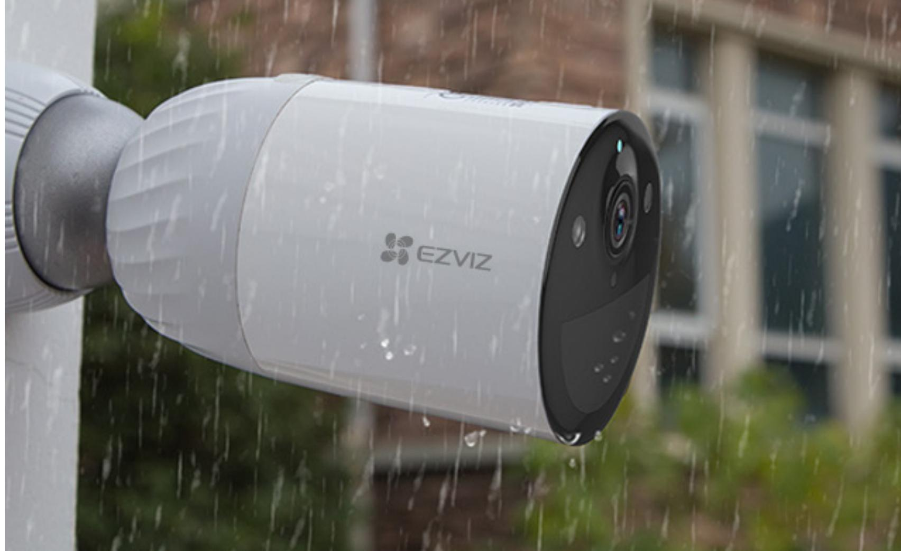

The BC1 camera features the advanced H.265 video compression technology, achieving better video quality with only half the bandwidth and half the storage space required by the previous H.264 video compression standard.

### BC1 helps you save money on storage and bandwidth. Storage

Protecting your data and privacy is our highest priority. Data transmission between the camera and the EZVIZ Cloud is encrypted from end to end. Only you have the keys to decrypt your data.

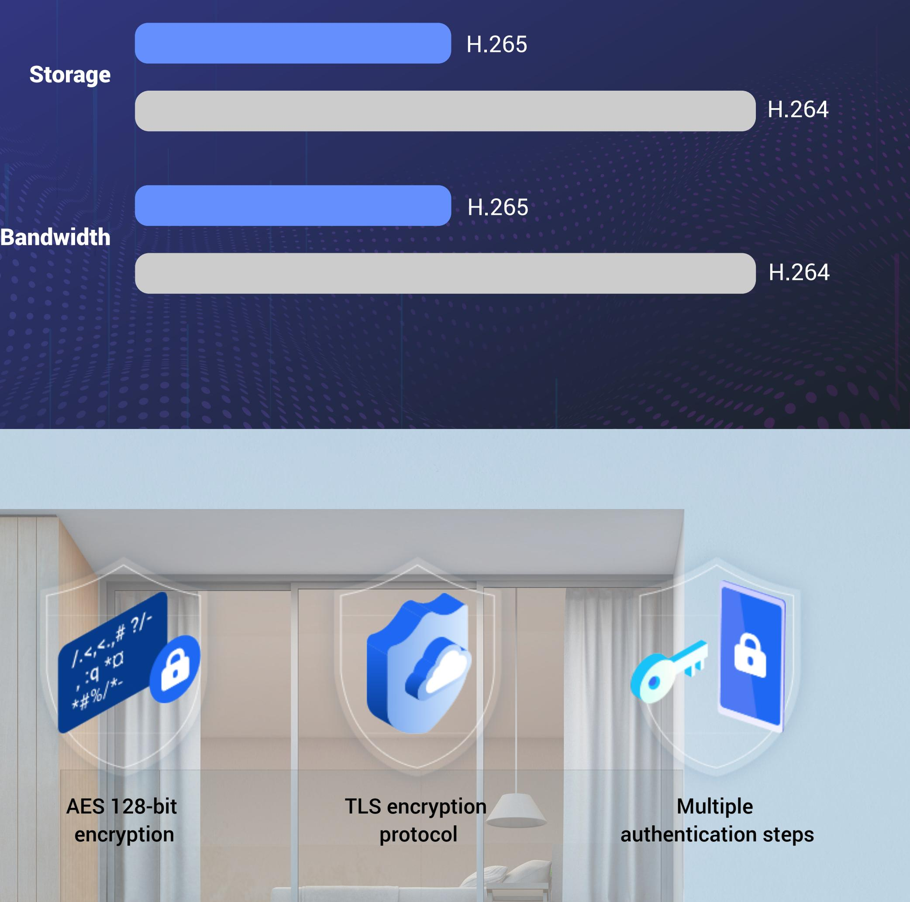

#### We protect your data and privacy.

## Specifications Model CS-BC1-A0-2C2WPBL

#### Camera Parameters

| Image sensor | 1/2.8" 2-Megapixel Progressive Scan CMOS Sensor    |
|--------------|----------------------------------------------------|
| Lens         | 2.8 mm @ F1.6; 128° (Diagonal), 108° (Horizontal)  |
| Lens Mount   | M12                                                |
| Night Vision | IR Distance:10m, IR-cut filter with auto-switching |

#### Audio Parameters

| Audio Input   | Built-in omnidirectional microphone |
|---------------|-------------------------------------|
| Audio Output  | Built-in loudspeaker                |
| Audio Quality | Noise suppression                   |

#### Event

Sensor PIR Motion Detection Sensor

Alarm Customized Alert Area

#### Video Parameters

| Video Compression | Smart H.265                                                                |  |
|-------------------|----------------------------------------------------------------------------|--|
| Max. Resolution   | FHD 1920 x 1080                                                            |  |
| Frame Rate        | 50Hz @ 25fps, 60Hz @ 30fps. Adaptive frame rate of network transmission |  |
| DNR               | 3D DNR                                                                     |  |
| WDR               | DWDR                                                                       |  |
|                   |                                                                            |  |

#### System Parameters

| Processor        | High-Performance Embedded SOC Processor |  |
|------------------|-----------------------------------------|--|
| Operating System | Linux                                   |  |
|                  |                                         |  |

#### Network Parameters and Storage

| Wireless                       | Built-in 2.4G Wi-Fi                               |
|--------------------------------|---------------------------------------------------|
| Network Configuration          | AP Pairing                                        |
| Minimum Network Requirement | 2Mbps                                             |
| Local Storage                  | Support MicroSD card up to 256 GB in Base Station |
| Cloud Storage                  | EZVIZ Cloud Storage                               |
|                                |                                                   |

#### General

| Operating Conditions | -20°C to 45°C (-4°F to 113 °F), Humidity 95% or less (non-condensing)                                                       |
|----------------------|--------------------------------------------------------------------------------------------------------------------------------|
| Power Supply         | 12900mAh Rechargeable Lithium Battery or 5V DC                                                                                 |
| Power Consumption    | Max. 5W                                                                                                                        |
| IP Grade             | IP 66                                                                                                                          |
| Dimensions           | Camera: 104.76 x 62.80 x 62.80 mm (4.12 x 2.47 x 2.47 inch) Base: 81.97 x 63.97 x 160.22 mm (3.23 x 2.52 x 6.31 inch) |
| Packaging Dimensions | 260.00 x 217.00 x 180.00 mm (10.24 x 8.54 x 7.09 inch)                                                                      |
| Weight               | 1304 g (46 oz)                                                                                                                 |
|                      |                                                                                                                                |

# In the box:

- BC1 Camera
- Magnetic Base
- Screw Base
- Power Adapter (For Camera)
- USB Cable
- Mounting plate
- Drill template
- Screw Kit
- Regulatory Information
- Quick Start Guide

CE/FCC/WEEE/ROHS/REACH/UL

# Certifications:

https://www.ezvizlife.com/

Specifications are subject to change without notice. " ", " " and other EZVIZ's trademarks and logos are the properties of EZVIZ in various jurisdictions. Other brands and product names are trademarks or registered trademarks of their respective holders.