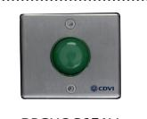

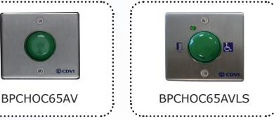

BPNONFCHOCCABHV

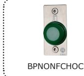

**BNONFCHOC BNONFCHOCCAB BPCHOC65AV BPCHOC65AVLS BPNONFCHOC BPNONFCHOCCAB BPNONFCHOCCABHV**

BPNONFCHOCCAB

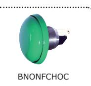

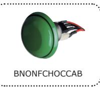

1

*Mushroom style push button*

# **1] PRODUCT PRESENTATION**

- *Ergonomic design with very sensitive switch.*
- *Easy to mount (19MM hole).*
- *Heavy duty.*
- *This high quality push button needs no dismantling to install the switch.*
- *Available in versions :*
	- Flush mount
	- Stainless steel plate
	- Precabled or not
	- Surface mount with stainless steel housing (CBP)
- Stainless steel plate, LED and buzzer
- *Colour: Green or silver (velour finish).*
- *Input voltage:* 12V 5 A.
- Material: cast aluminium body and stainless steel.
- Push button with Silver plated contact switch
- certicated UL, CSA & SEMKO.
- Soldering contact output :
- BNONFCHOC
- BPNONFCHOC (with stainless steel plate)
- BPCHOC65AV (with stainless steel plate)
- BPCHOC65AVLS (plate, LED and Buzzer)
- Precabled output :

HIGH RESISTANCE

TO VANDALISM

- BNONFCHOCCAB
- BPNONFCHOCCAB (with stainless steel plate)
- BPNONFCHOCCABHV (plate, LED and Buzzer)
- NO and NC contact outputs with 2 separate contacts.

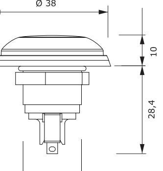

40 8 10

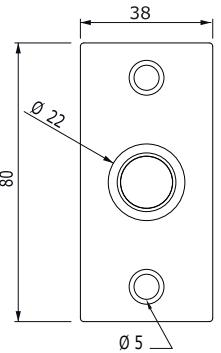

*This push button range complies with the "disability act"*

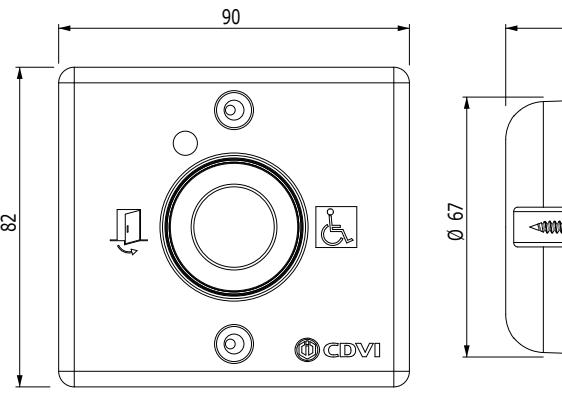

** BNONFCHOC and BNONFCHOCCAB versions.*

*Environmental tests: Salt spray*

*IP53 or IP68**

*-40°C à +85°C*

*The dynamic sealing rubber washer and the rubber washer mounted at the front side isolate totally the electronic.*

Mushroom style push button

# **2] MOUNTING**

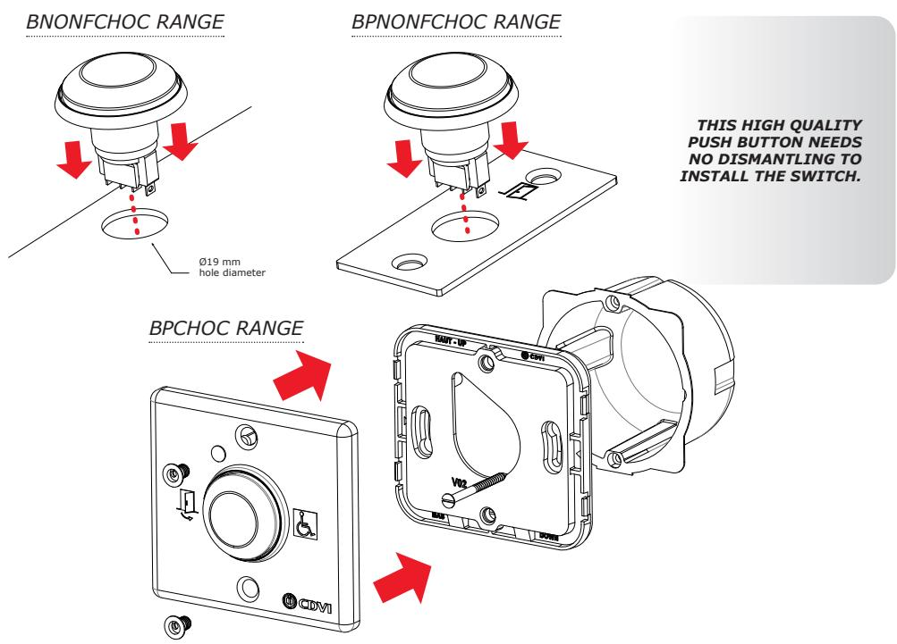

# **3] WIRING DIAGRAM WITHOUT BUZZER**

- Normally Open ( NO ) = 3 + 4,
- Normally closed ( NC ) = 1 + 2.

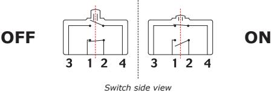

### **4] WIRING DIAGRAM WITH BUZZER** BPNONFCHOCCABHV

### **OPERATING MODE**

*Buzzer + Green LED = ON (When prerssing on the push button)*

### **STAND-BY MODE**

*Buzzer + Green LED = OFF*

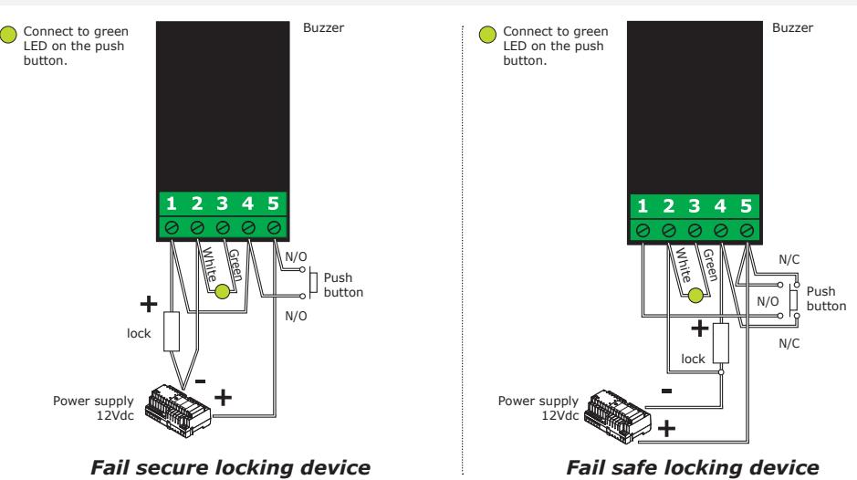

### **PUSH BUTTON ONLY**

*Fail safe locking device*

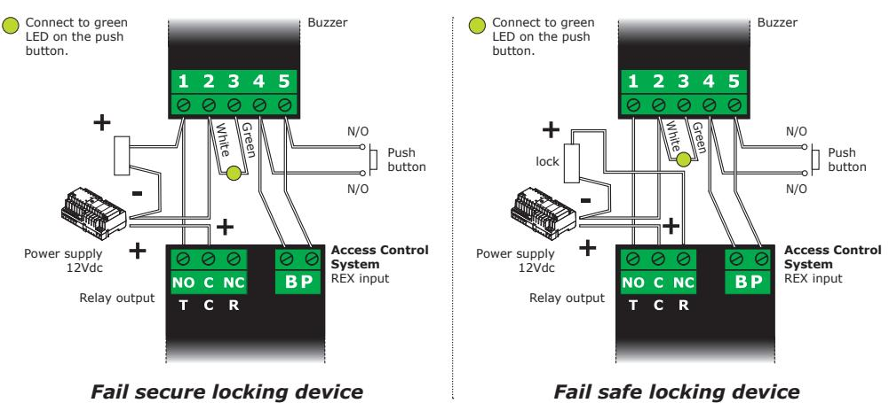

# **PUSH BUTTON WITH ACCESS CONTROL SYSTEM**

| NOTES |
|-------|

# **1] PRODUKTSPECIFIKATION**

- *Ergonomisk design med väldigt känslig brytare. Enkel att montera (19MM hål). Klarar hög belastning. Denna hög kvalitativa tryckknapp behöver inte plockas isär vid montering. Finns i olika utföranden :* - Infällt montage - Med rostfri platta - Med eller utan kabel - Utanpåliggande montage med rostfri kapsling (CBP) - Rostfri platta, med LED och summer  *Färger: Grön eller silver. Spänningsmatning:* 12V - 5 A. Material: aluminium kropp och rostfritt stål. Tryckknapp med silverplaterad kontakt certifierad enl. UL, CSA & SEMKO. Stift : - BNONFCHOC, - BPNONFCHOC (med rostfri platta) - BPCHOC65AV (med rostfri platta) - BPCHOC65AVLS (med rostfri platta, LED och summer) Kablage på stiften : - BNONFCHOCCAB, - BPNONFCHOCCAB (med rostfri platta) - BPNONFCHOCCABHV (med rostfri platta, LED och summer) Separat NO och NC utgång. HIGH RESISTANCE TO VANDALISM *Tryckknapparna i denna serien är anpassade för funktionsnedsatta.* 90
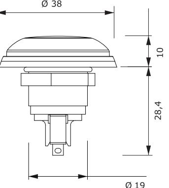

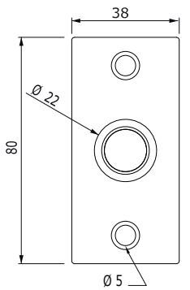

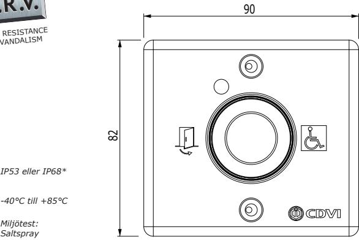

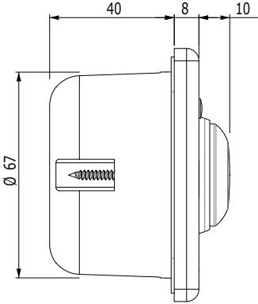

** BNONFCHOC och BNONFCHOCCAB versioner.*

*Den dynamiska gummipackningen och gummipackningen på framsidan gör att elektrioneken är helt isolerad.*

# **2] MONTAGE**

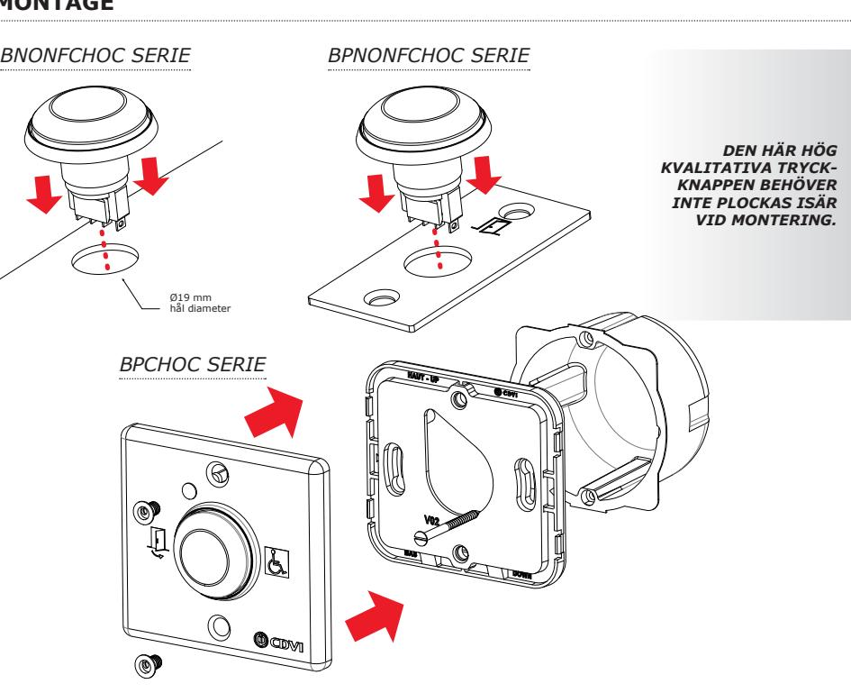

# **3] INKOPPLINGAR UTAN SUMMER**

- Normalt öppen ( NO ) = 3 + 4,
- Normalt sluten ( NC ) = 1 + 2.

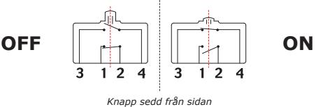

### **4] INKOPPLINGAR MED SUMMER** BPNONFCHOCCABHV

### **VID AKTIVERING**

*Summer + Grön LED = PÅ (När man trycker på knappen)* **STAND-BY LÄGE**

*Summer + Grön LED = AV*

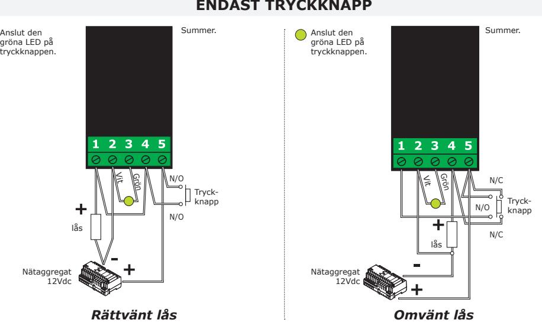

### **TRYCKKNAPP TILLSAMMANS MED PASSAGESYSTEM**

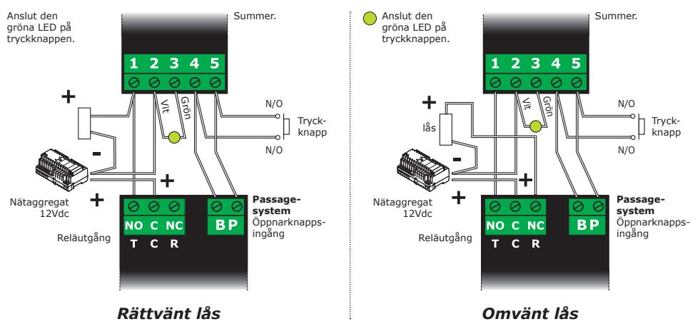

### **ANTECKNINGAR**

**1] PRODUKTSPECIFIKATION**

- *Ergonomisk design med meget følsom knap.*
- *Nem at montere (19 mm. hul).*
- *Kan klare høj belastning.*
- *Denne knap af høj kvalitet skal ikke afmonteres ved installering af kontakt.*

Grøn trykknap

- *Fås i versionerne:*
	- Indfældet montering.
	- Med rustfri stålplade.
	- Med eller uden kabel.
	- Overflademontering med rustfri kapsling (CBP).
	- Rustfri stålplade med LED og summer.
- *Farver: Grøn eller sølv.*
- *Input-spænding:* 12V 5A.
- Materiale: Støbt aluminium og rustfrit stål.
- Trykknap med forsølvet kontakt certificeret i henhold til UL, CSA & SEMKO.
- Udgang med pin.
- BNONFCHOC.
- BPNONFCHOC (med rustfri stålplade).
- BPCHOC65AV (med rustfri stålplade).
- BPCHOC65AVLS (plade, LED and summer).
- Udgang med kabler.
	- BNONFCHOCCAB.
	- BPNONFCHOCCAB (med rustfri stålplade).
	- BPNONFCHOCCABHV (plade, LED and summer).
- Separat NO- og NC-udgang.

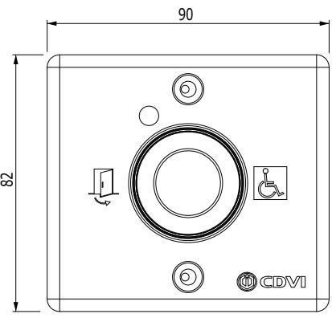

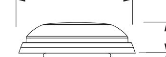

*Trykknapperne i denne serie er tilpasset brugere med funktionsnedsættelser.*

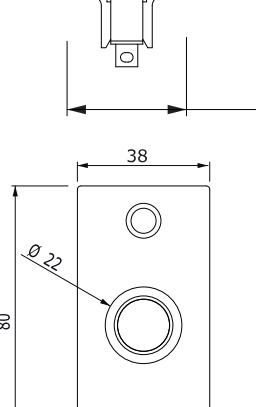

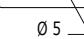

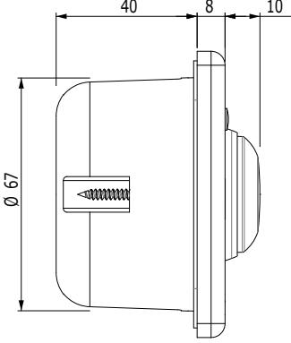

**BNONFCHOC DK DK**

10 cdvigroup.com

*Miljøtest: saltspray* 

HIGH RESISTANCE

TO VANDALISM

*IP53 eller IP68**

*-40°C til +85°C*

** BNONFCHOC og BNONFCHOCCAB.*

*Den dynamiske gummipakning og gummipakningen på forsiden gør, at elektronikken er helt isoleret.*

# **2] MONTERING**

# **3] KOBLINGSSKEMA UDEN BUZZER/SUMMER**

- Normalt åben ( NO ) = 3 + 4.
- Normalt lukket ( NC ) = 1 + 2.

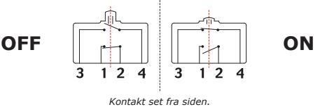

### **4] KOBLINGSSKEMA MED BUZZER/SUMMER** BPNONFCHOCCABHV

#### **DRIFTSTILSTAND**

*Summer + Grøn LED = ON (Ved tryk på den grønne trykknap)*  **STANDBY-TILSTAND**

*Summer + Grøn LED = OFF*

### **TRYKKNAP SAMMEN MED ADGANGSKONTROLSYSTEM**

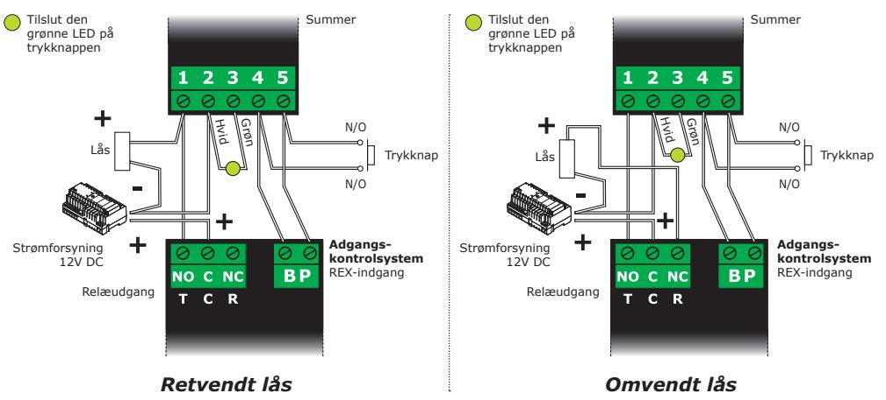

| NOTER |
|-------|
|       |

**Extranet :** CDVI_IM BNONFCHOC CMYK A5 EN-SE-DK 01

**CDVI Group** FRANCE (Headquarters) Phone: +33 (0) 1 48 91 01 02

**CDVI FRANCE + EXPORT** +33 (0) 1 48 91 01 02 www.cdvi.com

**CDVI AMERICAS [CANADA - USA]** +1 (450) 682 7945 www.cdvi.ca

#### **CDVI BENELUX [BELGIUM - NETHERLANDS - LUXEMBOURG]**

+32 (0) 56 73 93 00 www.cdvibenelux.com

**CDVI TAIWAN** +886 (0) 42471 2188 www.cdvichina.cn

**CDVI SUISSE** +41 (0) 21 882 18 41 www.cdvi.ch

**CDVI CHINA** 

+86 (0) 10 84606132/82 www.cdvichina.cn

**CDVI IBÉRICA [SPAIN - PORTUGAL]** +34 (0) 935 390 966

www.cdviberica.com **CDVI ITALIA** +39 (0) 321 90 573 - www.cdvi.it

**CDVI MAROC** +212 (0) 5 22 48 09 40 www.cdvi.ma

**CDVI NORDICS [SWEDEN - DENMARK - NORWAY - FINLAND]** +46 (0) 31 760 19 30

www.cdvi.se

**CDVI UK [UNITED KINGDOM - IRELAND]** +44 (0) 1628 531300 www.cdvi.co.uk

**CDVI POLSKA** +48 (0) 12 659 23 44 www.cdvi.com.pl

*All the information contained within this document (pictures, drawings, features, specifications and dimensions)could be perceptibly different and can be changed without prior notice.*

# **www.cdvigroup.com**