BPNONFE

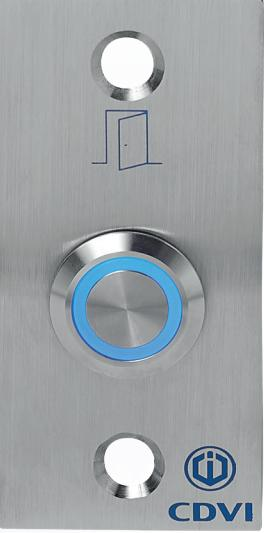

BNONFE

# **BNONFE BPNONFE**

*Illuminated push button 12Vdc*

1

#### **1] PRODUCT PRESENTATION**

- *Illuminated (blue).*
- *Easy to mount (19mm hole).*
- *Heavy duty.*
- *Available in versions :*
	- *Flush mount (BNONFE),*
	- *With a stainless steel plate (BPNONFE).*
- *Input voltage:*
	- *Contact : 12V 5 A*
	- *LED : 12Vdc*
- Material: cast aluminium body and stainless steel.
- Push button with Silver plated contact switch.
- Wires with lug supplied.
- NO and NC contact outputs with 2 separate contacts.

*Environmental tests: Salt spray*

*IP67 -40°C to +70°C*

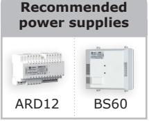

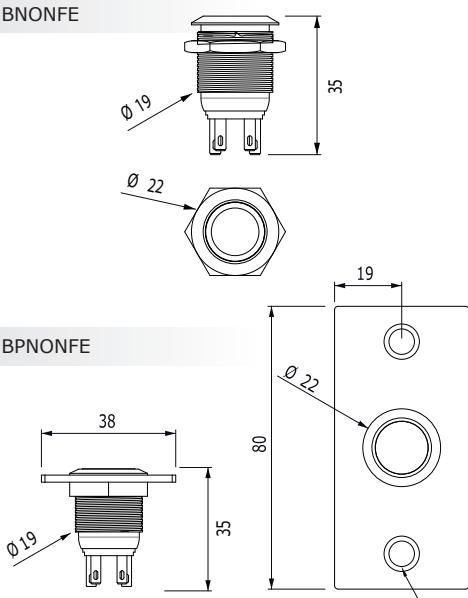

#### **3] WIRING DIAGRAM**

- Normally Open ( NO ) = 3 + 4,
- Normally closed ( NC ) = 1 + 2.

#### **2] MOUNTING**

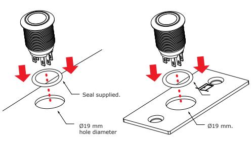

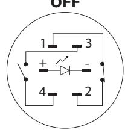

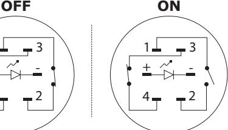

Ø 5

*Switch bottom view*

| CABLE COLORS |       |  |
|--------------|-------|--|
| 1            | Black |  |
| 2            | Black |  |
| 3            | Red   |  |
| 4            | Red   |  |
| 12V          | Blue  |  |
| 0V           | Grey  |  |

| NOTES |  |
|-------|--|
|-------|--|

#### **1] PRODUKTSPECIFIKATION**

- *Bakgrundsbelyst (blå).*
- *Enkel att installera (19MM hål).*
- *Klarar hög belastning.*
- *Finns i olika utföranden :*
	- *Infällt montage (BNONFE),*
- *Med rostfri platta (BPNONFE).*
- *Spänningsmatning - Kontakt : 12V - 5 A*
- *LED : 12Vdc*
- Material: aluminium kropp och rostfritt stål

HIGH RESISTANCE

TO VANDALISM

**Rekommenderade nätaggregat**

ARD12 BS60

- Tryckknapp med silverplaterad kontakt.
- Kablage på stift.

*IP67*

*Miljötest: Saltspray*

*-40°C till +70°C*

- Separat NO och NC utgång.
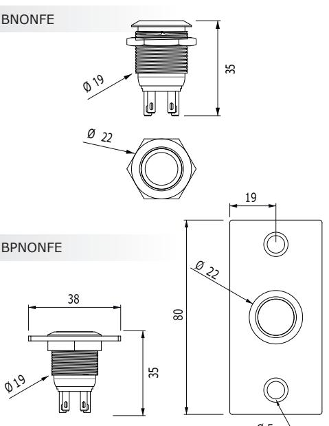

#### **3] INKOPPLINGAR**

- Normalt öppen ( NO ) = 3 + 4,
- Normalt sluten ( NC ) = 1 + 2.

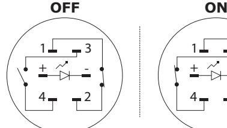

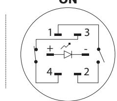

Ø 5

*Knapp sedd från undersidan*

| Kablage |       |  |
|---------|-------|--|
| 1       | Svart |  |
| 2       | Svart |  |
| 3       | Röd   |  |
| 4       | Röd   |  |
| 12V     | Blå   |  |
| 0V      | Grey  |  |

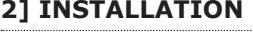

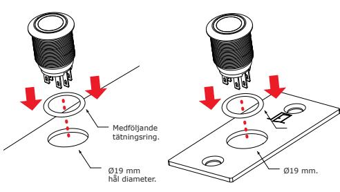

#### **ANTECKNINGAR**

Bakgrundsbelyst tryckknapp 24Vdc

Baggrundsbelyst trykknap 12Vdc

- *Baggrundsbelyst (blå).*
- *Nem at montere (19 mm. hul).*
- *Kan klare høj belastning.*
- *Fås i versionerne:*
	- *Indfældet montering (BNONFE).*
	- *Med rustfri stålplade (BPNONFE).*
- *Input-spænding:* 
	- *Kontakt: 12V 5 A.*
	- *LED: 12V DC.*
- Materiale: støbt aluminium og rustfrit stål.
- Trykknap med sølvbelagt kontakt.
- Pin kabler følger med.
- NO- og NC-udgang med 2 separate kontakter.

*IP67 Miljøtest: Saltspray* 

ARD12 BS60 **Anbefalede strømforsyninger** 

## **2] MONTERING**

*-40°C til +70°C*

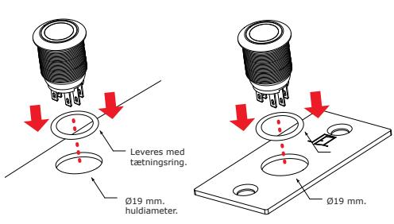

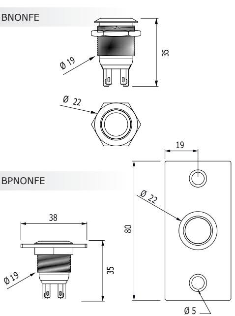

#### **3] KOBLINGSSKEMA**

- Normalt åben (NO)= 3 + 4.
- Normalt lukket (NC)= 1 + 2.

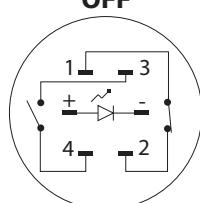

*Knap set nedefra* 

| KABELFARVER |      |  |
|-------------|------|--|
| 1           | Sort |  |
| 2           | Sort |  |
| 3           | Rød  |  |
| 4           | Rød  |  |
| 12V         | Blå  |  |
| 0V          | Grå  |  |

| NOTER |  |
|-------|--|
|-------|--|

**DK DK**

**Extranet :** CDVI_IM BNONFE - BPNONFE CMYK A5 EN-SE-DK 01

**CDVI Group** FRANCE (Headquarters) Phone: +33 (0) 1 48 91 01 02

**CDVI FRANCE + EXPORT** +33 (0) 1 48 91 01 02 www.cdvi.com

**CDVI AMERICAS [CANADA - USA]** +1 (450) 682 7945 www.cdvi.ca

#### **CDVI BENELUX [BELGIUM - NETHERLANDS - LUXEMBOURG]**

+32 (0) 56 73 93 00 www.cdvibenelux.com

**CDVI TAIWAN** +886 (0) 42471 2188 www.cdvichina.cn

**CDVI SUISSE** +41 (0) 21 882 18 41 www.cdvi.ch

**CDVI CHINA** 

+86 (0) 10 84606132/82 www.cdvichina.cn

**CDVI IBÉRICA [SPAIN - PORTUGAL]** +34 (0) 935 390 966

www.cdviberica.com **CDVI ITALIA** +39 (0) 321 90 573 - www.cdvi.it

**CDVI MAROC** +212 (0) 5 22 48 09 40 www.cdvi.ma

**CDVI NORDICS [SWEDEN - DENMARK - NORWAY - FINLAND]** +46 (0) 31 760 19 30

www.cdvi.se

**CDVI UK [UNITED KINGDOM - IRELAND]** +44 (0) 1628 531300 www.cdvi.co.uk

**CDVI POLSKA** +48 (0) 12 659 23 44 www.cdvi.com.pl

*All the information contained within this document (pictures, drawings, features, specifications and dimensions)could be perceptibly different and can be changed without prior notice.*

### **www.cdvigroup.com**