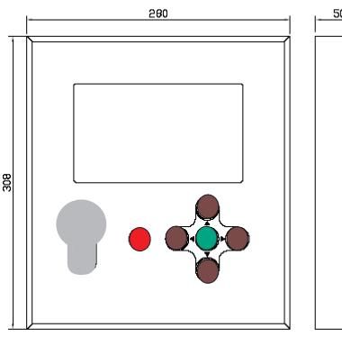
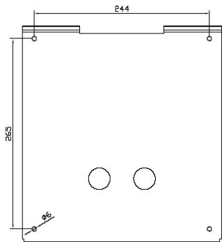
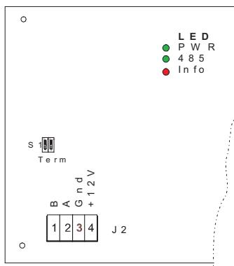
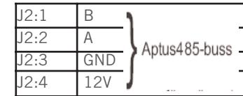
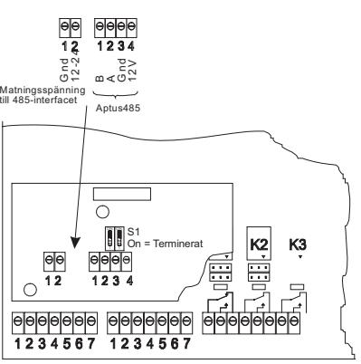

# **BOKA 1306**

# **INSTALLATIONSANVISNING**

**Revision 1**

# **INSTALLATION 2**

#### **ALLMÄNT**

Bokningstavla för Aptus traditionella bokningssystem. Tavlan är försedd med integrerad läsare och grafisk display. Obs! 485-kommunikation till centralenhet, (Aptus485-buss).

#### **TEKNISKA DATA**

|                 | Strömförsörjning: 12 V DC reglerad (10.5 - 14). |  |
|-----------------|-------------------------------------------------|--|
|                 | Max 0.8A, Min 0.18A (vid 12V).                  |  |
|                 | Matning från centralenheten.                    |  |
| Miljökrav:      | 0 till +40 grader Celcius                       |  |
|                 | 10 till 90% luftfuktighet                       |  |
|                 |                                                 |  |
| Mått:           | 280x308x50 mm                                   |  |
| Vikt:           | 3.6Kg                                           |  |
| Monteringshöjd: | 1220 mm underkant                               |  |

## **PACKLISTA**

- 1 st Boka 1306, Bokningstavla med läsare
- 4 st Träskruv
- 1 st Ferrit
- 1 st Installationsanvisning (denna)

# **SYSTEMBESKRIVNING** Centralenhet Aptus485

## **MONTERING**

Enheten är avsedd för utanpåliggande montage. Dra fram kablaget så att det passar till bakstyckets genomföringshål. För kablaget genom bottenplattan och skruva fast bakstycket i väggen. Anslut i plint J2. Fäst tavlan i bakstycket och skruva fast tavlan med tillhörande säkerhetsskruvskruv.

### **INKOPPLINGSANVISNING**

Tavlan ansluts till centralen med partvinnad kabel. Förlägg ett par till 485 (A+B) och spänning (12V+GND) i det andra paret.

Kabelarean skall minst vara 0.5mm2 för spänningsmatningen. Vid längre avstånd skall arean ökas. Använd gärna Aptuskabeln som är framtagen för detta ändamål. Den är en 2-pars kabel med grövre area i ena paret: 2x0.15mm2 + 2x1.0mm2.

Tavlan kopplas till centralen över Aptus485-bussen. Sammanlagda busslängden får ej överstiga 200 meter per central.

Se till att signalkabeln är cirka 10 cm längre än vad som krävs, för att kunna ta isär enheten vid behov.

Anslut J2 på tavlan till centralens 485-interface. **Obs!** Det skall vara ett 485-interface i bokningscentral som hanterar Boka 1306. 485BTinterface eller 485PT-interface kan ej användas.

Bilden ovan visar anslutning i tavlan.

Bilden till höger visar central med ett 485-interface monterat. Observera att interfacet måste anslutas till centralens spänningsmatning via den tvåpoliga plinten.

**3**

Snäpp fast den medskickade ferriten runt installationskabeln precis innan denna lämnar kapslingen.

Maximalt avstånd mellan central och Boka 1306 beror på arean till spänningsmatningen och givetvis om andra enheter är anslutna till Aptus485-bussen. Vid dimensionering av kabelarea måste hänsyn tas till att tavlan drar mer ström ju lägre spänningen är. Vid minspänningen 10.5V drar tavlan 900mA.

Om kabelarean är 1mm2 kan avståndet mellan tavla och central vara drygt 40meter. Vill du sätta tavlan på 100m måste du gå upp till 1.6mm2.

#### **LYSDIODER**

Tavlan har tre lysdioder: LED PWR, LED 485 och LED Info. LED PWR: Lyser grönt när tavlan är spänningssatt.

LED 485: Blinkar vid kommunikation på Aptus485-bussen.

Obs! Lysdioderna är endast synliga när bakstycket är demonterat.

#### **INSTÄLLNINGAR**

| Terminering | ON,ON => Terminering inkopplad. Endast |
|-------------|----------------------------------------|
|             | ändpunkterna av bussen termineras.     |
|             | Boka 1306 levereras oterminerad.       |
|             |                                        |
|             |                                        |
|             |                                        |

#### **VARNING**

Det finns hög spänning, ca 1000V, på det lilla kretskortet i kapslingens överkant. Kretsen är märkt med en varnings och skyddsetikett med texten: "Caution, High Voltage". Undvik beröring.

#### **SYSTEMKRAV**

MultiAccess från version 7.3. BC 700 från version R1.

#### **PROGRAMMERING**

När Boka 1306 är inkopplad kan du få in den i MultiAccess genom att hämta hårdvara. En ny enhet med namnet "Boka" skall komma upp. Under denna finns resurserna display och läsare. På resursen "läsare" skall du ange vilken dörr som läsaren används till. Övrig programmering av bokningsfunktioner görs under enheten "Bokningskort utan tavla". Där finns boknings-typer, -grupper och

Avsluta programmeringen med att sända data.

#### **AVPROVNING**

objekt.

Kontrollera en extra gång att alla signalledare är rätt inkopplade innan anläggningen spänningssätts.

#### **GARANTI**

Aptus Elektronik AB lämnar två års garanti på material och fabrikationsfel på samtliga produkter. Övrigt enligt leveransbestämmelser NL01.

#### **SERVICE**

För service hänvisar APTUS Elektronik AB till ansvarig återförsäljare som utöver egen kompetens har kontinuerlig kontakt med APTUS Elektronik AB.