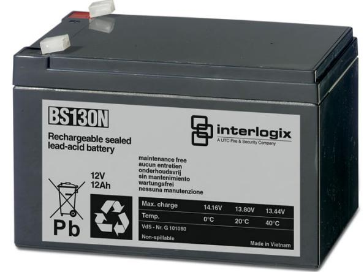

## Produktblad

# BS130N

Underhållsfri ackumulator 12 V, 12 Ah

### BS130N

Underhållsfri blyackumulator lämplig för kontinuerlig underhållsladdning, exempelvis inbrottslarms- och brandlarmscentraler.

#### Standardprestanda

- EUnderhållsfritt
- E Lång livslängd
- ETemperaturokänslig
- EUppladdningsbart
- ELäckagefri konstruktion

# BS130N

Underhållsfri ackumulator 12 V, 12 Ah

### Tekniska data

| Strömförsörjning            | 12 VDC           |
|-----------------------------|------------------|
| Kapacitet                   | 12 Ah            |
| Max laddning vid +20°       | 13,8 VDC         |
| Max laddningsström          | 7,8 A            |
| Max urladdning              | 130 A            |
| Internal approx. resistance | 10 mohm          |
| Temperatur                  |                  |
| Laddning                    | 0 till 40 °C     |
| Drift                       | -15 till +50 °C  |
| Lagring                     | -15 till +40 °C  |
| Anslutningar                | Kabelsko 6,35 mm |
| Materiel                    | ABS              |
| Fire retardant              | -                |
| Vikt                        | 4,27 kg          |
| Dimension (BxHxD)           | 151x93x98 mm     |

Order data

| Artikelnummer | Beskrivning                           |
|---------------|---------------------------------------|
| BS130N        | Underhållsfri ackumulator 12 V, 12 Ah |

