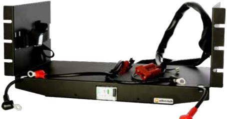
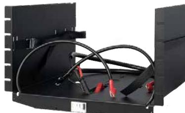
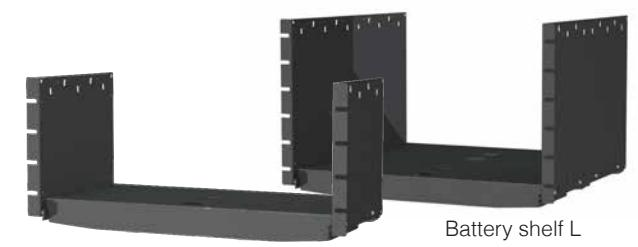
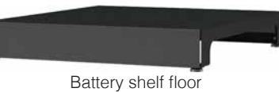

## **Batterihyllor**

Battery shelf 24V M

Battery shelf M

För sälj support: sales@milleteknik.se För teknisk support: support@milleteknik.se Telefonnummer: +46 31 34 00 230

Battery shelf 24V L

| Produktinformation:                           |                                                                                                                                                                                                                                                                                                                                                                                            |                                             |                     |                                                                                                                       |                                                                                                                       |
|-----------------------------------------------|--------------------------------------------------------------------------------------------------------------------------------------------------------------------------------------------------------------------------------------------------------------------------------------------------------------------------------------------------------------------------------------------|---------------------------------------------|---------------------|-----------------------------------------------------------------------------------------------------------------------|-----------------------------------------------------------------------------------------------------------------------|
| Battery shelf 24V M                           | Batterihylla med plats för upp till 2x 45Ah batterier. Levereras med färdigt kablage för anslutning emot batterierna, automatsäkring emellan batterier samt färdig kabel för anslutning emot batteribackupen. Hyllan är avsedd för 19" rackmontage. Observera att "Adapter FLX to Batteryshelfs" skall användas om produkten skall nyttjas tillsammans med NEO / NOVA / EN54 FLX M.  |                                             |                     |                                                                                                                       |                                                                                                                       |
| Battery shelf 24V L                           | Batterihylla med plats för upp till 2x 150Ah batterier. Levereras med färdigt kablage för anslutning emot batterierna, automatsäkring emellan batterier samt färdig kabel för anslutning emot batteribackupen. Hyllan är avsedd för 19" rackmontage. Observera att "Adapter FLX to Batteryshelfs" skall användas om produkten skall nyttjas tillsammans med NEO / NOVA / EN54 FLX M. |                                             |                     |                                                                                                                       |                                                                                                                       |
| Battery shelf M                               | Batterihylla med plats för upp till 2x 45Ah batterier. Levereras exkl. kablage och automatsäkring. Hyllan är avsedd för 19" rackmontage.                                                                                                                                                                                                                                                   |                                             |                     |                                                                                                                       |                                                                                                                       |
| Battery shelf L                               | Batterihylla med plats för upp till 2x 150Ah batterier alternativt upp till 4x 150Ah front terminal batterier. Levereras exkl. kablage och automat säkring. Hyllan är avsedd för 19" rackmontage. Används med fördel tillsammans med med våra "Battery connection panels" vid användning av front terminal batterier.                                                                |                                             |                     |                                                                                                                       |                                                                                                                       |
| Battery shelf floor                           | Batterihylla för golvmontage med plats för upp till 2x 150Ah batterier alternativt upp till 4x 150Ah front terminal batterier. Levereras exkl. kabla ge och automatsäkring. Golvhyllan är avsedd för placering emellan rackstolparna i ett 19" rack. Används med fördel tillsammans med med våra "Battery connection panels" vid användning av front terminal batterier.             |                                             |                     |                                                                                                                       |                                                                                                                       |
| Rekommenderad miljö och kapslingsinformation: | Battery shelf 24V M                                                                                                                                                                                                                                                                                                                                                                        | Battery shelf 24V L                         | Battery shelf M     | Battery shelf L                                                                                                       | Battery shelf floor                                                                                                   |
| Rekommenderad miljö:                          | Miljöklass 1, Inomhus, 20% ~ 90% relativ fuktighet                                                                                                                                                                                                                                                                                                                                         |                                             |                     |                                                                                                                       |                                                                                                                       |
| Omgivningstemperatur:                         | +5 °C - 40 °C (För optimal batterilivslängd +15 °C - +25 °C)                                                                                                                                                                                                                                                                                                                               |                                             |                     |                                                                                                                       |                                                                                                                       |
| Skyddsklass:                                  | IP20                                                                                                                                                                                                                                                                                                                                                                                       |                                             |                     |                                                                                                                       |                                                                                                                       |
| Rekommenderad montering:                      | 19" rack                                                                                                                                                                                                                                                                                                                                                                                   |                                             |                     |                                                                                                                       | Golvmontage                                                                                                           |
| Dimension (HxBxD):                            | 215x438x200mm (5HE)                                                                                                                                                                                                                                                                                                                                                                        | 290x490x430mm (7HE)                         | 215x438x200mm (5HE) | 290x490x430mm (7HE)                                                                                                   | 130x448x500mm (3HE)                                                                                                   |
| Nettovikt:                                    | 7kg                                                                                                                                                                                                                                                                                                                                                                                        | 10kg                                        | 3kg                 | 5kg                                                                                                                   | 5kg                                                                                                                   |
| Kapslingens färg:                             |                                                                                                                                                                                                                                                                                                                                                                                            |                                             | Svart               |                                                                                                                       |                                                                                                                       |
| Elektrisk information:                        |                                                                                                                                                                                                                                                                                                                                                                                            |                                             |                     |                                                                                                                       |                                                                                                                       |
| Inspänning /Utspänning:                       | 27,3VDC / 27,3VDC - -                                                                                                                                                                                                                                                                                                                                                                |                                             |                     |                                                                                                                       |                                                                                                                       |
| Artikel information:                          |                                                                                                                                                                                                                                                                                                                                                                                            |                                             |                     |                                                                                                                       |                                                                                                                       |
| Artikelnamn:                                  | Battery shelf 24V M                                                                                                                                                                                                                                                                                                                                                                        | Battery shelf 24V L                         | Battery shelf M     | Battery shelf L                                                                                                       | Battery shelf floor                                                                                                   |
| Artikelnummer:                                | BS010000024BM01                                                                                                                                                                                                                                                                                                                                                                            | BS020000024BL01                             | BS010000000BM01     | BS020000000BL01                                                                                                       | BS030000000BF01                                                                                                       |
| E-nummer:                                     | 5213578                                                                                                                                                                                                                                                                                                                                                                                    | 5213587                                     | -                   | 5213624                                                                                                               | 5213510                                                                                                               |
| Produkten möter kraven enligt:                | EMC Direktiv 2014/30EU, Lågspännings direktivet: 2014/35/EU CE direktivet enligt:765/2008, Emission:EN61000-6-:2001, EN55022:1998:-A1:2000, A2:2003 Klass B, EN61000-3-2:2001. Immunity: EN61000-6-2:2005, EN61000-4-2, -3, 4, -5, -6, -11.                                                                                                                                             |                                             |                     |                                                                                                                       |                                                                                                                       |
| Garantiperiod:                                |                                                                                                                                                                                                                                                                                                                                                                                            |                                             | 2 år                |                                                                                                                       |                                                                                                                       |
| Designad och producerad av:                   | Milleteknik AB                                                                                                                                                                                                                                                                                                                                                                             |                                             |                     |                                                                                                                       |                                                                                                                       |
| Ursprungsland:                                |                                                                                                                                                                                                                                                                                                                                                                                            |                                             | Sverige             |                                                                                                                       |                                                                                                                       |
| Information och val av batteri / batterier:   |                                                                                                                                                                                                                                                                                                                                                                                            |                                             |                     |                                                                                                                       |                                                                                                                       |
| Rekommenderad batterityp:                     | 12V Underhållsfria batterier, typ AGM                                                                                                                                                                                                                                                                                                                                                      |                                             |                     |                                                                                                                       |                                                                                                                       |
| Möjliga batterier för montering på hylla:     | 2x 28Ah / 2x 45Ah                                                                                                                                                                                                                                                                                                                                                                          | 2x 75Ah / 2x 100Ah / 2x 120Ah / 2x 150Ah | 2x 28Ah / 2x 45Ah   | 2x 75Ah / 2x 100Ah / 2x 120Ah / 2x 150Ah 4x 62Ah FT / 4x 92Ah FT 4x 100Ah FT/ 4x 125Ah FT/ 4x 150Ah FT | 2x 75Ah / 2x 100Ah / 2x 120Ah / 2x 150Ah 4x 62Ah FT / 4x 92Ah FT 4x 100Ah FT/ 4x 125Ah FT/ 4x 150Ah FT |
| Artikelnummer rekommenderat batteri:          | MT113-12V45-01                                                                                                                                                                                                                                                                                                                                                                             | MT113-12V150-01                             |                     | MT113-12V150-01                                                                                                       | MT114-12V150-FT                                                                                                       |
| Milleteknik AB                                |                                                                                                                                                                                                                                                                                                                                                                                            |                                             |                     |                                                                                                                       | För order: order@milleteknik.se                                                                                       |

POWER SUPPLIES - MADE IN SWEDEN

**Milleteknik AB** Ögärdesvägen 8B 433 30 Partille Sweden