## **Hur säker är din bostad?**

**Går det att bryta upp din dörr hemma? Dina fönster, ditt garage din källare eller förrådet?**

**Montera ett brytskydd på dina dörrar och fönster och du kan på ett enkelt och effektivt sätt förebygga inbrott.**

**Produkten är utvecklad i samarbete med svenska säkerhetsinstallatörer/låssmeder.** C-profilen är ett brytskydd som är utvecklat och anpassat efter skandinaviska mått på dörrar och fönster.

Samtliga modeller finns i vitt, brunt samt aluzink. Modell U och UF finns dessutom i polerat rostfritt. De vita och brunlackerade C-profilerna är tillverkade i Aluzink som ger ett extra bra rostskydd. Brytskyddet kan kapas efter behov för att passa olika höjder på dörrar eller fönster.

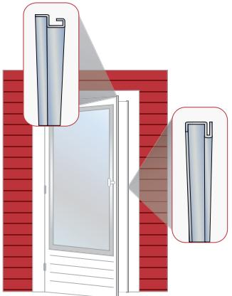

C-profilen består av två olika stålprofiler. En profil monteras på dörrkarmen och den andra monteras på dörren.

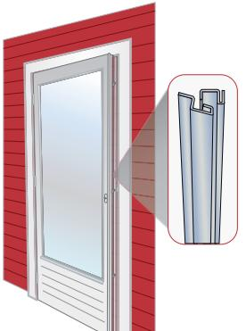

När dörren stängs går dörrprofilen in i karmprofilen.

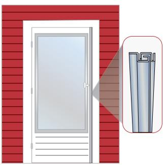

De två profilerna förseglar effektivt hela dörrspringan mellan dörr och karm på altandörr eller fönster. Vilket gör att tjuven inte kan komma in med t.ex. en kofot.

# **C-profilen finns i fem olika modeller anpassade för olika typer av dörrar och fönster**

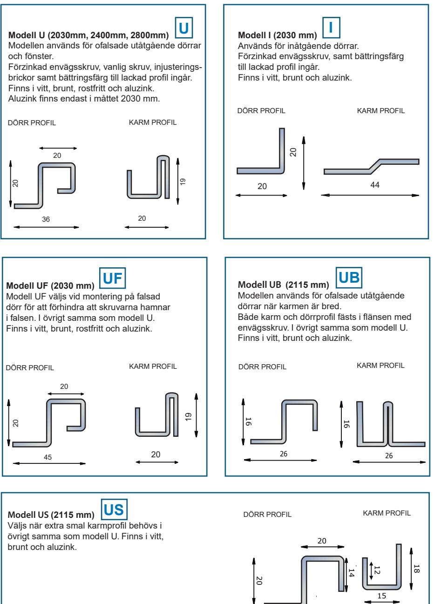

35

# TEKNISKA UPPGIFTER

**För utåtgående dörrar och fönster.**

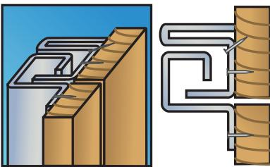

### **UF**

**För utåtgående falsade dörrar och fönster.**

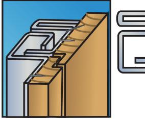

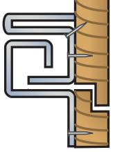

# **UB**

**För utåtgående dörrar och fönster. Används där karmen är bred.**

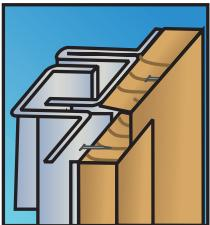

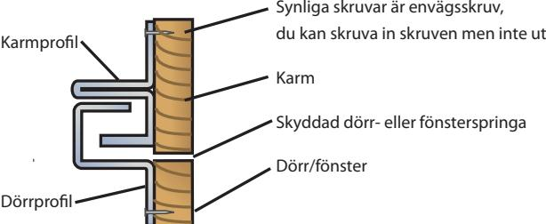

**Är du osäker?** Kontakta din säkerhetsinstallör för rådgivning och hjälp.

Din säkerhetsleverantör

# **I**

**För inåtgående dörrar och fönster. För inåtgående dörrar och fönster.**

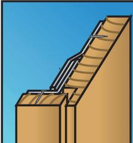

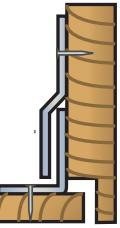

## **US**

**För utåtgående dörrar och fönster. Används där karmen är smal.** 

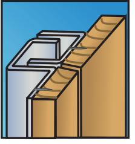

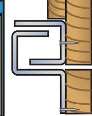