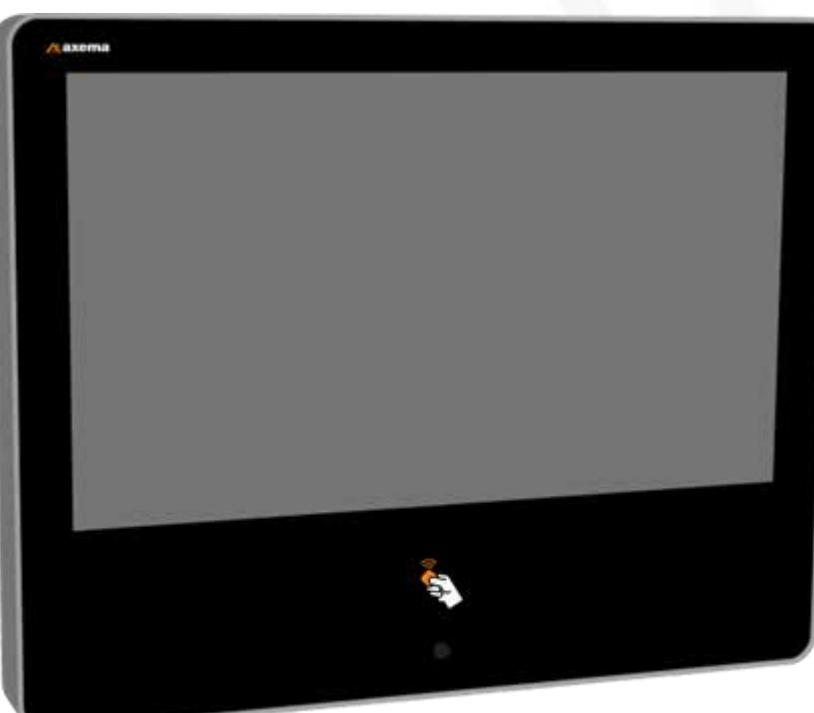
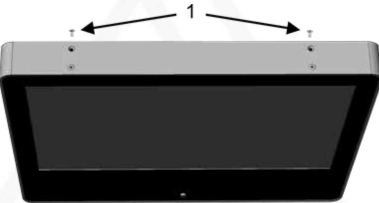
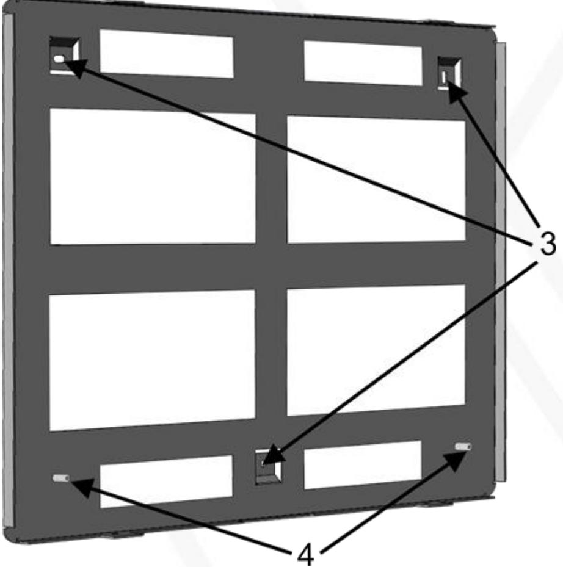
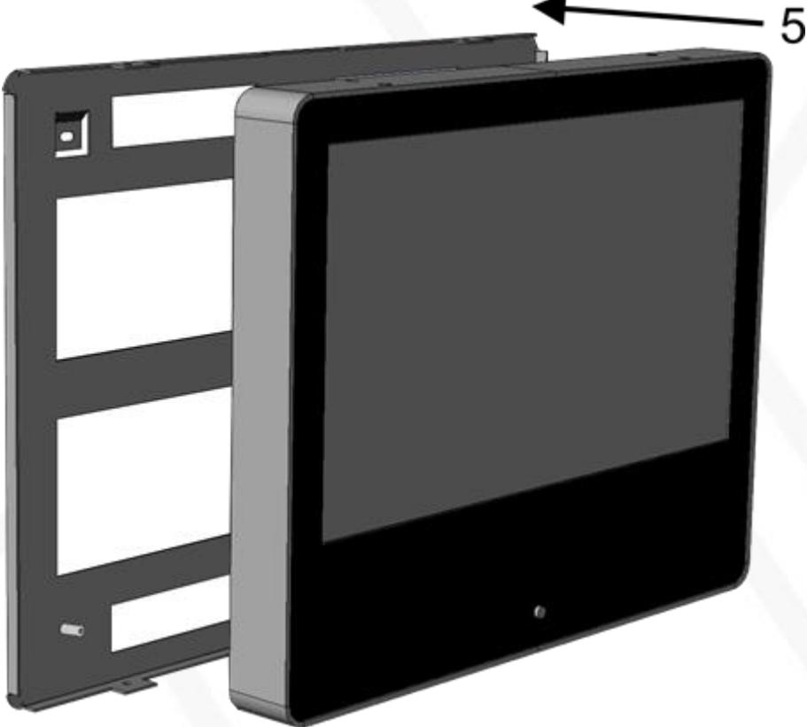
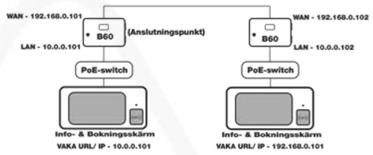

Manual Updated 2020-10-26

#### **Info & Booking Screen C205**

Axema Access Control AB | Box 90215 | SE-120 23 Stockholm, Sweden | +46 8 722 34 40 | info@axema.se | www.axema.se

## Contents

| Combi key fobs                        | 3 |
|---------------------------------------|---|
| B60 DHCP                              | 3 |
| Mounting                              | 3 |
| Configuring the Info & Booking Screen | 6 |
| Default booking object                | 7 |
| Installation and configuration        | 8 |
|                                       |   |

## Combi key fobs

If you use combi key fobs, please contact Axema Support on +46 8 722 34 40, option 2.

# B60 DHCP

The B60 has a DHCP server that can be activated on the LAN side and assigns IP addresses between

10.0.0.11 and 10.0.0.49, which means you can use up to 39 devices with a dynamic IP address. Examples of devices that can use dynamic IP address are info and booking screens and admin computers. More than 39 of these devices can be used if they have a static IP address.

The DHCP server is activated according to Network Settings in the VAKA manual, making it easier to connect the info and booking screens.

# Mounting

The booking screen should be mounted where:

- The screws on the top and bottom are accessible
- The temperature stays between 0°C and 50°C

- The device should not be exposed to direct sunlight. Sunlight can activate the PIR sensor and the screen will light up unnecessarily.

The recommended mounting height is 140–150 cm to the bottom of the device.

- ⚫ Unscrew the four inner screws (1) (two on the top and two on the bottom).

- Detach the back section from the front section.

- Feed the network cable through one of the holes in the back section and connect the cable to the front section.
- Attach the back section to the three fixing points (3) in the wall.
.

- Stabilize the back section against the wall using the adjustment screws (4) and tighten them by hand.
- ⚫ Hang the front section on the back section and screw in the four inner screws.

## Configuring the Info & Booking Screen

- 1. When the screen is properly connected to the network (using Power over Ethernet (PoE)), the text No connection with VAKA server appears on the screen together with a Settingsbutton.
- 2. Press Settings.
- 3. To display the on-screen keyboard, press the Password field.
- 4. Enter the password "AxemaBooking" (without quotation marks). Note that the password is case sensitive.
- 5. Press OK.
- 6. Enter the web or IP address that the info screen uses to access the system connection point, usually 10.0.0.101, in the VAKA URL/ IPfield. This field only accepts TCP port 80.
- 7. Enter a screen ID between 1 and 99 in the Screen ID * field. The screen ID is used to determine which information is displayed on which screen.
- 8. This point applies only if the domain controller does not have DHCP activated. Fill in the IP Address, Netmask, Gateway, Additional DNS1 and Additional DNS2 fields with information from the IT manager.
- 9. Press Apply Settingsto finish.

*If Screen ID is not available, continue with the configuration and log in to the device after it has been updated.

# Default booking object

The default booking object is displayed after a user has logged in with their key fob.

- 1. To access the configuration menu: Unscrew the lower right outer screw from the frame. With a narrow object, press the button that is now accessible through the screw hole. Enter
the password "AxemaBooking" (without quotation marks). Note that the password is case sensitive. Press OK.

- 2. Under Default Booking Object, select the booking object to be displayed after logging on.
- 3. Press Apply Settingsto finish.

#### Installation and configuration

This manual only shows you how to mount and connect the device. For information on how to install and configure the device, refer to the VAKA Commissioning manual.