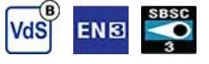
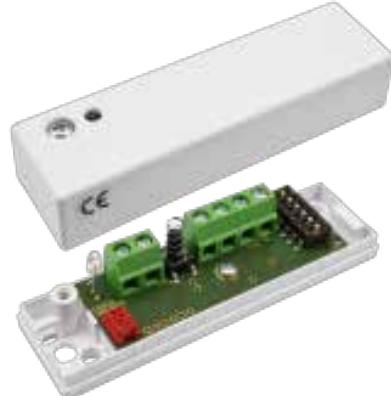
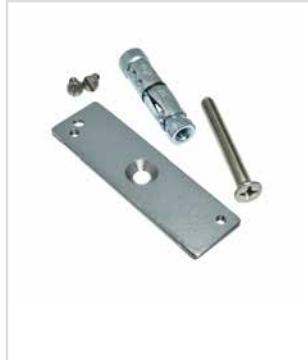

# CD 470

# Chockdetektor, LK3

### **Produktdetajler:**

| Godkännanden                               | EN 50131-2-8 Grad 3, SBSC Klass 2, VdS G 121502 Class B |
|--------------------------------------------|------------------------------------------------------------|
| Inspänning                                 | 8 – 15 VDC (DAY), 6 VDC (NIGHT)                            |
| Larmutgång                                 | Relay (Max 50V / 120 mA), R up to 30 Ω                  |
| Larmindikering                             | LED, DAY/NIGHT controlled                                  |
| Hålltid larm                               | 4s (auto reset) or locks in alarm mode                  |
| Larmåterställning                          | Voltage breaking input (up to 1 V)                         |
| Arbetstemperatur                           | -40°C - +55°C                                              |
| Kapsling, Färg                             | ABS Plastic, white                                         |
| Kapslingsklass                             | IP 42                                                      |
| Mått (L x B x H) mm                        | 80 x 23 x 20 mm                                            |
| Sabotageutgång                             | Relay (Max 50V / 120 mA), R up to 30 Ω                  |
| Detektionsradie                            | up to 3m                                                   |
| DAG- och NATT-kontroll                     | DAY 8V, NIGHT 6V supply voltage                            |
| Lågspänningslarm eller fel i elektronik | up to 5V is indicated by flashing LED                      |
| Strömförbrukning i vila / vid larm         | 8.0 mA (12 V)/7.1 mA (12 V)                                |
| Grade                                      | 3                                                          |

CD 470 erbjuder pålitlig övervakning mot angrepp med mekaniska verktyg. CD 470 är en selektivt avkännande vibrationsdetektor med 3 separata detektionskanaler: en integrationskanal/sågkanal för svaga signaler med lång varaktighet, en räknekanal som känner av stark påverkan på den övervakade ytan och en explosionskanal som känner av mycket starka signaler från t.ex. en explosion.

Känslighet och övriga inställningar väljs via DIP omkopplare. Detektorn har en LED för larmindikering och sabotageskydd mot bortbrytning och öppning av kapslingen. För montering på betong och tegelvägg skall monteringsplattan MP 550 med expanderbult användas. I besvärliga miljöer utomhus eller inomhus bör en speciell kapsling WH 500, med inbyggt värmeelement användas för att erhålla en lämplig temperatur och fuktighet för detektorn

CD 470 delar design med CD 475 men har inbyggda reläer för larm- och sabotageutgångarna. Detta medger att GD 470 kopplas direkt till larmets centralenhet, ingen analysatorenhet behövs. CD 470 polaritetsoberoende, precis som CD 475.

#### **EGENSKAPER**

- Reläutgångar för larm och sabotage
- Polaritetsoberoende
- 3 separata detektionskanaler
- Täckningsradie upp till 3m
- Motståndskraftig mot störningar
- Detaljerad känslighetsinställning
- Lämplig för 24 timmars övervakning
- DAG och NATT kontroll av LED

## **Relaterade produkter och tillbehör:**

Powered by TCPDF (www.tcpdf.org)

### **MP 550**

Monteringsplatta för CD 550