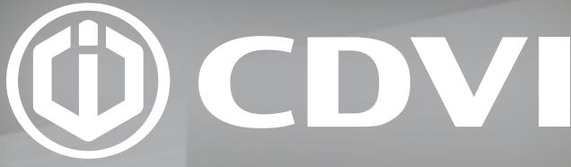
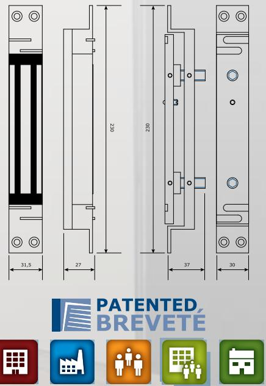

# CZ3000 INFÄLLT SÄKERHETSLÅS MED HÖG HÅLLKRAFT I SIDOBELASTNING

## The installer's choice cdvi.se

## **PATENTERAT ELEKTROMAGNETISKT SÄKERHETSLÅS MED SHEARLOCK FUNKTION**

### **CZ3000**

- *> Genom att kombinera mekaniska och magnetiska krafter uppnås en mycket hög hållfraft vid sido belastning, upp till 1500daN (1529kg) i sidled*
- *> Klarar upp till 3 mm avstånd mellan magnet och ankare*
- *> Utan spänningstopp som många andra shearlock magneter har problem med*
- *> Utmärkt för pendeldörrar och övervakade utrymningsdörrar*
- *> Skall inte monteras i dragriktningen som traditionella elektromagneter*
- *> Uppfyller Air standard D0160D*
- *> 10 års produktgaranti*

#### *Tillval:*

- *Tillbehör för glasdörrar och utanpå liggande montage*
- Hållkraft:
- 1500daN, 1529 kg i sidled Dimensioner (L x B x H):
- Magnet = 230 x 31,5 x 27mm Ankare = 230 x 30 x 37mm
- Indikering med N/O eller N/C kontakt Driftspänning:
- 12/24 VDC Strömförbrukning:
- 12 VDC = 630mA 24 VDC = 315mA

Public Buildings

Commercial Industral

Multi-tenant Residential Occupancy

**CDVI** Sweden AB Datavägen 12B 43632 ASKIM (GÖTEBORG)

Tel: +46 (0)31 760 19 30

*cdvigroup.com cdvi.se*