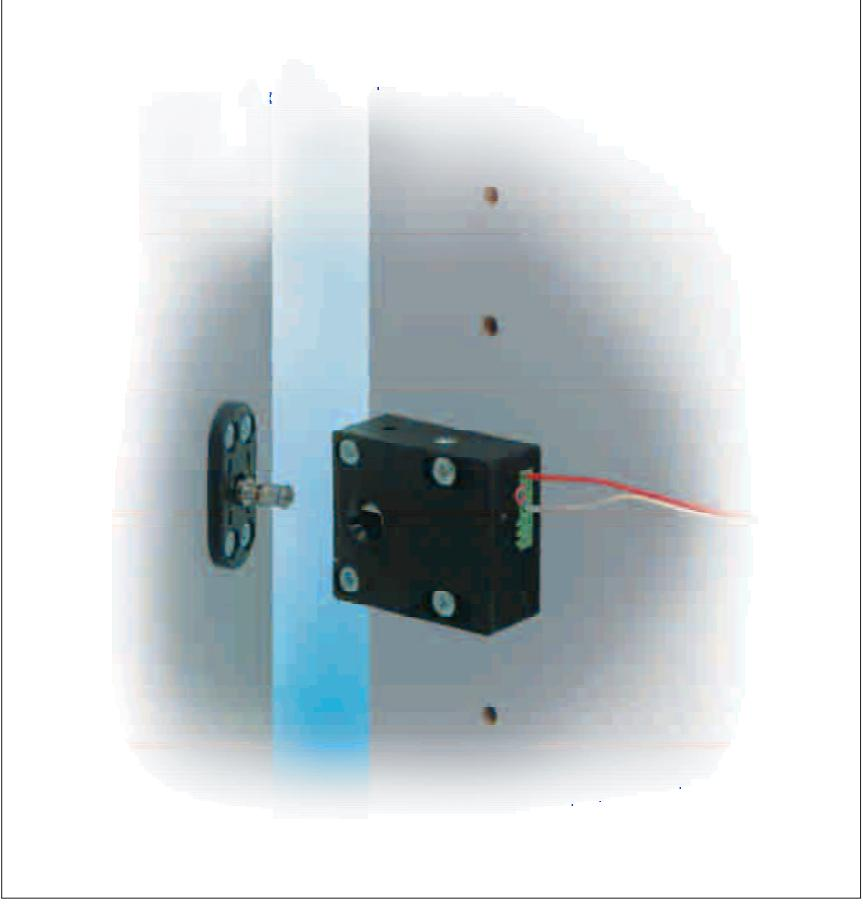
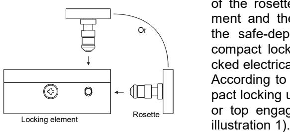
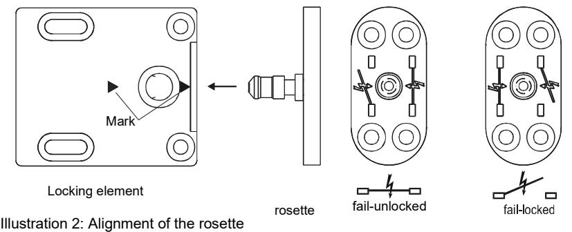
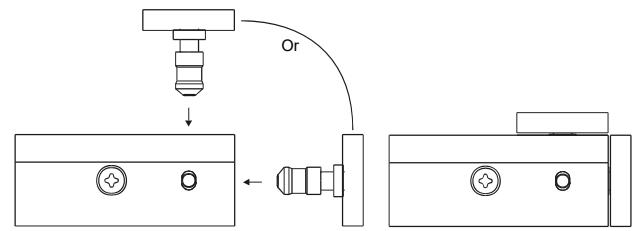
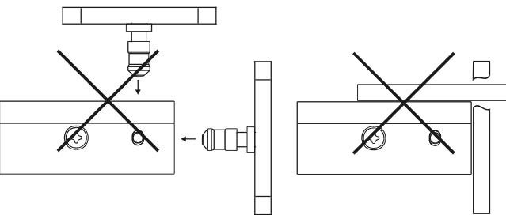
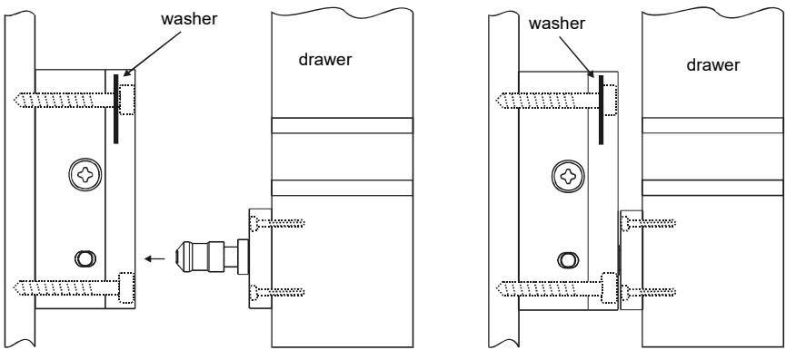
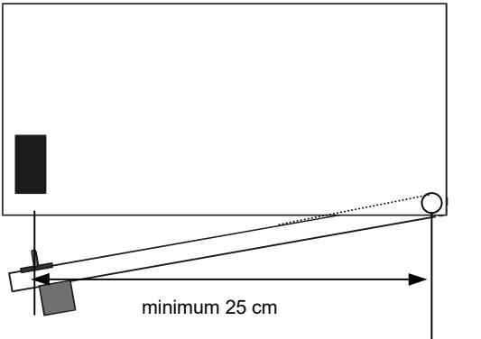
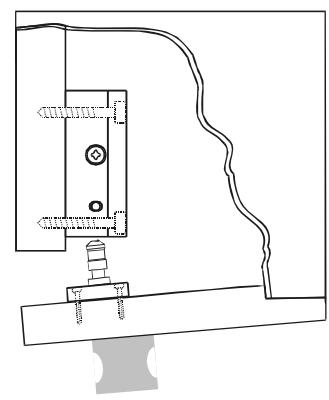
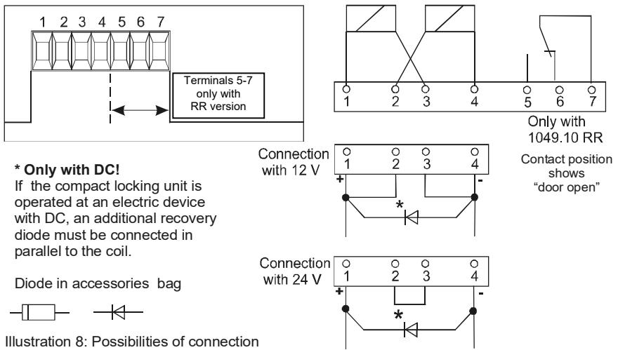

**1049.10 1049.10RR**

# **Mounting and Installation Instructions**

# **General description**

The compact locking units 1049.10 and 1049.10 RR have especially been developed for the locking of furniture. They can be used instead of usual mechanical lockings or additionally as an access control system and prevent unauthorized access to valuables or certain documents.

The compact locking units can be used for locking filing cabinets, fitted cupboards, drawers, post-office boxes / safe-deposit boxes and glass cabinets, for example.

The most simple way to operate the access control system is by means of a key switch. If it is necessary to electronically control, register and monitor the access control system, the compact locking unit can be combined with a code or card reader system.

The RR version additionally incorporates a change-over contact for monitoring the state of the door (open/closed).

Taking into account the varied possibilities to use the compact locking unit, it can be operated in the fail-unlocked mode as well as in the fail-locked mode.

The field reversibility is easily executed in no time during the installation of the unit by positioning the rosette accordingly.

**Due to the integrated mechanism that keeps the door closed, the door of a filing cabinet, for example, is kept close even if it is unlocked. Consequently, additional mechanisms for keeping the door closed (e.g. magnetic snaps) are not required.**

# **Fail-unlocked and fail-locked operation:**

The difference between the fail-unlocked and the fail-locked operating mode is the following: the fail-unlocked version must be energized in order to be locked whereas the fail-locked version must be energized in order to be unlocked.

## **Note:**

Fail-locked operation means that in the event of power failure unlocking is impossible and consequently the door cannot be opened.

### **Functional characteristics:**

The compact locking unit 1049.10/1049.10 RR consists of two parts. Part 1 is the locking element which is, for example mounted laterally to a safe-deposit box. Part 2 is the rosette which is installed at the door.

When the door is closed, the locking bolt of the rosette engages the locking element and the safe-deposit is locked. If the safe-deposit must be opened, the compact locking element must be unlocked electrically first.

According to the requirements, the compact locking unit can be installed for front or top engagement of the rosette (see

Illustration 1: Locking principle

# **Setting of fail-unlocked or fail-locked operating mode**

Two pictograms are printed on the rosette, one for fail-unlocked and one for fail-locked mode (see illustration 2). For operation in the fail-unlocked mode, the mark on the locking element must point to the fail-unlocked pictogram of the rosette. For operation in the fail-locked mode, the mark must point to the fail-locked pictogram.

### **Mounting**

**Mounting and adjustment only when the rosette is in the failunlocked position in case the compact locking unit cannot yet be unlocked electrically. Otherwise, it would not be possible to open the door or the drawer any more.** !

Four cylindrically countersunk mounting holes each are provided for mounting the locking element as well as the rosette. Position of mounting holes see drawing. Reducing bushes, screws and washers are included in the mounting material supplied.

**Before fastening the two washers of special steel with screws, they must be placed into the elongated holes of the locking element.**

**Dimensioned drawing:**

Illustration 3: Dimensioned drawing

# **Mounting instructions:**

Locking element and rosette must be aligned as shown in illustration 4 (flush). When closing the door or drawer, the locking bolt of the rosette must be able to engage the locking element unimpededly and completely. Furthermore, no tensile force caused by the door respectively the drawer must act on the locking element. The rosette can be fixed by screws and is also suitable for flush mounting. The adjustment of locking element and rosette must be effected by means of the elongated holes in the locking element. An adhesive film (adhesive on both sides) is supplied which can be stuck to the back of the rosette. This will help you to find the correct position of the rosette.

After fixing the adhesive film, the rosette must be put into the mounted locking element with fail-unlocked setting and the door must be closed. When the door is opened again the rosette sticks in the correct position. After marking the drilling points, the rosette must be turned through 180°.

**Under no circumstances must the rosette be mounted as shown in illustration 5 i.e. turned through 90**°**. If the locking bolt of the rosette engaged the locking element that way, it would not be possible to open the door or drawer any more.** !

Correct positioning: The locking bolt of the rosette engages the locking element unimpededly and completely.

Illustration 4: Mounting instruction

Wrong positioning: The rosette turned - through 90°.

Illustration 5: Mounting instruction

### **Mounting examples:**

Illustrations 6 and 7 show possibilities for mounting the compact locking unit to a desk with drawers or to a fitted cupboard.

An accessories bag is supplied with the compact locking unit. This bag contains fixing screws and washers for the locking element and the rosette as well as reducing bushes for the installation in existing bore holes.

Illustration 6: Mounting to a drawer

Illustration 7: Mounting to a fitted cupboard

### **Electric Supply**

With regard to continuous duty operation, the compact locking units 1049.10 and 1049.10 RR must be operated with stabilized DC, 12 V or 24 V. Unlocking by AC is possible, however, it is not recommended due to the buzzing sound caused. Connections must be effected according to the connecting diagram (see illustration 8). The necessary jumpers as well as the diodes are included in the accessories bag.

Model 1049.10 RR additionally incorporates a change-over contact which monitors the state of the door (open/closed).

When determining the wiring please take into consideration that the supply voltage – measured at the terminals – is not lower than the minimum indicated.

#### **Connecting Diagram:**

**Instructions for connection:** loosen the screws of the required terminals by turning them anticlockwise (3-4 turns). Insert the lead into the terminal. For fastening the terminal retighten the screws by turning them clockwise.

#### **Technical data:**

| mode of operation                                        | fail-unlocked or fail-locked operation momentary or continuous unlocking |                            |              |  |                            |
|----------------------------------------------------------|-----------------------------------------------------------------------------|----------------------------|--------------|--|----------------------------|
| operating voltage                                        | 12V DC stab.                                                                | 12V AC buzzing sound | 24V DC stab. |  | 24V AC buzzing sound |
| connecting voltage                                       | operating voltage ± 10%                                                     |                            |              |  |                            |
| current consumption typ.                                 | 260 mA                                                                      | 140 mA                     | 130 mA       |  | 70 mA                      |
| max.cap. of the RR contact                               | 25 V/ 1A                                                                    |                            |              |  |                            |
| tensible strength                                        | 1000 N (≈100 kp)                                                            |                            |              |  |                            |
| type of protection accor ding to DIN 40050            | IP 20                                                                       |                            |              |  |                            |
| housing temperature                                      | continuous energization: approx. 60°C                                       |                            |              |  |                            |
| temperature range                                        | +10°C - +40°C                                                               |                            |              |  |                            |
| dimensions in mm (L x W x H) locking element w/o rosette |                                                                             |                            | 48 x 42 x 20 |  |                            |

#### effeff Fritz Fuss GmbH & Co.

Kommanditgesellschaft auf Aktien Bildstockstraße 20 D-72458 Albstadt Telefon +49 74 31/1 23-0 Telefax +49 74 31/1 23-240 www.effeff.com info@effeff.com