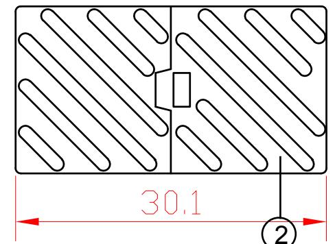
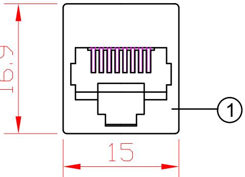
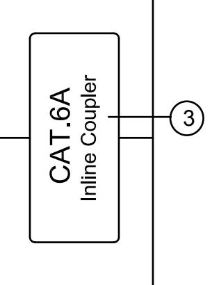

## NOTES :

ELECTRICAL :

1.VOLTAGE RATING:125 VAC RMS

2. CURRENT RATING:1.5AMP

3.CONTACT RESISTANCE.100MILLIOHMS MAX

4. INSULATION RESISTANCE:100 MEGOHMS MIN @500 VDC

CUSTOMER

685-U

mm

NONE

ITEM NO.

SCALE

DRAW NO. UNIT

5. DIELECTRIC STRENGTH: 750 VAC RMS 60Hz, 1MIN

DRAWN

ENVIRONMENTAL :

1. STORAGE:-40°T0+85°

2.0PERATION:0°T070°

MECHANICAL :

APPROVED

1.HOUSINGG MATERIAL:PC

2. INSERT MATERIAL:FAME RETARDANCY ABS

3.PCB MATERIAL:FR-4 T=1.6mm

4. CONTACT MATERIAL:PHOSPHOR BRONZE

STAMP PIN T=0. 30mm

CHECKED

5.RJ45 JACK ;LIFE:750 TIMES MIN

| (3)                       | LABLE             | 1 PCS | " CAT 6A Inline Coupler"       |         |  |
|---------------------------|-------------------|-------|--------------------------------|---------|--|
| 2                         | shell             | 1 PCS | ABS shell                      |         |  |
| (1)                       | CONNECTER         | 2PCS  | RJ45 Female (8P8C) gold plated |         |  |
| NO.                       | PARTS NAME   Q'TY |       | SPECIFICATION                  |         |  |
| Description:              |                   |       |                                |         |  |
| Cat 6A Inline Coupler UTP |                   |       |                                | DETA VE |  |
|                           |                   |       |                                |         |  |

