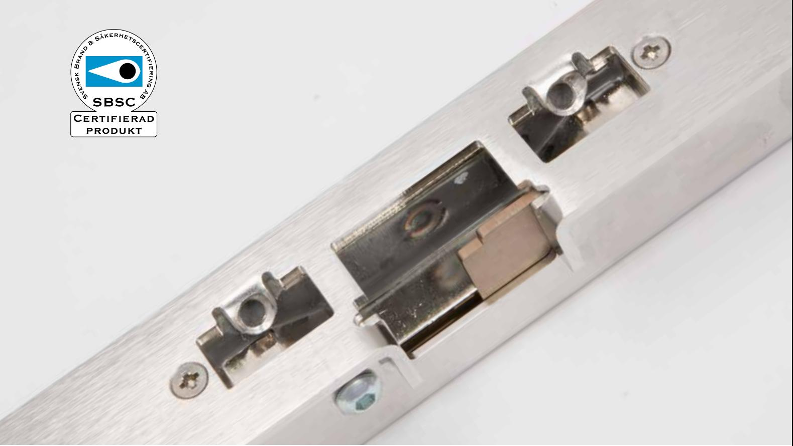
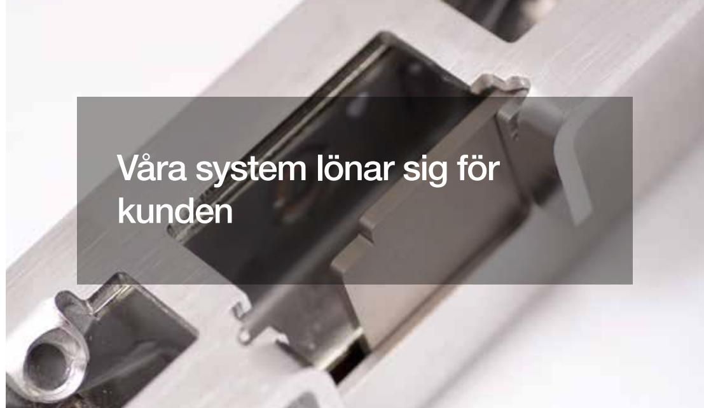
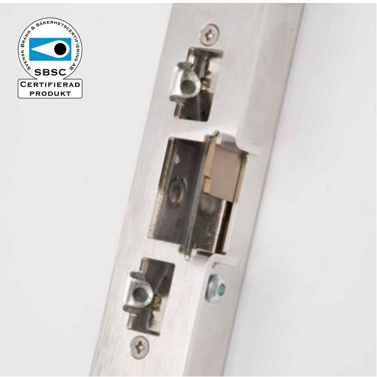

exma.se

# Certifierad motoriserad låsning

**Rapid**

Det svensktillverkade låssystemet

Genom att övergripande arbeta med lokal förankring har vi de flesta underleverantörer och samarbetspartners nära inpå, i många fall på gångavstånd.

Exma Rapid, som utvecklas och produceras i Eskilstuna, möter de allra högsta kraven. Produkten är sedan länge godkänd för användning i exempelvis högsäkerhetsanläggningar.

Detta motoriserade slutbleck erbjuder stabil, elektrisk låsning, kombinerat med flexibilitet.

Eftersom Rapid kan användas fristående i fristående installationer är det också möjligt att använda slutblecket med andra tillverkares produkter.

Produkten kan naturligtvis användas med våra egna läsare utan fördyrande gränssnitt, däribland Exma MiniRead.

### Säkert och certifierat

Certifikat och intyg är självklart oerhört viktigt för såväl oss på Exma som för våra kunder. Rapid uppfyller SSEN 14846 med certifikat 10-581.

Förutom att vi har allt som krävs ger vår lokala förankring extra trygghet. Exma Rapid är mer än svensktillverkat; det är Eskilstunatillverkat.

## Säkerheten styr valet av lösning

Våra produktlinjer är både skalbara och anpassningsbara, vilket gör det enkelt för våra kunder att själva bestämma hur de vill hantera sitt låssystem.

Samtidigt som trådbundna system erbjuder central kontroll innebär de ökad sårbarhet. Därför har vi valt att istället fokusera på stand alone-produkter.

## Smartast i längden

Genom att satsa på ett Exma Rapid, tillverkat enligt svenska standarder i låsstaden Eskilstuna, investerar du i ett system som håller länge och därmed ger en attraktiv prislapp i det längre perspektivet.

# Modern elektronik

Elektroniken, som är en central del i Exma Rapid, är ett område där vi lägger mycket tid på när det kommer till utveckling.

Förutom att vi själva sitter på såväl erfarenhet som hög kompetens arbetar vi också tätt i anslutning till närliggande, lokala samarbetspartners.

# Smidigt att använda

Säkerhet och godkännanden är givetvis centralt hos Rapid, precis som hos våra andra produkter.

Samtidigt lägger vi också väldigt mycket vikt vid användarvänlighet. Våra produkter ska vara lika enkla att använda som de är säkra.

## Smidigt att installera

Fristående stand alone-system är attraktiva ur installationssynpunkt.

Färre ingrepp på dörrar och intilliggande väggar effektiviserar arbetet för den som monterar, samtidigt som det också innebär att kunden snabbare får ett färdigt lås – utan behov av restaurering efteråt.

Givetvis erbjuder vi på Exma instruktioner och utbildningar inom såväl installation som underhåll av våra produkter.

| Specifikationer för Rapid                |                                    |
|------------------------------------------|------------------------------------|
| Certifierad enl. SS-EN14846              | Ja                                 |
| Certifikatnr                             | 10-581                             |
| Drivspänning                             | 18-24V DC Filtrerad likspänning |
| Strömförbrukning vid vila                | 85 mA                              |
| Strömförbrukning vid gång                | 300 mA                             |
| Strömförbrukning vid motorstart. (50 mS) | 500mA                              |
| Temperaturområde                         | -20°C – +60°C                      |
| Låsningstid                              | c:a 0,3 sek                        |
| Klimattestad 240 tim i saltdimkammare    | Ja                                 |
| Material                                 | Rostfritt                          |
| Brythållfasthet i träkarm                | Grade 3                            |
| Antal låsningscykler vid normal drift    | < 1000 000                         |
| Kodad kommunikation                      | Ja                                 |
| med Styrenhet A1D                        | Ja                                 |
| med MiniRead                             | Ja                                 |
| med Dorma motorlås i Protonserien        | Ja                                 |
| Storlek, BxHxD                           | 26x180x34 mm                       |
| Storlek, med stolpe, BxHxD               | 39x245x39 mm                       |

