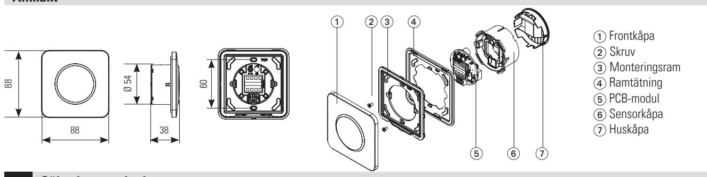
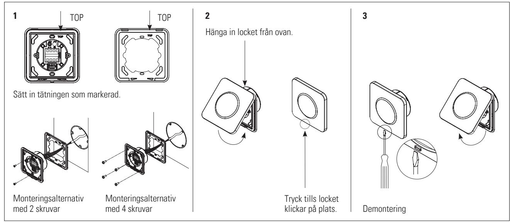
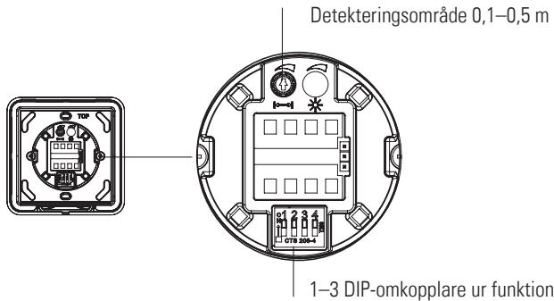
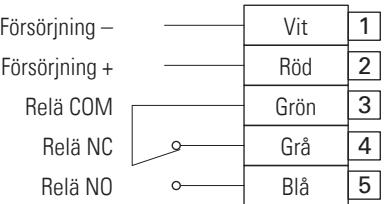
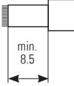
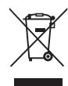
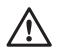

**SVENSKA**

Beröringsfri brytare

# **CleanSwitch Basic**

# **Översättning av originalbruksanvisningen**

## **Allmänt**

## **1 Säkerhetsanvisning**

Enheten får endast installeras och tas i drift av utbildad och kvalificerad personal. Enheten får endast öppnas och repareras av tillverkare. Enheten får endast användas med skyddande lågspänning med säker elisolering. Följ alltid säkerhetsanvisningen i sin helhet, inte bara för enstaka komponenter i systemet.

Installatören ansvarar för att göra en riskbedömning och att installera optikenheten och systemet på rätt sätt. Undvik att röra vid elektroniska komponenter.

# **2 Hopsättning**

# **3 Konfiguration**

## **Fabriksinställning**

#### **DIP-omkopplare**

4 ON Omkopplarläge 4 OFF Pulsläge

| ON 1 | 2 | 3 | 4 | ON Omkopplar läge |
|---------|---|---|---|-------------------------|
| ON 1 | 2 | 3 | 4 | OFF Puls läge     |

#### **4 Elektriska anslutningar**

Avdragningslängd minst 8,5 mm (fast eller böjlig tråd)

AWG 24 – 16/0,2 – 1,5 mm2

• Fast tråd > tryck in

- Böjlig tråd > tryck på knappen och tryck in
#### **5 Tekniska data**

| Teknik                    | Mikrovågsbaserad dopplerradar                                                                                                                                                                                                          |  |  |
|---------------------------|----------------------------------------------------------------------------------------------------------------------------------------------------------------------------------------------------------------------------------------|--|--|
| Frekvens                  | 24,125 GHz                                                                                                                                                                                                                             |  |  |
| Detekteringsområde        | 0,1–0,5 m                                                                                                                                                                                                                              |  |  |
| Detekteringsläge          | Pulsläge: sensorn känner av när handen rör sig Omkopplarläge: första rörelsen on/andra rörelsen off                                                                                                                                 |  |  |
| Detekteringshastighet     | Min: 5 Hz eller ± 3 cm/s Max: 200 Hz eller ± 1,2 m/s                                                                                                                                                                                |  |  |
| Försörjningsspänning      | 12–24 V AC ± 10 % (50–60 Hz) 12–24 V DC + 20 %/-10 %                                                                                                                                                                                |  |  |
| Max. effektförbrukning    | < 1 W (med optisk återkoppling)                                                                                                                                                                                                        |  |  |
| Utgång                    | Relä med överkopplingskontakt (potentialfri) Max. omkopplingsspänning/-ström (DC): 1 A upp till 30 V, 0,5 A upp till 60 V Max. omkopplingsspänning/-ström (AC): 1 A upp till 50 V Max. omkopplingsström: 30 W (DC)/50 VA (AC) |  |  |
| Utgångskvarhållningstid   | "Reläkvarhållningstid": 0,3 s                                                                                                                                                                                                          |  |  |
| Lagrings-/drifttemperatur | -20 till + 60 ˚C                                                                                                                                                                                                                       |  |  |
| Kapslingsklass            | IP65 (monterad med fyra skruvar, slät yta)                                                                                                                                                                                             |  |  |
| Mått (mm)                 | 88 x 88 x 38 mm (L x B x H)                                                                                                                                                                                                            |  |  |
| Vikt                      | 55 g                                                                                                                                                                                                                                   |  |  |
| Material                  | ASA/PC                                                                                                                                                                                                                                 |  |  |

#### **Observera: CleanSwitch Basic är enligt VAH-listan resistent mot ytdesinfektionsmedel på sjukhus**

Se bilaga

## **7 WEEE**

Apparater med denna symbol måste hanteras separat vid återvinningen. Detta ska göras i enlighet med respektive nationella lagar om miljövänlig avfallssortering, bearbetning och återvinning av elektriska och elektroniska apparater.

#### **8 FCC-tillstånd**

Denna apparat uppfyller kraven i avsnitt 15 i FCC-bestämmelserna och den kanadensiska industrinormen RSS-210 (Industry Canada). **Varning:** Om ändringar eller modifieringar görs på denna apparat kan FCC-godkännandet för drift av denna apparat upphävas.

#### **9 Kontakt**

Made in China / Designed in Switzerland **BBC Bircher Smart Access,** BBC Bircher AG, Wiesengasse 20, CH-8222 Beringen, www.bircher.com