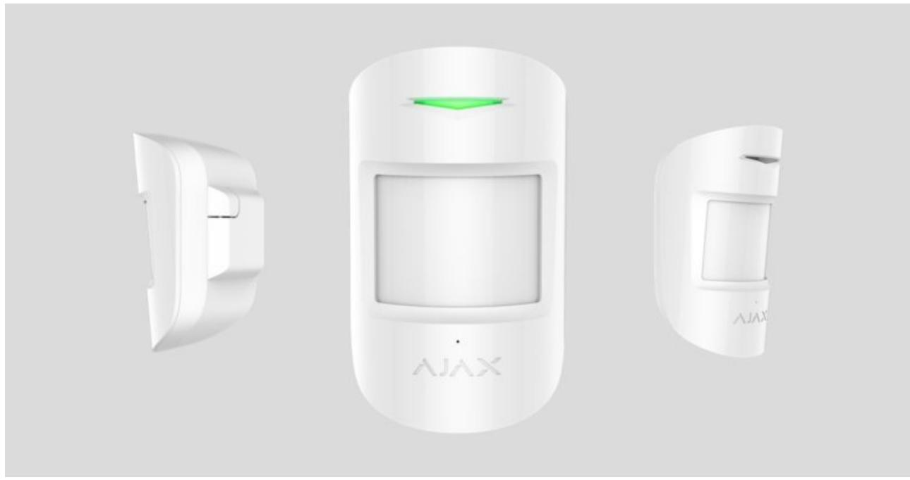
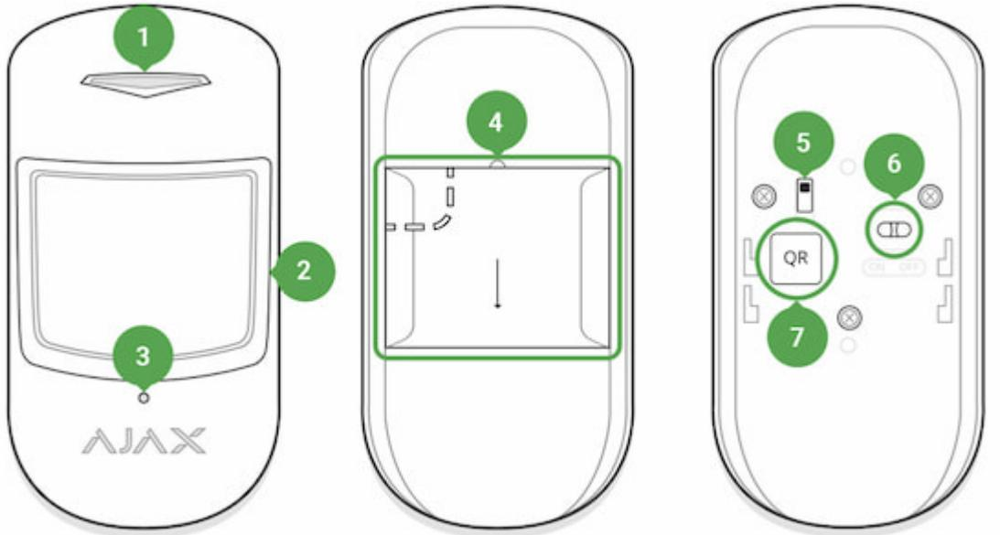
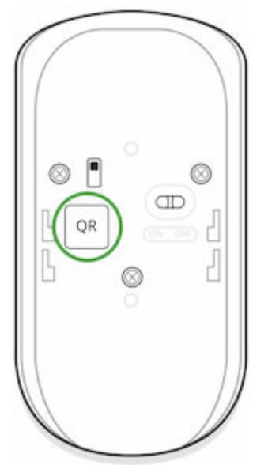
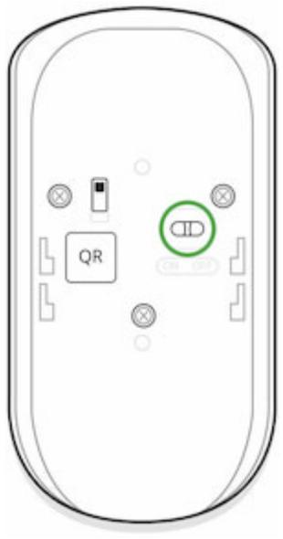
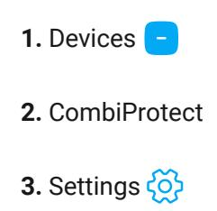
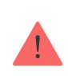
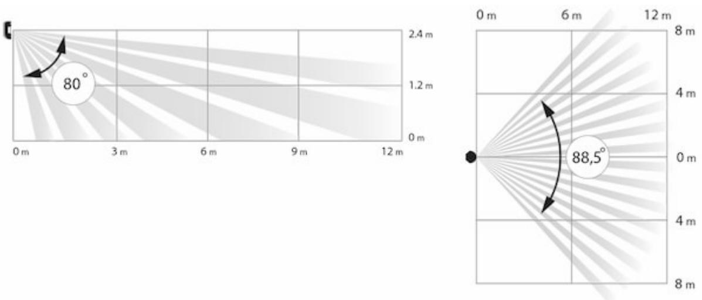
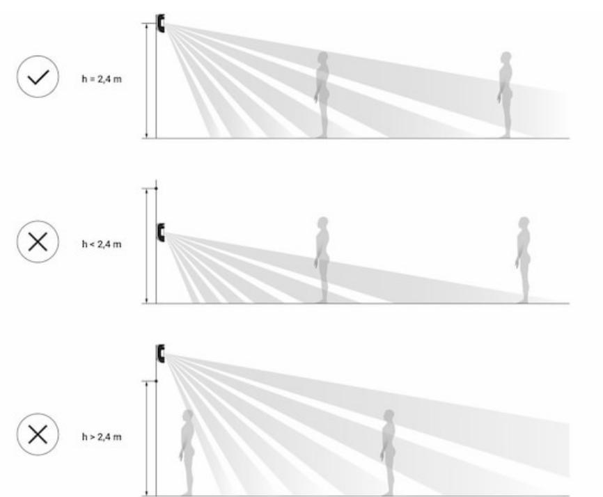
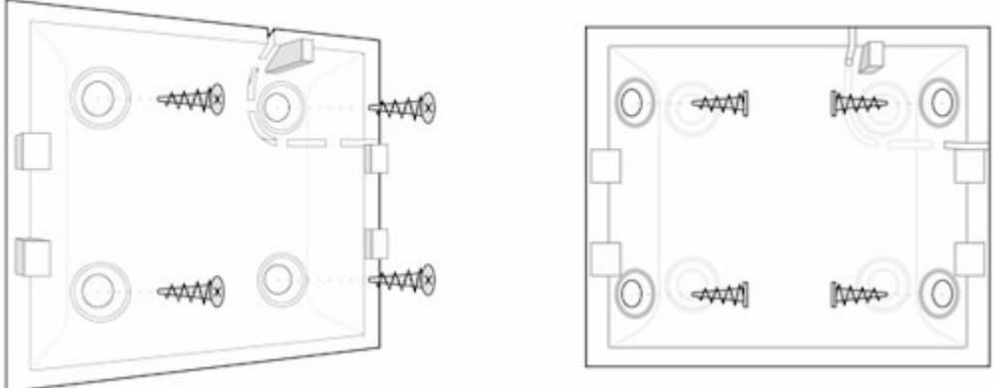

# CombiProtect User Manual

Posted on December 7, 2021

**CombiProtect** is a device combining a wireless motion detector with the viewing angle of 88.5° and distance up to 12 meters, as well as a glass break detector with the distance up to 9 meters. It can ignore animals and detects a person within the protected zone from the first step. It can operate for up to 5 years from a pre-installed battery and is used inside premises.

CombiProtect operates within the Ajax security system, connected to the via the protected protocol. The communication range is up to 1200 meters in the line of sight. In addition, the detector can be used as a part of third-party security central units via the or integration modules. hub Jeweller Ajax uartBridge Ajax ocBridge Plus

The detector is set up via a for iOS and Android based smartphones. The system notifies user of all events through push notifications, SMS messages and calls (if activated). mobile application

The Ajax security system is self-sustaining, but the user can connect it to the central monitoring station of a private security company.

# Functional Elements

- **1.** LED indicator
- **2.** Motion detector lens
- **3.** Microphone hole
- **4.** SmartBracket attachment panel (perforated part is required for actuating the tamper in case of any attempt to dismantle the detector)
- **5.** Tamper button
- **6.** Device switch
- **7.** QR code

# Operating Principle

CombiProtect combines two types of security devices – motion detector and glass break detector.

Thermal PIR sensor detects intrusion into a protected room by detecting moving objects with a temperature close to the temperature of the human body. However, the detector can ignore domestic animals if the suitable sensitivity has been chosen in the settings.

The electret microphone is responsible for glass break detection. The intelligent event registration system requires a sequence of sounds of a specific nature – first dull blow, then ringing sound of falling chips, which prevents accidental actuation.

> CombiProtect does not detect glass breaking if the glass is covered with any film: shockproof, sunscreen, decorative or other. In order to detect the breaking of this type glass, we recommend using a wireless opening detector with shock and tilt sensor. DoorProtect Plus

After actuation, the armed detector immediately transmits an alarm signal to the hub, activating the sirens and notifying the user and security company.

If before arming the system, the detector has detected motion, it will not arm immediately, but during the next inquiry by the hub.

# Connecting the Detector to the Ajax security system

The detector is connected to the hub and set up via the Ajax Security system mobile application. To establish connection please locate the detector and the hub within the communication range and follow the device adding procedure.

#### **Before starting connection:**

- **1.** Following the hub manual recommendations, install the . Create an account, add the hub to the application, and create at least one room. Ajax application
- **2.** Switch on the hub and check the internet connection (via Ethernet cable and/or GSM network).
- **3.** Ensure that the Hub is disarmed and does not update by checking its status in the mobile application.

Only users with administrator rights can add the device to the hub

#### **How to connect the detector to the hub:**

- **1.** Select the **Add Device** option in the Ajax app.
- **2.** Name the device, scan/write manually the **QR Code** (located on the body and packaging), and select the location room.

- **3.** Select **Add** the countdown will begin.
- **4.** Switch on the device.

For detection and pairing to occur, the detector should be located within the coverage of the wireless network of the hub (at a single protected object).

Request for connection to the hub is transmitted for a short time at the time of switching on the device.

If connection to the Ajax Hub failed, switch off the detector for 5 seconds and retry.

The detector connected to the hub will appear in the list of devices of the hub in the application. Update of the detector statuses in the list depends on the device inquiry time set in the hub settings, with the default value — 36 seconds.

## Connecting the Detector to Third Party Security Systems

To connect the detector to a third party security central unit using the or integration module, follow the recommendations in the manual of the respective device. uartBridge ocBridge Plus

#### States

**1.** Devices

**2.** CombiProtect

| Parameter                   | Value                                                                                           |  |
|-----------------------------|-------------------------------------------------------------------------------------------------|--|
| Temperature                 | Temperature of the detector. Measured on the processor and changes gradually                 |  |
| Jeweller Signal Strength    | Signal strength between the hub and the detector                                             |  |
| Battery Charge              | Battery level of the device. Displayed as a percentage How battery charge is displayed in |  |
|                             | Ajax apps                                                                                       |  |
| Lid                         | The tamper mode of the detector, which reacts to the detachment of or damage to the body     |  |
| Delay When Entering, sec    | Delay time when entering                                                                        |  |
| Delay When Leaving, sec     | Delay time when exiting                                                                         |  |
| ReX                         | radio signal Displays the status of using a range extender                                |  |
| Motion Detector Sensitivity | Sensitivity level of the motion detector                                                        |  |

| Motion Detector Always Active | If active, the motion detector is always in the armed mode                                                                                                                                                                                                                                                                                                                                                                                                                                                                                                                                                                                                                   |  |
|-------------------------------|---------------------------------------------------------------------------------------------------------------------------------------------------------------------------------------------------------------------------------------------------------------------------------------------------------------------------------------------------------------------------------------------------------------------------------------------------------------------------------------------------------------------------------------------------------------------------------------------------------------------------------------------------------------------------------|--|
| Glass Detector Sensitivity    | Sensitivity level of the glass detector                                                                                                                                                                                                                                                                                                                                                                                                                                                                                                                                                                                                                                         |  |
| Glass Detector Always Active  | If active, the glass detector is always in the armed mode                                                                                                                                                                                                                                                                                                                                                                                                                                                                                                                                                                                                                    |  |
| Temporary Deactivation        | Shows the status of the device temporary deactivation function: No — the device operates normally and transmits all events. Lid only — the hub administrator has disabled notifications about triggering on the device body. Entirely — the device is completely excluded from the system operation by the hub administrator. The device does not follow system commands and does not report alarms or other events. By number of alarms — the device is automatically disabled when the number of alarms is exceeded (specified in the settings for Devices Auto Deactivation). The feature is configured in the Ajax PRO app. |  |
| Firmware                      | Detector firmware version                                                                                                                                                                                                                                                                                                                                                                                                                                                                                                                                                                                                                                                       |  |
| Device ID                     | Device identifier                                                                                                                                                                                                                                                                                                                                                                                                                                                                                                                                                                                                                                                               |  |

## Setting Up the Detector

| Setting     | Value                                                         |
|-------------|---------------------------------------------------------------|
| First field | Detector name, can be edited                                  |
| Room        | Selecting the virtual room to which the device is assigned |
|             |                                                               |

| Delay When Entering, sec              | Selecting delay time when entering                                                                                                                                                                                        |  |
|---------------------------------------|---------------------------------------------------------------------------------------------------------------------------------------------------------------------------------------------------------------------------|--|
| Delay When Leaving, sec               | Selecting delay time on exit                                                                                                                                                                                              |  |
| Delays in Night Mode                  | Delay turned on when using night mode                                                                                                                                                                                     |  |
| Arm in Night Mode                     | When turned on, the detector will switch to armed mode when using night mode                                                                                                                                           |  |
| Alarm LED indication                  | Allows you to disable the flashing of the LED indicator during an alarm. Available for devices with firmware version 5.55.0.0 or higher How to find the firmware version or the ID of the detector or device? |  |
| Motion Detector                       | If active, motion detector will be active                                                                                                                                                                                 |  |
| Motion Detector Sensitivity           | Choosing the sensitivity level of the motion detector: High Normal Low Why motion detectors react to animals and how to avoid it                                                                        |  |
|                                       |                                                                                                                                                                                                                           |  |
| Motion Detector Always Active         | If active, the detector always registers motion                                                                                                                                                                           |  |
| Glass Detector Enabled                | If active, glass breaking detector will be active                                                                                                                                                                         |  |
| Glass Protection Sensitivity          | Choosing the sensitivity level of the glass detector: High Normal Low                                                                                                                                         |  |
| Glass Protection Always Active        | If active, the detector always registers glass breaking                                                                                                                                                                |  |
| Alert with a siren if motion detected | sirens If active, added to the system are activated when the motion detected                                                                                                                                     |  |

| Jeweller Signal Strength Test | Switches the detector to the signal strength test mode                                                                                                                                                                                                                                                                                                                                                                                                                                                                                                                                                                    |  |
|-------------------------------|------------------------------------------------------------------------------------------------------------------------------------------------------------------------------------------------------------------------------------------------------------------------------------------------------------------------------------------------------------------------------------------------------------------------------------------------------------------------------------------------------------------------------------------------------------------------------------------------------------------------------|--|
| Detection Zone Test           | Switches the detector to the detection area test                                                                                                                                                                                                                                                                                                                                                                                                                                                                                                                                                                             |  |
| Attenuation Test              | Switches the detector to the signal fade test mode (available in detectors with firmware version 3.50 and later)                                                                                                                                                                                                                                                                                                                                                                                                                                                                                                       |  |
| Temporary Deactivation        | Allows the user to disconnect the device without removing it from the system. Two options are available: Entirely — the device will not execute system commands or participate in automation scenarios, and the system will ignore device alarms and other notifications Lid only — the system will ignore only notifications about the triggering of the device tamper button Learn more about temporary deactivation of devices The system can also automatically disable devices when the set number of alarms is exceeded. Learn more about auto deactivation of devices |  |
| User Guide                    | Opens the detector User Guide                                                                                                                                                                                                                                                                                                                                                                                                                                                                                                                                                                                                |  |
| Unpair Device                 | Disconnects the detector from the hub and deletes its settings                                                                                                                                                                                                                                                                                                                                                                                                                                                                                                                                                            |  |

## Indication

| Event                                                                        | Indication                                  | Note |
|------------------------------------------------------------------------------|---------------------------------------------|------|
| Turning on the detector                                                      | Lights up green for about one second     |      |
| Detector connection to the hub ocBridge Plus , and uartBridge | Lights up continuously for a few seconds |      |

| Alarm / tamper activation | Lights up green for about one second                  | Alarm is sent once in 5 seconds                                                          |
|---------------------------|----------------------------------------------------------|---------------------------------------------------------------------------------------------|
| Battery needs replacing   | During the alarm, slowly lights up green and goes off | Replacement of the detector battery is described in the Battery Replacement manual |

# Detector Testing

The Ajax security system allows conducting tests for checking the functionality of connected devices.

The tests do not start straight away but within a period of 36 seconds when using the standard settings. The time of the start depends on the settings of the detector polling period (the paragraph on "**Jeweller**" settings in the hub settings).

#### Jeweller Signal Strength Test

#### Detection Zone Test

- Glass break detection zone Test
- Motion detection zone Test

#### Attenuation Test

## Installing the detector

# Selection of the installation site

The controlled area and the efficiency of the security system depends on the location of the detector.

The device developed only for indoor use.

Location of the CombiProtect depends on the remoteness from the hub and presence of any obstacles between the devices hindering the radio signal transmission: walls, inserted floors, large-size objects located within the room.

Check the signal level at the installation location

If the signal level is at one bar, we cannot guarantee stable operation of the security system. Take all possible measures to improve the quality of the signal! As a minimum, move the device – even 20 cm shift can significantly improve the quality of reception.

If after moving the device still has a low or unstable signal strength, use a . radio signal range extender

The direction of the detector lens should be perpendicular to the probable way of intrusion into the room. The detector microphone should be positioned at the angle of no more than 90 degrees relative to the window.

Make sure that any furniture, domestic plants, vases, decorative or glass structures do not block the field of view of the detector.

We recommend installing the detector at the height of 2.4 meters.

If the detector is not installed at the recommended height, this will reduce the area of the motion detection zone and impair the operation of the function of ignoring animals.

Why motion detectors react to animals and how to avoid it

# Installation of the detector

Before installing the detector, make sure that you have selected the optimal location and it is in compliance with the guidelines contained in this manual

CombiProtect detector can be attached to a vertical surface or in a corner.

- **1.** Attach the SmartBracket panel to the surface using bundled screws, using at least two fixing points (one of them – above the tamper). If you select other attachment hardware, make sure that they do not damage or deform the panel.

The double-sided adhesive tape may only be used for temporary attachment of the detector. The tape will run dry in the course of time, which may result in the falling of the detector and actuation of the security system. Furthermore, the device may fail from a hit, as a result of an impact.

- **2.** Put the detector on the attachment panel. When the detector is fixed in SmartBracket, it will blink with an LED — this will be a signal that the tamper on the detector is closed.
If the light indicator of the detector is not actuated after installation in SmartBracket, check the tamper mode in the and then the fixing tightness of the panel. Ajax Security System app

If the detector is torn off from the surface or removed from the attachment panel, you will receive the notification.

#### **Do not install the detector:**

- **1.** outside the premises (outdoors);
- **2.** in the direction of the window, when the detector lens is exposed to direct sunlight;
- **3.** opposite any object with the rapidly changing temperature (e.g., electrical and gas heaters);
- **4.** opposite any moving objects with the temperature close to that of the human body (oscillating curtains above the radiator);
- **5.** opposite any reflective surfaces (mirrors);
- **6.** at any places with fast air circulation (air fans, open windows or doors);
- **7.** nearby any metal objects or mirrors causing attenuation and screening of the signal;
- **8.** within any premises with the temperature and humidity beyond the range of permissible limits;
- **9.** closer than 1 m from the hub.

## Detector Maintenance

Check the operational capability of the CombiProtect detector on a regular basis.

Clean the detector body from dust, spider web and other contaminations as they appear. Use soft dry napkin suitable for equipment maintenance.

Do not use for cleaning the detector any substances containing alcohol, acetone, gasoline and other active solvents. Wipe the lens very carefully and gently – any scratches on the plastic may cause reduction of the detector sensitivity.

The pre-installed battery ensures up to 5 years of autonomous operation (with the inquiry frequency by the hub of 3 minutes). If the detector battery is discharged, the security system will send respective notices and the LED will smoothly light up and go out, if the detector detects any motion or if the tamper is actuated.

To change the battery, switch off the device, loosen three screws and remove the front panel of the detector. Change the battery for a new one of type CR123A, observing the polarity.

#### How long Ajax devices operate on batteries, and what affects this

#### Battery Replacement

## Tech Specs

| Sensitive element                    | PIR sensor (motion) electret microphone (glass break)                                                      |
|--------------------------------------|---------------------------------------------------------------------------------------------------------------|
| Motion detection distance            | Up to 12 m                                                                                                    |
| Motion detector viewing angles (H/V) | 88.5° / 80°                                                                                                   |
| Time for motion detection            | From 0.3 to 2 m/s                                                                                             |
| Pet immunity                         | Yes, weight up to 20 kg, height up to 50 cm Why motion detectors react to animals and how to avoid it > |
| Glass break detection distance       | Up to 9 m                                                                                                     |

| Microphone coverage angle    | 180°                                                                                                                                                          |
|------------------------------|---------------------------------------------------------------------------------------------------------------------------------------------------------------|
| Tamper protection            | Yes                                                                                                                                                           |
| Radio communication protocol | Jeweller Learn more                                                                                                                                        |
| Radio frequency band         | 866.0 – 866.5 MHz 868.0 – 868.6 MHz 868.7 – 869.2 MHz 905.0 – 926.5 MHz 915.85 – 926.5 MHz 921.0 – 922.0 MHz Depends on the region of sale. |
| Compatibility                | hubs radio signal Operates with all Ajax , range extenders ocBridge Plus , , uartBridge                                               |
| Maximum RF output power      | Up to 20 mW                                                                                                                                                   |
| Radio signal modulation      | GFSK                                                                                                                                                          |
| Radio signal range           | Up to 1,200 m (any obstacles absent) Learn more                                                                                                            |
| Power supply                 | 1 battery CR123A, 3 V                                                                                                                                         |
| Вattery life                 | Up to 5 years                                                                                                                                                 |
| Installation method          | Indoors                                                                                                                                                       |
| Operating temperature range  | From -10°С to +40°С                                                                                                                                           |
| Operating humidity           | Up to 75%                                                                                                                                                     |
| Overall dimensions           | 110 × 65 × 50 mm                                                                                                                                              |
| Weight                       | 92 g                                                                                                                                                          |
| Service life                 | 10 years                                                                                                                                                      |
| Certification                | Security Grade 2, Environmental Class II in conformity with the requirements of EN 50131- 1, EN 50131-2-7-1, EN 50131-2-2, EN 50131-5-3                 |

Compliance with standards

## Complete Set

- **1.** CombiProtect
- **2.** SmartBracket mounting panel
- **3.** Battery CR123A (pre-installed)
- **4.** Installation kit
- **5.** Quick Start Guide

# Warranty

Warranty for the "AJAX SYSTEMS MANUFACTURING" LIMITED LIABILITY COMPANY products is valid for 2 years after the purchase and does not apply to the pre-installed battery.

If the device does not work correctly, you should first contact the support service—in half of the cases, technical issues can be solved remotely!

The full text of the warranty

User Agreement

Technical support: support@ajax.systems