# **Aktiviteter 2022**

Marknadspaket för leverantörer till Copiax

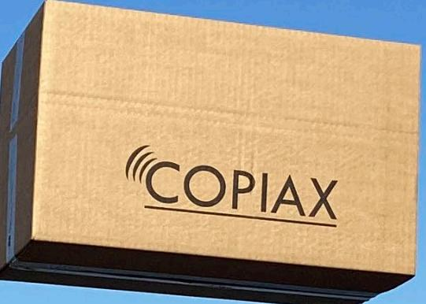

VER 2: 2022 Vi förbehåller oss rätten till eventuella förändringar av innehållet i Marknadspaketet men står för likvärdig ersättare om detta sker under avtalad tid. Köpt paket är bindande och påverkar inte debiteringen om du väljer att inte delta eller utnyttja det.

## **Nå ut till säkerhetsinstallatörerna**

### **Marknadspaket**

Med vårt Marknadspaket kan du som leverantör marknadsföra företaget och dina produkter tillsammans med Copiax. Ett effektivt sätt att nå ut och exponeras mot lås- och säkerhetsbranschen. Du syns kontinuerligt i digitala och fysiska kanaler.

Marknadspaketen finns i tre olika varianter (brons, silver, guld) för att passa olika behov och budgetar. Prioritet för platser sker utifrån paket och avtal. Enskilda insatser kan därför inte erbjudas för alla aktiviteter, utan i mån av plats.

För att se och jämföra de olika paketens innehåll och få pris, kontakta din produktchef.

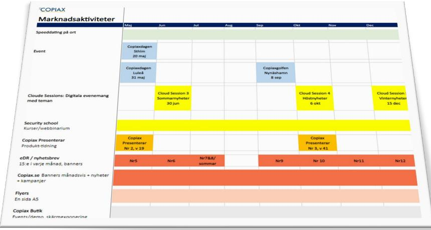

### **Planen med datum för respektive aktivitet hittar du här**

[Aktivitetsplan](https://copiax.se/doc/Partner_doc/MarknadsAktiviteter.pdf) (copiax.se)

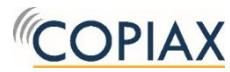

# **Digital produktexponering**

### **Annonsera på copiax.se**

Hela 93% av vår försäljning sker digitalt. Som en leverantör blir dina produkter synliga med pris, bild, text och specifikation (dvs PIM) på copiax.se. Genom att bidra med material av hög kvalitet får ditt företag bästa möjliga exponering av era produkter.

För att nå ut ytterligare erbjuder vi annonsering på sajten. Olika placeringar, storlekar och format finns tillgängliga.

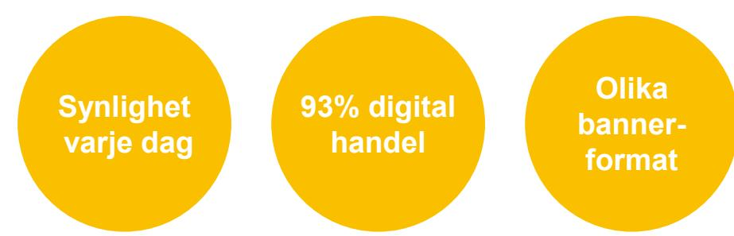

HÄR KAN DU SYNAS

**Varumärkessida** Egen bild/banner

**Annonsplaceringar** Startsida Produktgrupp Redaktionella sidor Meny - Produkter & Tjänster

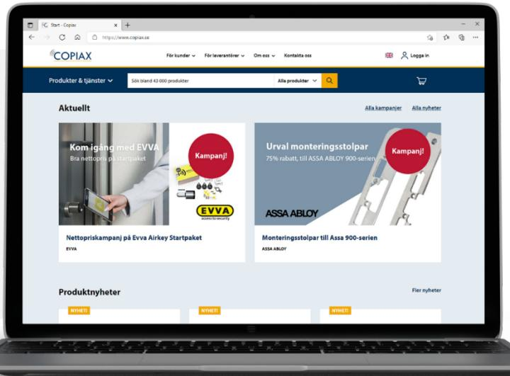

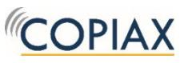

## **Bygg din varumärkessida**

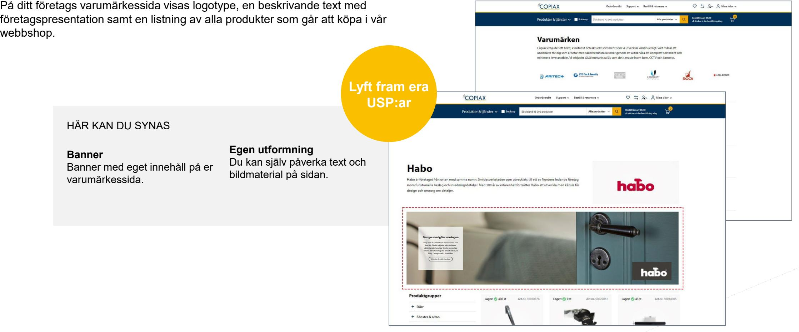

## **Nå ut med nyhetsbrevet**

### **Direkt i våra kunders inbox**

Vi på Copiax skickar regelbundet nyhetsbrev till våra kunder. Vi är mycket måna om att hålla det relevant och innehållet styrs därför utifrån en plan som sätts av Copiax. Det finns möjlighet att synas i nyhetsbrevet med beaktning av ovan.

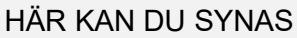

**Nyhetsbrevet - utskick** Till alla kunder, 10-12 utskick per år

**Exponering** Banner i nyhetsbrev Innehåll i nyhetsbrev

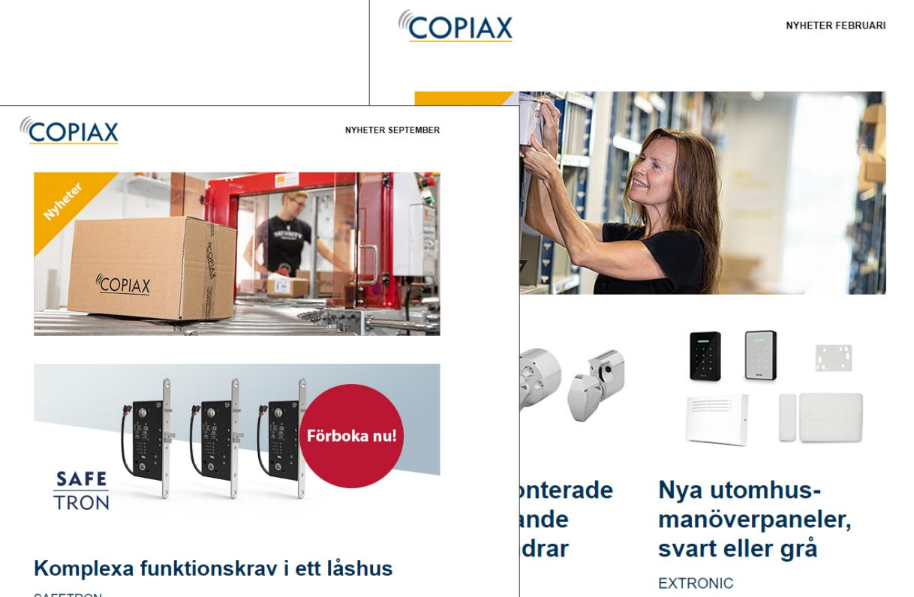

## **Produktexponering i Copiax Presenterar**

### **Vi talar om just din produkt**

Copiax Presenterar är det säljmaterial vi tar med i möten med kunder för att visa upp nyheter. Den ges ut tre gånger om året i tryckt format och distribueras även som en digital version via copiax.se och eDR. Produkturval och innehåll baseras på nyhetsvärde, produktkategori/tema och säsong.

|  |  |  |  |  |  |  | Tidning Digital och i tryck |  |
|--|--|--|--|--|--|--|-----------------------------------|--|
|  |  |  |  |  |  |  |                                   |  |
|  |  |  |  |  |  |  |                                   |  |
|  |  |  |  |  |  |  |                                   |  |
|  |  |  |  |  |  |  |                                   |  |
|  |  |  |  |  |  |  |                                   |  |
|  |  |  |  |  |  |  |                                   |  |
|  |  |  |  |  |  |  |                                   |  |
|  |  |  |  |  |  |  |                                   |  |
|  |  |  |  |  |  |  |                                   |  |
|  |  |  |  |  |  |  |                                   |  |
|  |  |  |  |  |  |  |                                   |  |
|  |  |  |  |  |  |  |                                   |  |

### HÄR KAN DU SYNAS

#### **Tre utgåvor**

- 1. Januari Maj
- 2. Maj Oktober
- 3. Oktober Januari

**Exponering** Annons Innehåll / produkter

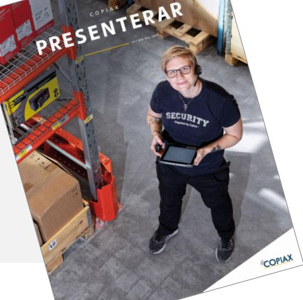

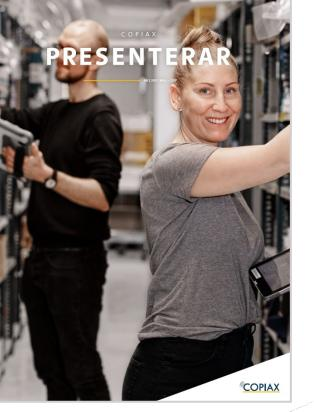

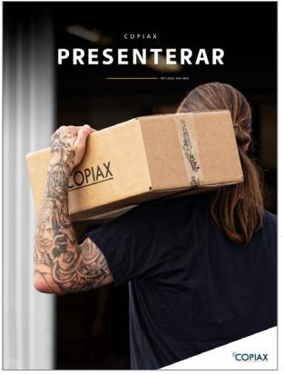

## **Skicka med en tryckt reklamflyer**

## **Omkring 3 500 varor lämnar vårt lager varje dag**

Vi skickar tusentals lådor ut i landet, som tas emot av personer som hanterar säkerhetsprodukter. Med den vetskapen använder vi lådorna för att distribuera även annan relevant information till våra kunder.

Våra flyers är A5-format och som leverantör till Copiax kan du få möjligheten att trycka ditt innehåll på ena sidan av flyern.

Då Copiax står som avsändare är vi måna om innehållet och dess relevans för målgruppen. Produkten måste säljas via Copiax.

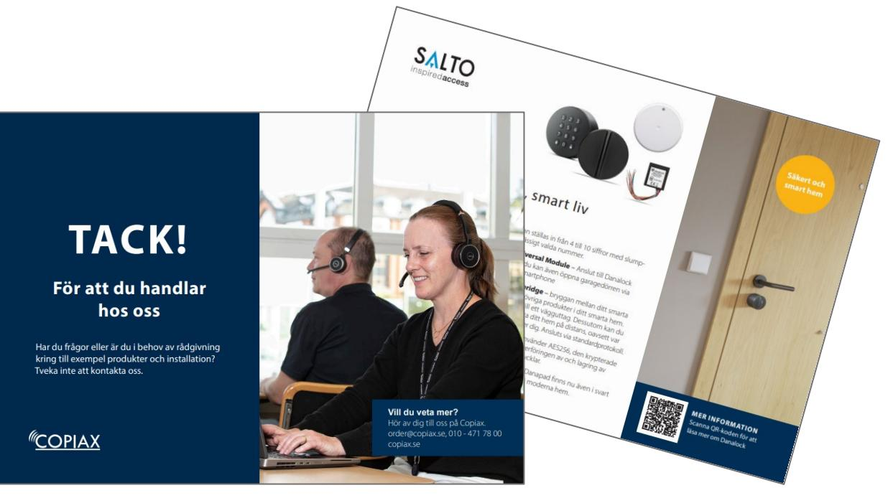

#### HÄR KAN DU SYNAS

#### **Exponering**

En hel sida för din annons. Bestäm ditt budskap själv. Behöver du hjälp med produktionen? – Prata med oss, så löser vi det. Upplaga max om: 5000 st.

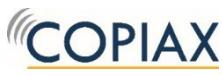

**Digitalt och i** 

## **Utbildningar med Security School**

## **klassrum Maximera spridning och räckvidd digitalt**

### **Utbilda med ett webbinarium**

Varje år utbildar vi tusentals personer via Security School-plattformen! Med oss har du möjlighet att spela in och få ut dina budskap. Låt det digitala materialet ligga kvar på vår utbildningsplattform så att de som är intresserade kan ladda ned och se det när det passar dem (on demand).

### **Delta i Copiax Cloud Sessions**

Copiax drar varje år ihop till ett par digitala samlingsevent där olika leverantörer tillsammans med Copiax står för innehållet. Under 2021 drog dessa event totalt hela 3 656 tittare och statistiken fortsätter att stiga eftersom materialet finns tillgängligt "on demand" i efterhand.

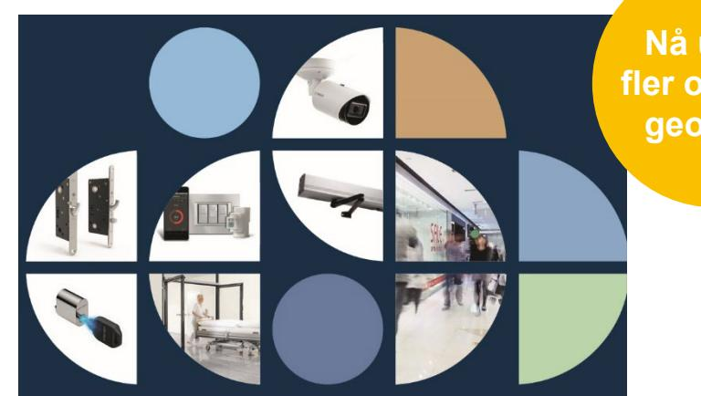

**Nå ut till fler oavsett geografi**

HÄR KAN DU SYNAS & HÖRAS

#### **Exponering**

Egna webbinarier – vi hjälper till med allt runt omkring, såsom inbjudningar och spridning Cloud Sessions – var med i ett större sammanhang

> *Innehåll sätts baserat på nyhetsvärde, säsong, inköpsvolymer och vi förbehåller oss att planera dem därefter.*

## **Studio**

### **Spela in material eller kör live**

Att genomföra digitala utbildningar eller evenemang kräver vissa förberedelser och rätt verktyg.

Vi har arbetat med både helt förinspelade sessioner och liveevent och även hybrider där en värd presenterar kommande föreläsningar och även finns tillgänglig i chatten för att svara på frågor.

I vår studio kan du spela in din presentation. Vi finns behjälpliga från början till slut.

Hyr vår studio och spela in ditt föredrag. Detta sker i Copiax regi, vilket gör att vi också står som avsändare och distributör. Ni har rätt till materialet och spridning av detta.

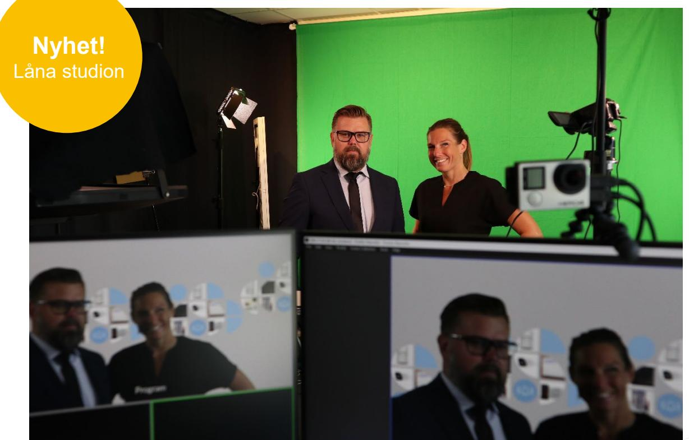

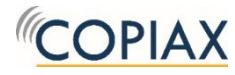

**Nyhet!** I olika digitala

## **Utbildningar med Security School**

### **Utbildningar i klassrum**

Utbildningarna är ett bra sätt att visa hur dina produkter fungerar och skaffa konkurrensfördelar när du informerar yrkesproffs i branschen om just dina produkter.

Copiax står för allt det praktiska som inbjudningar, bokningar, administration och uppföljning, så att du som kursledare kan fokusera på innehållet.

Utbildningarna genomförs runt om i landet beroende på intresse och ämne. Kurserna vänder sig till kunder som arbetar inom Säkerhetsbranschen och är kund hos oss. Utbildningarna är kostnadsfria för kunden.

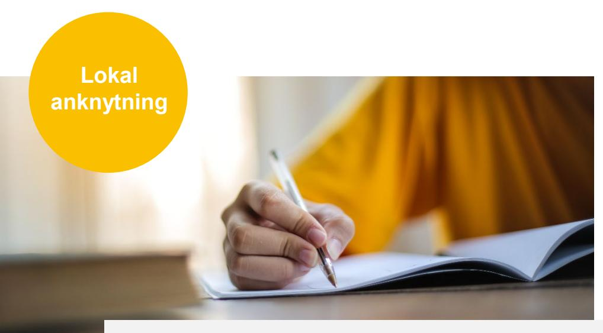

#### HÄR KAN DU SYNAS & HÖRAS

**Exponering** Egna kurser i lokal – vi hjälper till med allt runt omkring

*Innehåll sätts baserat på nyhetsvärde, säsong, inköpsvolymer och vi förbehåller oss att planera dem därefter. * Tillägg som externa lokaler (ej leverantörens eller Copiax) och tillkommande önskemål om t.ex. mat och material, debiteras som tillägg då detta är svårt att ge generellt pris för.* 

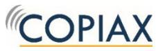

## **Delaktighet i evenemang**

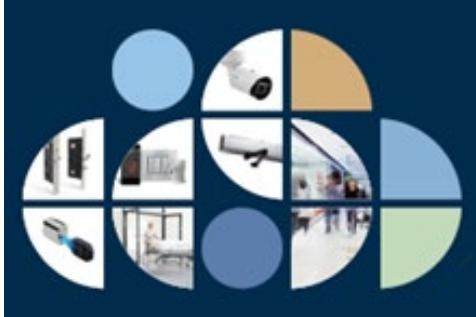

### **Cloud Sessions Copiaxdagarna**

Under 2021 utvecklade vi våra digitala live-dagar och formade dem efter olika typer av tema. Flera föreläsare från olika varumärken tar plats i skärmen.

Dessa event fortsätter vi att utveckla under 2022.

Vi sänder under en utsatt tid men materialet finns kvar i efterhand (on demand).

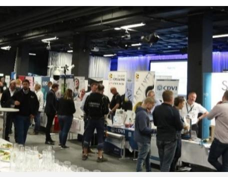

Populära Copiaxdagarna hålls på flera platser i Sverige för att ta mässa bortom storstäderna.

Vi vill blanda nytta med nöje och har alltid någon happening på lut utöver mässan, som utbildningspass, lunch, boule eller after work.

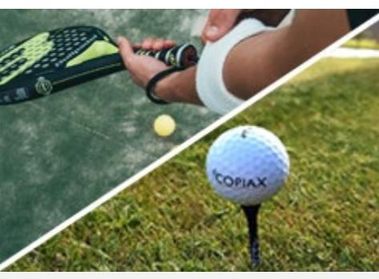

### **Copiax sportevent**

Copiaxgolfen erbjuder det perfekta tillfället att mötas, umgås och ha riktigt trevligt med branschkollegor, leverantörer och kunder.

Golfen är tradition och fylls på snabbt. Även mindre aktiviteter som padelturneringar med tillhörande frukost är sätt att under lättsamma former möta kunder.

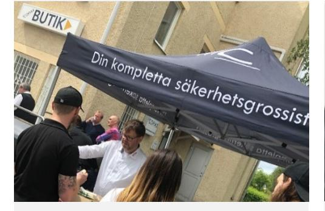

Vill du dema en produkt, nå ut med en nyhet eller helt enkelt bygga nätverk och stärka ditt varumärke?

Vill du köra en grillunch? En frukost i butiken eller en kvällsaktivitet för att visa en produkt?

Prata med oss.

### **Skräddarsytt Speed Dating**

Personliga möten i mindre grupp där syftet är att på lokala orter förmedla produktnyheter till både nya och befintliga kunder.

## **Vår butik**

### **Happenings, demos och skärmar**

### **Träffa kunderna på plats**

Vår butik håller öppet fem dagar i veckan. Här har du möjlighet att ha demos på plats eller på annat vis slå ett slag för dina produkter. Under sommartid kan även en plats utomhus, intill parkeringen nyttjas.

### **Material på skärm eller tryckt format**

I butiken finns också möjlighet att exponera skyltexemplar, film och erbjudanden.

#### HÄR KAN DU SYNAS

### **Exponering**

Happenings och demos – berätta vad du vill göra. Digitalt i våra skärmar.

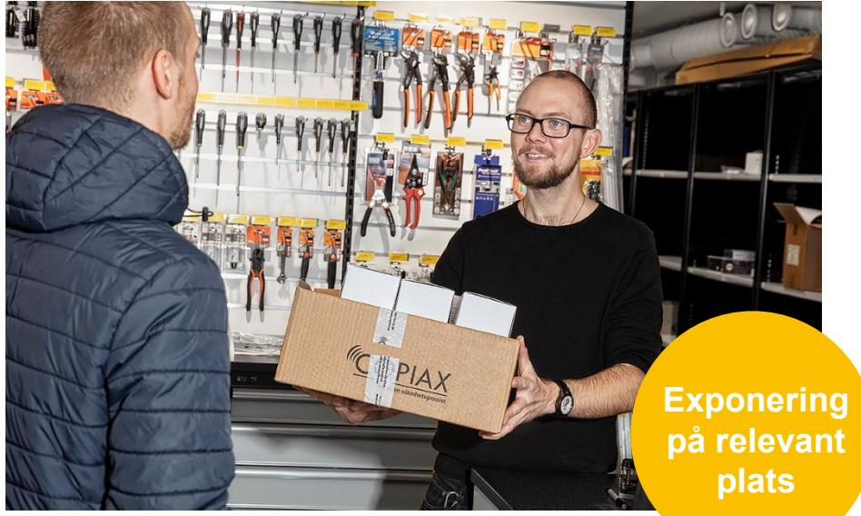

## **Wrap up!**

#### **Bokningar**

Har du frågor om hur du kommer igång? Eller vill boka en specifik tid för en kampanj? Tänk på att boka i god tid då många evenemang är populära och har ett begränsat antal platser. Kontakta oss:

Produktcheferna: [produktchefer_se@copiax.se](mailto:info@copiax.se)

### **Produktionshjälp**

Har du frågor gällande produktion, specifikationen eller leveranser av ditt material, så kontaktar du oss på marknad.

Marknadsavdelningen: [marknad@copiax.se](mailto:marknad@copiax.se)

**Event** [copiaxevents@copiax.se](mailto:copiaxevents@copiax.se)

**Utbildningar** [school@copiax.se](mailto:school@copiax.se)

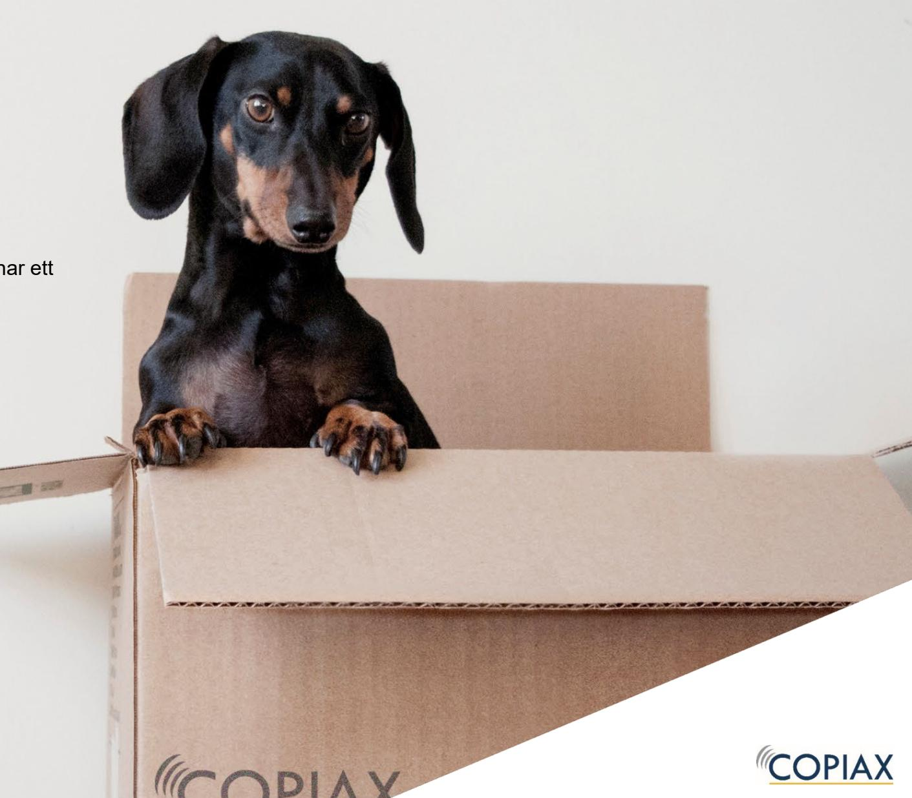