# **Aktiviteter 2023**

Marknadspaket för leverantörer till Copiax

VER 1: 2023 Vi förbehåller oss rätten till eventuella förändringar av innehållet i Marknadspaketet men står för likvärdig ersättare om detta sker under avtalad tid. Köpt paket är bindande och påverkar inte debiteringen om du väljer att inte delta eller utnyttja det.

## **Nå ut till säkerhetsinstallatörerna**

### **Marknadspaket**

Med vårt Marknadspaket kan du som leverantör marknadsföra företaget och dina produkter tillsammans med Copiax. Ett effektivt sätt att nå ut och exponeras mot lås- och säkerhetsbranschen. Du syns kontinuerligt i digitala och fysiska kanaler.

Marknadspaketen finns i tre olika varianter (brons, silver, guld) för att passa olika behov och budgetar. Prioritet för platser sker utifrån paket och avtal. Enskilda insatser kan därför inte erbjudas för alla aktiviteter, utan i mån av plats.

För att se och jämföra de olika paketens innehåll och få pris, kontakta din produktchef.

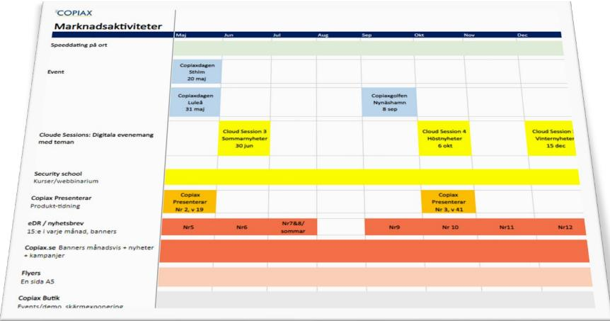

### **Planen med datum för respektive aktivitet hittar du här**

[Aktivitetsplan](https://copiax.se/doc/Partner_doc/Marknadsaktiviteter2023.pdf) (copiax.se)

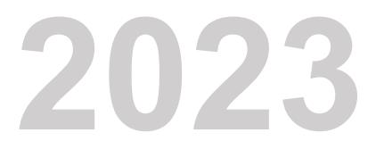

**Februari:** Copiaxpadel, Nyhetsbrev **Mars:** Copiaxdagen Västerås, Nyhetsbrev **April:** Cloud Session 1, Nyhetsbrev **Maj:** Copiaxdagen Malmö, Nyhetsbrev **Juni:** Copiaxdagen Sthlm, Nyhetsbrev Copiax Presenterar 2, Nyhetsbrev **Juli:** Nyhetsbrev **November:** Copiaxdagen GBG, Nyhetsbrev **2023 December:** Norrland Julbord & speeddating, Nyhetsbrev

MARKNADSAKTIVITETER | 2023 **Januari:** Copiax Presenterar, Nyhetsbrev **September:** Copiaxgolfen, Nyhetsbrev **Oktober:** Cloud Session 2, Copiax Presenterar 3, Nyhetsbrev

|                                                  | Jan                             | Feb                             | Mar                                               | Apr                                | Maj                                                     | Jun                                                       | Jul   | Aug | Sep                                 | Okt                               | Nov                                               | Dec                             |
|--------------------------------------------------|---------------------------------|---------------------------------|---------------------------------------------------|------------------------------------|---------------------------------------------------------|-----------------------------------------------------------|-------|-----|-------------------------------------|-----------------------------------|---------------------------------------------------|---------------------------------|
| Event                                            |                                 |                                 | Copiaxdagen Västerås (steam) 21 mar + kväll |                                    | Copiaxdagen Malmö (Slaghthuset) 11 maj + kväll | Copiaxdagen STHLM (färgfabriken) 15 juni + KVÄLL |       |     | Copiaxgolfen 7 sep Omberg G R |                                   | Copiaxdagen GBG 30 nov (Jacy'z) dag + kväll |                                 |
|                                                  |                                 | Copiaxpadel i Sthlm 9 feb |                                                   |                                    |                                                         |                                                           |       |     |                                     |                                   |                                                   | Norrland julbord Speeddating |
| Cloude Sessions: Digitala evenemang med teman |                                 |                                 |                                                   | Cloud Session 1 20 apr Aktuellt |                                                         |                                                           |       |     |                                     | Cloud Session 2 5 okt Aktuellt |                                                   |                                 |
| Security school Kurser/webbinarium               |                                 | Bokas upp                       |                                                   |                                    |                                                         |                                                           |       |     |                                     |                                   |                                                   |                                 |
| Copiax Presenterar  Produkt-tidning              | Copiax Presenterar Nr 1, v 3 |                                 |                                                   |                                    | Copiax Presenterar Nr 2, v 19                        |                                                           |       |     |                                     | Copiax Presenterar Nr 3, v 41  |                                                   |                                 |
| Nyhetsbrev 15:e i varje månad                    | Nr1                             | Nr2                             | Nr3                                               | Nr4                                | Nr5                                                     | Nr6                                                       | Nr7&8 |     | Nr9                                 | Nr 10                             | Nr11                                              | Nr12                            |
| Copiax.se nyheter + kampanjer                    |                                 | Annonser copiax.se bokas upp    |                                                   |                                    |                                                         |                                                           |       |     |                                     |                                   |                                                   |                                 |
| Flyers i utgående kartonger                      |                                 | Flyers bokas upp                |                                                   |                                    |                                                         |                                                           |       |     |                                     |                                   |                                                   |                                 |
| Copiax Butik Events/demo, skärmar                |                                 | Butik happenings - bokas upp    |                                                   |                                    |                                                         |                                                           |       |     |                                     |                                   |                                                   |                                 |

*Innehåll sätts baserat på nyhetsvärde, säsong, inköpsvolymer och vi förbehåller oss att planera dem därefter.*

### **Delaktighet i evenemang**

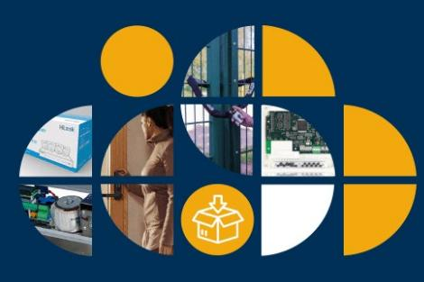

### **Cloud Sessions Copiaxdagarna**

Digitala live-dagar där vi samlar nyheter från flera parter. Föreläsare från olika varumärken tar plats i skärmen.

Vi sänder under en utsatt tid men materialet finns kvar i efterhand (on demand).

**2 st under 2023 20/4, 5/10**

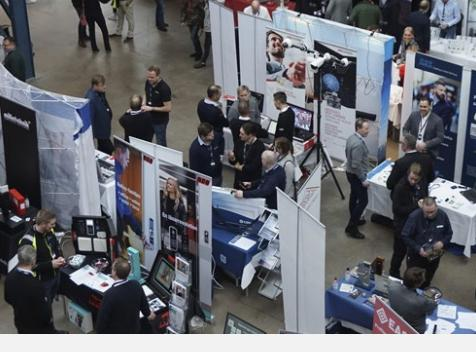

Populära Copiaxdagarna hålls på flera platser i Sverige för att ta mässa bortom storstäderna. Vi vill blanda nytta med nöje och har alltid någon happening på lut utöver mässan

**Västerås tis 21 mars Malmö tors 11 maj Sthlm tors 15 juni Gbg tors 30 nov**

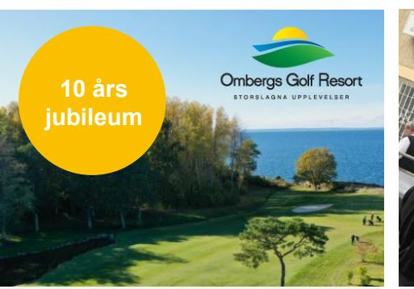

### **Copiaxgolfen & Padel**

Copiaxgolfen erbjuder det perfekta tillfället att möta kunder. Golfen är tradition och fylls på snabbt. Dag och kvällsaktivitet. Padeln kör vi i Stockholm – Kungens kurva (guldleverantörer)

**Omberg Golf Resort Tors 7 sep**

**Padel i Sthlm Tors 9 feb**

Vill du dema en produkt, nå ut med en nyhet eller helt enkelt bygga nätverk och stärka ditt varumärke?

Vill du köra en grillunch? En frukost i butiken eller en kvällsaktivitet för att visa en produkt?

Prata med oss.

### **Skräddarsytt Julbord i Norrland med Speed Dating**

Personliga möten i rasande tempo – sedan julbord på det. Guldleverantörer och Copiax

**Digitalt och i klassrum**

## **Utbildningar med Security School**

Utbildningarna är ett bra sätt att visa hur dina produkter fungerar och skaffa konkurrensfördelar när du informerar yrkesproffs i branschen om just dina produkter

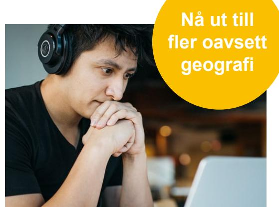

### HÄR KAN DU SYNAS & HÖRAS

Vi hjälper till med allt runt omkring, såsom inbjudningar och spridning

### **Digital räckvidd! Utbilda med ett webbinarium**

Varje år utbildar vi tusentals personer via Security Schoolplattformen! Med oss har du möjlighet att spela in och få ut dina budskap.

Låt det digitala materialet ligga kvar på vår utbildningsplattform så att de som är intresserade kan ladda ned och se det när det passar dem (on demand).

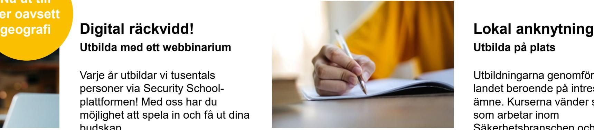

### HÄR KAN DU SYNAS & HÖRAS

Egna kurser i lokal – vi hjälper till med allt runt omkring

### **Utbilda på plats**

Utbildningarna genomförs runt om i landet beroende på intresse och ämne. Kurserna vänder sig till kunder som arbetar inom Säkerhetsbranschen och är kund hos oss. Utbildningarna är kostnadsfria för kunden.

Copiax står för allt det praktiska som inbjudningar, bokningar, administration och uppföljning, så att du som kursledare kan fokusera på innehållet.

## **Studio**

### **Spela in material eller kör live studio**

Att genomföra digitala utbildningar eller evenemang kräver vissa förberedelser och rätt verktyg.

Vi har arbetat med både helt förinspelade sessioner och liveevent och även hybrider där en värd presenterar kommande föreläsningar och även finns tillgänglig i chatten för att svara på frågor.

I vår studio kan du spela in din presentation. Vi finns behjälpliga från början till slut.

Hyr vår studio och spela in ditt föredrag. Detta sker i Copiax regi, vilket gör att vi också står som avsändare och distributör. Ni har rätt till materialet och spridning av detta.

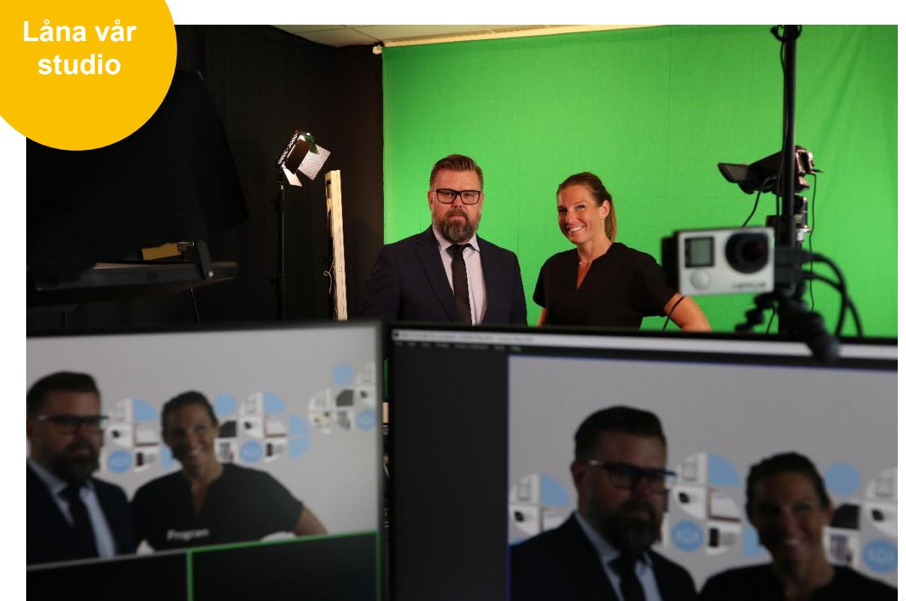

## **Vår butik**

### **Happenings, demos och skärmar**

### **Träffa kunderna på plats**

Vår butik håller öppet fem dagar i veckan. Här har du möjlighet att ha demos på plats eller på annat vis slå ett slag för dina produkter. Under sommartid kan även en plats utomhus, intill parkeringen nyttjas.

### **Material på skärm eller tryckt format**

I butiken finns också möjlighet att exponera skyltexemplar, film och erbjudanden.

#### HÄR KAN DU SYNAS

### **Exponering**

Happenings och demos – berätta vad du vill göra. Digitalt i våra skärmar.

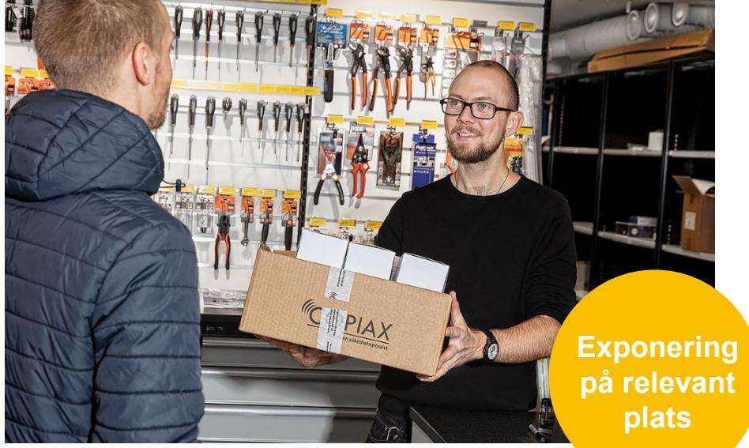

# **Digital produktexponering**

### **Annonsera på copiax.se**

Hela 93% av vår försäljning sker digitalt. Som en leverantör blir dina produkter synliga med pris, bild, text och specifikation (dvs PIM) på copiax.se. Genom att bidra med material av hög kvalitet får ditt företag bästa möjliga exponering av era produkter.

För att nå ut ytterligare erbjuder vi annonsering på sajten. Olika placeringar, storlekar och format finns tillgängliga.

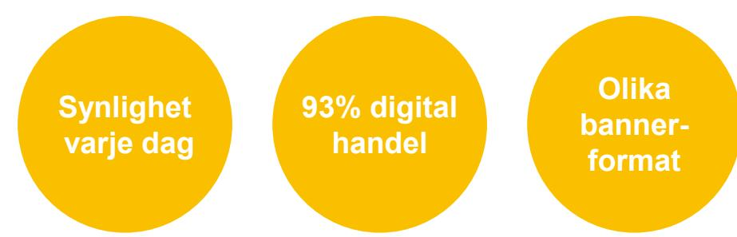

HÄR KAN DU SYNAS

**Varumärkessida** Egen bild/banner

**Annonsplaceringar** Startsida Produktgrupp Redaktionella sidor Meny - Produkter & Tjänster

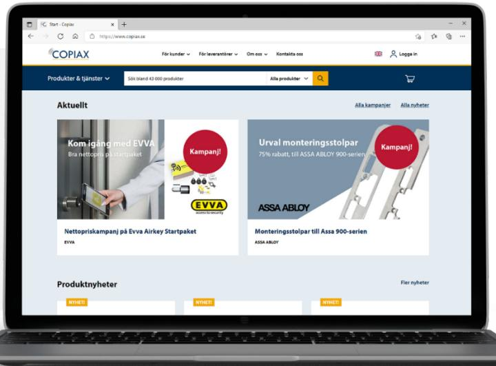

## **Bygg din varumärkessida**

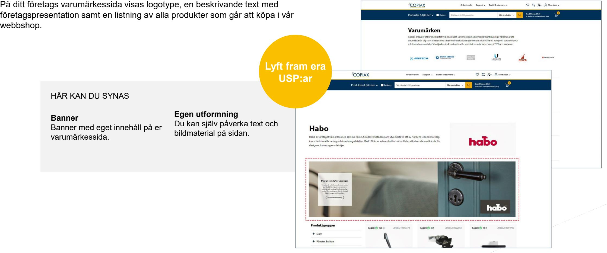

## **Nå ut med nyhetsbrevet**

### **Direkt i våra kunders inbox**

Vi på Copiax skickar regelbundet nyhetsbrev till våra kunder. Vi är mycket måna om att hålla det relevant och innehållet styrs därför utifrån en plan som sätts av Copiax. Det finns möjlighet att synas i nyhetsbrevet med beaktning av ovan.

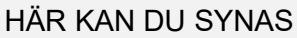

**Nyhetsbrevet - utskick** Till alla kunder, 10-12 utskick per år

**Exponering** Banner i nyhetsbrev Innehåll i nyhetsbrev

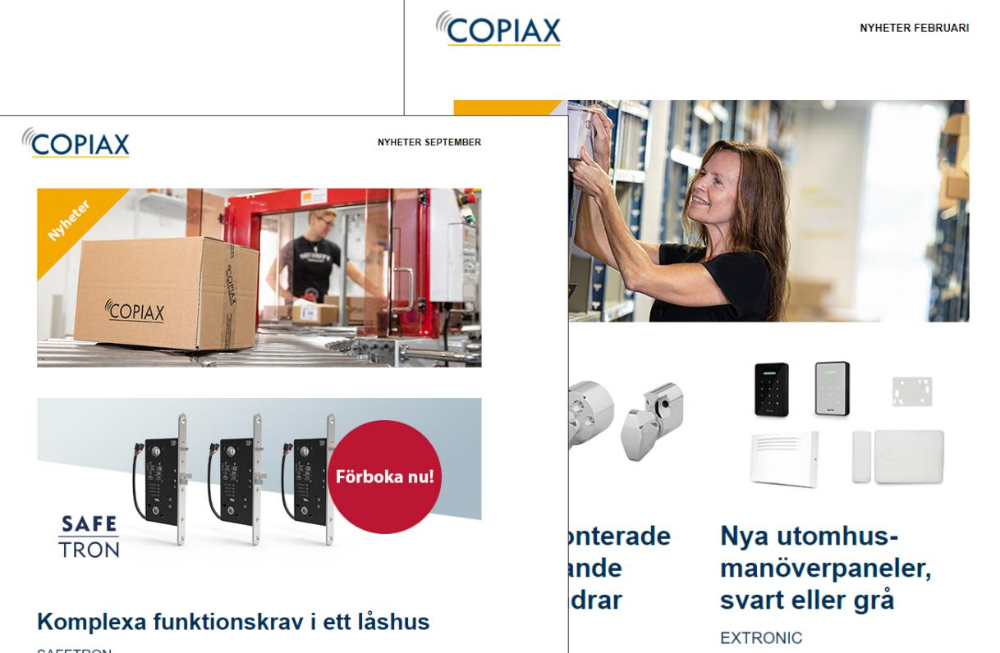

## **Produktexponering i Copiax Presenterar**

### **Vi talar om just din produkt**

Copiax Presenterar är det säljmaterial vi tar med i möten med kunder för att visa upp nyheter. Den ges ut tre gånger om året i tryckt format och distribueras även som en digital version via copiax.se och eDR. Produkturval och innehåll baseras på nyhetsvärde, produktkategori/tema och säsong.

#### HÄR KAN DU SYNAS

#### **Tre utgåvor**

- 1. Januari Maj
- 2. Maj Oktober
- 3. Oktober Januari

**Exponering** Annons Innehåll / produkter

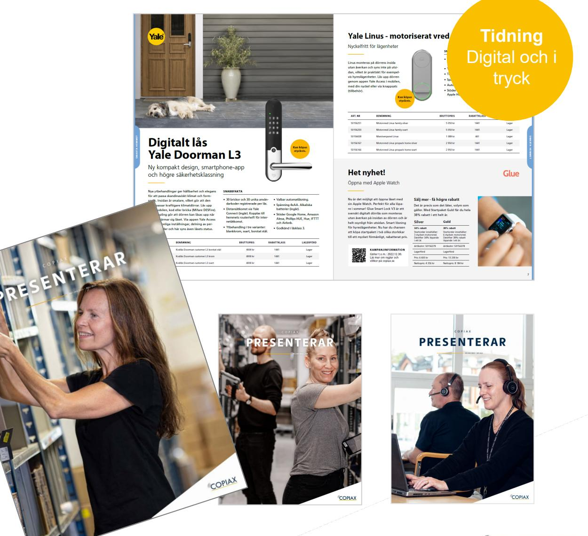

## **Skicka med en tryckt reklamflyer**

### **Omkring 3 500 varor lämnar vårt lager varje dag**

Vi skickar tusentals lådor ut i landet, som tas emot av personer som hanterar säkerhetsprodukter. Med den vetskapen använder vi lådorna för att distribuera även annan relevant information till våra kunder.

Våra flyers är A5-format och som leverantör till Copiax kan du få möjligheten att trycka ditt innehåll på ena sidan av flyern.

Då Copiax står som avsändare är vi måna om innehållet och dess relevans för målgruppen. Produkten måste säljas via Copiax.

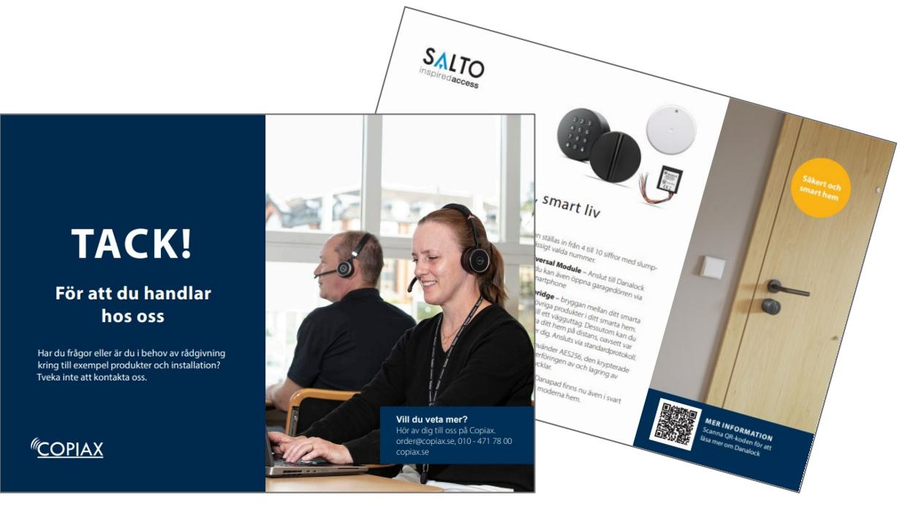

#### HÄR KAN DU SYNAS

#### **Exponering**

En hel sida för din annons. Bestäm ditt budskap själv. Behöver du hjälp med produktionen? – Prata med oss, så löser vi det. Upplaga max om: 5000 st.

## **Samarbetet**

### **Villkor och ansvar**

#### **Köp av paket**

Paketen är rabatterade. Du betalar ett paketpris och om du sedan väljer att inte nyttja alla delar påverkar det inte priset. Eftersom ditt deltagande är viktigt för kundupplevelsen är det dock så att Copiax förväntar sig deltagande i de större aktiviteterna.

#### **Turordning**

Guldpaket prioriteras först och sedan i fallande ordning. Vissa populära evenemang kommer inte att finnas som a la carte.

#### **Bokning**

Evenemang med fasta datum kommer du löpande få information om när de närmar sig. Du ansvarar för att vi på Copiax har fått kontaktuppgifter till ansvarig på ditt företag. Andra delar i paketen är upp till dig att nyttja när du tycker det passar ditt företags behov. Vill du

t.ex. ha en banner på sajten eller en demo i butiken måste du själv boka detta med din kontakt på Copiax Inköp. Tänk på att vara ute i god tid.

#### **Material**

I de fall ditt företag tar fram eget material ansvarar du för att det håller hög kvalitet och är korrekt enligt de specar vi har.

#### **Deadlines**

Får Copiax inte in material som behövs i utsatt tid, för att genomföra en produktion eller ett evenemang, tar vi oss rätten att stryka deltagandet. Avhopp påverkar dock kundupplevelsen negativt eftersom Copiax marknadsför partners i förväg. Där har vi ett gemensamt ansvar.

### **Tips!**

### **Partnerportalen**

HÅLL REDA PÅ EVENEMANG OCH MATERIALDAGAR

Vi skickar ut mejl om våra fasta evenemang men för att alltid ha full koll finns en sida du alltid kan hitta det du behöver. Där finns tex. tidsplaner, deadlines och materialspecar. Sätt ett bokmärke i din browser och mejla URL:en till fler i organisationen – t.ex. din marknadsansvariga.

PartnerPortalen – Copiax <https://copiax.se/Webshop/Content/partnerportalen>

## **Wrap up!**

#### **Bokningar**

Har du frågor om hur du kommer igång? Eller vill boka en specifik tid för en kampanj? Tänk på att boka i god tid då många evenemang är populära och har ett begränsat antal platser. Kontakta oss:

Produktcheferna: [produktchefer_se@copiax.se](mailto:info@copiax.se)

### **Produktionshjälp**

Har du frågor gällande produktion, specifikationen eller leveranser av ditt material, så kontaktar du oss på marknad.

Marknadsavdelningen: [marknad@copiax.se](mailto:marknad@copiax.se)

**Event** [copiaxevents@copiax.se](mailto:copiaxevents@copiax.se)

**Utbildningar** [school@copiax.se](mailto:school@copiax.se)

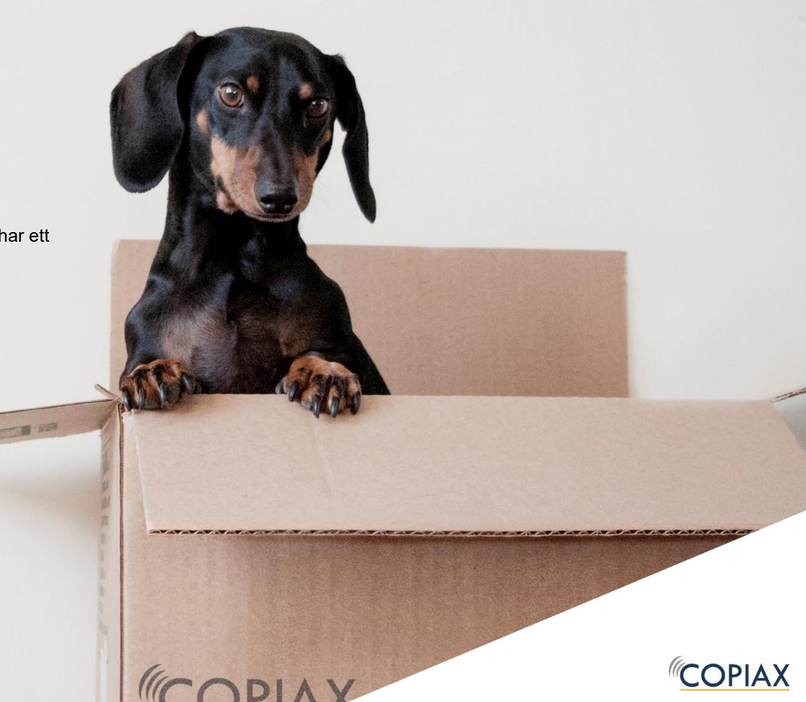