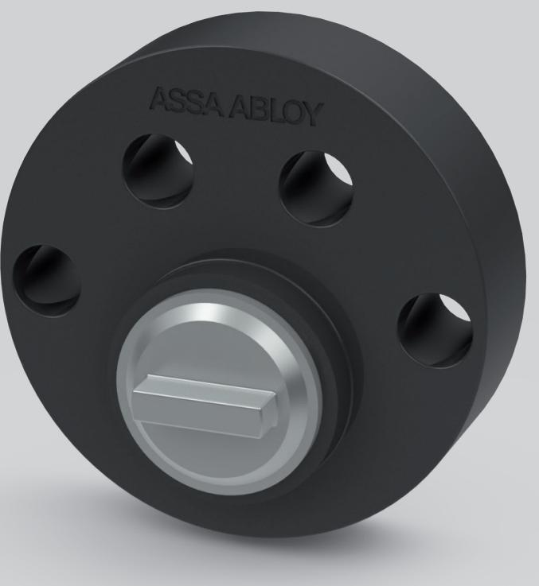

## Cylinderförlängare

## **Användningsområde**

Rund cylinderförlängare av komposit används tillsammans med ASSA ABLOYs runda cylindersortiment. Kompletteras med höghållfasthetsskruv.

## **Egenskaper**

Cylinderförlängaren av nylon används för korrekt montage av rund cylinder i ASSA ABLOYs sortiment när dörrens B/C mått överstiger 27mm. Cylinderförlängare av nylon har även egenskapen att den agerar köldbrygga och hindrar köld- och kondensspridning genom dörren.

ASSA ABLOY Opening Solutions Sweden P.O. Box 371 SE-631 05 Eskilstuna Sweden

Phone +46 (0)16 17 70 00 Fax +46 (0)16 17 70 49

Customer support: Phone intl. +46 (0)16 17 71 00 Phone nat. 0771-640 640 Fax +46 (0)16 17 73 72 e-mail: helpdesk.se.openingsolutions@assaabloy.com www.assaabloyopeningsolutions.se

## **Funktion**

Material: Komposit Mått: 10mm Används när dörrens B/C mått överstiger 27mm 1 st förlängningsdel kompletteras med 70/76* mm höghållfasthetsskruv

2 st förlängningsdelar kompletteras med 80/86* mm höghållfasthetsskruv

3 st förlängningsdelar kompletteras med 90/96* mm höghållfasthetsskruv

4 st förlängningsdelar kompletteras med 100/106* mm höghållfasthetsskruv

5 st förlängningsdelar kompletteras med 110/116* mm höghållfasthetsskruv

* Avser cylinderbehör 3212S

**Artikelnummer**

706773200000 Cylinderförlängare 10 mm rund Komposit 25p

706773800000 Cylinderförlängare 10 mm rund Komposit 100p