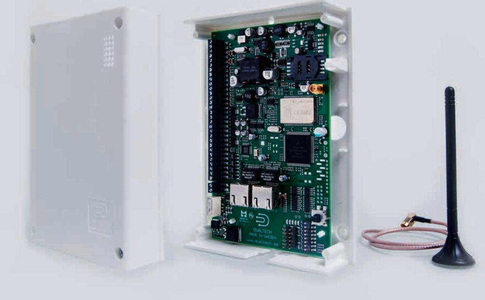

## ALARM COMMUNICATION PRODUCTS | DALM Säkerhetsrouter med plastkapsling

# DALM med plastkapsling.

Genom att digitalisera befintliga analoga installationer med hjälp av DALM Säkerhetsrouter skapas en framtidssäkrad och övervakad larmöverföring till larmcentralen, med möjligheter till fler och smidigare trygghetslösningar. Plastkapslingen gör installationen extra smidig.

**DALM Säkerhetsrouter** har dubbla kommunikationsvägar och används som extern larmsändare i drift-, brand- och inbrottslarm. Telelinjeutgången hanterar analogt larmprotokoll från anslutet inbrottslarm och konverterar till TCP/IP-protokoll för överföring till larmcentral. DALM har ingångar för larm och utgångar som kan fjärrmanövreras. Dessutom kan IP-kameror anslutas till routern.

**DALM ger enkel fjärraccess** till anslutet inbrottslarm och även vissa brandlarm. Med tillbehöret SIM-kort Secure SIM24 ges optimal säkerhet och tillgänglighet. Dessutom tillgång till nya säkerhetstjänster som t ex EagleEye Kundapp med bildvisning från anslutna kameror, fjärrstyrning och larmbesked direkt i kundens mobil, läsplatta och dator. Säkerhetsroutern hanteras via vår användarvänliga webbportal EasyWebManager 2.0 och gör att du som säkerhetsinstallatör kan erbjuda snabbare service och en rad nya tjänster.

#### PRODUKTÖVERSIKT

- Teleutgång för konvertering av SIA (nivå 1-3), SIA Hex, Contact ID och Robofon
- 8 st ingångar
- 4 st fjärrstyrningsbara utgångar
- Integrerat IP larmprotokoll SOS ACCESS V4
- Sänder även larm som SMS
- TCP/IP larmöverföring via fasta Internet och/eller 2G eller 3G till larmcentral och/eller EagleEye
- Krypterad informationsöverföring
- Kontinuerlig funktions- och förbindelseövervakning genom pollning mellan router och larmcentral
- Upp till 4 st IP-kameror kan anslutas
- Tillbehör: SIM-kort Secure SIM24

| TEKNISK BESKRIVNING        |  |
|----------------------------|--|
| Matningsspänning 10-30 VDC |  |

| STRÖMFÖRBRUKNING     | 13,7 VDC | 27,2 VDC |
|----------------------|----------|----------|
| SINGEL LARMVÄG 2G/3G | ca150mA  | ca75mA   |
| DUBBLA LARMVÄGAR     | ca210 mA | ca105 mA |

DALM levereras komplett med plastkapsling och antenn med 0,5 meter antennkabel. Enheten spänningsmatas normalt från befintlig larmanläggning.

## Produktvarianter på nästa sida.

# Larmklasser för DALM Säkerhetsrouter med plastkapsling. Två larmvägar.

LARMKLASS 2-4 SSF 114

## LARMKLASS 1 SSF 114

#### DALM1000 IP/2G **E-nr: 6390257** DALM1000 IP/2G SIM24 **E-nr: 6390258** DALM1000 IP/3G **E-nr: 6390259** DALM1000 IP/3G SIM24

**E-nr: 6390260**

DALM3000 IP/2G **E-nr: 6390261** DALM3000 IP/2G SIM24 **E-nr: 6390262** DALM3000 IP/3G **E-nr: 6390263** DALM3000 IP/3G SIM24 **E-nr: 6390264**

### LARMKLASS 2-4 SSF 114 OCH SBF 110:7

- DALM5000 IP/2G **E-nr: 6390265** DALM5000 IP/2G SIM24 **E-nr: 6390266** DALM5000 IP/3G **E-nr: 6390267** DALM5000 IP/3G SIM24 **E-nr: 6390268**