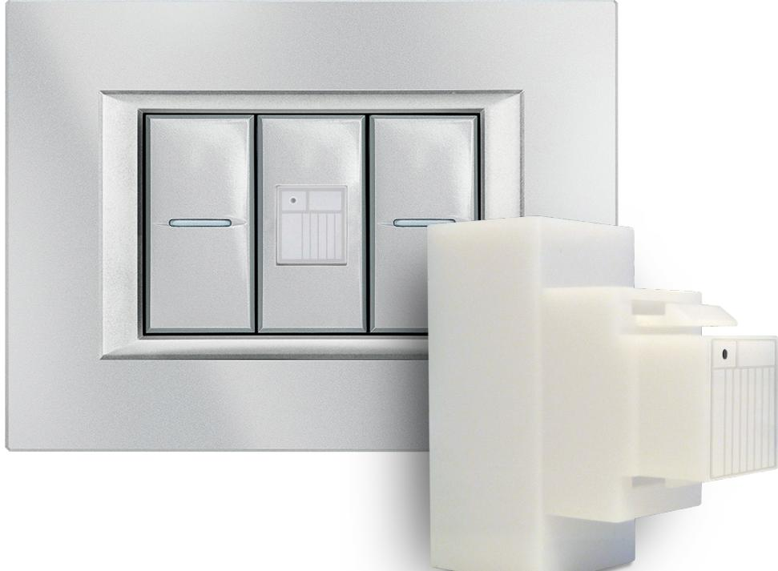
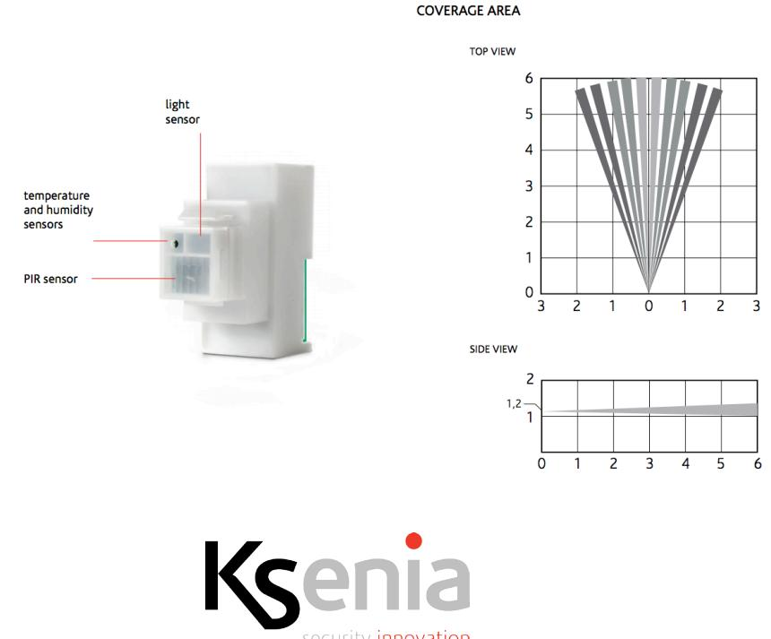

# **domus**

#### **domus Multi-function sensor KSI2700000.300**

DS-domus EN Rev.00 **www.kseniasecurity.com www.kseniasecurity.com**

## **INTRODUCTION**

**domus** is a built-in module which, like the RFID reader for **volo-in** access control, uses the Keystone opening (of identical size on any series of switch plates) to insert a new device that allows, for each room, to have in a single device a motion detector, a temperature sensor, relative humidity and light intensity.

Ideal in home automation, in combination with **auxi-L** module, it allows to switch lights on and off depending on the internal brightness, whenever someone is in the room.

It also has a temperature and humidity sensor, produced by **Sensirion** (world leader in the production of these devices) and able to drive and manage at best its own air conditioning and dehumidification system, in order to obtain the real degree of comfort desired. It becomes indispensable for office environments and for the correct humidification required in museums for the best conservation of art works.

**domus** is the ideal device for temperature control in the residential area and not only: it can be easily installed in any environment.

Thanks to the chronothermostat available on **lares 4.0** control panel, it is possible to adjust the temperature comfortably and anywhere, adapting the level of comfort to the use of the environment with significant energy savings.

Thanks to the flexibility of **lares 4.0** control panel it can control both heating and conditioning devices.

### **MAIN FEATURES**

- **• Power Supply:** 13,8 Vdc
- **• Consumption:** 10 mA max
- **• Mounting Height:** 1,2m
- **• Temperature sensor:** accuracy ±0,5 °C, resolution ±0,1 °C
- **• Humidity Sensor** accuracy ±0,5% RH, resolution ±2% RH
- **• PIR detector, 6 meters capacity, 5 rays, opening: 45°**
- **• Light sensor**
- **• Compatible with opera Keystone**
- **• KS-BUS interface**

#### **HOW TO ORDER**

- **• KSI2700000.300 domus**
#### **PARTS INCLUDED**

- **• 1 domus Multi-function sensor**
- **• 1 Quick Installation Guide ITA/EN**

#### **COMPLIANCE**

- **• Europe CE**
#### **PROGRAMMING**

**domus** connects to lares 4.0 control panels via KS-BUS 4-wire serial BUS and is programmed directly from the control panel.

#### **ENVIRONMENTAL CARE**

**domus** has been specifically designed and manufactured for the environment as follows:

- · Halogen free laminates and lead-free PCBA
- · Low consumption
- · Arsenic-free glass
- · Packaging realized mainly with recicled fibers and materials

