# Datasheet

High-Performance airMAX® Bridge Models: NBE-M2-13, NBE-M5-16, NBE-M5-19

Uniform Beamwidth Maximizes Noise Immunity

Innovative Mechanical Design

High-Speed Processor for Superior Performance

## **Overview**

Starting with the first-generation NanoBridge®, Ubiquiti Networks pioneered the all-in-one design for an airMAX® product functioning as a CPE (Customer Premises Equipment). Now Ubiquiti Networks launches the latest generation of CPE, the NanoBeam®.

### **Improved Noise Immunity**

Available for the 2.4 and 5 GHz frequency bands, the NanoBeam directs RF energy in a tighter beamwidth. With the focus in one direction, the NanoBeam blocks or spatially filters out noise, so noise immunity is improved. This feature is especially important in an area crowded with other RF signals of the same or similar frequency.

## **Integrated Design**

The Ubiquiti® Research and Development team combined the radio and antenna to create a more efficient and compact CPE. The NanoBeam gets maximum gain out of the smallest footprint.

Providing increased performance from its faster processor and innovative mechanical design at a low cost, the NanoBeam is extremely versatile and cost-effective to deploy.

## **airMAX Technology Included**

Unlike standard Wi-Fi protocol, Ubiquiti's Time Division Multiple Access (TDMA) airMAX protocol allows each client to send and receive data using pre-designated time slots scheduled by an intelligent AP controller.

This time slot method eliminates hidden node collisions and maximizes airtime efficiency. It provides significant performance improvements in latency, throughput, and scalability compared to all other outdoor systems in its class.

**Intelligent QoS** Priority is given to voice/video for seamless streaming.

**Scalability** High capacity and scalability.

**Long Distance** Capable of high-speed, carrier-class links.

#### **Application Examples**

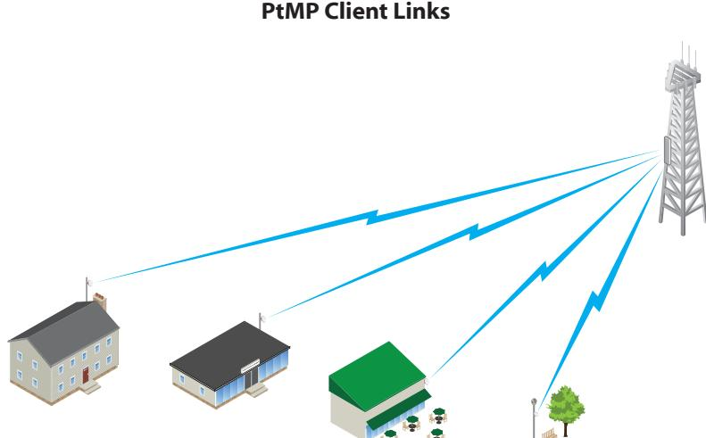

*The NanoBeam used as a CPE device for each client in an airMAX PtMP network.*

# **Wireless Client PtP Link**

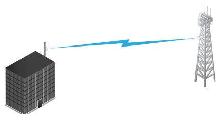

*The NanoBeam as a powerful wireless client.*

*Use a NanoBeam on each side of a PtP link.*

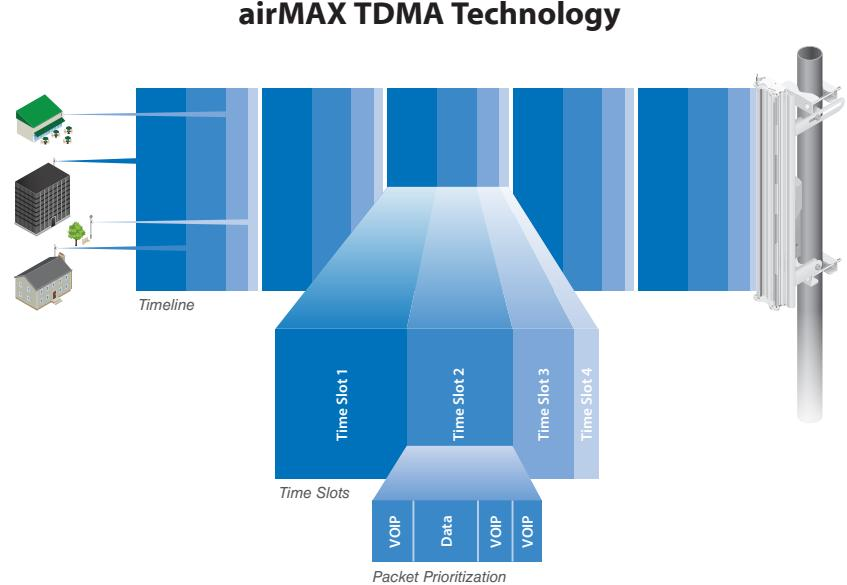

*Up to 100 airMAX stations can be connected to an airMAX Sector; four airMAX stations are shown to illustrate the general concept.*

# **Software**

airOS® is an intuitive, versatile, highly developed Ubiquiti firmware technology. It is exceptionally intuitive and was designed to require no training to operate. Behind the user interface is a powerful firmware architecture, which enables high -performance, outdoor multi -point networking.

- Protocol Support
- Ubiquiti Channelization
- Spectral Width Adjustment
- ACK Auto-Timing
- AAP Technology
- Multi-Language Support

Integrated on all Ubiquiti M products, airView® provides advanced spectrum analyzer functionality: waterfall, waveform, and real-time spectral views allow operators to identify noise signatures and plan their networks to minimize noise interference.

- **Waterfall** Aggregate energy over time for each frequency.
- **Waveform** Aggregate energy collected.
- **Real-time** Energy is shown in real time as a function of frequency.
- **Recording** Automate airView to record and report results.

airControl® is a powerful and intuitive, web-based server network management application, which allows operators to centrally manage entire networks of Ubiquiti devices.

- Network Map
- Monitor Device Status
- Mass Firmware Upgrade
- Web UI Access
- Manage Groups of Devices
- Task Scheduling

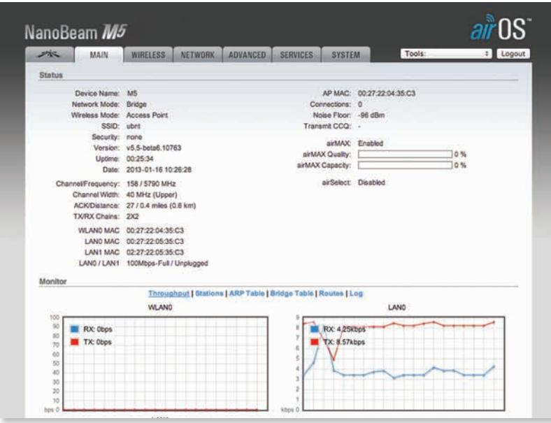

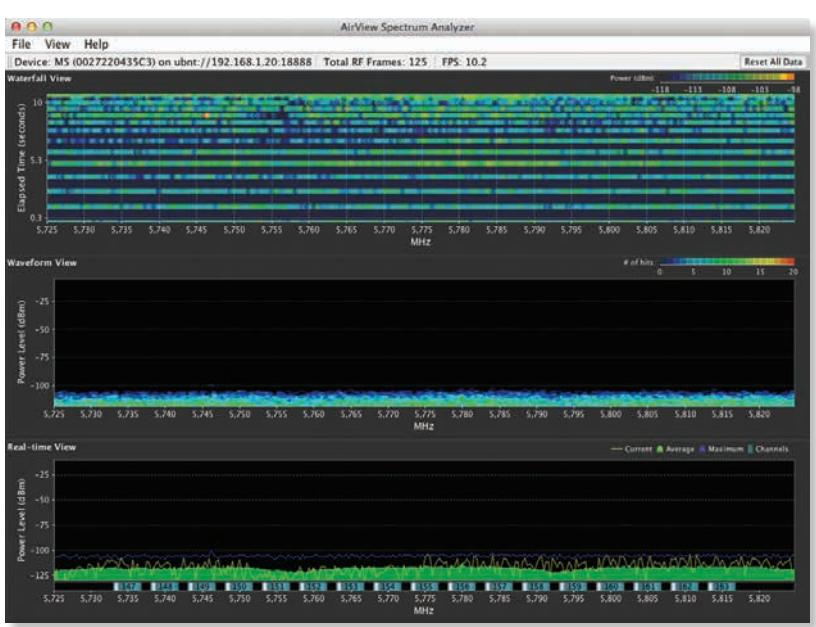

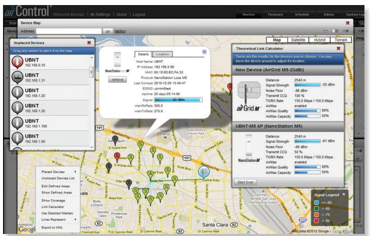

# **Hardware Overview**

#### **Innovative Mechanical Design**

- **All-in-one design** The NanoBeam provides both the radio and antenna in the smallest possible footprint.
- **Quick and easy installation** No fasteners are required for pole-mounting, and a single wall fastener (not included) is required for wall-mounting.
- **Convenient alignment** The NanoBeam pivots on its ball joint for easy aiming.

#### **Compact Form Factor**

- **Efficient footprint** The radio and antenna are combined into a single body that takes up minimal space.
- **Versatile mounting** The NanoBeam can be mounted in almost any position needed for line of sight.
- **Aesthetics** The NanoBeam is small enough to blend discreetly into the background at a customer's location.

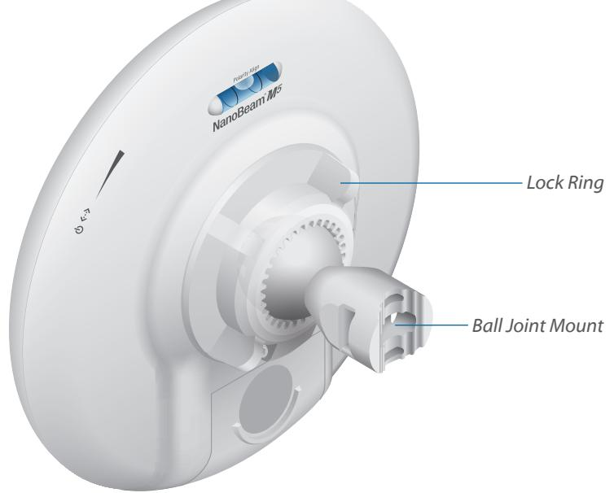

*NBE-M5-19 with Mounting Hardware*

# **Optional Isolator Shield Accessory**

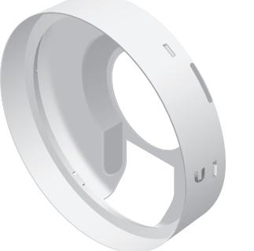

| Model       | NBE-M2-13 | NBE-M5-16 | NBE-M5-19 |
|-------------|-----------|-----------|-----------|
| ISO-BEAM-16 |           | ü         |           |
| ISO-BEAM-19 | ü         |           | ü         |

An RF isolator shield is available as an optional accessory to enhance signal isolation.

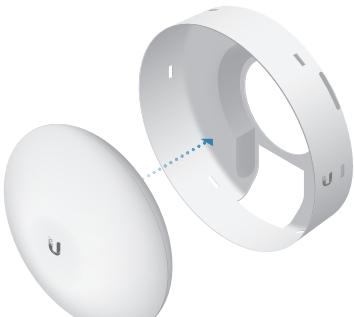

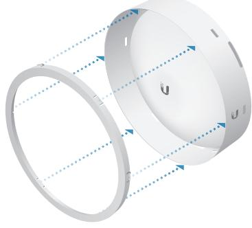

*Installation Using the IsoBeam™*

# **Optional Mounting Accessories**

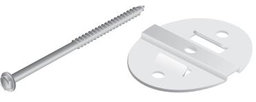

| Model   | NBE-M2-13 | NBE-M5-16 | NBE-M5-19 |
|---------|-----------|-----------|-----------|
| NBE-WMK | ü         | ü         | ü         |

A wall mount kit is available as an optional accessory to enhance stability for wall-mounting.

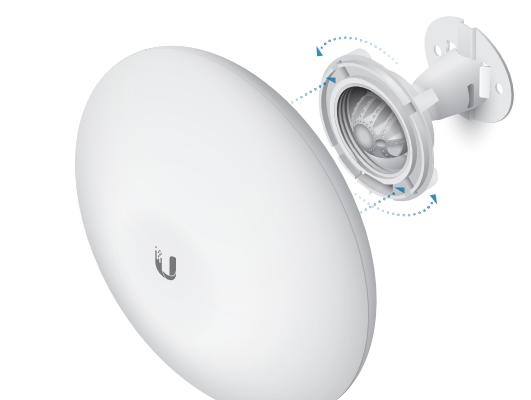

*Installation Using the NanoBeam Wall Mount Kit*

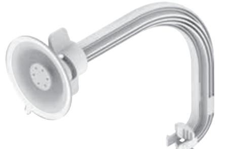

| Model     | NBE-M2-13 | NBE-M5-16 | NBE-M5-19 |
|-----------|-----------|-----------|-----------|
| NBE-16-WM |           | ü         |           |
| NBE-19-WM | ü         |           | ü         |

A suction cup mount is available as an optional accessory to mount the NanoBeam on a window.

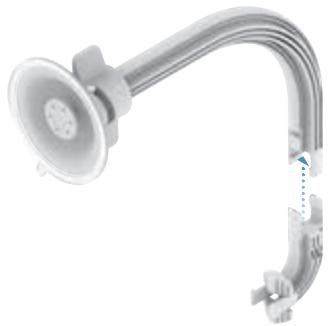

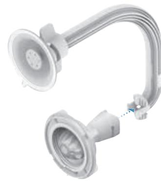

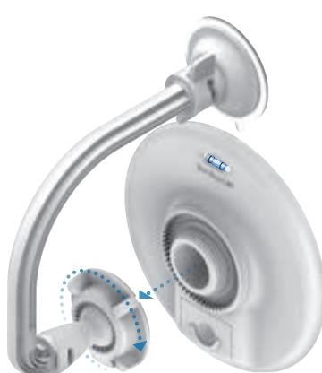

*Installation Using the NanoBeam Window Mount*

# **Specifications**

| Dimensions 189 x 189 x 125 mm (7.44 x 7.44 x 4.92") Weight 0.530 kg (1.17 lb) Power Supply 24V, 0.5A PoE Max. Power Consumption 6W Operating Frequency 2405 - 2475 MHz Gain 13 dBi Networking Interface (1) 10/100 Ethernet Port Processor Specs Atheros MIPS 74Kc, 560 MHz Memory 64 MB DDR2, 8 MB Flash LEDs (1) Power, (1) LAN, (4) WLAN Signal Strength LEDs Software-Adjustable to Correspond to Custom RSSI Levels Channel Sizes 5/8/10/20/30/40 MHz Polarization Dual Linear Enclosure Outdoor UV Stabilized Plastic Mounting Pole-Mount (Kit Included), Wall-Mount Wind Loading 45.4 N @ 200 km/h (10.2 lbf @ 125 mph) Wind Survivability 200 km/h (125 mph) ESD/EMP Protection Air: ± 24 kV, Contact: ± 24 kV Operating Temperature -40 to 80° C (-40 to 176° F) Operating Humidity 5 to 95% Noncondensing Wireless Approvals FCC, IC, CE |
|-------------------------------------------------------------------------------------------------------------------------------------------------------------------------------------------------------------------------------------------------------------------------------------------------------------------------------------------------------------------------------------------------------------------------------------------------------------------------------------------------------------------------------------------------------------------------------------------------------------------------------------------------------------------------------------------------------------------------------------------------------------------------------------------------------------------------------------------------------------------------------------------------------------------------------------------------------------------------------|
|                                                                                                                                                                                                                                                                                                                                                                                                                                                                                                                                                                                                                                                                                                                                                                                                                                                                                                                                                                               |
|                                                                                                                                                                                                                                                                                                                                                                                                                                                                                                                                                                                                                                                                                                                                                                                                                                                                                                                                                                               |
|                                                                                                                                                                                                                                                                                                                                                                                                                                                                                                                                                                                                                                                                                                                                                                                                                                                                                                                                                                               |
|                                                                                                                                                                                                                                                                                                                                                                                                                                                                                                                                                                                                                                                                                                                                                                                                                                                                                                                                                                               |
|                                                                                                                                                                                                                                                                                                                                                                                                                                                                                                                                                                                                                                                                                                                                                                                                                                                                                                                                                                               |
|                                                                                                                                                                                                                                                                                                                                                                                                                                                                                                                                                                                                                                                                                                                                                                                                                                                                                                                                                                               |
|                                                                                                                                                                                                                                                                                                                                                                                                                                                                                                                                                                                                                                                                                                                                                                                                                                                                                                                                                                               |
|                                                                                                                                                                                                                                                                                                                                                                                                                                                                                                                                                                                                                                                                                                                                                                                                                                                                                                                                                                               |
|                                                                                                                                                                                                                                                                                                                                                                                                                                                                                                                                                                                                                                                                                                                                                                                                                                                                                                                                                                               |
|                                                                                                                                                                                                                                                                                                                                                                                                                                                                                                                                                                                                                                                                                                                                                                                                                                                                                                                                                                               |
|                                                                                                                                                                                                                                                                                                                                                                                                                                                                                                                                                                                                                                                                                                                                                                                                                                                                                                                                                                               |
|                                                                                                                                                                                                                                                                                                                                                                                                                                                                                                                                                                                                                                                                                                                                                                                                                                                                                                                                                                               |
|                                                                                                                                                                                                                                                                                                                                                                                                                                                                                                                                                                                                                                                                                                                                                                                                                                                                                                                                                                               |
|                                                                                                                                                                                                                                                                                                                                                                                                                                                                                                                                                                                                                                                                                                                                                                                                                                                                                                                                                                               |
|                                                                                                                                                                                                                                                                                                                                                                                                                                                                                                                                                                                                                                                                                                                                                                                                                                                                                                                                                                               |
|                                                                                                                                                                                                                                                                                                                                                                                                                                                                                                                                                                                                                                                                                                                                                                                                                                                                                                                                                                               |
|                                                                                                                                                                                                                                                                                                                                                                                                                                                                                                                                                                                                                                                                                                                                                                                                                                                                                                                                                                               |
|                                                                                                                                                                                                                                                                                                                                                                                                                                                                                                                                                                                                                                                                                                                                                                                                                                                                                                                                                                               |
|                                                                                                                                                                                                                                                                                                                                                                                                                                                                                                                                                                                                                                                                                                                                                                                                                                                                                                                                                                               |
|                                                                                                                                                                                                                                                                                                                                                                                                                                                                                                                                                                                                                                                                                                                                                                                                                                                                                                                                                                               |
|                                                                                                                                                                                                                                                                                                                                                                                                                                                                                                                                                                                                                                                                                                                                                                                                                                                                                                                                                                               |
| RoHS Compliance Yes                                                                                                                                                                                                                                                                                                                                                                                                                                                                                                                                                                                                                                                                                                                                                                                                                                                                                                                                                        |
| Salt Fog Test IEC 68-2-11 (ASTM B117), Equivalent: MIL-STD-810 G Method 509.5                                                                                                                                                                                                                                                                                                                                                                                                                                                                                                                                                                                                                                                                                                                                                                                                                                                                                              |
| Vibration Test IEC 68-2-6                                                                                                                                                                                                                                                                                                                                                                                                                                                                                                                                                                                                                                                                                                                                                                                                                                                                                                                                                  |
| Temperature Shock Test IEC 68-2-14                                                                                                                                                                                                                                                                                                                                                                                                                                                                                                                                                                                                                                                                                                                                                                                                                                                                                                                                         |
| UV Test IEC 68-2-5 at 40° C (104° F), Equivalent: ETS 300 019-1-4                                                                                                                                                                                                                                                                                                                                                                                                                                                                                                                                                                                                                                                                                                                                                                                                                                                                                                          |
| Wind-Driven Rain Test ETS 300 019-1-4, Equivalent: MIL-STD-810 G Method 506.5                                                                                                                                                                                                                                                                                                                                                                                                                                                                                                                                                                                                                                                                                                                                                                                                                                                                                              |

| NBE-M2-13 Output Power: 28 dBm |             |         |                         |                |             |              |           |
|--------------------------------|-------------|---------|-------------------------|----------------|-------------|--------------|-----------|
| TX Power Specifications        |             |         | RX Power Specifications |                |             |              |           |
| Modulation                     | Data Rate   | Avg. TX | Tolerance               | Modulation     | Data Rate   | Sensitivity  | Tolerance |
| 802.11g                        | 1 - 24 Mbps | 28 dBm  | ± 2 dB                  |                | 1 - 24 Mbps | -94 dBm Min. | ± 2 dB    |
|                                | 36 Mbps     | 26 dBm  | ± 2 dBQ                 |                | 36 Mbps     | -80 dBm      | ± 2 dB    |
|                                | 48 Mbps     | 25 dBm  | ± 2 dB                  | 802.11g        | 48 Mbps     | -77 dBm      | ± 2 dB    |
|                                | 54 Mbps     | 24 dBm  | ± 2 dB                  |                | 54 Mbps     | -75 dBm      | ± 2 dB    |
|                                | MCS0        | 28 dBm  | ± 2 dB                  |                | MCS0        | -96 dBm      | ± 2 dB    |
| 802.11n/airMAX                 | MCS1        | 28 dBm  | ± 2 dB                  |                | MCS1        | -95 dBm      | ± 2 dB    |
|                                | MCS2        | 27 dBm  | ± 2 dB                  |                | MCS2        | -92 dBm      | ± 2 dB    |
|                                | MCS3        | 26 dBm  | ± 2 dB                  |                | MCS3        | -90 dBm      | ± 2 dB    |
|                                | MCS4        | 25 dBm  | ± 2 dB                  |                | MCS4        | -86 dBm      | ± 2 dB    |
|                                | MCS5        | 24 dBm  | ± 2 dB                  |                | MCS5        | -83 dBm      | ± 2 dB    |
|                                | MCS6        | 23 dBm  | ± 2 dB                  |                | MCS6        | -77 dBm      | ± 2 dB    |
|                                | MCS7        | 22 dBm  | ± 2 dB                  |                | MCS7        | -74 dBm      | ± 2 dB    |
|                                | MCS8        | 28 dBm  | ± 2 dB                  | 802.11n/airMAX | MCS8        | -96 dBm      | ± 2 dB    |
|                                | MCS9        | 28 dBm  | ± 2 dB                  |                | MCS9        | -95 dBm      | ± 2 dB    |
|                                | MCS10       | 27 dBm  | ± 2 dB                  |                | MCS10       | -92 dBm      | ± 2 dB    |
|                                | MCS11       | 26 dBm  | ± 2 dB                  |                | MCS11       | -90 dBm      | ± 2 dB    |
|                                | MCS12       | 25 dBm  | ± 2 dB                  |                | MCS12       | -86 dBm      | ± 2 dB    |
|                                | MCS13       | 24 dBm  | ± 2 dB                  |                | MCS13       | -83 dBm      | ± 2 dB    |
|                                | MCS14       | 23 dBm  | ± 2 dB                  |                | MCS14       | -77 dBm      | ± 2 dB    |
|                                | MCS15       | 22 dBm  | ± 2 dB                  |                | MCS15       | -74 dBm      | ± 2 dB    |

Datasheet

*Horizontal Azimuth Horizontal Elevation*

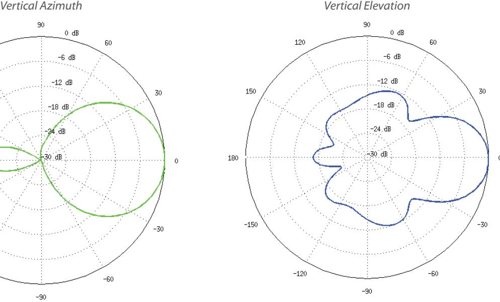

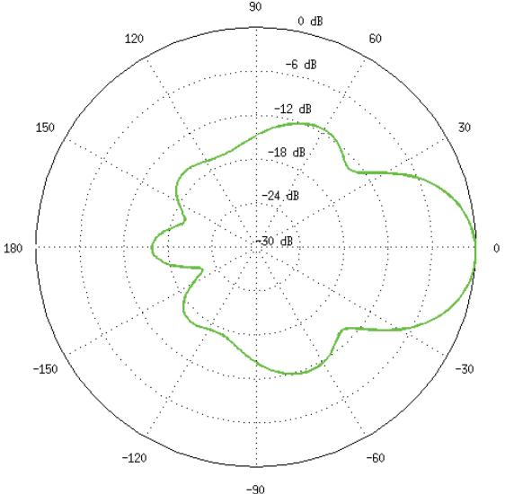

*Return Loss*

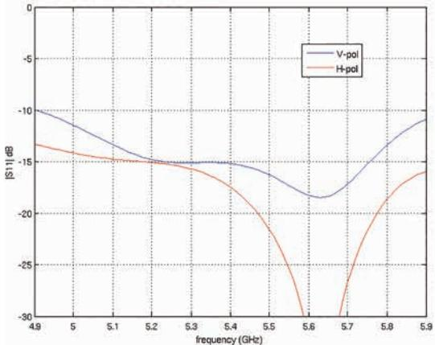

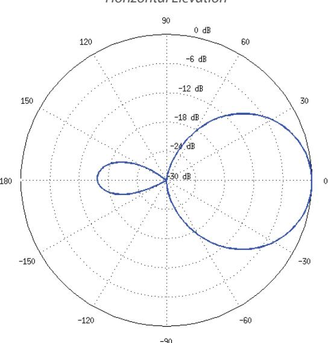

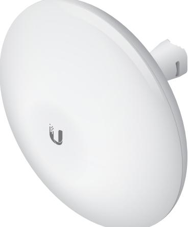

# **Specifications**

| NBE-M5-16              |                                                                 |                                                           |                                                |                  |                                         |  |  |
|------------------------|-----------------------------------------------------------------|-----------------------------------------------------------|------------------------------------------------|------------------|-----------------------------------------|--|--|
| Dimensions             |                                                                 |                                                           |                                                |                  | 140 x 140 x 54 mm (5.51 x 5.51 x 2.13") |  |  |
| Weight                 |                                                                 | 0.320 kg (0.71 lb)                                        |                                                |                  |                                         |  |  |
| Power Supply           |                                                                 |                                                           |                                                |                  | 24V, 0.5A PoE                           |  |  |
| Max. Power Consumption |                                                                 |                                                           |                                                |                  | 6W                                      |  |  |
| Operating Frequency    | Worldwide                                                       | USA: U-NII-1                                              | USA: U-NII-2A USA: U-NII-2C USA: U-NII-3 |                  |                                         |  |  |
|                        | 5150 - 5875 MHz                                                 | 5150 - 5250 MHz*                                          | 5250 - 5350 MHz*                               | 5470 - 5725 MHz* | 5725 - 5850 MHz*                        |  |  |
| Gain                   |                                                                 |                                                           |                                                |                  | 16 dBi                                  |  |  |
| Networking Interface   |                                                                 |                                                           |                                                |                  | (1) 10/100 Ethernet Port                |  |  |
| Processor Specs        |                                                                 |                                                           |                                                |                  | Atheros MIPS 74Kc, 560 MHz              |  |  |
| Memory                 |                                                                 |                                                           |                                                |                  | 64 MB DDR2, 8 MB Flash                  |  |  |
| LEDs                   |                                                                 | (1) Power, (1) LAN, (4) WLAN                              |                                                |                  |                                         |  |  |
| Signal Strength LEDs   |                                                                 | Software-Adjustable to Correspond to Custom RSSI Levels   |                                                |                  |                                         |  |  |
| Max. VSWR              |                                                                 |                                                           |                                                |                  | 1.5:1                                   |  |  |
| Channel Sizes          |                                                                 | 5/8/10/20/30/40 MHz                                       |                                                |                  |                                         |  |  |
| Polarization           |                                                                 | Dual Linear                                               |                                                |                  |                                         |  |  |
| Enclosure              |                                                                 | Outdoor UV Stabilized Plastic                             |                                                |                  |                                         |  |  |
| Mounting               |                                                                 | Pole-Mount (Kit Included), Wall-Mount                     |                                                |                  |                                         |  |  |
| Wind Loading           |                                                                 | 21.4 N @ 200 km/h (4.8 lbf @ 125 mph)                     |                                                |                  |                                         |  |  |
| Wind Survivability     | 200 km/h (125 mph)                                              |                                                           |                                                |                  |                                         |  |  |
| ESD/EMP Protection     | Air: ± 24 kV, Contact: ± 24 kV                                  |                                                           |                                                |                  |                                         |  |  |
| Operating Temperature  | -40 to 70° C (-40 to 158° F)                                    |                                                           |                                                |                  |                                         |  |  |
| Operating Humidity     | 5 to 95% Noncondensing                                          |                                                           |                                                |                  |                                         |  |  |
| Wireless Approvals     | FCC, IC, CE                                                     |                                                           |                                                |                  |                                         |  |  |
| RoHS Compliance        | Yes                                                             |                                                           |                                                |                  |                                         |  |  |
| Salt Fog Test          | IEC 68-2-11 (ASTM B117), Equivalent: MIL-STD-810 G Method 509.5 |                                                           |                                                |                  |                                         |  |  |
| Vibration Test         |                                                                 | IEC 68-2-6                                                |                                                |                  |                                         |  |  |
| Temperature Shock Test |                                                                 | IEC 68-2-14                                               |                                                |                  |                                         |  |  |
| UV Test                |                                                                 | IEC 68-2-5 at 40° C (104° F), Equivalent: ETS 300 019-1-4 |                                                |                  |                                         |  |  |
| Wind-Driven Rain Test  |                                                                 | ETS 300 019-1-4, Equivalent: MIL-STD-810 G Method 506.5   |                                                |                  |                                         |  |  |
|                        |                                                                 |                                                           |                                                |                  |                                         |  |  |

| NBE-M5-16 Output Power: 26 dBm |             |                         |           |                         |             |                                                                                                                                                                                    |           |
|--------------------------------|-------------|-------------------------|-----------|-------------------------|-------------|------------------------------------------------------------------------------------------------------------------------------------------------------------------------------------|-----------|
|                                |             | TX Power Specifications |           | RX Power Specifications |             |                                                                                                                                                                                    |           |
| Modulation                     | Data Rate   | Avg. TX                 | Tolerance | Modulation              | Data Rate   | Sensitivity                                                                                                                                                                        | Tolerance |
| 802.11a                        | 6 - 24 Mbps | 26 dBm                  | ± 2 dB    | 802.11a                 | 6 - 24 Mbps | -94 dBm Min.                                                                                                                                                                       | ± 2 dB    |
|                                | 36 Mbps     | 25 dBm                  | ± 2 dB    |                         | 36 Mbps     | -80 dBm                                                                                                                                                                            | ± 2 dB    |
|                                | 48 Mbps     | 24 dBm                  | ± 2 dB    |                         | 48 Mbps     | -77 dBm                                                                                                                                                                            | ± 2 dB    |
|                                | 54 Mbps     | 23 dBm                  | ± 2 dB    |                         | 54 Mbps     | -75 dBm MCS0 -96 dBm MCS1 -95 dBm MCS2 -92 dBm MCS3 -90 dBm MCS4 -86 dBm MCS5 -83 dBm MCS6 -77 dBm MCS7 -74 dBm MCS8 -95 dBm | ± 2 dB    |
|                                | MCS0        | 26 dBm                  | ± 2 dB    | 802.11n/airMAX          |             |                                                                                                                                                                                    | ± 2 dB    |
|                                | MCS1        | 25 dBm                  | ± 2 dB    |                         |             |                                                                                                                                                                                    | ± 2 dB    |
|                                | MCS2        | 25 dBm                  | ± 2 dB    |                         |             |                                                                                                                                                                                    | ± 2 dB    |
|                                | MCS3        | 25 dBm                  | ± 2 dB    |                         |             |                                                                                                                                                                                    | ± 2 dB    |
|                                | MCS4        | 24 dBm                  | ± 2 dB    |                         |             |                                                                                                                                                                                    | ± 2 dB    |
|                                | MCS5        | 23 dBm                  | ± 2 dB    |                         |             |                                                                                                                                                                                    | ± 2 dB    |
| 802.11n/airMAX                 | MCS6        | 23 dBm                  | ± 2 dB    |                         |             |                                                                                                                                                                                    | ± 2 dB    |
|                                | MCS7        | 23 dBm                  | ± 2 dB    |                         |             |                                                                                                                                                                                    | ± 2 dB    |
|                                | MCS8        | 26 dBm                  | ± 2 dB    |                         |             |                                                                                                                                                                                    | ± 2 dB    |
|                                | MCS9        | 25 dBm                  | ± 2 dB    |                         | MCS9        | -93 dBm                                                                                                                                                                            | ± 2 dB    |
|                                | MCS10       | 25 dBm                  | ± 2 dB    |                         | MCS10       | -90 dBm                                                                                                                                                                            | ± 2 dB    |
|                                | MCS11       | 25 dBm                  | ± 2 dB    |                         | MCS11       | -87 dBm                                                                                                                                                                            | ± 2 dB    |
|                                | MCS12       | 24 dBm                  | ± 2 dB    |                         | MCS12       | -84 dBm                                                                                                                                                                            | ± 2 dB    |
|                                | MCS13       | 23 dBm                  | ± 2 dB    |                         | MCS13       | -79 dBm                                                                                                                                                                            | ± 2 dB    |
|                                | MCS14       | 23 dBm                  | ± 2 dB    |                         | MCS14       | -78 dBm                                                                                                                                                                            | ± 2 dB    |
|                                | MCS15       | 23 dBm                  | ± 2 dB    |                         | MCS15       | -75 dBm                                                                                                                                                                            | ± 2 dB    |

Datasheet

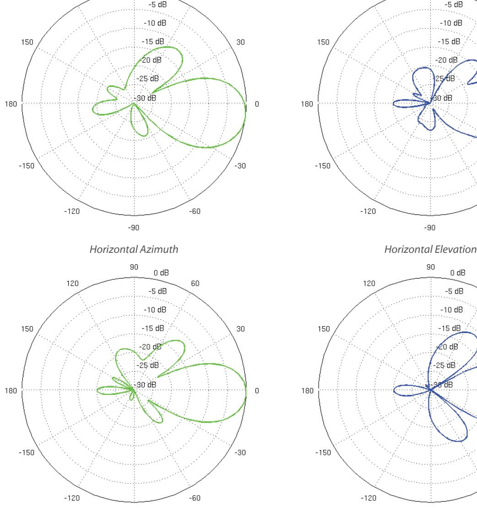

*Vertical Azimuth Vertical Elevation*

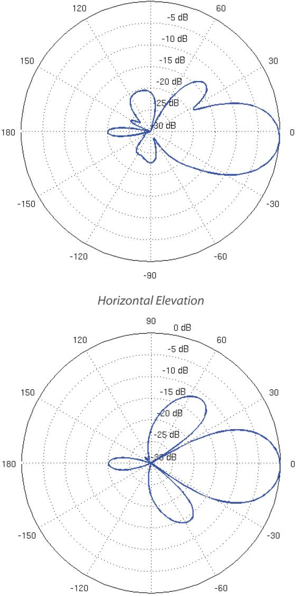

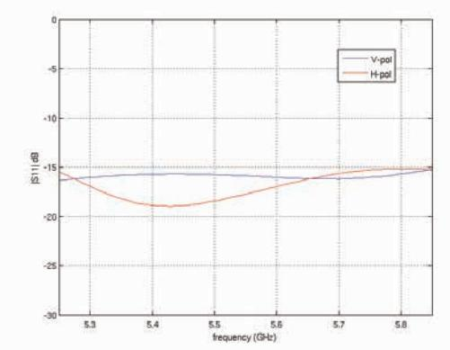

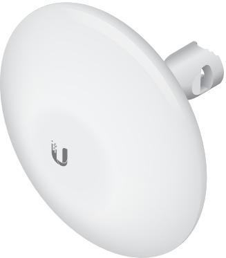

# **Specifications**

| NBE-M5-19              |                                                                 |                                                           |                  |                  |                                          |  |  |
|------------------------|-----------------------------------------------------------------|-----------------------------------------------------------|------------------|------------------|------------------------------------------|--|--|
| Dimensions             |                                                                 |                                                           |                  |                  | 189 x 189 x 125 mm (7.44 x 7.44 x 4.92") |  |  |
| Weight                 |                                                                 |                                                           |                  |                  | 0.530 kg (1.17 lb)                       |  |  |
| Power Supply           |                                                                 |                                                           |                  |                  | 24V, 0.5A PoE                            |  |  |
| Max. Power Consumption |                                                                 |                                                           |                  |                  | 8W                                       |  |  |
| Operating Frequency    | Worldwide                                                       | USA: U-NII-1                                              | USA: U-NII-2A    | USA: U-NII-2C    | USA: U-NII-3                             |  |  |
|                        | 5150 - 5875 MHz                                                 | 5150 - 5250 MHz*                                          | 5250 - 5350 MHz* | 5470 - 5725 MHz* | 5725 - 5850 MHz*                         |  |  |
| Gain                   |                                                                 |                                                           |                  |                  | 19 dBi                                   |  |  |
| Networking Interface   |                                                                 |                                                           |                  |                  | (1) 10/100 Ethernet Port                 |  |  |
| Processor Specs        |                                                                 |                                                           |                  |                  | Atheros MIPS 74Kc, 560 MHz               |  |  |
| Memory                 |                                                                 |                                                           |                  |                  | 64 MB DDR2, 8 MB Flash                   |  |  |
| LEDs                   |                                                                 | (1) Power, (1) LAN, (4) WLAN                              |                  |                  |                                          |  |  |
| Signal Strength LEDs   |                                                                 | Software-Adjustable to Correspond to Custom RSSI Levels   |                  |                  |                                          |  |  |
| Max. VSWR              |                                                                 | 1.5:1                                                     |                  |                  |                                          |  |  |
| Channel Sizes          |                                                                 | 5/8/10/20/30/40 MHz                                       |                  |                  |                                          |  |  |
| Polarization           |                                                                 | Dual Linear                                               |                  |                  |                                          |  |  |
| Enclosure              |                                                                 | Outdoor UV Stabilized Plastic                             |                  |                  |                                          |  |  |
| Mounting               |                                                                 | Pole-Mount (Kit Included), Wall-Mount                     |                  |                  |                                          |  |  |
| Wind Loading           |                                                                 | 45.4 N @ 200 km/h (10.2 lbf @ 125 mph)                    |                  |                  |                                          |  |  |
| Wind Survivability     | 200 km/h (125 mph)                                              |                                                           |                  |                  |                                          |  |  |
| ESD/EMP Protection     |                                                                 | Air: ± 24 kV, Contact: ± 24 kV                            |                  |                  |                                          |  |  |
| Operating Temperature  | -40 to 70° C (-40 to 158° F)                                    |                                                           |                  |                  |                                          |  |  |
| Operating Humidity     | 5 to 95% Noncondensing                                          |                                                           |                  |                  |                                          |  |  |
| Wireless Approvals     | FCC, IC, CE                                                     |                                                           |                  |                  |                                          |  |  |
| RoHS Compliance        | Yes                                                             |                                                           |                  |                  |                                          |  |  |
| Salt Fog Test          | IEC 68-2-11 (ASTM B117), Equivalent: MIL-STD-810 G Method 509.5 |                                                           |                  |                  |                                          |  |  |
| Vibration Test         |                                                                 | IEC 68-2-6                                                |                  |                  |                                          |  |  |
| Temperature Shock Test |                                                                 | IEC 68-2-14                                               |                  |                  |                                          |  |  |
| UV Test                |                                                                 | IEC 68-2-5 at 40° C (104° F), Equivalent: ETS 300 019-1-4 |                  |                  |                                          |  |  |
| Wind-Driven Rain Test  | ETS 300 019-1-4, Equivalent: MIL-STD-810 G Method 506.5         |                                                           |                  |                  |                                          |  |  |
|                        |                                                                 |                                                           |                  |                  |                                          |  |  |

| NBE-M5-19 Output Power: 26 dBm |             |                         |           |                         |             |                                                                                                                                                                              |           |
|--------------------------------|-------------|-------------------------|-----------|-------------------------|-------------|------------------------------------------------------------------------------------------------------------------------------------------------------------------------------|-----------|
|                                |             | TX Power Specifications |           | RX Power Specifications |             |                                                                                                                                                                              |           |
| Modulation                     | Data Rate   | Avg. TX                 | Tolerance | Modulation              | Data Rate   | Sensitivity                                                                                                                                                                  | Tolerance |
| 802.11a                        | 6 - 24 Mbps | 26 dBm                  | ± 2 dB    | 802.11a                 | 6 - 24 Mbps | -94 dBm Min.                                                                                                                                                                 | ± 2 dB    |
|                                | 36 Mbps     | 25 dBm                  | ± 2 dB    |                         | 36 Mbps     | -80 dBm                                                                                                                                                                      | ± 2 dB    |
|                                | 48 Mbps     | 24 dBm                  | ± 2 dB    |                         | 48 Mbps     | -77 dBm                                                                                                                                                                      | ± 2 dB    |
|                                | 54 Mbps     | 23 dBm                  | ± 2 dB    |                         | 54 Mbps     | -75 dBm -96 dBm -95 dBm -92 dBm -90 dBm -86 dBm -83 dBm -77 dBm -74 dBm -95 dBm -93 dBm -90 dBm -87 dBm -84 dBm -79 dBm -78 dBm | ± 2 dB    |
|                                | MCS0        | 26 dBm                  | ± 2 dB    | 802.11n/airMAX          | MCS0        |                                                                                                                                                                              | ± 2 dB    |
|                                | MCS1        | 25 dBm                  | ± 2 dB    |                         | MCS1        |                                                                                                                                                                              | ± 2 dB    |
|                                | MCS2        | 25 dBm                  | ± 2 dB    |                         | MCS2        |                                                                                                                                                                              | ± 2 dB    |
|                                | MCS3        | 25 dBm                  | ± 2 dB    |                         | MCS3        |                                                                                                                                                                              | ± 2 dB    |
|                                | MCS4        | 24 dBm                  | ± 2 dB    |                         | MCS4        |                                                                                                                                                                              | ± 2 dB    |
|                                | MCS5        | 23 dBm                  | ± 2 dB    |                         | MCS5        |                                                                                                                                                                              | ± 2 dB    |
|                                | MCS6        | 23 dBm                  | ± 2 dB    |                         | MCS6        |                                                                                                                                                                              | ± 2 dB    |
|                                | MCS7        | 23 dBm                  | ± 2 dB    |                         | MCS7        |                                                                                                                                                                              | ± 2 dB    |
|                                | MCS8        | 26 dBm                  | ± 2 dB    |                         | MCS8        |                                                                                                                                                                              | ± 2 dB    |
| 802.11n/airMAX                 | MCS9        | 25 dBm                  | ± 2 dB    |                         | MCS9        |                                                                                                                                                                              | ± 2 dB    |
|                                | MCS10       | 25 dBm                  | ± 2 dB    |                         | MCS10       |                                                                                                                                                                              | ± 2 dB    |
|                                | MCS11       | 25 dBm                  | ± 2 dB    |                         | MCS11       |                                                                                                                                                                              | ± 2 dB    |
|                                | MCS12       | 24 dBm                  | ± 2 dB    |                         | MCS12       |                                                                                                                                                                              | ± 2 dB    |
|                                | MCS13       | 23 dBm                  | ± 2 dB    |                         | MCS13       |                                                                                                                                                                              | ± 2 dB    |
|                                | MCS14       | 23 dBm                  | ± 2 dB    |                         | MCS14       |                                                                                                                                                                              | ± 2 dB    |
|                                | MCS15       | 23 dBm                  | ± 2 dB    |                         | MCS15       | -75 dBm                                                                                                                                                                      | ± 2 dB    |

* Some frequencies may require activation; visit: **https://www.ubnt.com/fcclabelrequest**

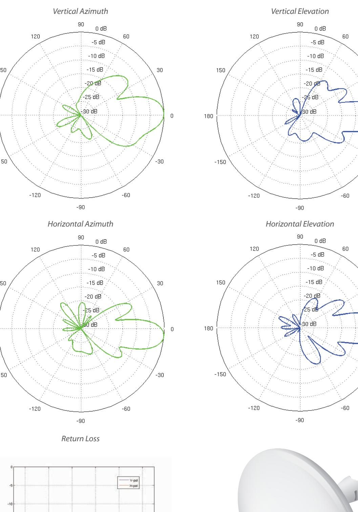

**www.ubnt.com**

Specifications are subject to change. Ubiquiti products are sold with a limited warranty described at: www.ubnt.com/support/warranty ©2016 Ubiquiti Networks, Inc. All rights reserved. Ubiquiti, Ubiquiti Networks, the Ubiquiti U logo, the Ubiquiti beam logo, airControl, airMAX, airOS, airView, NanoBeam, and NanoBridge are trademarks or registered trademarks of Ubiquiti Networks, Inc. in the United States and in other countries. All other trademarks are the property of their respective owners.