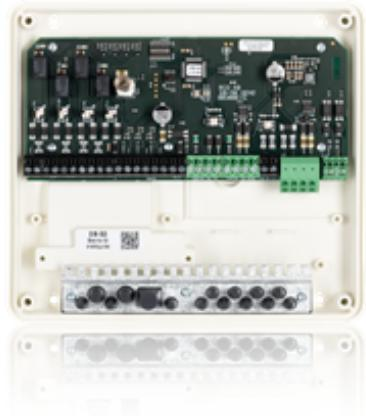

## DB-50 GEN2 DELNINGSBOX

Artikelnummer: 20080302, E-nummer: 5872018

Dörrcentral för upp till två kortläsare som kan anslutas på I2C eller TB-485 bussen.

DB-50 Gen2 har 4 ingångar och 4 utgångar.

Används för att ansluta kortläsare, ellås, öppnaknapp, dörravkänning, dörrautomatik, hisstyrning och andra ev. tillbehör.

Ansluts mot UC-50 via lokalbuss RS-485.

**VIKTIGT! R-CARD M5 behöver ha följande mjukvaruversion eller senare för att DB-50 Gen2 skall kunna användas: M5 Version 5.49.4.**

| Utförande:            | Vit, PC ABS Plast                          |
|-----------------------|--------------------------------------------|
| Systemkrav R-CARD M5: | Rek. M5 V5.49.4                            |
| Anslutningar:         | 4 Ingångar & 4 Utgångar                    |
| Kommunikation:        | UC via RS-485, Läsare via TB-485 eller I2C |
| Strömförbrukning:     | Min 10mA - Max 64mA                        |
| Temperaturområde:     | +5°C till +40°C                            |
| Mått (BxHxD):         | 201x181x50 mm                              |