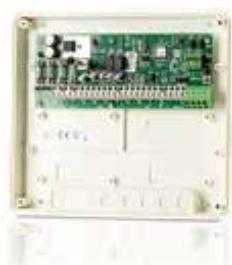

## DB-50W FÖR WIEGANDTERMINAL

Artikelnummer: 20080305, E-nummer: 5875009

Fungerar som DB-50 men med den skillnaden att terminaler med Wiegandinterface kan användas. DB-50W har fyra ingångar och fyra utgångar. Ansluts mot UC-50 via lokalbuss RS485.

| Mått (mm, BxHxD): | 200x180x50                                        |
|-------------------|---------------------------------------------------|
| Temperaturområde: | +5°C till +60°C                                   |
| Ingångar:         | 4 ingångar (3 Dubbelbalanserade 2,2 Kohm, 1 Opto) |
| Utgångar:         | 4 utgångar (2 Relä, 2 Halvledarrelä)              |
| Kommunikation:    | Lokalbuss RS485, Wiegand                          |
| Matningsspänning: | 10 - 24 V DC                                      |
| Strömförbrukning: | Max 84mA                                          |