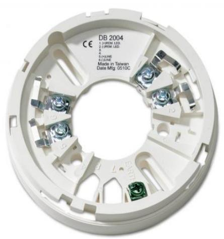

## DB2004

Produktblad

Sockel till adresserbara detektorer i 2000-serien

### Allmänt

DB2004 är en sockel som passar till alla detektorer i 2000- serien. I varje sockel sitter en ettikett med inkopplingsanvisning för anslutningsplintarna i sockeln. Kabelgenomföring kan göras både från sidan och från baksidan av sockeln.

#### Standardprestanda

- EUtgång för fjärrindikering
- EPassar alla adresserbara detektorer i 2000-serien

# DB2004

Sockel till adresserbara detektorer i 2000-serien

### Tekniska data

| Mått                   |               |
|------------------------|---------------|
| Diameter               | 101 mm        |
| Höjd                   | 17 mm         |
| Antal ansutningar      | 5             |
| Fjärrindikeringsutgång | Ja            |
| Jordanslutning         | Ja            |
| Färg                   | Vit (RAL9001) |

Order data

Artikelnummer Beskrivning DB2004 Sockel till adresserbara detektorer i 2000-serien

