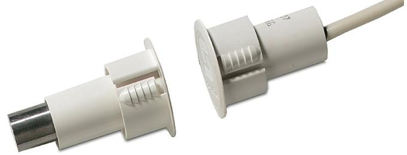

# Produktblad

# DC1076-6M

Magnetkontakt för metalldörrar, förspänd, 6 m

## DC1076

Magnetkontakten används för att detektera öppning av till exempel dörrar, fönster eller luckor. DC1076 är avsedd för infällt montage i metalldörrar. Den unika kapslingens utseende, med flexibel taggad sida för snabb installation. Magnetens kapsling isolerar magneten från omgivande metallen för maximal öppningsavstånd.

#### Installation

Kontaktdelen monteras på karmen och magnetdelen i den rörliga delen, borrhål ska vara 18,8 mm. Vid montage ska man ta hänsyn till eventuella förändringar i olika material så att det maximala kontakavståndet inte överskrids. Anslutning sker med kabel 4-ledare.

#### Hög säkerhet

DC1076 har en liten inbyggd magnet som normalt påverkar reedelementet. Kontakten är balanserad, men endast så länge den ordinarie magneten finns inom rätt område. Om reedelementet påverkas av en yttre magnet, men inom fel område såväl i sidled som i närhet, utlöses ett larm.

### Standardprestanda

- ESpecialdesignad för metalldörrar
- ESjälvlåsning vid montering
- E6 m kabel

- EFörsedd med sabotageslinga
- EFörspänd

# DC1076-6M

Magnetkontakt för metalldörrar, förspänd, 6 m

## Tekniska data

| Arbetsavstånd    | 29 mm (max.)                                                     |
|------------------|------------------------------------------------------------------|
| Anslutning       | 4 -tråd, 2 m                                                     |
| Funktion i drift | Normalt sluten                                                   |
| Mått             | Magnet (Ø x H) 22,2 x 39,7 mm; Kontakt (Ø x H) 22,2 x 28,6 mm |
| Färg             | Vit                                                              |

Order data

Artikelnummer

DC1076-6M

Magnetkontakt för metalldörrar, förspänd, 6 m

Beskrivning

Reservationer för produktförändringar. För uppdatering av produktdata, gå in på www. utcfssecurityproducts.se eller kontakta din lokala UTC Fire & Security återförsäljare. DC1076-6M-2017-01-19 10:18:40 Released :20-JUN-16

