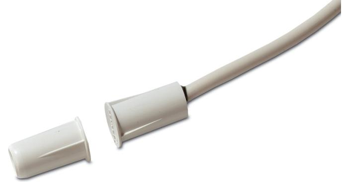

## Produktblad

# DC120

Infälld magnetkontakt, kort modell med klämflänsar, långt arbetsavstånd

### Allmänt

Magnetkontakten DC120 är utformad speciellt för applikationer där utrymmet är begränsat. Dess korta längd gör den idealisk för tunna fönster- och dörrarkarmar där längre enheter inte kan användas. Klämflänsar på kapslingen ger en snabb och enkel installation. Magnetkontakten ska installeras i icke ferromagnetiskt material.

#### Standardprestanda

- EOmfattande produktserie
- EÖverlägsen kvalitet
- EEnkla att installera
- ETvå meters ledarlängd som standard
- E Försedda med sabotageslinga
- ESBSC-intygad, larmklass 1/2

# DC120

Infälld magnetkontakt, kort modell med klämflänsar, långt arbetsavstånd

### Tekniska data

| Arbetsavstånd (max) | 18 mm               |
|---------------------|---------------------|
| Anslutningstyp      | 2,5 m lång 4-ledare |
| Funktion i drift    | Normalt sluten      |
| Mått                |                     |
| Kontaktdel          | Ø 10,9 x 19 mm (L)  |
| Magnet              | Ø 10,9 x 19 mm (L)  |
| Borrdiameter        | 9 mm                |
| Färg                | Beige               |

Order data

| Artikelnummer | Beskrivning                                                                |
|---------------|----------------------------------------------------------------------------|
| DC120         | Infälld magnetkontakt, kort modell med klämflänsar, långt arbetsavstånd |

