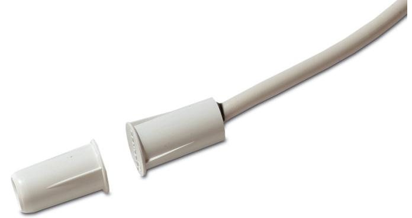

# DC120S60

Infälld magnetkontakt, kort modell med klämflänsar, långt arbetsavstånd

#### Allmänt

Magnetkontakten DC120S60 är utformad speciellt för applikationer där utrymmet är begränsat. Dess korta längd gör den idealisk för tunna fönster- och dörrarkarmar där längre enheter inte kan användas. Klämflänsar på kapslingen ger en snabb och enkel installation. Magnetkontakten ska installeras i icke ferromagnetiskt material.

#### Standardprestanda

- EOmfattande produktserie
- EÖverlägsen kvalitet
- EEnkla att installera
- ESex meters ledarlängd som standard
- EFörsedda med sabotageslinga
- ESBSC-intygad, larmklass 1/2

## DC120S60

Infälld magnetkontakt, kort modell med klämflänsar, långt arbetsavstånd

### Tekniska data

| Arbetsavstånd (max) | 18 mm              |
|---------------------|--------------------|
| Anslutningstyp      | 6 m lång 4-ledare  |
| Funktion i drift    | Normalt sluten     |
| Mått                |                    |
| Kontaktdel          | Ø 10,9 x 19 mm (L) |
| Magnet              | Ø 10,9 x 19 mm (L) |
| Borrdiameter        | 9 mm               |
| Färg                | Beige              |

Order data

Artikelnummer Beskrivning DC120S60 Infälld magnetkontakt, kort modell med klämflänsar, långt arbetsavstånd