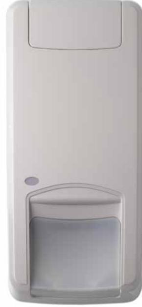
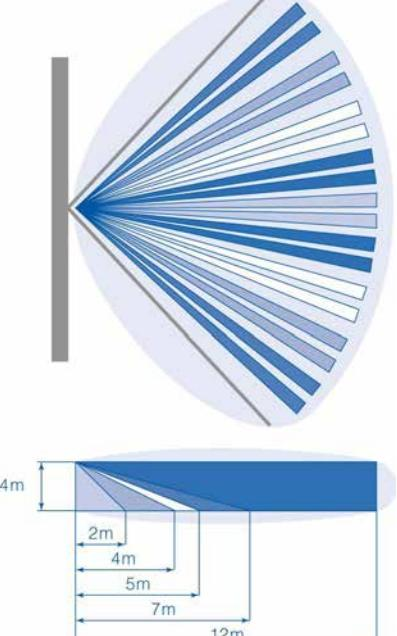

# DD1012-N **12 m Dual Technology motion sensor, 9 curtains, digital pyro**

### **Patented range gated radar technology**

Motion sensors of the DD1000 Series incorporate a Carrier Fire & Security patented and unique range gated radar technology allowing the installer to define a clear borderline of the radar range as the radar is used to measure distance between the sensor and moving objects. Effectively the end-user will get rid of any nuisance alarms generated by movements outside the detection pattern.

Every motion sensor comes with 4 possible radar ranges selectable via dip switches allowing the detection pattern to be tailored according to the room where the motion sensor is installed. The radar operates on 5.8GHz frequency.

The DD1012-N motion sensor incorporates a new digital pyro for an improved signal quality and a better immunity to electrical interferences.

#### **PIR technology in combination with patented mirror optics**

Our patented optical mirror technology gives the advantage of gliding focus, which creates a continuous detection curtain from floor level up to installation height.

Within our DD1012 series we are using a dual element pyro generating 2 volumetric curtains for each of the 9 curtain sets.

#### **Detection technologies working together**

These dual tech motion sensors generate an alarm depending on what both technologies – range gated radar and PIR – saw within its detection coverage.

But our dual tech go beyond a simple "AND" function : it classifies the signals from each technology – range gated radar and PIR – to have the best alarm result without being sensitive for nuisance signal sources. This technology creates a uniform sensitivity in all course directions.

### **Ease and flexibility of installation**

- 1. Tolerates wall angle deviation and different mounting heights.
2. Limited loss of coverage when objects are placed in the field of the PIR vision.

- 3. Easy range setting via dip switches of the range gated radar in order to tailor the detection pattern to your needs.
- 4. Multiple build-in End-Of-Line resistor values with "easy wiring"

option available. 5. Plug-in connector.

## **Other members of the family**

This family includes motion sensors with variants in detection range, two types of anti-masking masking technology and Pet Immunity. The consistent family aesthetics between the various models ensure a professional approach when installing different sensor types.

### **Details**

- Patented selectable range gated radar technology clearly defining the radar detection border
- PIR technology with patented mirror curtain optics
- Intelligent alarm decision based on signal classification of the PIR and radar alarm
- Automatic continuous self diagnostics on all technologies
- Green mode : option to switch off the radar technology when the security system is not armed
- Holding several security approvals including EN Grade II
- Incorporates a new digital pyro that detects the temperature fluctuations with high degree of precision

# DD1012-N **12 m Dual Technology motion sensor, 9 curtains, digital pyro**

## **Technical specifications**

| Allmänt                          |                                              |
|----------------------------------|----------------------------------------------|
| Teknik                           | Dual                                         |
| Application type                 | Wall mount                                   |
| Anti masking                     | No                                           |
| Pet immune                       | No                                           |
| Camera                           | No                                           |
| Pry-off tamper kit               | ST400                                        |
| Detector start-up time           | 60 s                                         |
| Detektering                      |                                              |
| Max. detection range             | 12 m                                         |
| Detection range selection     | 4, 6, 9, or 12 m selectable via dip switches |
| No. of curtains                  | 9                                            |
| Coverage (field of view) 78°     |                                              |
| Microwave frequency              | 5.8 GHz                                      |
| (nom.)                           |                                              |
| Max. microwave output (at 1m) | 0.003 µW/cm²                                 |
| Undercrawl protection            | Ja                                           |
| Target speed range               | 0.2 to 3.0 m/s                               |
| Alarm memory                     | Ja                                           |
| Alarm time                       | 3 s                                          |
| Peak-to-peak ripple              | 2 V (at 12 VDC)                              |
| immunity                         |                                              |
| Trådbunden/trådlös               |                                              |
| Wired-wireless                   | Wired                                        |
| Ingångar/utgångar                |                                              |
| Alarm relay                      | NC, 80 mA 30 VDC, Form A                     |
| characteristic                   |                                              |
| Tamper relay                     | NC, 80 mA 30 VDC, Form A                     |
| characteristic                   |                                              |
| Relay configuration              | Multiple EOL values                          |
| Remote control lines             | Day/Night, Walk test                         |
| Spänning                         |                                              |
| Power supply value               | 9 to 15 VDC (12 V nominal)                   |
| Current consumption              | 5 to 16 mA (8 mA nominal)                    |
|                                  |                                              |
| Mått                             |                                              |
| Physical dimensions              | 126 x 63 x 50 mm                             |
| Net weight                       | 120 g                                        |
| Colour                           | Cloud white (RAL 9001)                       |
| Material                         | ABS                                          |
| Mounting height                  | 1.8 to 3 m                                   |
| Miljö                            |                                              |
| Operating temperature            | -10 to +55° C                                |
| Relative humidity                | 95% max. noncondensing                       |
| Miljö                            | Indoor                                       |

**Regulatory**

| EN50131 grade | Grade 2            |
|---------------|--------------------|
| Compliancy    | CE                 |
| Intygande     | INCERT, NFA2P, VdS |

IK04

IP rating IP30

Powered by TCPDF (www.tcpdf.org)

Carrier Fire & Security förbehåller sig rätten att ändra produktspecifikationer utan föregående meddelande. För de senaste produktspecifikationerna, besök se.firesecurityproducts.com online eller kontakta din försäljningsrepresentant.