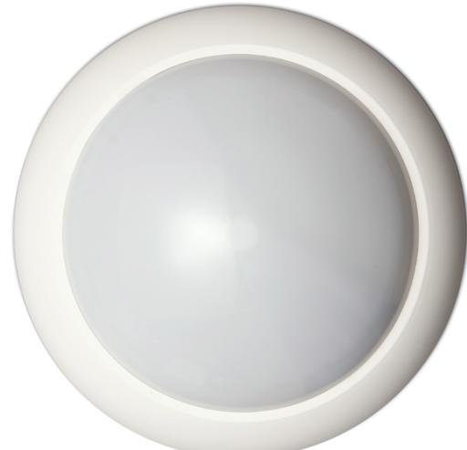
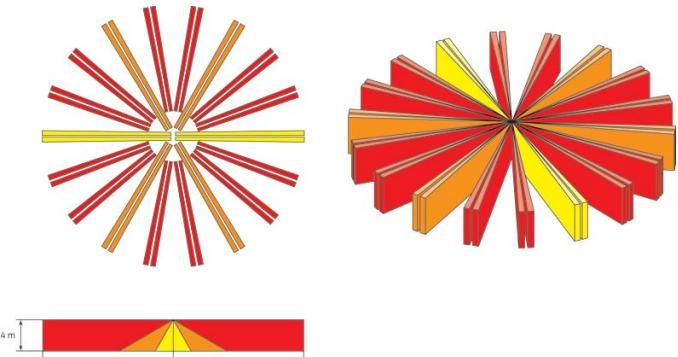

### Produktblad

# DD669

Kombi- takdetektor PIR och mikrovåg 20 m, 18 ridåer

#### Kombi- takdetektorer

DD669 ingår i DD669-serien somär en ny serie med kombitakdetektorer PIR och mikrovåg som även kan fås med maskningsskydd. DD669-sserien kompletterar de framgångsrika PIR-detektorerna i EV669-serien. De 18 ridåerna erbjuder maximal detekteringsförmåga, inklusive fullständigt underkrypningsskydd, i ett skyddat område på upp till 20 meter i diameter. Den unika spegeloptikstekniken har ett glidande fokus, vilket skapar sammanhängande ridåer och aldrig tappar inkräktaren ur sikte.

#### "4D" signalbehandling

4D-signalbehandling gör en effektiv särskiljning mellan inkräktare och störsignaler. DD669-serien har både 4D signalbehandling och Bi-ridåbehandling för svåra miljöer. Kombinationen av spegeloptiken med 4D-signalbehandling ger förrutom bättre förmåga att upptäcka inkräktare också ökad stabilitet samt att den ignorerar störningar.

#### Avståndsinställning

DD669-detektorn innehåller en unik radarteknik som kan avståndsinställas och arbetar på 5.8 GHz frekvensen. Avståndsinställningen betyder att inga larm genereras för rörelser utanför det inställda avståndet.

#### Infällt montage

DD669-detektorerna kan monteras infällda med tillbehör 360FM. 360FM garanterar en snygg installation i taket då endast den översta delen av sensorn är synlig.

#### Standardprestanda

- EKombi- takdetektor, Passiv IR och mikrovåg
- ETäckningsområde 360°, 20 m
- E Steg och glidande fokus spegeloptik
- E18 unika larmridåer med glidande autofokus
- E Avståndsinställning av mikrovåg
- E4D-signalbehandling
- EValbart täckningsområde med hjälp av spegelmasker
- EExtra Bi-ridå processing för kärva miljöer
- EIngen justering behövs för olika monteringshöjder
- ESBSC-godkänd

## DD669

Kombi- takdetektor PIR och mikrovåg 20 m, 18 ridåer

### Tekniska data

| Drivspänning                      | 12 V (8-15 VDC)                            |  |  |
|-----------------------------------|--------------------------------------------|--|--|
| Max ripple                        | 2 V p-t-p vid 12 V                         |  |  |
| Strömförbrukning Normal drift  | 12 mA                                      |  |  |
| Vid larm                          | 10 mA                                      |  |  |
| Utgångar Larmrelä                 | Normalt sluten, 80 mA vid 28 VDC           |  |  |
| Sabotage                          | Normalt sluten, 80 mA vid 28 VDC           |  |  |
| Täckningsområde                   | 20 m i diameter                            |  |  |
| Monteringshöjd                    | 2,5-5 m                                    |  |  |
| Larmminne                         | Ja                                         |  |  |
| Mikrovågsfrekvens                 | 5,8 GHz                                    |  |  |
| Avståndsinställning               | Ja, 20 m eller 12 m                        |  |  |
| Fjärrstyrning                     | Gångtest & Dag-/nattläge                   |  |  |
| Green mode (Endast Passiv IR)  | Ja, frånkopplad                            |  |  |
| Stealth mode (Endast mikrovåg) | Ja, inställning med DIP-switchar           |  |  |
| Temperatur                        | -10 °C till +55 °C, max 93 % luftfuktighet |  |  |
| Mått                              | 138 mm (diameter) x 92 mm (höjd)           |  |  |
| IP                                | 30                                         |  |  |
| Miljöklass                        | II                                         |  |  |
| Larmklass                         | 3                                          |  |  |

|  | Order data |  |  |
|--|------------|--|--|
|  |            |  |  |

| Artikelnummer | Beskrivning                                         |
|---------------|-----------------------------------------------------|
| DD669         | Kombi- takdetektor PIR och mikrovåg 20 m, 18 ridåer |
| 360FM         | Monteringsbrickor för infällning i undertak         |

Reservationer för produktförändringar. För uppdatering av produktdata, gå in på www. utcfssecurityproducts.se eller kontakta din lokala UTC Fire & Security återförsäljare. DD669-2017-01-18 10:53:25 Released :02-SEP-11