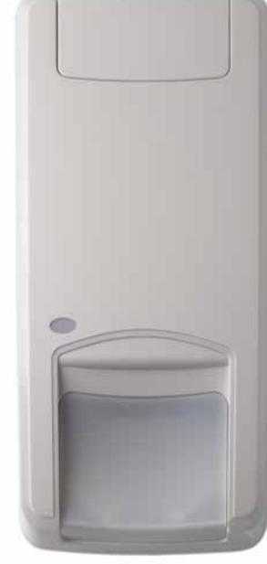
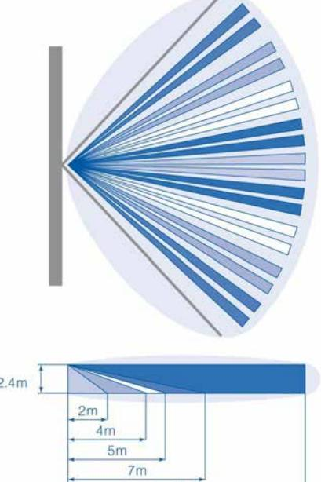

# DDV1016-N **16 m, Dual Vector, 9 curtains, digital pyro, neural algorithm**

# **Patented technologies: range gated radar and neural algorithm**

Motion sensors of the DDV1016 Series incorporate a Carrier Fire & Security patented and unique range gated radar technology allowing the installer to define a clear borderline of the radar range as the radar is used to measure distance between the sensor and moving objects. Effectively the end-user will get rid of any nuisance alarms generated by movements outside the detection pattern.

Every motion sensor comes with 4 possible radar ranges selectable via dip switches allowing the detection pattern to be tailored according to the room where the motion sensor is installed.Motion sensors of the DDV1016 Series incorporate a Carrier Fire & Security patented and unique range gated radar technology allowing the installer to define a clear borderline of the radar range as the radar is used to measure distance between the sensor and moving objects. Effectively the enduser will get rid of any nuisance alarms generated by movements outside the detection pattern.

Every motion sensor comes with 4 possible radar ranges selectable via dip switches allowing the detection pattern to be tailored according to the room where the motion sensor is installed. The radar operates on 5.8GHz frequency.

The DDV1016-N motion sensor incorporates a new digital pyro and a brand new neural algorithm to filter out unwanted alarms.

Thanks to these two technologies, a better quality of signals is generated.

The advanced processing combined with a better detection performance result in an extreme low rate of unwanted alarms.

## **PIR technology in combination with patented mirror optics**

Our patented optical mirror technology gives the advantage of gliding focus, which creates a continuous detection curtain from floor level up to installation height.

Using a four element pyro, so generating 4 volumetric curtains for each of the 9 curtain sets, in combination with our VE-techniques allowed us to create a 16m dual tech motion sensor in a rather small housing.

# **Detection technologies working together**

These dual tech motion sensors generate an alarm depending on what both technologies – range gated radar and PIR – saw within its detection coverage.

But our dual tech go beyond a simple "AND" function : it classifies the signals from each technology – range gated radar and PIR – to have the best alarm result without being sensitive for nuisance signal sources. This technology creates a uniform sensitivity in all course directions.

## **Details**

- Patented selectable range gated radar technology clearly defining the radar detection border
- PIR technology with patented mirror curtain optics
- Intelligent alarm decision based on signal classification of the PIR and radar alarm
- Automatic continuous self diagnostics on all technologies
- Green mode : option to switch off the radar technology when the security system is not armed
- Holding several security approvals including EN Grade II
- Patented algorithm for better false alarm immunity
- Incorporates a new digital pyro that detects the temperature fluctuations with high degree of precision
- Incorporates a brand new neural algorithm to filter out unwanted alarms

### **Ease and flexibility of installation**

- 1. Tolerates wall angle deviation and different mounting heights.
2. Limited loss of coverage when objects are placed in the field of the PIR vision.

- 3. Easy range setting via dip switches of the range gated radar in order to tailor the detection pattern to your needs.
- 4. Multiple build-in End-Of-Line resistor values with "easy wiring"

option available.

5. Plug-in connector.

## **Other members of the family**

The consistent family aesthetics between the various models ensure a professional approach when installing different sensor types.

## **Neural network-based technology algorithm**

Aritech has developed an improved algorithm based on cutting edge neural network-based technology to improve the detection performance and reduce false alarms triggered by external sources. Neural networks are trained to extract complex image features effectively; it allows the detection of slow motion even further apart from the detector.

This algorithm has the aim to improve even further the immunity to false alarms, which is a key concern for major applications of sensors in commercial settings.

# DDV1016-N **16 m, Dual Vector, 9 curtains, digital pyro, neural algorithm**

# **Technical specifications**

| Allmänt                          |                                                 |
|----------------------------------|-------------------------------------------------|
| Teknik                           | Dual                                            |
| Application type                 | Wall mount                                      |
| Anti masking                     | No                                              |
| Pet immune                       | No                                              |
| Camera                           | No                                              |
| Pry-off tamper kit               | ST400 (optional)                                |
| Detector start-up time           | 60 s                                            |
| Detektering                      |                                                 |
| Max. detection range             | 16 m                                            |
| Detection range selection     | 10, 12, 14, or 16 m selectable via dip switches |
| No. of curtains                  | 9                                               |
| Coverage (field of view) 78°     |                                                 |
| Microwave frequency (nom.)    | 5.8 GHz                                         |
| Max. microwave output (at 1m) | 0.003 µW/cm²                                    |
| Undercrawl protection            | Ja                                              |
| Target speed range               | 0.2 to 3.0 m/s                                  |
| Alarm memory                     | Ja                                              |
| Alarm time                       | 3 s                                             |
| Peak-to-peak ripple immunity  | 2 V (at 12 VDC)                                 |

### **Regulatory**

| EN50131 grade | Grade 2            |
|---------------|--------------------|
| Compliancy    | CE                 |
| Intygande     | INCERT, NFA2P, VdS |

## **Trådbunden/trådlös**

Wired-wireless Wired

### **Ingångar/utgångar**

| Alarm relay characteristic     | NC, 80 mA 30 VDC, Form A |
|-----------------------------------|--------------------------|
| Tamper relay characteristic    | NC, 80 mA 30 VDC, Form A |
| Anti mask relay characteristic | NC, 80 mA 30 VDC, Form A |
| Relay configuration               | Multiple EOL values      |
| Remote control lines              | Day/Night, Walk test     |

#### **Spänning**

| Power supply value  | 9 to 15 VDC (12 V nominal) |  |
|---------------------|----------------------------|--|
| Current consumption | 5 to 16 mA (8 mA nominal)  |  |
| Mått                |                            |  |

| Physical dimensions | 126 x 63 x 50 mm |  |
|---------------------|------------------|--|
| Net weight          | 120 g            |  |
| Colour              | White            |  |
| Mounting height     | 1.8 to 3 m       |  |

#### **Miljö**

Powered by TCPDF (www.tcpdf.org)

| Operating temperature | -10 to +55°C           |
|-----------------------|------------------------|
| Relative humidity     | 0 to 95% noncondensing |
| Miljö                 | Indoor                 |
| IP rating             | IP30                   |
|                       | IK04                   |

Carrier Fire & Security förbehåller sig rätten att ändra produktspecifikationer utan föregående meddelande. För de senaste produktspecifikationerna, besök se.firesecurityproducts.com online eller kontakta din försäljningsrepresentant.