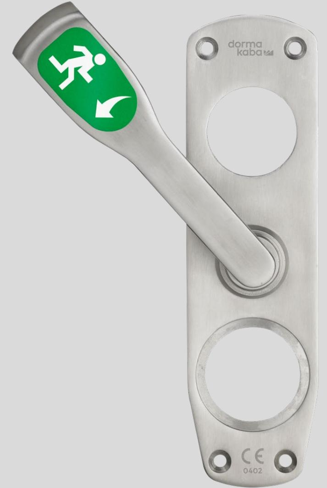
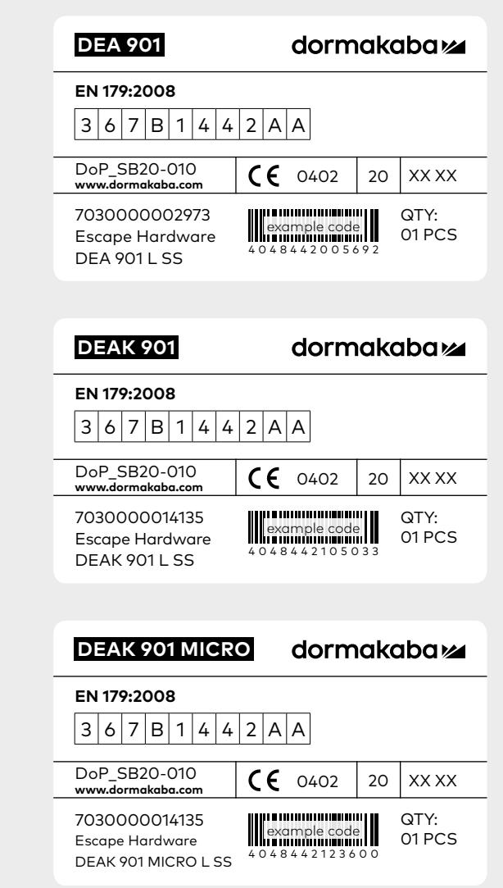
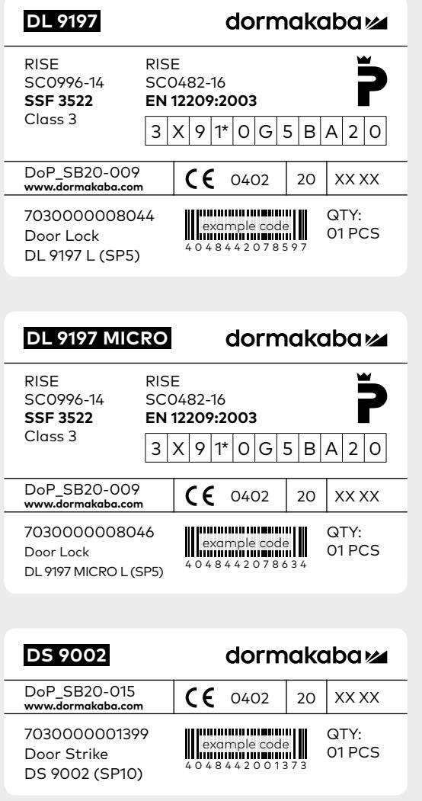
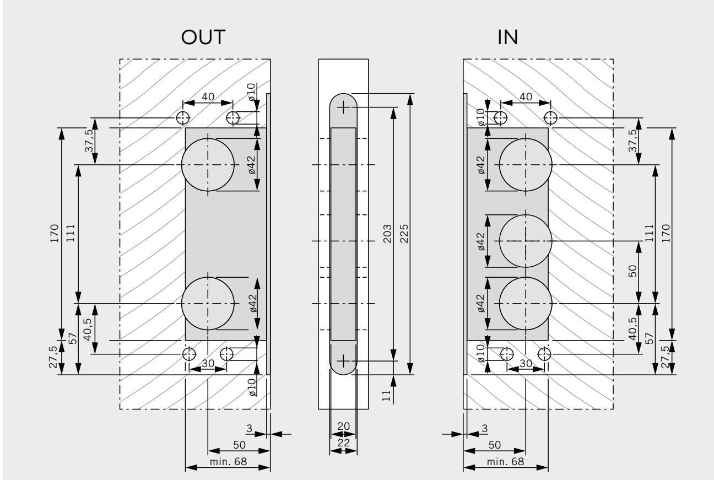
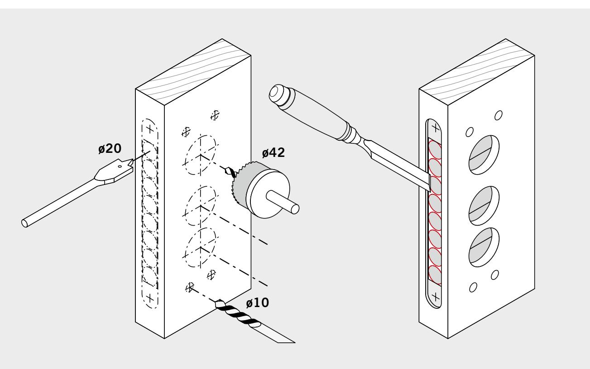
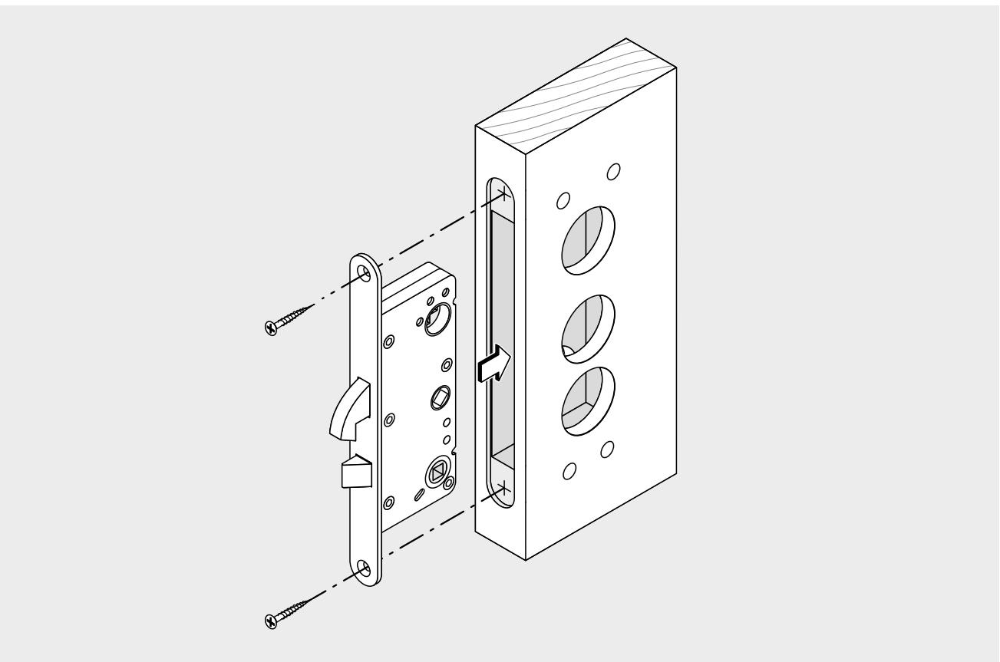
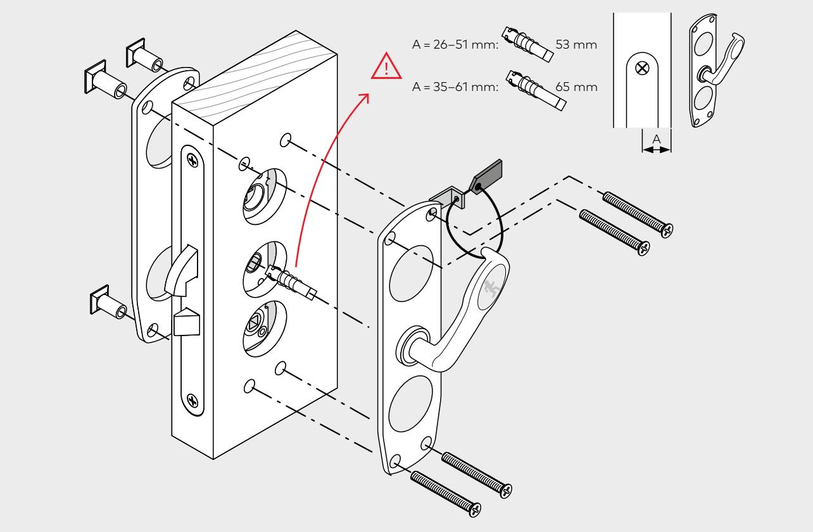

 DEA 901  DEAK 901  DEAK 901 Micro

## **Mounting instruction**

Document identification – 0000175-02

# **DEA 901 EN**

**Important information**

Please read below information before installation and use.

The safety features of this product are essential to its compliance with EN 179. No modification of any kind, other than those described in these instructions, is permitted.

DEA 901 Escape Hardware may for reasons of certification, approvals and warranty only be mounted together with a dormakaba lock case, type DL  9197. If the DEA 901 Escape Hardware is mounted with another lock case, approvals and warranties will lapse.

#### **Maintenance**

To ensure performance following routine maintenance checks should be performed at intervals of no more than one month.

- Check that the equipment is mounted according to the installation instructions, that it is properly fixed, has no damage and that no external factors interfere with the function
- Check that the emergency handle is easily operated, working as originally intended and returns to its initial position, that the latch bolt engages well in the striking plate when the door closes and any re-entry function is working
- Use a force gauge to measure and record the operating forces to release the emergency handle.
- Lubricate any sliding surfaces with lock lubricant
- Adjust any deviations
- Equipment intended for a plastic sealing wire shall be fitted with such after testing

### **DA**

**Vigtig information**

Læs informationerne nedenfor inden installation og brug.

Dette produkts sikkerhedsfunktioner er vigtige for at det overholdes i henhold til EN 179. Ingen ændringer af nogen art, bortset fra dem der er beskrevet i denne instruktion, er tilladt.

DEA 901 Escape Hardware kan af certificeringsårsager, godkendelser og garanti kun monteres sammen med en dormakaba-låskasse, type DL  9197. Hvis DEA 901 Escape Hardware er monteret med en anden låsekasse, bortfalder godkendelser og garantier.

#### **Vedligehold**

For at sikre, at funktionen opretholdes, skal følgende rutinemæssige vedligeholdelseskontrol udføres mindst en gang om måneden.

- Kontroller, at udstyret er installeret i henhold til installationsvejledningen, at det er ordentligt fastgjort, ikke har nogen skade, og at ingen eksterne faktorer forstyrrer funktionen
- Kontroller, at nødåbningshåndtaget let er manøvrerbart, fungerer som det oprindeligt var beregnet og vender tilbage til sin oprindelige startposition, at grebsfalle griber fat i slutbliket når døren er lukket og enhver indgang er mulig igen
- Mål og registrere de manøvreringsstyrker, der kræves for at åbne nødåbningshåndtaget
- Smør eventuelle glideflader
- Juster eventuelle afvigelser
- Udstyr beregnet til plastforsegling skal være udstyret med sådant efter prøvning

#### **FI**

#### **Tärkeää tietoa**

Lue alla olevat tiedot ennen asennusta ja käyttöä.

Tämän tuotteen turvaominaisuudet ovat välttämättömiä EN 179 -standardin mukaisuuden saavuttamiseksi. Muita kuin tämän käyttöohjeen mukaisia muutoksia ei sallita.

DEA 901 Escape Hardware voidaan sertifikaatin, hyväksyntöjen ja takuiden vuoksi asentaa vain yhdessä dormakaba lukkorungon kanssa, tyyppi DL 9197. Jos DEA 901 Escape -laitteisto kiinnitetään toiseen lukkorunkoon, hyväksynnät ja takuut raukeavat.

#### **Ylläpito**

Suorituskyvyn ylläpitämisen varmistamiseksi seuraavat rutiininomaiset huoltotarkastukset tulisi suorittaa vähintään kerran kuukaudessa.

- Tarkista, että laite on asennettu asennusohjeiden mukaan, että se on kunnolla kiinni, siinä ei ole vaurioita ja ettei ulkoiset tekijät häiritse toimintoa
- Tarkista, että hätäevakuointikahva on helposti ohjattavissa, että se toimii alun perin tarkoitetulla tavalla ja palaa alkuperäiseen asentoonsa, että telki lukittuu vastarautaan kun ovi suljetaan ja että paluu tulosuuntaan on mahdollista
- Mittaa ja kirjaa evakuointikahvan avaamiseen tarvittavat liikevoimat
- Voitele kaikki liukupinnat
- Säädä mahdolliset poikkeamat
- Muovilankasinetöintiin tarkoitetut laitteet on varustettava sellaisilla testauksen jälkeen

#### **NO**

**Viktig informasjon**

Les informasjonen nedenfor før installasjon og bruk.

Sikkerhetsfunksjonene til dette produktet er avgjørende for at det overholdes i henhold til EN 179. Ingen modifiseringer, av andre slag enn de som er beskrevet i disse instruksjonene, er tillatt.

DEA 901 Escape Hardware kan av sertifiserings-, godkjennings- og garantihensyn bare monteres sammen med en dormakabalåsekasse, type DL 9197. Hvis DEA 901 Escape Hardware er montert med en annen låsekasse, bortfaller godkjenninger og garantier.

#### **Vedlikehold**

For å sikre at funksjonen opprettholdes, skal følgende rutinemessige vedlikeholdskontroller utføres minst en gang i måneden.

- Kontroller at utstyret er montert i henhold til installasjonsveiledningen, at det er ordentlig festet, ikke har noen skader og at ingen eksterne faktorer forstyrrer funksjonen
- Kontroller at nødåpningshåndtaket er lett manøvrerbart, fungerer som opprinnelig ment og går tilbake til sin opprinnelige utgangsposisjon, at vriderfallen griper godt fast i sluttstykket når døren er lukket og eventuell inngang igjen er mulig
- Mål og registrer manøvreringsstyrkene som kreves for å åpne evakueringshåndtaket
- Smør eventuelle glideflater
- Juster eventuelle avvik
- Utstyr som skal være utrustet med plastforsegling skal utstyres med slikt etter testing

#### **SV**

**Viktig information**

Läs informationen nedan innan installation och användning.

Denna produkts säkerhetsfunktioner är väsentliga för att den ska uppfylla EN 179. Ingen modifiering av något slag, utom de som beskrivs i dessa instruktioner, är tillåtna.

DEA 901 Escape Hardware får av certifieringsskäl, godkännanden och garanti endast monteras tillsammans med ett dormakaba låshus av modell DL 9197. Om DEA 901 Escape Hardware är monterad med ett annat låshus, förfaller godkännanden och garantier.

#### **Underhåll**

För att säkerställa att prestanda upprätthålls ska följande rutinmässiga underhållskontroller utföras minst en gång per månad:

- Kontrollera att utrustningen är monterad enligt monteringsanvisningen, att den är ordentligt fixerad, inte har några skador och att inga yttre faktorer stör funktionen.
- Kontrollera att utrymningshandtaget lätt kan manövreras, fungerar som det ursprungligen var avsett och återgår till sitt ursprungliga läge, att fallkolven fäster i slutblecket när dörren stängs och eventuell återinrymning är möjlig
- Mät och registrera de manöverkrafter som krävs för öppning av utrymningshandtaget
- Smörj eventuella glidytor
- Justera eventuella avvikelser
- Utrustning avsedd för plastplombering ska utrustas med sådan efter testning

| DL  9197                                                  | Article number |
|-----------------------------------------------------------|----------------|
| DL  9197 (EN179) Left/Venstre/Vasen/Venstre/Vänster       | 7030000008044  |
| DL  9197 (EN179) Right/Højre/Oikea/Høyre/Höger            | 7030000008045  |
| DL  9197 Micro (EN179) Left/Venstre/Vasen/Venstre/Vänster | 7030000008046  |
| DL  9197 Micro (EN179) Right/Højre/Oikea/Høyre/Höger      | 7030000008047  |

| EN179:2008       | DEA 901 | Emergency exit device                                                                                                                                             |
|------------------|---------|-------------------------------------------------------------------------------------------------------------------------------------------------------------------|
| Category of use  | 3       | Grade 3: High frequency of use where there is little incentive to exercise care, i.e. where there is a chance of an accident occurring and of misuse.       |
| Durability       | 6       | Grade 6: 100 000 test cycles.                                                                                                                                     |
| Door mass        | 7       | Grade 7: Over 200 kg.                                                                                                                                             |
| Fire/smoke doors | B       | Grade B: Suitable for use on fire and smoke door assemblies based on a test in accordance with EN1634-1.                                                       |
| Safety           | 1       | Grade 1: All emergency exit devices have a critical safety function, therefore only the top grade is identified for the purposes of this European Standard. |
| Corrosion        | 4       | Grade 4: 240 h (very high resistance).                                                                                                                            |
| Security         | 4       | Grade 4: 3 000 N.                                                                                                                                                 |
| Projection       | 2       | Grade 2: projection up to 100 mm (standard projection).                                                                                                           |
| Operation        | A       | Type A: Emergency exit device with "lever handle" operation.                                                                                                      |
| Door             | A       | Category A: Outwardly opening single exit door, double exit door: active or inactive leaf.                                                                     |

2.

4.

| This mounting instruction is valid for the following products | Art.no        |
|------------------------------------------------------------------|---------------|
| DEA 901, left, Satin Steel                                       | 7030000000123 |
| DEA 901, right, Satin Steel                                      | 7030000002973 |
| DEA 901, left, Polish Steel                                      | 7030000008850 |
| DEA 901, right, Polish Steel                                     | 7030000008851 |
| DEAK 901, left, Satin Steel                                      | 7030000014135 |
| DEAK 901, right, Satin Steel                                     | 7030000014134 |
| DEAK 901, left, Polish Steel                                     | 7030000014137 |
| DEAK 901, right, Polish Steel                                    | 7030000014136 |
| DEAK 901 MICRO, left, Satin Steel                                | 7030000027990 |
| DEAK 901 MICRO, right, Satin Steel                               | 7030000027991 |
| DEAK 901 MICRO, left, Polish Steel                               | 7030000028261 |
| DEAK 901 MICRO, right, Polish Steel                              | 7030000028262 |

#### 0000175-02

- en Subject to change without notice
- da Med forbehold for eventuelle fejl og / eller ændringer
- no Med forbehold om eventuelle feil og / eller endringer
- fi Pidätämme oikeuden muutoksiin ja mahdollisten virheiden korjauksiin
- sv Med förbehåll för eventuella fel och / eller ändringar

#### **dormakaba Danmark A/S**

T: 44 54 30 00 info.dk@dormakaba.com www.dormakaba.dk

#### **dormakaba Norge AS**

T: 06866 firmapost.no@dormakaba.com www.dormakaba.no

#### **dormakaba Suomi Oy**

P: 010-218 81 00 info.fi@dormakaba.com www.dormakaba.fi

#### **dormakaba Sverige AB**

T: 031-355 20 00 info.se@dormakaba.com www.dormakaba.se