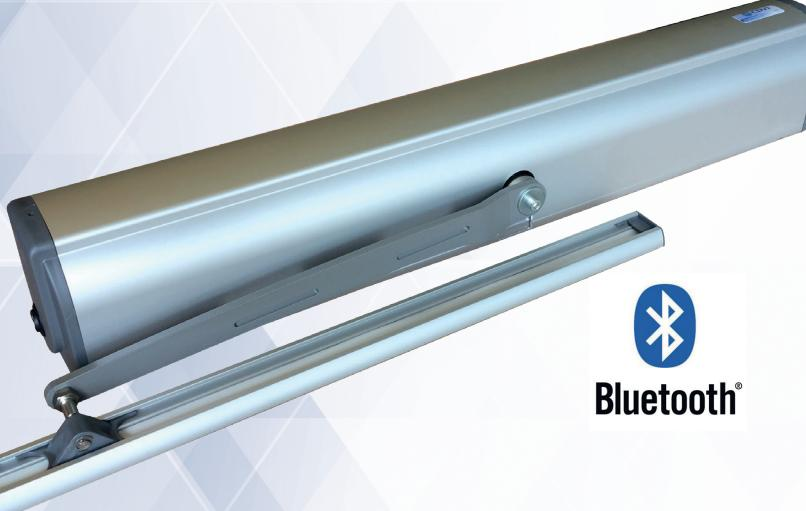

# **DIGIWAY SR**

*Elektromekanisk slagdörrsautomatik med returfjäder, inåt- och utåtgående dörrar*

**cdvi.se**

# *Innehåll Sida*

| Allmänna säkerhetsanvisningar 2           |  |  |  |  |  |
|-------------------------------------------|--|--|--|--|--|
| Maskindirektivet 2006/42/EC 3             |  |  |  |  |  |
| Användningsområde 3                       |  |  |  |  |  |
| Deklaration från tillverkaren 3           |  |  |  |  |  |
| Identifiering av komponeneter och delar 4 |  |  |  |  |  |
| Tillbehör  5                              |  |  |  |  |  |
| Dimensioner och mått 6                    |  |  |  |  |  |
| Teknisk data 7                            |  |  |  |  |  |
| Installation - Rotera motortappen 8       |  |  |  |  |  |
| Rotera LCD displayen 9                    |  |  |  |  |  |
| Måttspecifikation 10                      |  |  |  |  |  |
| Kopplingsschema 11                        |  |  |  |  |  |
| Kopplingsschema för säkerhetssensorer 13  |  |  |  |  |  |
| Förklaring LED meddelande 14              |  |  |  |  |  |
| Kom igång 14                              |  |  |  |  |  |
| • Steg 1 : Inledning 15                |  |  |  |  |  |
| • Steg 2 : Spänna upp fjädern 16       |  |  |  |  |  |
| • Steg 3 : Välj armsystem 17           |  |  |  |  |  |
| • Steg 4 : Dörrkalibrering 18          |  |  |  |  |  |
| • Steg 5 : Konfiguration 19            |  |  |  |  |  |
| • Steg 6 : Huvudfunktion 20            |  |  |  |  |  |
| • Steg 7 : Avancerade inställningar 21 |  |  |  |  |  |
| Funktionshindersinställningar 24          |  |  |  |  |  |
| Lägga till / Ta bort sändare  24          |  |  |  |  |  |
| Fabriks- och systemåterställning 25       |  |  |  |  |  |
| Dubbeldörrsmontage 26                     |  |  |  |  |  |
| Användarinstruktioner och Underhåll 31    |  |  |  |  |  |
| Felsökning  33                            |  |  |  |  |  |
| Loggbok 34                                |  |  |  |  |  |
| Riskanalys och Service 35                 |  |  |  |  |  |
|                                           |  |  |  |  |  |

### *Allmänna säkerhetsanvisningar*

Den här handboken är avsedd för yrkesmässigt kompetent personal med lämplig utbildning. Installation och anslutningar måste genomföras i enlighet med gällande standard och i överensstämmelse med gällande förordningar. Arbete med elektrisk utrustning får endast utföras av auktoriserade elektriker. Dålig installation kan vara källa till fara. Läs noga igenom denna manual innan du börjar installationen.

Kontrollera att dörrautomatiken är lämpad för miljön. Speciella konstruktionsförhållanden, tillgång till verktyg och reservdelar eller andra speciella förhållanden kan göra att andra åtgärder behövs för att säkerställa installationen och användningen än som nämns i manualen. Kontrollera dörrvikt och dörrbredden och andra faktorer som nämns i denna handbok eller i andra dokument från CDVI. Anslut automatiken till byggnadens elnät med en termo-magnetisk strömbrytare med en kontaktöppning på minst 3 mm. Den installation som beskrivs här är ett exempel. Se till att ingen kan bli instängd mellan dörren och omgivningen. Kontrollera alla kopplingar, kablar och installationen innan automatiken förses med ström.

Säkerställ att enheten är ordentligt frånkopplad från kraftkällan när rengöring och underhållsarbeten görs. Service av automatiken är av grundläggande betydelse för att systemet ska fungera ordentligt och säkert. Kontrollera installationen regelbundet för eventuell obalans och utnötning eller skador på kablar, fjädrar och fästanordningar. Håll rent från grus och skräp under dörren i rörelsefältet för att undvika störningar. Använd inte dörrautomatiken om den behöver lagas eller justeras.

Följ tillverkarens instruktioner som beskrivs i denna manual. Använd endast original reservdelar vid byten eller reparationer som krävs. Dörrautomatik tillverkaren frånsäger sig allt ansvar i händelse av att komponenter monterade som inte är förenliga med säker och korrekt användning. Automatiken får endast installeras inomhus. Tillverkaren avskriver sig allt ansvar för skador orsakade av montering på utsidan, utan ett lämpligt skydd. Den här produkten ska inte installeras på platser med en explosiv atmosfär eller i närvaro av brandfarliga ångor eller gaser.

### *Maskindirektivet 2006/42/EC*

Slagdörrautomatik är inkluderad i tillämpningsområde för Maskindirektivet 2006/42/EC och implementeras i svensk lagstiftning genom Arbetsmiljöverkets föreskrift, AFS 2008:3.

#### DETTA INNEBÄR ATT DEN SOM MONTERAR DÖRRAUTOMATIKEN ANSES VARA TILLVERKARE OCH DÄRMED SKALL FÖLJANDE UPPFYLLAS AV INSTALLATÖREN:

1. Skapa dokumentation på den kompletta maskinen (dörrautomatik och dörrblad) som måste innehålla de handlingar

som anges i bilaga V i maskindirektivet. Dokumentationen skall förvaras och ställas till förfogande av behöriga

nationella myndigheter i minst tio år från dagen för tillverkningen av maskinen (dörrautomatik och dörrblad).

2. Genomför en "EG-försäkran som överensstämmelse" i enlighet med Maskindirektivet, bilaga II-A.

3. Märkning av maskinen i enlighet med Maskindirektivet, bilaga I, punkt 1.7.3

(Tillverkarens företagsnamn, adress, maskinens beteckning, CE-märkning, serienummer mm).

EFTER INSTALLATIONEN SKALL FÖLJANDE HANDLINGAR ÖVERLÄMNAS TILL KUNDEN:

1. Instruktioner om hur man handhar och säkert använder systemet.

2. Rutin och underhålls instruktioner.

3. Försäkran om överensstämmelse.

- 4. Underhållregister.
### *Användningsområde*

Dörrautomatiken DIGIWAY-SR utvecklades för att passa både höger- och vänsterhängda dörrar och uppfyller kraven för arbets/serviceklass 5 – Heavy Duty (600 öppningar per dag i minst fem år)

### *Deklaration från tillverkaren*

( Enligt Maskindirektivet 2006/42/CE, Annex II part B )

The Manufacturer

CDVI WIRELESS SPA Via Piave,23 31020 S.Pietro di Feletto (TV) ITALY

Herewith declares that the automatic operator for swing doors Brand : CDVI Type : DIGIWAY-SR P/N : DWSR10xBT

- constitutes a "partly completed machinery" and it is intended to be incorpored into machinery or to be assembled with other machinery to constitute a machinery covered by Directive 2006/42/CE;
- complies with the following Directives :

2006/95/CE ( Low Voltage Directive ) 2004/108/CE ( Electromagnetic Compatibility Directive ) 2014/53/UE ( RED ) European Standard EN16005 : Power Operated doorsets - Safety in Use

- it is not allowed to put the machinery into service until the machinery into which it has to be incorporated or of which it has to be a component has been found and declarated to be in compliance with the provisions of the Directive 2006/42/CE.

S.Pietro di Feletto, 1/11/2017

G. Massimo Dalle Carbonare ( Product manager )

### *Identifiera komponenter och delar*

Digiway SR "DWSR10xBT" är en dörrautomatik för inomhusbruk men som kan styra både inner- och ytterdörrar. Den har integrerad elektronisk styrenhet och radiomottagare och man kan styra öppningen som manuell eller elektromekanisk och stängningen som fjäderdriven med motor-assistans eller endast med fjäderdriven stängning. Följande versioner finns tillgängliga:

| F-nummer | Referens   | Beskrivning                                                            |  |  |
|----------|------------|------------------------------------------------------------------------|--|--|
|          | DWSR102BT  | Dörrautomatik Digiway SR (230Vac) med bluetooth modul                  |  |  |
|          | DWSR102BTT | Dörrautomatik Digiway SR (230Vac) med bluetooth modul, tropicalization |  |  |
|          | DWSR104BT  | Dörrautomatik Digiway SR (24Vdc) med bluetooth modul                   |  |  |
|          | DWSR104BTT | Dörrautomatik Digiway SR (24Vdc) med bluetooth modul, tropicalization  |  |  |

Den här automatiken är lämplig för dörrar med en max bredd på 1,5m eller en max vikt på 200 kg (se diagram på sidan 7). Vid max hastighet kan dörren öppnas eller stängas inom 4 sekunder (90°), beroende på dörrvikten och mått. Se teknisk data på sidan 7 i den här manualen.

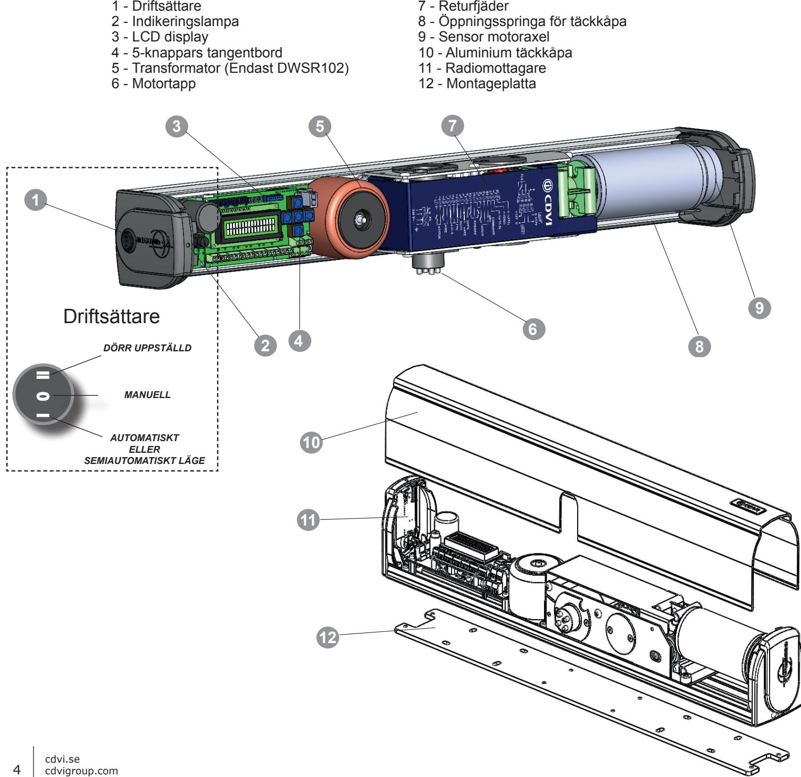

### *Förklaring*

### *Tillbehör*

| Beskrivning                              | Produkt- namn              | F-nummer                                  |  |
|------------------------------------------|----------------------------|-------------------------------------------|--|
| Tryckande arm                            | DWBA                       | F0543000209                               |  |
| Glidarm                                  | DWBS                       | F0543000210                               |  |
| Universalarm                             | DWBU                       | F0543000211                               |  |
| Synkroniseringskabel för dubbeldörr   | DWPCS                      | F0543000124                               |  |
| Verktygskit                              | DWTK                       | F0543000156                               |  |
| Förlängningsbult 30mm 55mm 80mm | DWSE30 DWSE55 DWSE80 | F0543000123 F0543000033 F0543000136 |  |
| Dörrkoordinator                          | SEL-NICK                   | F0522000003                               |  |
| Bluetooth modul*                         | DSRMBT                     | F0543000178                               |  |

(*): Sitter monterad i dörrautomatiken från fabrik.

*Dimensioner och mått*

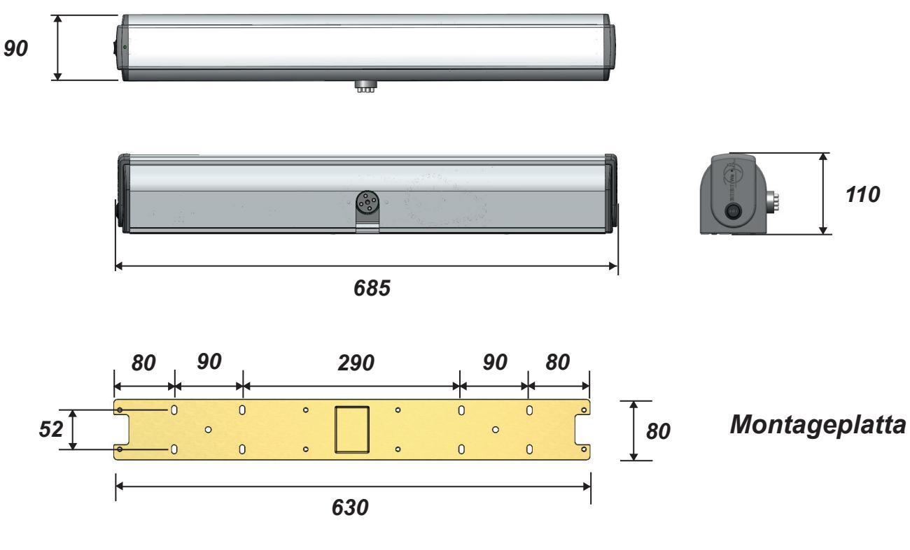

*Universalarm : hur man ändrar från glidarm till tryckande arm*

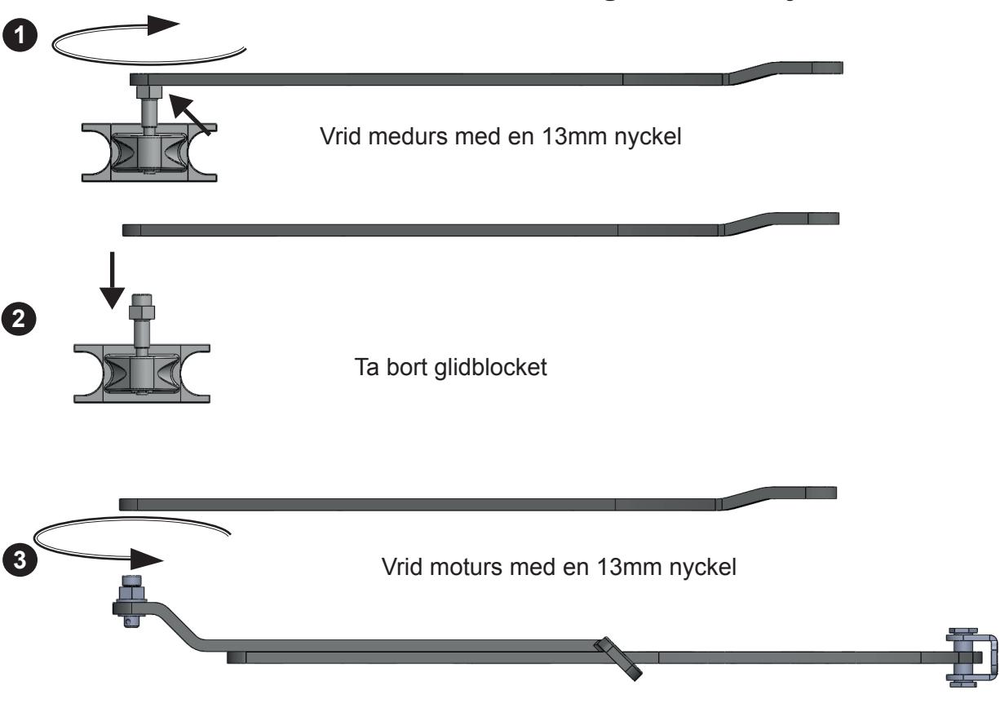

#### *Produktspecifikationer DWSR102BT* Nätspänning: 230Vac - 50Hz Motor vridmoment: 20Nm Effektförbrukning: 100W Arbets/serviceklass: 5 ( heavy duty ) Dimensioner: 685 x 90 x 110 mm Vikt: 10.5 Kg Arbetstemperatur: -10°C / +55°C Kappslingsklass: IP40 Öppnings- / Stängningstid: 4 / 15 sek. Hålltid: 1 / 90 sek. Ström för externa enheter: 13.5Vdc - 500mA Ström för låsanordning: 12Vdc - 1A / 24Vdc - 0.5A Reläutgång för lås: ( C-NO-NC) 10A / 12V Dörrstatus relä: ( C-NO ) - 24VA Hålltid för relä: Ställbar [ 0.1 / 5 min ] Sändarens säkerhetsprotokoll: Keeloq® Hopping Code Max antal sändare: 50 sändare Integrerad radiomottagare: 433.92 MHz ASK / -107 dBm *Användningsområde Anslutningar* Ingång: **Max dörröppningsvinkel** Låsutgång ( C-NO-NC ) Spänning / ström 12Vdc / 1A eller 24Vdc / 500mA Test för säkerhetssensorer Spänning / ström för enheter 13.5Vdc / 500mA Sensor i öppning ( C-NC) Sensor i stängning ( C-NC ) Manuell ( C-NO ) Uppställd ( C-NO ) Utvändig Radar ( C-NO ) Invändig Radar ( C-NO ) Nattläge ( C-NO ) Dörröppnare kontakt ( C-NO ) Brandlarmsingång ( C-NC ) Utgång: Dörrbredd Dörrvikt Nätspänning: 24Vdc - 100W / 18Vac - 100W Motor vridmoment: 20Nm Effektförbrukning: 100W Arbets/serviceklass: 5 ( heavy duty ) Dimensioner: 685 x 90 x 110 mm Vikt: 10.5 Kg Arbetstemperatur: -10°C / +55°C Kappslingsklass: IP40 Öppnings- / Stängningstid: 4 / 15 sek. Hålltid: 1 / 90 sek. Ström för externa enheter: 13.5Vdc - 500mA Ström för låsanordning: 12Vdc - 1A / 24Vdc - 0.5A Reläutgång för lås: ( C-NO-NC) 10A / 12V Dörrstatus relä: ( C-NO ) - 24VA Hålltid för relä: Ställbar [0.1 / 5 min] Sändarens säkerhetsprotokoll: Keeloq® Hopping Code Max antal sändare: 50 sändare Integrerad radiomottagare: 433.92 MHz ASK / -107 dBm

### *Standard funktioner*

- Funktionslägen: Automatisk, Semi automatisk, Manuell eller Uppställd
- Drift för enkeldörr, pardörr, inåt- eller utåtgående
- Hjälp guide för driftsättning
- Programmering via fjärrkontroll eller app
- Push & Go / Pull & Go funktion
- Justerbar hålltid och hastighet
- Justerbar låsstyrning och låsavlastning
- LED diod status
- Justerbara lägen för säkerhetssensorer
- Brandläge med bortkoppling av säkerhetssensorer och radar
- Nattläge
- Dörrstatus indikering
- Inbyggd räknare
- Inbyggd servicemeny med indikering
- Loggfunktion för hinderupptäckter

### *Produktspecifikationer DWSR104BT*

### *Installation*

Först och främst kontrollera stabiliteten/konstruktionen i dörren, kontrollera att dörren öppnar och stänger i en jämn rörelse och att ingen onormal friktion inträffar. Om det inte är så, gör alla nödvändiga förbättringar vid/på dörrmiljön för att säkerställa installationen/funktionen.

- Ta bort alla manuella låsanordningar (ex. låsanordning som kräver att man trycker ner handtaget för att öppna dörren).
- Ta bort alla stängningsanordningar (ex. dörrtillslutare och dörrstängare).

### *Rotera motortappen*

Returfjädern spänner man alltid åt samma håll, (se pilen bredvid motortappen) därför måste man montera motortappen enligt anvisningarna nedan, så att fjädern hjälper till att dra igen dörren

Beroende på vilken sida gångjärnen sitter på (höger eller vänster) i kombination med om det är en inåt- eller utåtgående dörr så kan man alltså behöva sätta automatiken upp och ner.

För att vända motortappen så släpper du bult A som sitter på motsatt sida av motortappen.

Ta bort motortappen och montera tillbaka delarna i motsatt riktning.

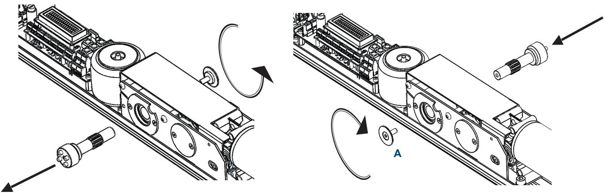

**DET FINNS OLIKA SÄTT ATT MONTERA AUTOMATIKEN. TITTA PÅ BILDERNA INNAN DU PÅBÖRJAR INSTALLATIONEN**

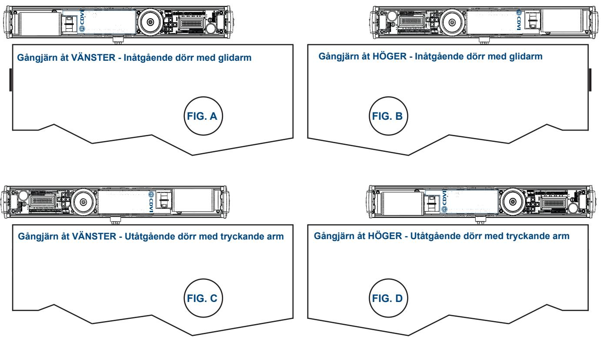

### *Montera automatiken*

Automatiken måste monteras med hjälp av montageplattan som medföljer.

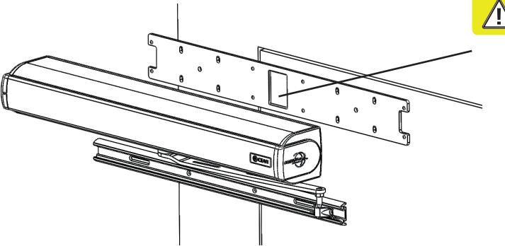

Var noga med att montera montageplattan så att urhålningen är mot baksidan på automatiken, annars kan inte returfjädern löpa fritt.

# *Rotera LCD displayen*

Från fabrik så kommer automatiken med displayen monterad på vänster sidan enligt (Fig B. och Fig. C). Om automatiken ska monteras upp och ner så måste du vända på displayen enligt (Fig A. och Fig. D). Följ instruktionerna för att vända på displayen:

**3**

**4**

Slå av strömmen till automatiken.

Dra loss displayen försiktigt i uppåtriktning ifrån kretskortet. **2 1**

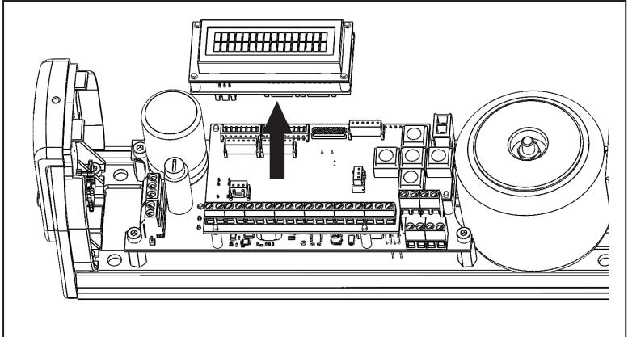

Vänd på automatiken i rätt riktning och sätt sedan tillbaka displayen i kontakterna på kretskortet. Se till att alla kopplingarna får kontakt mellan kretskortet och displayen.

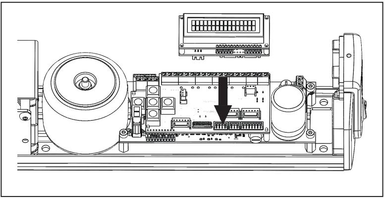

### *Måttspecifikation: Glidarm*

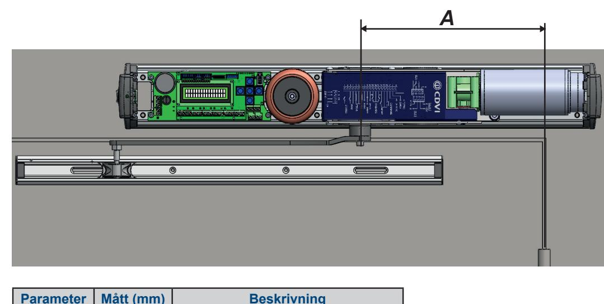

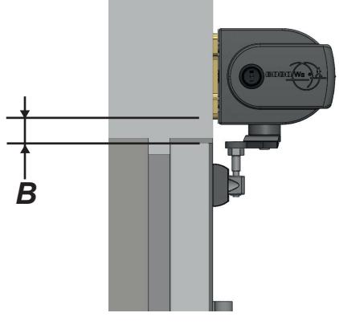

**30** 330 500 430 **0** 300 540 440

| Parameter | Mått (mm) | Beskrivning                      |  |
|-----------|-----------|----------------------------------|--|
| A         | 280       | Dörrgångjärn - motoraxel avstånd |  |
| B 35   |           | Montageplatta - ovankant dörr    |  |

### *Måttspecifikation: Tryckande arm*

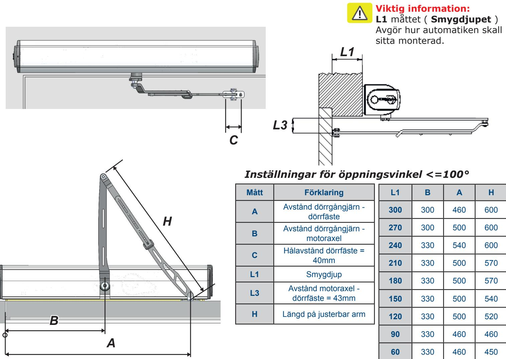

### *Kopplingsschema DWSR102 - 230Vac*

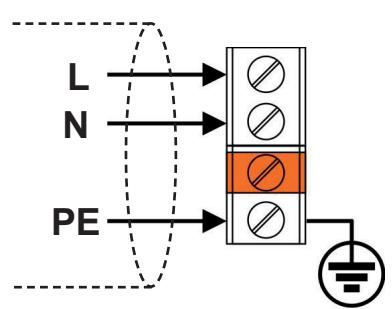

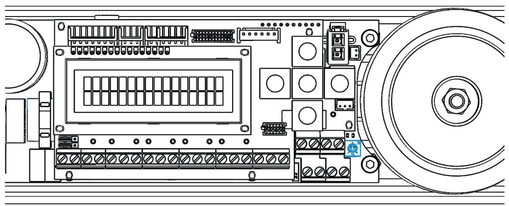

# *Kopplingsschema DWSR104 - 18Vac eller 24Vdc*

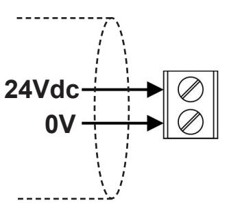

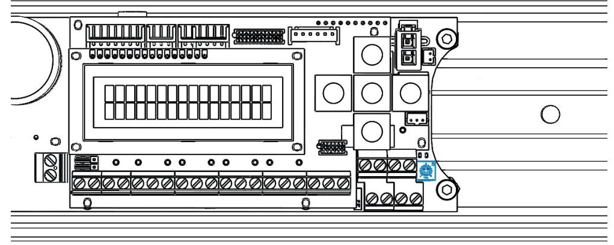

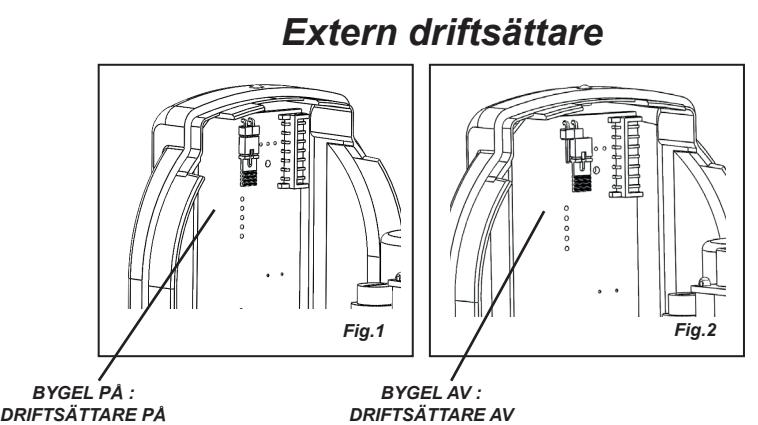

#### **Bygel för extern driftsättare**

Om du vill koppla bort den externa driftsättaren tar du bort bygeln på insidan av plastkåpan.

För att automatiken skall fungera måste du använda dig av en extern styrning som ska vara inkopplade på plint 8-9-10, eller kortsluta mellan plint 8-9 för att få automatiken i permanent drift, det är en användbar lösning i miljöer där det riskeras sabotage mot automatiken.

### **DIGIWAY SR SE SE** Elektromekanisk dörrautomatik med returfjäder

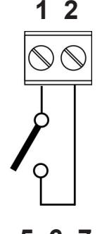

| Status relä C-NO     |    |                  |  |
|----------------------|----|------------------|--|
| Relä                 | Av | På               |  |
| Service              | OK | Dags för service |  |
| Dörrstatus Stängd |    | Öppnar / stänger |  |
|                      |    |                  |  |

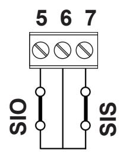

|   | Dörrstatus            | Stängd                      | Öppnar / stänger |  |
|---|-----------------------|-----------------------------|------------------|--|
|   |                       |                             |                  |  |
|   | Säkerhetssensorer (*) | 8 9 10                      |                  |  |
| 5 |                       | NC Sensor i öppning (SIO)   |                  |  |
| 6 | C Sensorer            |                             |                  |  |
| 7 |                       | NC Sensor i stängning (SIS) |                  |  |
|   |                       |                             |                  |  |

(*) Måste byglas om de inte används

**Radar 11** Ingång NO Utvändig radar (Inaktiv i nattläge)

**12** Ingång C Radar

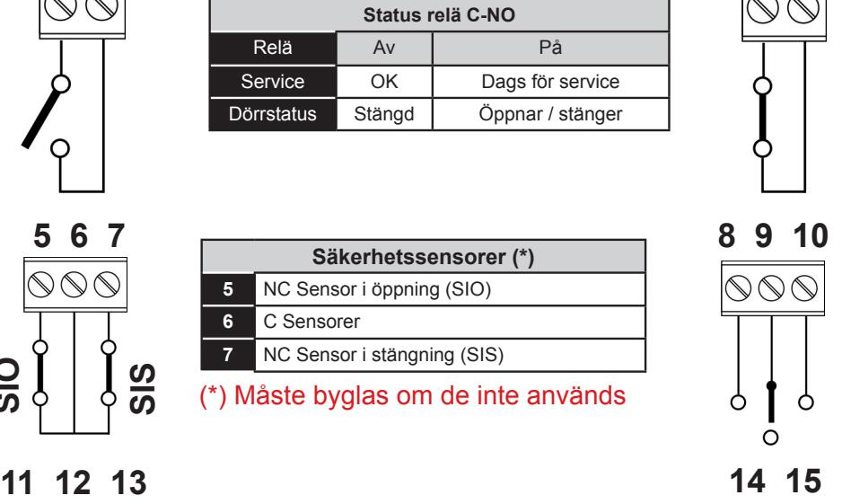

**3 4**

| Brandlarm |                      |  |
|-----------|----------------------|--|
| 3         | C kontakt brandlarm  |  |
| 4         | NC kontakt brandlarm |  |
|           |                      |  |

| Extern driftsättare (*) |                       |  |
|-------------------------|-----------------------|--|
| 8                       | Ingång NO position I  |  |
| 9                       | Ingång C position 0   |  |
| 10                      | Ingång NO position II |  |

**Nattläge**

(*) Se längst ner sidan 11

**14** Ingång NO Nattläge

**15** Ingång C

|     | 1 1 |
|-----|--------|
| OOO |        |
|     |        |
| )   |        |

| 13 Ingång NO Invändig radar                                 |                         |                                                                                            |                                                                                          |
|----------------------------------------------------------------|-------------------------|--------------------------------------------------------------------------------------------|------------------------------------------------------------------------------------------|
| 15 16 Öppningskommando 15 Ingång C 16 Ingång NO |                         | T1 C T2 T1 C T2 Test SIS C (GND) Test SIO                                | Test fotocell Utgång (+12) Test SIO C (GND) Test sensorer Utgång (+12) Test SIS |
|                                                                | Elslutbleck 24V + | C NO NC +24 V 17 18 19 20 17 18 19 20 21 22 23 24 21 22 23 24 0 +12 V | Spänning till lås Spänning radar och sensorlister                               |

**-**

**Spänning till lås**

**0**

**+12 V** 

### *Kopplingsschema säkerhetssensorer*

Standarden EN16005 visar att de delar av systemet som har en direkt effekt på säkerheten måste uppfylla EN12978 och utformas i enlighet med EN ISO 13849-1 Prestanda Nivå "c". Säkerhetsrelaterade delar av styrsystemet som används för utrymningsvägs funktionalitet ska överensstämma med EN ISO 13849-1 Prestanda Nivå "d"

Om enheter typ ESPE (fotoceller) används skall de övervakas av styrsystemet. Digiway-SR är utrustad med utsignaler test (T1, C, T2) som kontrollerar fotocellernas status innan någon rörelse har skett. Systemet stängs av för några mS och kör en testsignal på fotocellerna och kontrollerar förändringen på signalerna på plintarna 5-6 eller 6-7. Om signalerna ändras regelbundet aktiveras dörrens rörelse, annars stoppas dörrens rörelse eller inträder i Low energy.

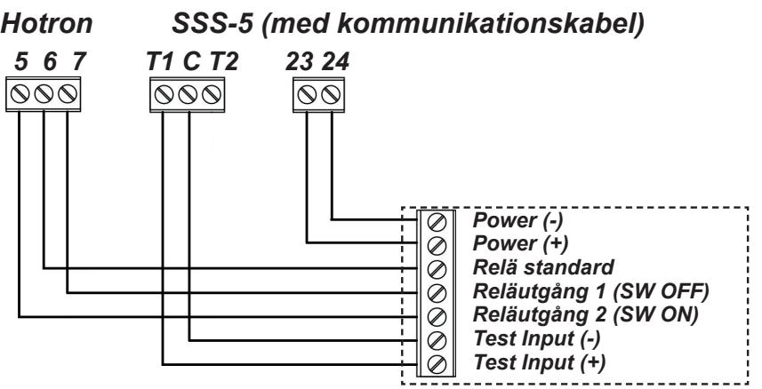

| Avancerade inställningar: |              |  |  |  |
|---------------------------|--------------|--|--|--|
| Test SIO                  | - Aktiverad  |  |  |  |
| Test SIS                  | - Aktiverad  |  |  |  |
| SIO/SIS Testtid           | - 020ms      |  |  |  |
| Test FTC mode             | - Active Low |  |  |  |

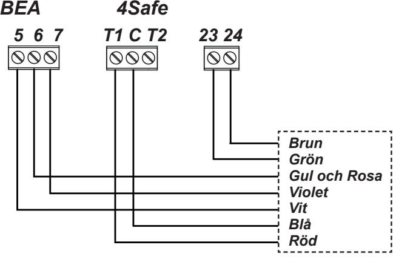

| Avancerade inställningar: |              |  |  |  |
|---------------------------|--------------|--|--|--|
| Test SIO                  | - Aktiverad  |  |  |  |
| Test SIS                  | - Aktiverad  |  |  |  |
| SIO/SIS Testtid           | - 005ms      |  |  |  |
| Test FTC mode             | - Active Low |  |  |  |

*BEA LZR - Flatscan SW och LZR - Flatscan 3D SW*

| Avancerade inställningar: |              |
|---------------------------|--------------|
| Test SIO                  | - Aktiverad  |
| Test SIS                  | - Aktiverad  |
| SIO/SIS Testtid           | - 005ms      |
| Test FTC mode             | - Active Low |

# *Driftstatus för ljusdioderna*

|    | LED PÅ                                    | LED AV                                    |
|----|-------------------------------------------|-------------------------------------------|
| L1 | Brandlarm normalt läge                    | Brandlarm aktiverat                       |
| L2 | NC-kontakt stopp fotoceller sluten     | NC-kontakt stopp fotoceller öppen      |
| L3 | NC-kontakt återöppna fotoceller sluten | NC-kontakt återöppna foto celler öppen |
| L4 | Automatiskt läge                          | -                                         |
| L5 | Uppställt läge                            | -                                         |
| L6 | Extern radar aktiv                        | -                                         |
| L7 | Intern radar aktiv                        | -                                         |
| L8 | Natt läge                                 | Dag läge                                  |
| L9 | Öppna / stäng kommandot aktiv          | -                                         |

### *Diod meddelande*

|                                   | LED GRÖN |           | LED ORANGE |            | LED RÖD |           |                     |
|-----------------------------------|----------|-----------|------------|------------|---------|-----------|---------------------|
| Funktion                          | PÅ       | Blinkande | PÅ         | Blinkande  | PÅ      | Blinkande | Snabbt blinkande |
| Allt OK                           | O        |           |            |            |         |           |                     |
| Brandlarm                         |          |           |            | O (Snabbt) |         |           |                     |
| Nattläge                          |          |           | O          |            |         |           |                     |
| Manuell (dörr fri)                | -        | -         | -          | -          | -       | -         | -                   |
| Nuvarande beräkning pågår      |          | O         |            |            |         |           |                     |
| Självkalibrering                  |          |           |            |            |         | röd/grön  |                     |
| Säkerhetfotoceller felfunktion |          |           |            |            |         |           | O                   |
| Uppställd (dörr öppen)            |          |           |            | O (Sakta)  |         |           |                     |
| Dags för service                  |          |           |            |            |         | O (Sakta) |                     |

### *Larm*

På kretskortet till Digiway-SR så sitter det tre stycken larm dioder som indikerar tre olika avvikelser för dörren som kommer att försätta den i manuellt läge.

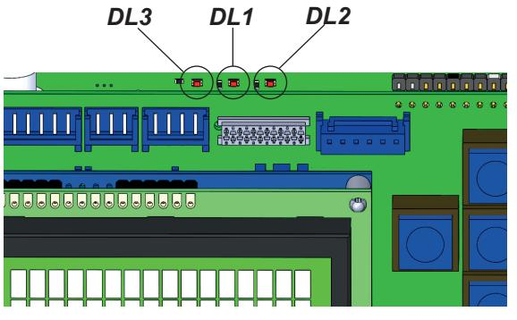

| LED | Beskrivning                                                                                                                     |
|-----|---------------------------------------------------------------------------------------------------------------------------------|
| DL1 | Onormal strömförbrukning > 9A i 2 sekunder                                                                                      |
| DL2 | Kortslutning                                                                                                                    |
| DL3 | Kretskortet har överhettats (>65°C). När temperaturen understiger 47°C så kommer systemet att återställa sig automatiskt. |

## *Kom igång*

Digiway-SR är utrustad med en LCD-display och ett 5-knappars tangentbord. Driftskonfiguration kan ställas genom flera menyer. Menyn är uppbyggt i en trädstruktur med en huvudmeny och olika undermenyer.

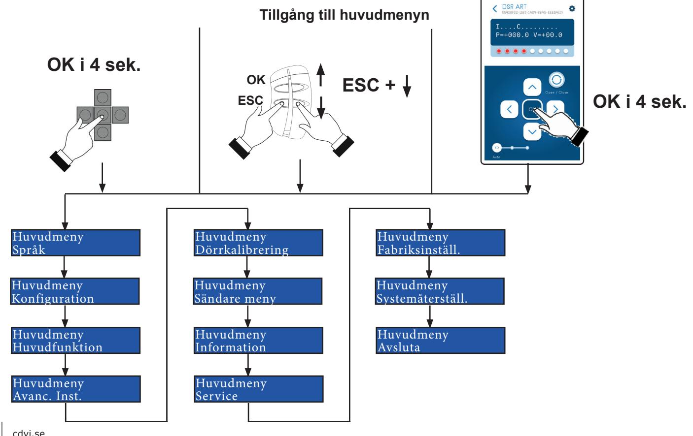

### *Konfigurationsguide*

I paketet medföljer det en 4-knapps sändare. Efter att ni har gjort klart den fysiska installationen och anslutit kablarna enligt kopplingsschemat, gå vidare med att memorera handsändaren till det interna minnet i Digiway. Den först memorerade sändaren kan navigera i menyn för att sätta alla nödvändiga parametrar, utan att du behöver trycka på kretskortets 5-knappars tangentbord. Handsändarens knappar motsvarar knapparna på kretskortet, se bilden nedan.

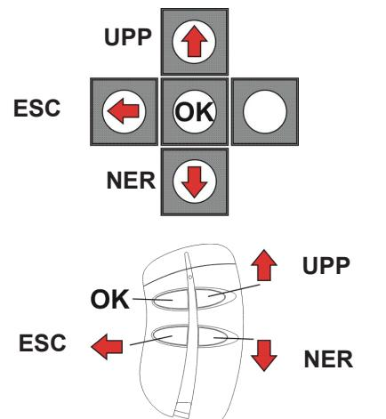

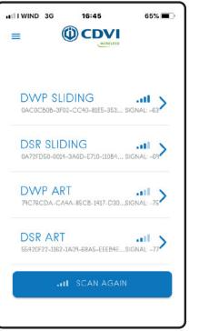

Appen visar de automatiker som är inom räckhåll för Bluetooth

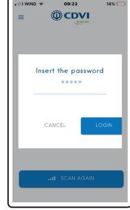

Standard PIN-kod 00000

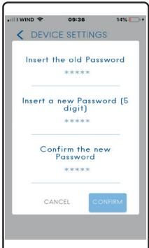

Byt ut PIN-koden mot valfri, 5 siffror

Följ guiden på 7 steg för att driftsätta automatiken:

- **STEG 1 : INLEDNING**
- **STEG 2 : SPÄNNA UPP FJÄDERN**
- **STEG 3 : VÄLJ ARMSYSTEM**
- **STEG 4 : DÖRRKALIBRERING**
- **STEG 5 : KONFIGURATION**
- **STEG 6 : HUVUDFUNKTION**
- **STEG 7 : AVANCERADE INSTÄLLNINGAR**

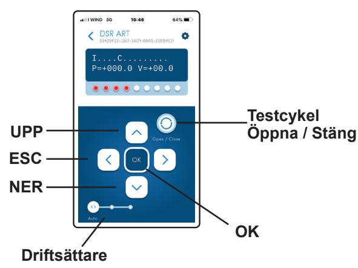

### **STEG 1 : INLEDNING**

- Tryck **OK** på tangentbordet i **4 sekunder** det står Main menu: Language i displayen. **1**
- Tryck **OK**, det står nu Language: English. Tryck på **NER** knappen och välj önskat språk. **2**
- Tryck på **OK** för att bekräfta: på skärmen visas OK och sedan visas meddelanden på valda språket. **3**
- Lämna menyn med knappen **ESC**. **4**
- Bläddra nedåt i huvudmenyn tills du kommer till **Sandare meny** och tryck på **OK**. **5**
	- Välj alternativet **Lägg till** och tryck på **OK. 6**
	- Tryck på knappen **A** (upp-vänstra knappen): skärmen visar motsvarande S/N, bekräftar memorering; **7**
	- Lämna menyn **Lägg till** med knappen **ESC** på tangentbordet; **8**
	- Lämna huvudmenyn genom att välja **Avsluta**. **9**

Nu är fjärrkontrollen aktiverad för att komma in i huvudmenyn. Tryck samtidigt på knapparna (C + D) för att komma in i huvudmenyn.

**OBSERVERA: Endast den första sändaren som lagts till kan öppna och navigera i menyn.**

# **STEG 2 : SPÄNNA UPP FJÄDERN**

Den här automatiken är utrustad med en returfjäder som gör att dörren alltid kommer stängas. Trycket som fjädern utgör mot dörren i stängt läge är justerbart, man spänner upp fjädern med hjälp av knapparna eller handsändaren. Av säkerhetsskäl så levereras automatiken utan någon förspänd fjäder.

#### **VIKTIGT: Spänn upp fjädern innan du fortsätter med autokalibrering eller andra inställningar.**

**1** Automatiken behöver ha spänningen inkopplad när man spänner upp fjädern. Montera armen på dörrbladet, oavsett om du har glidarm eller vridarm, men koppla inte fast armen på motortappen ännu.

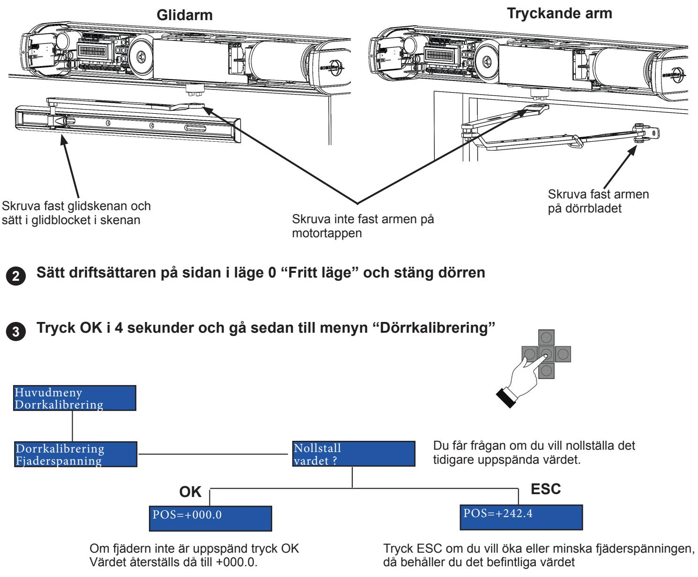

**VARNING: Om automatiken plockas ner från dörren eller om du släpper armen från motortappen så kommer fjädern att spänna ur sig. Du kommer då att behöva göra om inställningen för att spänna fjädern. I detta fallet så trycker du OK på ovanstående fråga.**

**4**

Motortappen kommer att rotera när du spänner upp fjädern.

Tryck på knapp UPP eller NER för att öka eller sänka värdet, värdet visas i grader.

**OBSERVERA: Det är viktigt att fjädern laddas enligt pilen som sitter brevid motortappen annars kommer den att spänna ut åt fel håll.**

**5** Fjädern går att justeras med 90 graders mellanrum, spänn upp fjädern så att motortappen passar i hålen på armen när dörren är stängd, skruva därefter fast medföljande M6x16 bult för att fästa armen.

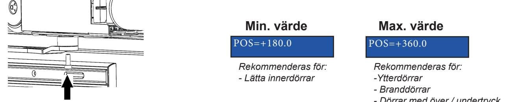

M6x16

*- Dörrar med över / undertryck*

**6** Gå ur menyn och känn på dörren manuellt så att den stänger som den ska. Om fjäderna inte är tillräckligt uppspänd så gör om tidigare procedur.

**OBSERVERA: För att undvika att fjädern spänner ut sig om du behöver justera armen så gå in i undermenyn "Fjäderspänning", och tryck nu ESC på frågan om du vill nollställa värdet, du kan nu ta bort M6x16 bulten, så länge du stannar i den menyn så kommer fjädern hålla sig fast i önskat läge.**

### **STEG 3 : Välj armsystem**

Välj vilken arm typ (glid- eller tryckande arm) beroende på om automatiken sitter på en inåt- eller utåtgående dörr.

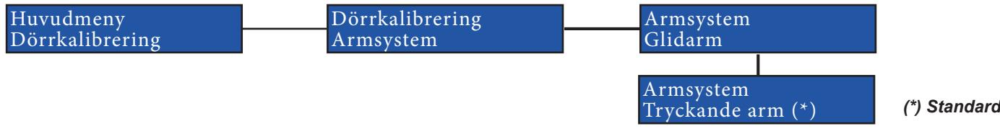

# **STEG 4 : DÖRRKALIBRERING [ Enkeldörr ]**

Digiway SR är utrustad med en programvara som gör att den anpassar sig efter aktuella dörregenskaper. **OBSERVERA att inga externa låsenheter får vara inkopplade vid kalibreringen.**  För kalibrering följ nedstående steg:

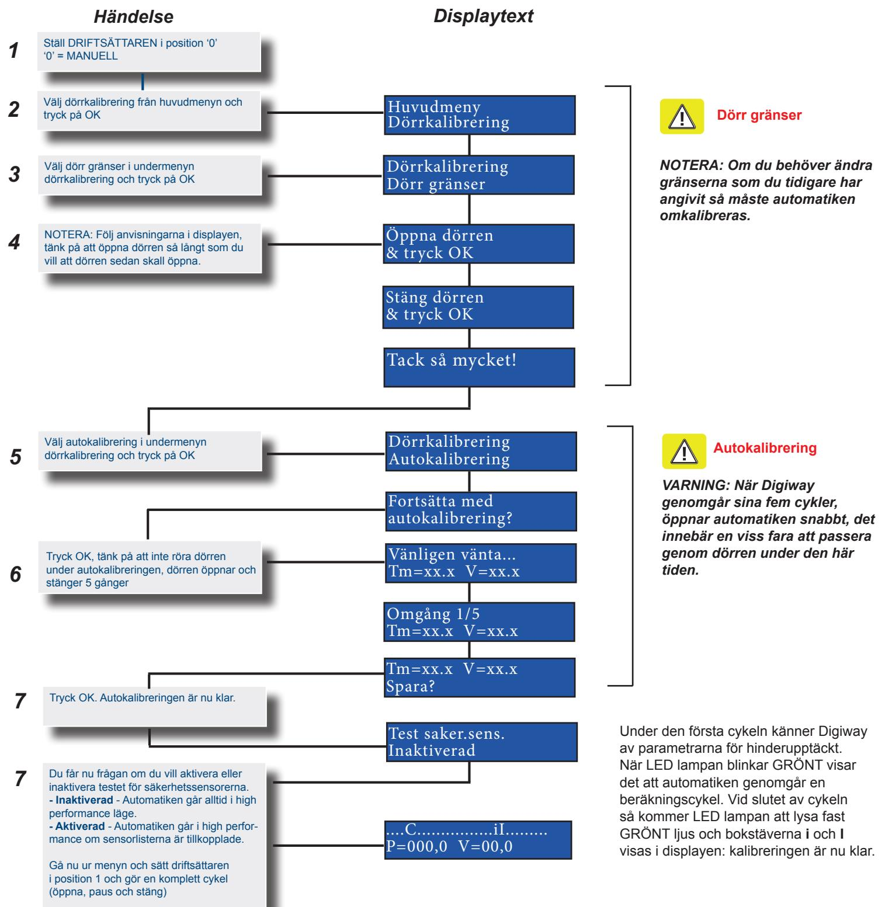

### **Justera öppningsvinkeln**

Om, det är så att automatiken inte öppnar så långt eller öppnar längre än som önskat efter autokalibreringen, så går det att justera öppningsvinkeln utan att behöva göra en ny autokalibrering.

### **STEG 5 : KONFIGURATION**

I steg 5 är det möjligt att ställa in alla de grundläggande parametrarna för dörrautomatiken, beroende på typ av dörr. **Standardvärdet visas i displayrutan**

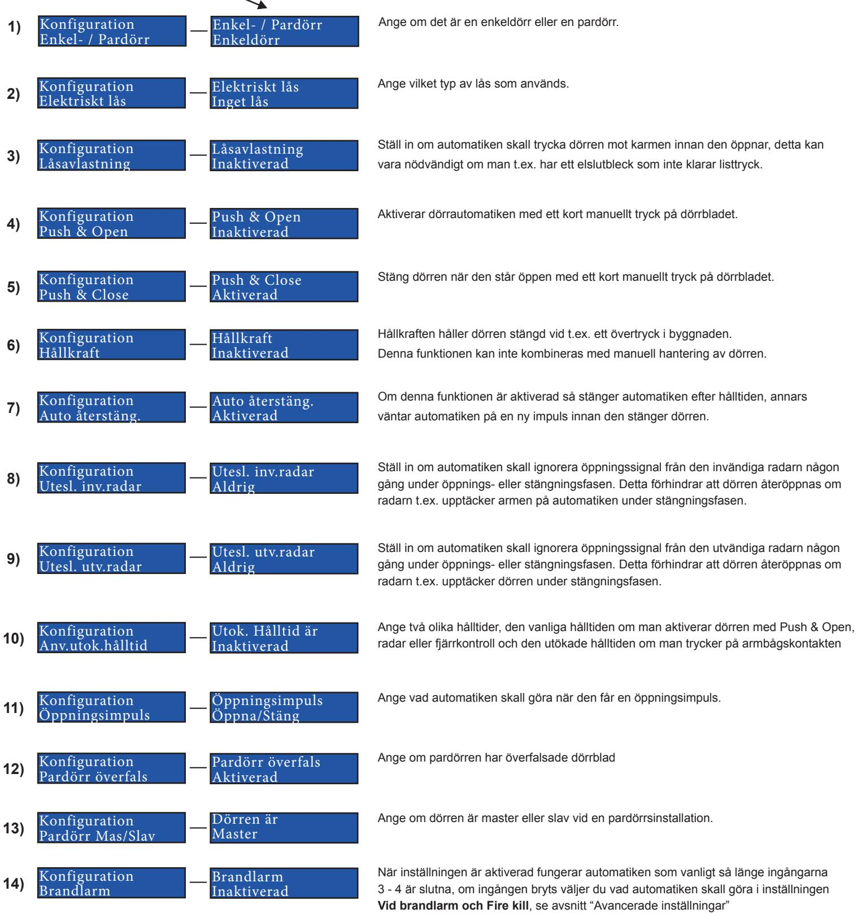

OBSERVERA: För att ändringar som genomförts ska bli aktiva måste systemet göra en komplett cykel (öppna, paus, stäng). Detta gäller även om en systemåterställning skall verkställas.

# **STEG 6 : HUVUDFUNKTION**

I steg 6 är det möjligt att ställa in driftläget på automatiken samt öppnings- och stängningshastigheten, hålltiden på dörrautomatiken och hur känslig automatiken skall vara för hinderupptäckter.

**Standardvärdet visas i displayrutan**

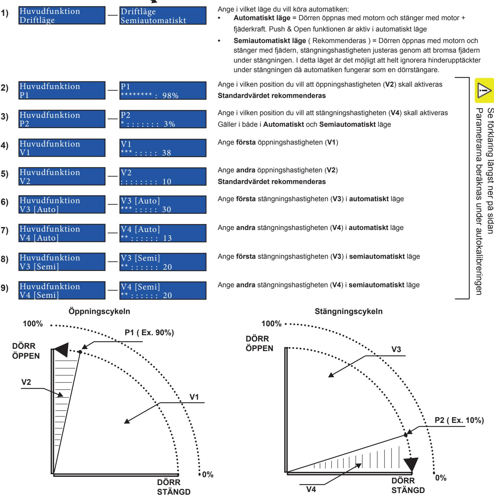

**Automatiskt läge** - i automatiskt läge är automatiken programmerad att bromsa in mot slutet av stängningen, om stängningskraften inte är tillräcklig måste du justera två parametrar **P2** och **V4**.

**Semiautomatiskt läge** - i semiautomatiskt läge bestäms stängningskraften av hur hårt fjädern är uppspänd, om du vill justera stängningshastigheten utan att spänna upp fjädern mer så ändrar du värdet **V4**, höjer du värdet till högre än **V3** så får du en tillslagsfunktion som kan vara bra om du har ett elslutbleck eller tätningslister, du väljer själv när **V4** skall börja verka genom att ändra **P2**.

| Parameter       | Resultat        |
|-----------------|-----------------|
| V4 samma som V3 | Samma hastighet |
| V4 högre än V3  | "Tillslag"      |
| V4 lägre än V3  | Inbromsning     |

# *Stängningshastighet i STRÖMLÖST LÄGE*

När automatiken är i strömlöst läge så ställs stängningshastigheten in av hur mycket man har spännt fjädern, det är möjligt att justera hastigheten med hjälp av en potentiometer, trots att strömmen är bortkopplad.

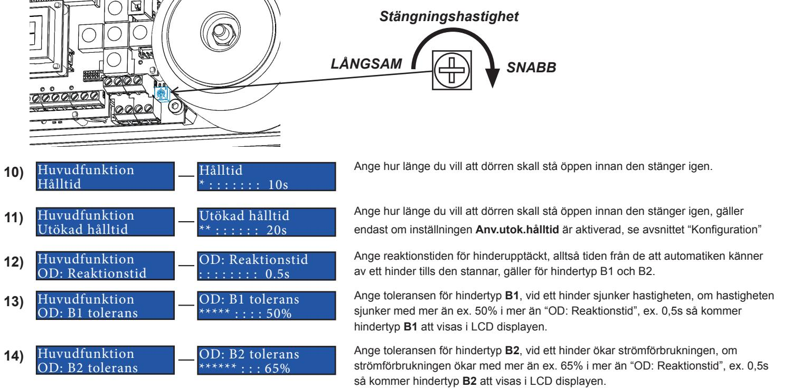

### **HINDER**

| Hinder | Beskrivning                                                                                                                                                                                                                                                                               |
|--------|-------------------------------------------------------------------------------------------------------------------------------------------------------------------------------------------------------------------------------------------------------------------------------------------|
| B1     | Hinderupptäckt: Hastigheten skiljer sig med mer än 50% från referensvärdet                                                                                                                                                                                                                |
| B2     | Hinderupptäckt: Strömförbrukningen skiljer sig med mer än 65% från referensvärdet                                                                                                                                                                                                         |
| B3     | B1 och B2 kombinerat                                                                                                                                                                                                                                                                      |
| B4     | Möjligt hinder som hindrar dörren från att röra sig minst 1% av den totala cykeln i mer än 1.5 sekund.                                                                                                                                                                                    |
| B5     | Möjligt hinder som orsakar en peak i strömförbrukningen, strömförbrukningen är mer än 2.4A i 400 mS                                                                                                                                                                                       |
| B6     | Möjligt hinder i den sista 10° av stängningen eller efter 80° av öppningen som orsakas av : 1) En peak i strömförbrukningen som är mer än 97% av maxvärdet 2) Hastigheten håller sig under 20° / minut. Detta kan inträffa om kalibreringsvärdena saknas (i och I visas inte i LCD) |

# **Vid anpassning för FUNKTIONSHINDRADE**

Om automatiken används för personer med funktionshinder. Då ska öppnings- och stängningshastigheten på dörrbladet justeras.

|               | Dörrens vikt |       |       |       |       |  |  |
|---------------|--------------|-------|-------|-------|-------|--|--|
| Dörrens bredd | 50 Kg        | 60 Kg | 70 Kg | 80 Kg | 90 Kg |  |  |
| 750 mm        | 3,0 s        | 3,1 s | 3,2 s | 3,3 s | 3,5 s |  |  |
| 850 mm        | 3,1 s        | 3,1 s | 3,2 s | 3,4 s | 3,6 s |  |  |
| 1000 mm       | 3,2 s        | 3,4 s | 3,7 s | 4,0 s | 4,2 s |  |  |
| 1200 mm       | 3,8 s        | 4,2 s | 4,5 s | 4,8 s | 5,1 s |  |  |

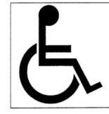

Enligt förordningen, när automatiken aktiveras för funktionshindrade:

- Hålltiden måste vara minst 5 sek.
- Motorns vridmoment värde vid dörrbladet skall vara lägre än 67 N.
- Den långsamma hastigheten i stängningen måste vara minst 1,5 sek.

Dessa inställningar kan ändras i menyn HUVUDFUNKTION.

Parametrarna beräknas under autokalibreringen

Se förklaring längst ner på sidan

# **STEG 7 : AVANCERADE INSTÄLLNINGAR**

Digiway SR är utrustad med många justerbara inställningar för att passa till olika typer av installationer. I Huvudmenyn välj undermenyn **Avancerade inställningar** för fler justeringsmöjligheter. **Standardvärdet visas i displayrutan**

Aktivera funktionen **Elektriskt lås**, se avsnittet "Konfiguration" Justera upplåsningstiden i sekunder för reläutgången.

Aktivera funktionen **Låsavlastning**, se avsnittet "Konfiguration" Justera hur länge automatiken skall trycka dörren mot karmen innan den öppnar.

Aktivera funktionen **Låsavlastning**, se avsnittet "Konfiguration"

Aktivera funktionen **Elektriskt lås**, se avsnittet "Konfiguration" Det är möjligt att lägga till en kort startfördröjning på automatiken så att låset hinner låsas upp, detta kan vara användbart när du använder motoriserade lås.

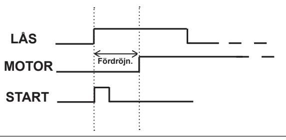

Aktivera funktionen **Hållkraft**, se avsnittet "Konfiguration" Detta gör det möjligt att ändra värdet på kraften som håller igen dörren vid stängt läge. Denna inställning kan inte kombineras med manuell hantering av dörren.

OD: Öka hålltid är en funktion som ökar den inställda hålltiden med 1 sekund varje gång som dörren upptäcker något hinder under stängningsfasen. När automatiken har stängt dörren utan att upptäcka något hinder så återställs hålltiden till det värde som är angett. Utöver det så aktiveras även funktionen "köpa tid" vilket gör att för varje öppningsimpuls som dörrautomatiken får när den öppen så återställs hålltiden.

Om dörren öppnas mot en vägg så är det stor risk är säkerhetssensorn i öppningen (SIO) upptäcker väggen som ett hinder. Då är det möjligt att utesluta den sensorn under sista delen av öppningsfasen. Värdet anges i procent av den totala öppningen.

#### **100 = Uteslut SIO under hela öppningen.**

Exempel: Om du vill inaktivera fotocellen åtgärden när dörren är öppen på 80% av hela öppnandet, ange värdet till 20.

*VARNING: Den bortagna zonen kan bli mycket farlig eftersom den inte* 

Aktivera funktionen **Brandlarm**, se avsnittet "Konfiguration" Vid brandlarm möjliggör att bestämma vad som skall hända om ingångarna 3-4 bryts.

- **Fritt läge** = Automatiken försätts i fritt läge och stänger med fjädernkraften. **• Uppställd** = Automatiken ställer dörren i uppställt läge.
- **Stängd och låst =** Dörren är stängd och låst.
- **Stängd och olåst** = Dörren är stängd men olåst.

**Tillslagsfunktion**

**SE SE DIGIWAY SR** Elektromekanisk dörrautomatik med returfjäder

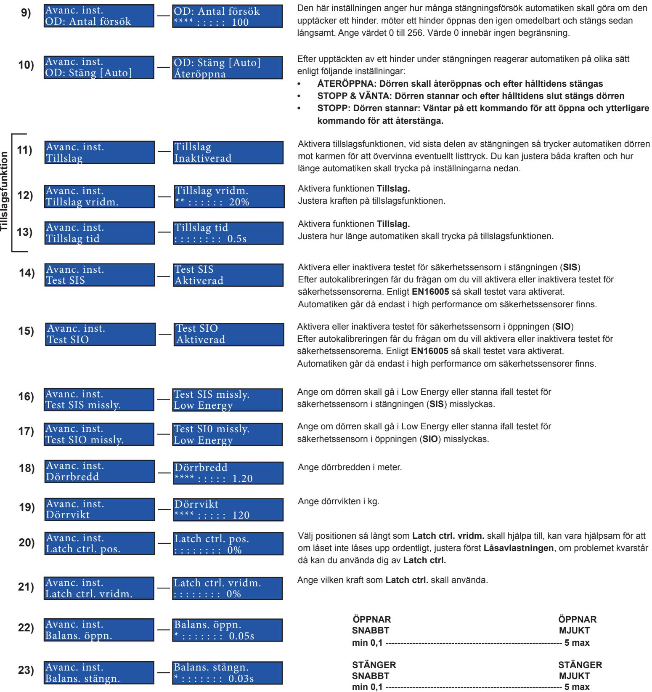

De två parametrarna **Balans. öppn.** och **Balans. Stängn.** kan vara användbara om du har en tung dörr och dörren smäller i öppningen eller stängningen. I det fallet så kan det vara bra att ändra värdet för att få en bättre balanserad öppning eller stängning.

**Värdet som anges som standard har räknats ut av systemet under autokalibreringen.**

Parametrarna är aktiva i både öppning och stängning i **automatiskt läge**, och endast aktiva i öppningfasen i **semiautomatiskt läge**.

### **DIGIWAY SR SE SE** Elektromekanisk dörrautomatik med returfjäder

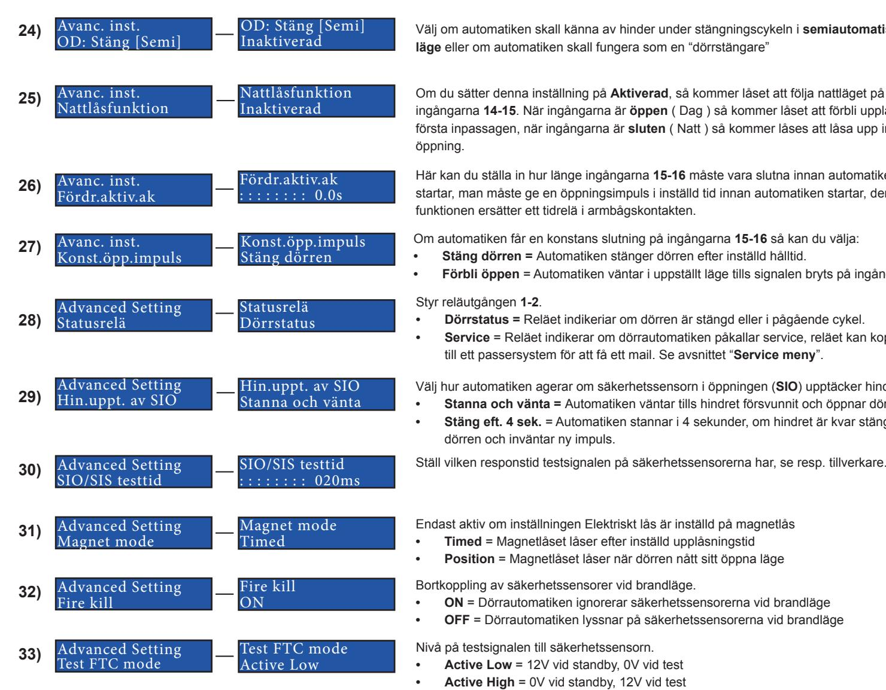

Inaktiverad Välj om automatiken skall känna av hinder under stängningscykeln i **semiautomatiskt läge** eller om automatiken skall fungera som en "dörrstängare"

> Om du sätter denna inställning på **Aktiverad**, så kommer låset att följa nattläget på ingångarna **14-15**. När ingångarna är **öppen** ( Dag ) så kommer låset att förbli upplåst efter första inpassagen, när ingångarna är **sluten** ( Natt ) så kommer låses att låsa upp inför varje

Här kan du ställa in hur länge ingångarna **15-16** måste vara slutna innan automatiken startar, man måste ge en öppningsimpuls i inställd tid innan automatiken startar, denna funktionen ersätter ett tidrelä i armbågskontakten.

Om automatiken får en konstans slutning på ingångarna **15-16** så kan du välja:

- **Stäng dörren =** Automatiken stänger dörren efter inställd hålltid.
**• Förbli öppen** = Automatiken väntar i uppställt läge tills signalen bryts på ingången.

Styr reläutgången **1-2**.

**• Dörrstatus =** Reläet indikeriar om dörren är stängd eller i pågående cykel.

- **Service** = Reläet indikerar om dörrautomatiken påkallar service, reläet kan kopplas till ett passersystem för att få ett mail. Se avsnittet "**Service meny**".
Välj hur automatiken agerar om säkerhetssensorn i öppningen (**SIO**) upptäcker hinder. **• Stanna och vänta =** Automatiken väntar tills hindret försvunnit och öppnar dörren.

- **Stäng eft. 4 sek.** = Automatiken stannar i 4 sekunder, om hindret är kvar stängs dörren och inväntar ny impuls.
Endast aktiv om inställningen Elektriskt lås är inställd på magnetlås

- **Timed** = Magnetlåset låser efter inställd upplåsningstid
- **Position** = Magnetlåset låser när dörren nått sitt öppna läge

Bortkoppling av säkerhetssensorer vid brandläge.

- **ON** = Dörrautomatiken ignorerar säkerhetssensorerna vid brandläge
- **OFF** = Dörrautomatiken lyssnar på säkerhetssensorerna vid brandläge

Nivå på testsignalen till säkerhetssensorn.

- **Active Low** = 12V vid standby, 0V vid test
- **Active High** = 0V vid standby, 12V vid test

# **SÄNDARE MENY**

Dörrautomatiken är utrustad med en inbyggd radiomottagare med Keeloq® Hopping code. Genom sändare menyn är det möjligt att administrera minnet för mottagaren som kan lagra upp till 50 fjärrkontroller (TX).

| Huvudmeny Sändare meny | Sändare meny Lägg till Tryck sändare knapp för att lägga till | Lägg till en sändare: välj Lägg till och tryck OK. Följ instruktionerna i displayen. Om allt är korrekt visas serienumret för sändaren. Om sändaren redan finns inlagd kommer meddelande visas: Sändare redan inlagd. Den första sändaren som läggs till kan användas för att programmera dörrautomatiken. |
|---------------------------|------------------------------------------------------------------------|------------------------------------------------------------------------------------------------------------------------------------------------------------------------------------------------------------------------------------------------------------------------------------------------------------------------|
|                           | Sändare meny Ta bort Tryck sändare knapp för att ta bort      | Ta bort en sändare: Välj Ta bort och tryck OK. Följ instruktionerna i displayen. Om allt är korrekt visas: Sändare Borttagen För att radera den först inlagda sändaren räcker det att trycka på en knapp. För att radera andra sändare måste du trycka varje knapp för sig.                                   |
|                           | Sändare meny Ta bort alla Ta bort alla sändare ?              | Radera alla inlagda sändare: Välj Ta bort och tryck OK. Du får frågan Ta bort alla sändare? i displayen, tryck OK. Alla sändare inkl. den första programmeringssändaren har raderats ur minnet.                                                                                                                  |

### **INFORMATION**

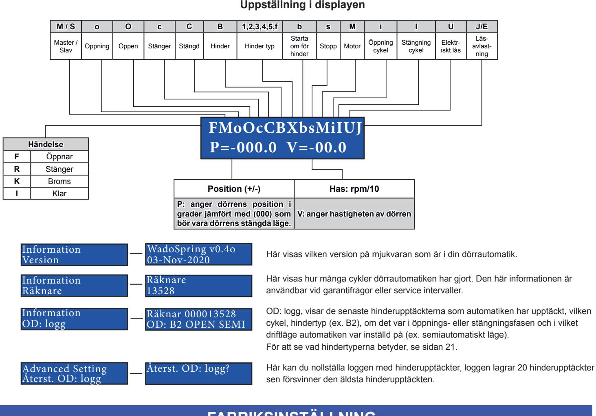

### **FABRIKSINSTÄLLNING**

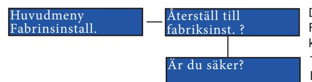

Det är det möjligt att återfå fabriksinställningarna med hjälp av undermenyn Fabriksinställningar i Huvudmenyn. Efter genomförandet av denna funktion, kommer alla parametrar återställas till standardvärde. Tryck OK för att fortsätta eller ESC för att avsluta utan någon åtgärd. Denna åtgärd går inte att ångra.

När fabriksinställningarna är utförd, kan automatiken fortfarande öppna och stänga dörren men utan att använda värderna som beräknades under Steg 4 dörrkalibrering, automatiken behåller dörrgränserna som ställdes in i steg 4, det är nödvändigt att göra en ny autokalibrering för att automatiken skall fungera ordentligt.

Alla sändare som hade lagts in i dörrautomatiken har nu raderats.

### **SYSTEMÅTERSTÄLLNING**

Det är möjligt att göra en systemåterställning, vilket motsvarar en "power off + power-on", Inställningen finns i "Huvudmenyn" under System åters. När systemet återställs gör maskinen en snabb omstart på systemet. Denna funktion ändrar inte värdet av parameter utom (I och i) som kommer att beräknas om under de kommande två cykler.

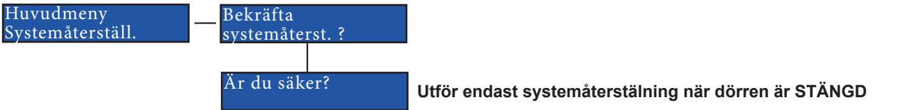

## **SERVICE MENY**

Enheten har två olika räknare : Total räknare **och Service räknare**

Total räknaren registrerar antalet cykler som automatiken har gjort, värdet på denna räknare kan ses i menyn Information : se sidan 25.

Service räknaren kan användas till att sätta service intervallen och den kan återställas efter att servicen är utförd.

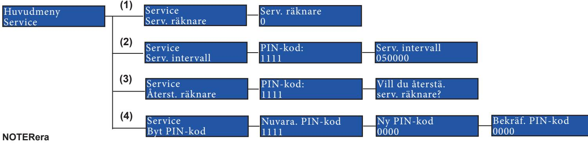

(1) : Service räknarens antal

(2) : Service intervall : är antalet cykler som automatiken skall göra innan den påkallar service : dioden blinakar sakta rött eller statusreläet växlar, detta kan du ställa in i avsnittet "Avancerade inställningar".

Om Intervall = 0 ( standardvärde ) påkallar aldrig automatiken service.

(3) : Återställ service räknaren : denna måste återställas efter service är utför och då lyser dioden grönt eller statusreläet växlar tillbaka och räknaren börjar om att räkna från noll.

#### (4) : Byt PIN-kod. **Standard PIN-kod = 1111**.

Skriv in den nuvarande PIN-koden. Skriv sedan in den nya PIN-koden och bekräfta det genom att skriva in den igen.

### *Underhåll och skötsel*

En dörrmiljö som använder en Digiway SR behöver regelbunden kontroll (efter ca. 12 månad eller 50.000 cykler) enligt följande punkter:

- 1) Kontrollera dörrens balansering och gångjärnens funktionalitet
- 2) Glidarm:
	- 2A) Kontrollera att glidskenan sitter fast ordentligt i dörrbladet och är horisontellt monterad
	- 2B) Kontrollera flytet i glidskenan
	- 2C) Kontrollera drivaxelbulten på huvudarmen
	- 2D) Kontrollera hållbarheten i länkarmen
	- 2E) Eventuell rengöring av skenan

#### 3) Tryckande arm:

- 3A) Kontrollera dörrfästet på dörren
- 3B) Kontrollera funktionen i vinkelfästet
- 3C) Kontrollera drivaxelbulten på huvudarmen
- 3D) Kontrollera hållbarheten i ledarmen och länkarmen (två M5 x 12 skruvar)
- 4) Kontrollera M6x20 skruven som håller ihop motortappen med mekaniken
- 5) Kontrollera infästningen av automatiken mot monteringsplattan och även mot väggen
- 6) Kontrollera om det finns slitage runt dörrbladet och dess foder
- 7) Kontrollera funktionerna hos kringutrustning (radar, elslutbleck eller magnet)
- 8) Vid par-/dubbeldörr med överlappande funktion, kontrollera synkroniseringen av de två dörrbladen

# *Användarinstruktioner*

#### *Om dörren fungerar ordentligt lyser ledlampan med ett FAST GRÖNT SKEN*

#### **Hur man öppnar dörren**

Enligt den kringutrustning som är installerad kan dörren öppnas av följande enheter:

- ÖPPNAKNAPP
- FJÄRRKONTROLL
- RADAR ( INTERN / EXTERN )
- MANUELLT TRYCK PÅ DÖRREN FÖR ATT ÖPPNA ELLER STÄNGA

#### **Hur man sätter dörren i automatiskt läge**

Flytta den externa driftsättaren till läge I---> Ledlampan lyser GRÖNT

#### **Hur man sätter automatiken i semiautomatiskt läge**

Flytta den externa driftsättaren till läge I---> Ledlampan lyser GRÖNT Ändras i undermenyn huvudfunktion

#### **Hur man sätter dörren i uppställt läge**

Flytta den externa driftsättaren till läge II ---> Ledlampan lyser ORANGE

#### **Hur man sätter dörren i manuellt läge**

Flytta den externa driftsättaren till läge 0 --> Ledlampan släckt

#### **Hur man förser dörren i nattläge ( när det är inkopplat )**

Flytta den externa driftsättaren till läge I ---> Ledlampan BLINKAR ORANGE

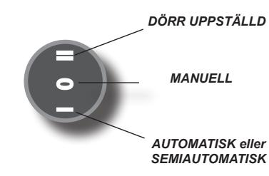

# **PARDÖRRSKONFIGURATION**

Pardörrs funktionen kan man få till med två stycken helt vanliga Digiway SR, som är ihopkopplade med sykroniseringskabel. Antingen så monterar man upp automatikerna som dom är eller så läggar man till en täckkåpa för mittenpartiet.

# *A ) Montage utan täckkåpan.*

### *A1 - Inåtgående dörrar : glidarmar*

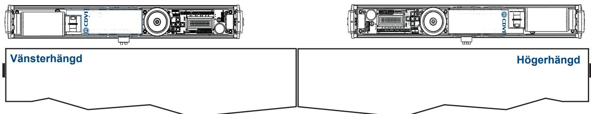

### *A2 - Utåtgående dörrar : tryckande armar*

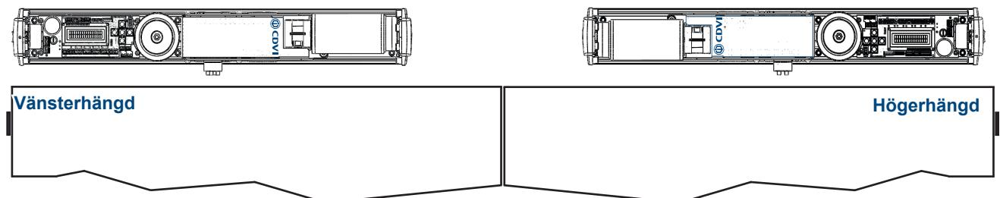

Följ måtten på sidan 10 vid montaget.

NOTERA : automatiker som är monterade på vänsterhängda dörrar och öppnar inåt samt högerhängda dörrar som öppnar utåt kräver att man vänder på automatiken, som visas på sidan 8.

### *B ) Montage med täckkåpa.*

Det finns fem olika dimensioner tillgängliga. Täckkåpan och montageplattan är inkluderat i paketen för dubbeldörr.

| Pardörr total bredd | Dörrblad bredd | p/n Glidarm  | p/n Tryckande arm |
|---------------------|----------------|--------------|-------------------|
| 1600 mm             | 70 - 80 cm     | DWSD10216SCD | DWSD10216ACD      |
| 1700 mm             | 81 - 85 cm     | DWSD10217SCD | DWSD10217ACD      |
| 1800 mm             | 86 - 90 cm     | DWSD10218SCD | DWSD10218ACD      |
| 1900 mm             | 91 - 95 cm     | DWSD10219SCD | DWSD10219ACD      |
| 2000 mm             | 96 - 100 cm    | DWSD10220SCD | DWSD10220ACD      |

#### **B1. Montageplattan**

- Mät ut den bästa platsen att montera montageplattan, plattan skall sitta centrerat över dubbeldörren;
- Markera hålen nogrannt för montageplattan;
- Borra hål och montera med pluggarna som medföljer;
- Dra strömmatningen till automatiken i centrumhålet på kåpan;
- Fixera montageplattan med skruvarna som medföljer, se till att den sitter horisentalt monterad.

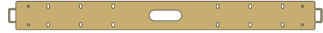

- Montera automatikernas montageplattor på var sida om centrumplattan.
- Borra åt och sätt in de räfflade pluggarna.
- Fäst montageplattorna med skruvarna som medföljer.

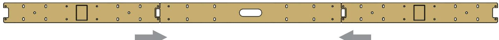

#### **B2. Centrum profilen**

Montera centrum profilen med de fyra M6x14 skruvarna som medföljer;

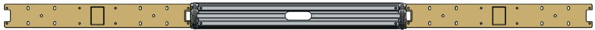

#### **B3. Montera automatiken**

Montera de två automatikerna enligt anvisning på paragraf A. inåtgående dörr eller utåtgående dörr.

#### **Utåtgående konfiguration**

- Ta bort högersidan på båda automatikerna;
- Montera den vänstra automatiken på den vänstra montageplattan;
- Vänd den högra automatiken och montera den på den högra montageplattan.
- Släpp M6 skruven för att vända på motortappen som visas på sidan. 8
- Vänd LCD displayen.
- Montera de två vridarmarna enligt anvisningarna på sidan 10

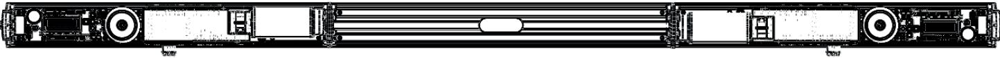

#### **Inåtgående konfiguration**

- Ta bort högersidan på båda automatikerna;
- Vänd på den vänstra automatiken och montera den på den vänstra montageplattan
- Ta bort den vänstra sidan på den högra automatiken.
- Ta bort 15cm kabel från den vänstra sidan
- Montera den högra automatiken på den högra montageplattan.
- Släpp M6 skruven för att vända på motortappen som visas på sidan. 8
- Koppla in den vita 60cm 6-ledar kabeln som medföljer.
- Vänd LCD displayen.

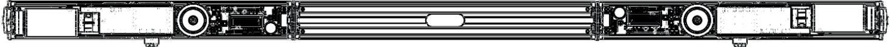

### *C ) Montera armarna*

#### **Glidarm ( Inåtgående dörr )**

- Montera båda armarna på respektive motortapp med M6x12 som medföljer;
- Sätt in glidskenan på glidblocket;
- Sätt driftsättaren i läge 0 och öppna/stäng dörren tills du hittat bästa positionen för glidskenan;
- Fäst glidskenan med de fyra skruvarna som medföljer;

#### **Vridarm ( Utåtgående dörr )**

- Montera båda armarna på respektive motortapp med M6x12 som medföljer;
- Sätt armen mot dörren, kontrollera måtten nogrannt innan du fäster armen, måtten står på sidan 10;
- Fäst plattan med de två skruvarna som medföljer.

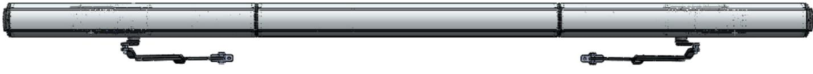

#### **Mekanisk kontroll**

- Sätt driftsättaren i läge 0 och kontrollera att båda dörrarna rör sig helt friktionsfritt under både öppning och stängning.
### *D) Dörrkordinator för strömbortfall (dörröverlapp)*

Om Digiway SR automatikerna jobbar med dörrar som överlappar varandra så är en dörrkordinator att rekommender för att säkerställa att rätt dörr stängs först i strömlöst läge. Eftersom dörrarna fortfarande kan öppnas manuellt och då stängs med fjäder så hjälper en dörrkordinator till så att slavdörren stängs först och sedan master dörren, som visas på bilden nedan. Dörrkordinatorn har produktnummer SEL-NICK

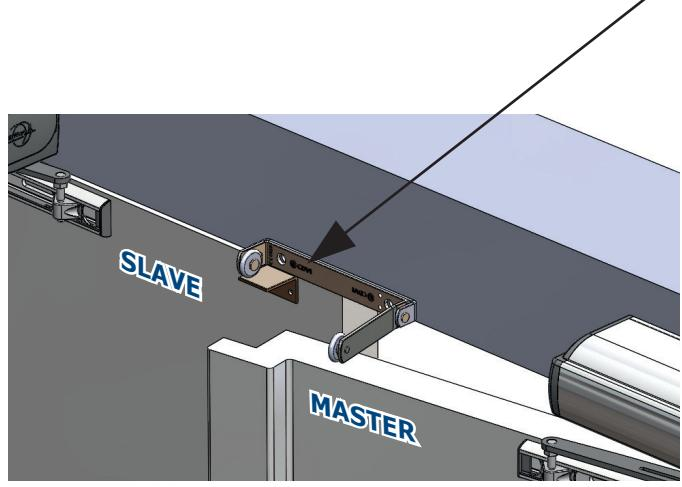

# *E) Överlappande dörrar i semiautomatiskt läge*

Om strömmen är tillkopplad och automatikerna jobbar i semiautomatiskt läge så kommer dom att stänga med fjäderkraft. Automatiken har alltid koll på de två dörrbladen så när du inte använder en dörrkordinator; justera stängningshastigheten på masterdörren med för att få en mjuk stängning utan att den stannar upp och väntar in slavdörren. Du justerar stängningshastigheten under menyn "Huvudfunktion" se sid. 20

# *F) Inkopplingar*

För kompletta Digiway SR dubbeldörrskit så ingår en synkroniseringskabel i paketet.

Det går också att göra två stycken enkeldörrsautomatiker till en dubbeldörrs automatik med hjälpa av synkroniseringskabeln DWPSC. Kabeln har två stycken special tre stiftskontakter och måste kopplas in på rätt plats. (se bilden nedan)

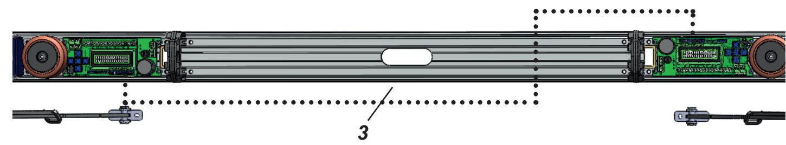

- 1 ) För resterande inkopplingar, se sidan 11-13 i den här manualen.

VARNING: Om dubbeldörren har överfalsade dörrar är det väldigt viktigt att identifiera dörrarna. **MASTER** automatiken som öppnar den här dörren skall öppna först och stänga sist. **SLAV** automatiken som öppnar den här dörren skall öppna sist och stänga först.

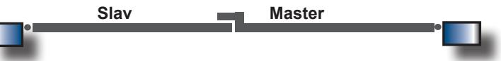

- 2 ) Koppla in eventuell RADAR och dag/natt läget på den automatiken som är vald till **MASTER.**
- 3 ) Fotocellerna kan kopplas in på två olika sätt:
- Koppla in säkerhetssensorerna till 5-6-7 på motsvarande kretskort.
- Koppla in säkerhetssensorerna från varje dörr i serie. Koppla in på 5-6-7 på MASTER enheten och brygga vidare till kontakt 5-6-7 på slavenheten.
- 4 ) Koppla in ellåset på MASTER enheten.

5 ) På SLAV enheten skall endast programmerings sändaren vara memorerad. Alla användar sändare skall vara kopplade till MASTER automatiken.

*VARNING : Memorera INTE samma programmerings sändare till båda automatikerna!*

# *Driftsättning*

Följ stegen och för att driftsätta dubbeldörrsautomatikerna. Kontrollera att allt är inkopplat och monterat korrekt innan du påbörjar driftsättningen.

1) på enheten "Slav", öppna menyn KONFIGURATION: Sätt inställningen **Pardörr Mas/Slav = Slav** Välj ( tillfälligt ) inställningen **Enkel- / Pardörr = Enkeldörr ( standard värde )**

2) på enheten "Master", öppna menyn KONFIGURATION: Sätt inställningen **Pardörr Mas/Slav = Master** Välj ( tillfälligt ) inställningen **Enkel- / Pardörr = Enkeldörr ( standard värde )**

*NOTERA: alla inkopplingar så som radar och andra enheter måste vara inkopplat på MASTER enheten.*

3) Se till att säkerhetsingångarna ( plint 5-6-7 ) på SLAV enheten antingen är byglade eller kopplade till rätt säkerhetssensor (SIS och SIO) och att LED lamporna L3 och L4 lyser med ett fast sken.

4) Se till att säkerhetsingångarna ( plint 5-6-7 ) på MASTER enheten antingen är byglade eller kopplade till rätt säkerhetssensor (SIS och SIO) och att LED lamporna L3 och L4 lyser med ett fast sken.

5) Följ stegen för DÖRRKALIBRERING på sidan 18 i den här manualen hela vägen för varje dörr. När du är klar med det så sätt båda driftsättarna i läge "0".

6) Ange LÄGES POSITIONEN i menyn Dörrkalibrering: det innebär ( i fall det finns överfals på dörrarna ) läget där man kan öppna dörrarna utan att dom krockar i varandra .

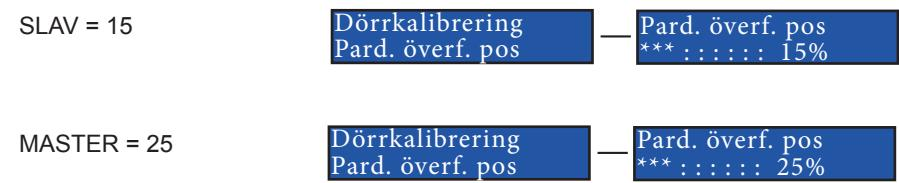

De förinställda värderna bör justeras.

7) Öppna menyn KONFIGURATION på SLAV enheten och ändra följande parametrar:

**Enkel- / Pardörr = Pardörr**

**Pardörr överfals = Aktiverad** ( om det finns överfals på dörrbladen )

8) Öppna menyn KONFIGURATION på MASTER enheten och ändra följande parametrar:

**Enkel- / Pardörr = Pardörr**

**Pardörr överfals = Aktiverad** ( om det finns överfals på dörrbladen )

9) Sätt båda driftsättarna i läge "I" ( automatisk ) se till att bokstäverna S och M visas i displayerna på båda enheterna, detta bekräftar att dom komminucerar med varandra.

### *Operating mode*

| Överlappande Dörrar |       | Ej Överlappande Dörrar                                   |        |      |                                                          |
|---------------------|-------|----------------------------------------------------------|--------|------|----------------------------------------------------------|
| Master              | Slav  | Driftläge                                                | Master | Slav | Driftläge                                                |
| 0                   | -     | Båda dörrarna är fria                                    | 0      | 0    | Båda dörrarna är fria                                    |
| II                  | I (*) | Båda dörrarna är alltid öppna                            | II     | II   | Båda dörrarna är alltid öppna                            |
|                     | I     | Båda dörrarna öppnas, först master och sedan slav     | I      | I    | Båda dörrarna öppnas samtidigt                           |
| I                   | 0     | Bara master dörren öppnas. Slav dörren förblir stängd | I      | 0    | Bara master dörren öppnas. Slav dörren förblir stängd |
|                     | II    | Inte tillåtet                                            | 0      | I    | Bara slav dörrer öppnas. Master dörren förblir stängd |

 *(*) : Sätt inte driftsättaren på SLAV dörren i läge 0 eller II, med MASTER dörren i läge II, eftersom det inte finns någon öppnings fördröjning och de två dörrbladen skulle då kunna slå i varandra.*

### **FELSÖKNING**

| Problem                                                                                                                                                                                                                                                                                                            | Orsak                                                                                                                                                                                                                                                                                                              | Lösning                                                                                                                                                                                                              |  |
|--------------------------------------------------------------------------------------------------------------------------------------------------------------------------------------------------------------------------------------------------------------------------------------------------------------------|--------------------------------------------------------------------------------------------------------------------------------------------------------------------------------------------------------------------------------------------------------------------------------------------------------------------|----------------------------------------------------------------------------------------------------------------------------------------------------------------------------------------------------------------------|--|
| Dörren stänger inte helt                                                                                                                                                                                                                                                                                           | Returfjädern är för löst spänd                                                                                                                                                                                                                                                                                     | Spänn upp returfjädern mer                                                                                                                                                                                           |  |
| LED lampan blinkar rött & dörren går sakta                                                                                                                                                                                                                                                                         | Säkerhetssensorer test misslyckades                                                                                                                                                                                                                                                                                | Kontrollera säkerhetssensorern, alternativ att testfunk tionen är avaktiverad i avancerade inställningar                                                                                                          |  |
| Dörren rör sig inte                                                                                                                                                                                                                                                                                                | C-NC säkerhetssensorer är inte slutna                                                                                                                                                                                                                                                                              | Om du inte använder dig av säkerhetssensorer, bygla kontakterna 5-6 och 6-7                                                                                                                                       |  |
| Hinder : B1                                                                                                                                                                                                                                                                                                        | Hinderupptäckt: hastigheten varierar med mer än 50%                                                                                                                                                                                                                                                                | Ta bort hindret. Om det är ett falskt hinder försök att öka det fabriksin ställda värdet för hastighet tolerans ( 50% )                                                                                        |  |
| Hinder : B2                                                                                                                                                                                                                                                                                                        | Hinderupptäckt: strömförbrukningen varierar med mer än 65%                                                                                                                                                                                                                                                      | Ta bort hindret. Om det är ett falskt hinder försök att öka det fabriksin ställda värdet för förbruknings tolerans ( 65% )                                                                                     |  |
| Hinder : B3                                                                                                                                                                                                                                                                                                        | B3 = B1 + B2                                                                                                                                                                                                                                                                                                       | se B1 och B2                                                                                                                                                                                                         |  |
| Hinder : B4                                                                                                                                                                                                                                                                                                        | Trolig hinderupptäckt som hindrar dörren från att röra sig minst 1% av rörelse banan inom 1,5 sek.                                                                                                                                                                                                              | Ta bort hindret. Ring supporten för att justera parametrarna.                                                                                                                                                     |  |
| Hinder : B5                                                                                                                                                                                                                                                                                                        | Trolig hinderupptäck som ökar strömförbrukningen med mer än 2,4A i 400 mS                                                                                                                                                                                                                                       | Ta bort hindret. Ring supporten för att justera parametrarna.                                                                                                                                                     |  |
| Hinder : B6                                                                                                                                                                                                                                                                                                        | Hinderupptäckten är möjlig i de sista 10° av stängningen eller efter 80° av öppningscykeln. Orsaken är : 1) strömförbrukningen har peakat till 97% av maxvärdet 2) hastigheten sjunker till mindre än 20°/min. Kan endast inträffa om autokalibreringen saknas (i och I visas inte i LCD displayen) | Ta bort hindret. Ring supporten för att justera parametrarna.                                                                                                                                                     |  |
| Hinder : Bf                                                                                                                                                                                                                                                                                                        | Hinder upptäckt av slavdörren under en dubbeldörrskonfiguration                                                                                                                                                                                                                                                 | Ta bort hindret.                                                                                                                                                                                                     |  |
| LED DL1 ( se sid. 14) lyser rött                                                                                                                                                                                                                                                                                   | Förhöjd strömförbrukning                                                                                                                                                                                                                                                                                           | ERROR : byt ut kretskortet                                                                                                                                                                                           |  |
| LED DL2 ( se sid. 14) lyser rött                                                                                                                                                                                                                                                                                   | Kortslutning i kretskortet                                                                                                                                                                                                                                                                                         | ERROR : byt ut kretskortet                                                                                                                                                                                           |  |
| LED DL3 ( se sid. 14) lyser rött                                                                                                                                                                                                                                                                                   | Kretskort överhettat                                                                                                                                                                                                                                                                                               | Stäng av systemet och kontrollera arbetstemperaturen. Om problemet kvarstår, byt ut kretskortet.                                                                                                                  |  |
| Stängningshastigheten är väldigt långsam i semiautomatiskt läge                                                                                                                                                                                                                                                 | Returfjädern är för löst spänd eller stängningshastigheten för låg                                                                                                                                                                                                                                              | Spänn upp fjädern eller sänk inställningen autobroms                                                                                                                                                                 |  |
| Dörren stänger sig inte även fast den inte har någon ström tillkopplad                                                                                                                                                                                                                                          | Returfjädern är trasig                                                                                                                                                                                                                                                                                             | Byt ut hela mekaniken                                                                                                                                                                                                |  |
| Medföljande handsändare fungerar inte                                                                                                                                                                                                                                                                              | Handsändaren har inte blivit memorerad. Minnet för hela radiomottagaren har blivit fabriksåterställt                                                                                                                                                                                                            | Memorera handsändaren igen                                                                                                                                                                                           |  |
| Inga handsändare fungerar                                                                                                                                                                                                                                                                                          | Handsändarna har inte blivit memorerade eller så är radiomottagaren felaktig.                                                                                                                                                                                                                                | Memorera handsändarna eller Byt ut radiomottagardelen                                                                                                                                                          |  |
| Driftsättaren fungerar inte                                                                                                                                                                                                                                                                                        | Bygel är AV ( se sid. 13 )                                                                                                                                                                                                                                                                                         | Sätt dit bygeln                                                                                                                                                                                                      |  |
| Den röda dioden blinkar sakta                                                                                                                                                                                                                                                                                      | Dags för service                                                                                                                                                                                                                                                                                                   | Ring supporten för hjälp med service                                                                                                                                                                                 |  |
| 1) Säkerhetssensorerna är trasiga 2) Ingångarna 5-6-7 har byglats men testfunktionen för säkerhetssensorerna är aktiverad. Test SIS/SIO misslyckas 3) Responstiden är inställd för kort och matchar inte säkerhetssensorernas responstid. 4) Testsignalens läge matchar inte säkerhetssensorerna |                                                                                                                                                                                                                                                                                                                    | Om responstiden är för kort, sätt in en länge responstid på parameter 30 i Avancerade inställningar. Om testsignalens läge inte matchar säkerhetssensor erna ändra parameter 33 i avancerade inställningar. |  |

|                                                                                      | Installatörsfirman: (Namnet på firman som installerade automatiken)                 |                                                                                                                                                      |  |  |  |
|--------------------------------------------------------------------------------------|-------------------------------------------------------------------------------------|------------------------------------------------------------------------------------------------------------------------------------------------------|--|--|--|
|                                                                                      |                                                                                     |                                                                                                                                                      |  |  |  |
|                                                                                      |                                                                                     |                                                                                                                                                      |  |  |  |
|                                                                                      |                                                                                     | Identifiering: (Identifiering på vilken dörr som automatiken har monterats på t.ex. lokalisering eller serienummer)                                  |  |  |  |
|                                                                                      |                                                                                     |                                                                                                                                                      |  |  |  |
|                                                                                      | Placering: (Information om byggnaden där automatiken har installerats)              |                                                                                                                                                      |  |  |  |
|                                                                                      | Adress                                                                              |                                                                                                                                                      |  |  |  |
|                                                                                      | Ägarens referens                                                                    |                                                                                                                                                      |  |  |  |
|                                                                                      | Installatören: (Information om firman och installatören)                            |                                                                                                                                                      |  |  |  |
|                                                                                      | Firma                                                                               |                                                                                                                                                      |  |  |  |
|                                                                                      | Adress                                                                              |                                                                                                                                                      |  |  |  |
|                                                                                      | Installatörens namn                                                                 |                                                                                                                                                      |  |  |  |
|                                                                                      | Installatörens signatur                                                             |                                                                                                                                                      |  |  |  |
| Installationsdatum: _______________ Identifiering och information av automatiken: |                                                                                     |                                                                                                                                                      |  |  |  |
|                                                                                      | Märke                                                                               | CDVI                                                                                                                                                 |  |  |  |
|                                                                                      | Modell                                                                              | Digiway-SR                                                                                                                                           |  |  |  |
|                                                                                      | Typ                                                                                 |                                                                                                                                                      |  |  |  |
|                                                                                      | Produktnamn                                                                         |                                                                                                                                                      |  |  |  |
|                                                                                      | Serienummer                                                                         |                                                                                                                                                      |  |  |  |
|                                                                                      | Tillverkningsdatum                                                                  |                                                                                                                                                      |  |  |  |
|                                                                                      |                                                                                     | Identifiering av säkerthetsanorningar: (Inkluderat fotoceller / säkerhetsmattor / driftläge etc.)                                                    |  |  |  |
|                                                                                      |                                                                                     |                                                                                                                                                      |  |  |  |
|                                                                                      |                                                                                     |                                                                                                                                                      |  |  |  |
|                                                                                      |                                                                                     |                                                                                                                                                      |  |  |  |
|                                                                                      | Installations manual : _________________________________                            |                                                                                                                                                      |  |  |  |
|                                                                                      | vanligaste mekaniska farorna. Fler faror finns i delen Annex L av Standard EN16005. | NOTERA: en installation utförd på en slagdörr skall ha omfattats av en riskanalys för att minimera faror med installationen. Se nedan en lista av de |  |  |  |

cdvi.se cdvigroup.com

| FARA | BESKRIVNING  | INSTALLATIONS NOTERING OCH/ELLER ÅTERGÄRD FÖR ATT MINSKA RISKEN |
|------|--------------|-----------------------------------------------------------------|
|      | Krock        |                                                                 |
|      | Kross        |                                                                 |
|      | Skärande     |                                                                 |
|      | Klyvande     |                                                                 |
|      | Klämrisk     |                                                                 |
|      | Vassa kanter |                                                                 |
|      | Hakrisk      |                                                                 |

#### *Service*

| Datum:                  |            | Ansvariges namn: |
|-------------------------|------------|------------------|
| Underhåll Reparation | [ ] [ ] | Beskrivning      |
| Uppgradering            | [ ]        |                  |
| Övrigt                  | [ ]        |                  |
| Signatur                |            |                  |

| Datum:       |     | Ansvariges namn: |
|--------------|-----|------------------|
| Underhåll    | [ ] | Beskrivning      |
| Reparation   | [ ] |                  |
| Uppgradering | [ ] |                  |
| Övrigt       | [ ] |                  |
| Signatur     |     |                  |

| Datum:                  |            | Ansvariges namn: |  |
|-------------------------|------------|------------------|--|
| Underhåll Reparation | [ ] [ ] | Beskrivning      |  |
| Uppgradering            | [ ]        |                  |  |
| Övrigt                  | [ ]        |                  |  |
| Signatur                |            | cdvi.se          |  |

cdvigroup.com

**CDVI Group** FRANCE (Headquarters) Phone: +33 (0) 1 48 91 01 02

**CDVI FRANCE + EXPORT** +33 (0) 1 48 91 01 02 www.cdvi.com

**CDVI AMERICAS [CANADA - USA]** +1 (450) 682 7945 www.cdvi.ca

#### **CDVI BENELUX [BELGIUM - NETHERLANDS - LUXEMBOURG]**

+32 (0) 56 73 93 00 www.cdvibenelux.com

#### **CDVI GERMANY**

+49 (0) 175 2932 901 www.cdvi.de

#### **CDVI TAIWAN** +886 (0) 42471 2188

www.cdvichina.cn

#### **CDVI SUISSE**

+41 (0) 21 882 18 41 www.cdvi.ch

#### **CDVI CHINA**

+86 (0) 10 84606132/82 www.cdvichina.cn

### **CDVI IBÉRICA [SPAIN - PORTUGAL]**

+34 (0) 935 390 966 www.cdviberica.com

### **CDVI ITALIA**

+39 (0) 321 90 573 www.cdvi.it

#### **CDVI WIRELESS**

+39 (0) 438 450860 www.erone.com

#### **CDVI MAROC**

+212 (0) 5 22 48 09 40 www.cdvi.ma

#### **CDVI NORDICS [SWEDEN - DENMARK - NORWAY - FINLAND]** +46 (0) 31 760 19 30

www.cdvi.se

#### **CDVI UK [UNITED KINGDOM - IRELAND]** +44 (0) 1628 531300

www.cdvi.co.uk

#### **CDVI POLSKA**

+48 (0) 12 659 23 44 www.cdvi.com.pl

*All the information contained within this document (pictures, drawings, features, specifications and dimensions)could be perceptibly different and can be changed without prior notice.*