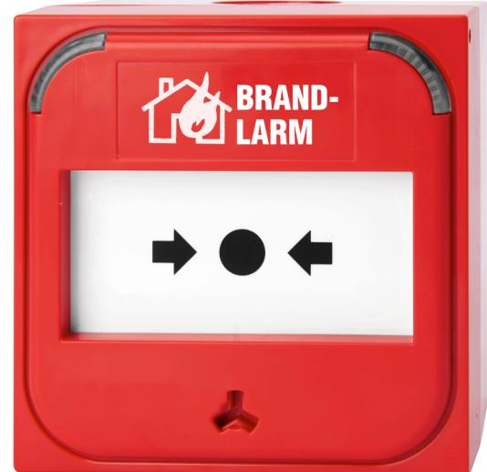
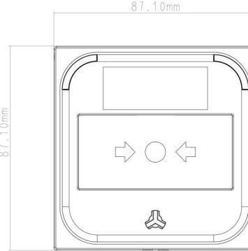

# DM3010RS06

#### **3000 Series intelligent addressable manual call point**

#### **General**

The DM3000 Series is an intelligent range of addressable manual call points. The DM3010RS06 is a red, single action indoor MCP with a House-on-Fire and "BRAND-LARM" functional indication. It is delivered complete with resettable element, test connector and test key. Multiple optional accessories are available to facilitate most indoor installation requirements.

#### **Aesthetics**

This single action MCP is a standard profile, indoor MCP suitable for surface and recess mount installations using standard or legacy European electrical boxes. With its designer dual, tricolour LEDs it offers 180°, clear local indication of its operational status, even from a side view in a passage installation. The clean face of the MCP is further enhanced by a front access & test key facility.

#### **Installation & maintenance friendly**

The front facing access for an aesthetically matching test key allows unhindered access regardless of the installation location. The MCP key doubles as a test and disassembly tool allowing removal of the MCP front cover without the need for additional tools.

#### **Compatibility**

The DM3000 range may be used on compatible Aritech fire systems. They can in many cases be deployed into existing systems without CIE configuration changes.

#### **Details**

- Reliable single action manual call point for recess or surface mounting
- Dual, tri-colour status indicators offers 180° alarm visibility
- Tamper resistant design with resettable or frangible element
- Unobtrusive front facing test facility
- Standard mounting options facilitates easy retrofitting to existing installations
- Back box with rear, top and bottom cable entry
- Screen connection terminal in the back box for electrically noisy installations
- Pluggable connector with link through facility for ease of installation and pre-commissioning testing
- An alarm flag on the face of the manual call point allows alarm indication even without alarm LEDs
- Fast, no-tools-required maintenance using the test key
- Up to 128 devices supported per loop

## DM3010RS06

**3000 Series intelligent addressable manual call point**

### **Technical specifications**

| General               |                                      |  |  |
|-----------------------|--------------------------------------|--|--|
| Status indication     | Dual LEDs, Alarm (red constant),     |  |  |
|                       | Isolated (yellow constant),          |  |  |
|                       | Fault (yellow blinking),             |  |  |
|                       | Communication (green blinking)       |  |  |
| User interface        | LEDs, Alarm Flag                     |  |  |
| Compatibility         | Aritech fire systems                 |  |  |
| Connectivity          | 2-wire loop                          |  |  |
| Addressing method     | DIP Switches                         |  |  |
| Electrical            |                                      |  |  |
| Power supply type     | Loop powered                         |  |  |
| Operating voltage     | 17 to 38 VDC                         |  |  |
| Current consumption   | 180 μA (Quiescent) 2.8 mA (Alarm) |  |  |
|                       |                                      |  |  |
| Cable specification   | 0.404 to 2.05 mm                     |  |  |
| No. of cable cores    | 2                                    |  |  |
| Terminals             | 4 (A+/A-;B+/B-)                      |  |  |
| Detection             |                                      |  |  |
| Detection principle   | Push button/switch                   |  |  |
| Monitoring            | Activated, Fault, Off                |  |  |
| Response time         | < 3 s                                |  |  |
| Installation height   | Determined by local regulation       |  |  |
| Physical              |                                      |  |  |
| Physical dimensions   | 87 x 87 x 26 mm (w/o back box)       |  |  |
|                       | 87 x 87 x 57 mm (w/ back box)        |  |  |
| Net weight            | 110 g (w/o back box)                 |  |  |
|                       | 170 g (w/ back box)                  |  |  |
| Colour                | Red (RAL 3028)                       |  |  |
| Mounting type         | Back box, Recessed mount, Wall mount |  |  |
| Material (body)       | Flame retardent ABS                  |  |  |
| Functional marking    | House on Fire, BRAND-LARM            |  |  |
| Environmental         |                                      |  |  |
| Vandal proof          | No                                   |  |  |
| Operating temperature | −25 to +72°C                         |  |  |
| Storage temperature   | −25 to +72°C                         |  |  |
| Relative humidity     | 10 to 95% noncondensing              |  |  |
| Miljö                 | Indoor                               |  |  |
| IP rating             | IP41                                 |  |  |
| Regulatory            |                                      |  |  |

| Compliancy | CE, REACH, RoHS 3, WEEE |
|------------|-------------------------|
| Intygande  | CPR                     |
| Intygande  | APPLUS                  |
| Standards  | EN54:11                 |
|            |                         |

[Powered by TCPDF (www.tcpdf.org)](http://www.tcpdf.org)

Carrier Fire & Security förbehåller sig rätten att ändra produktspecifikationer utan föregående meddelande. För de senaste produktspecifikationerna, besök se.firesecurityproducts.com online eller kontakta din försäljningsrepresentant.