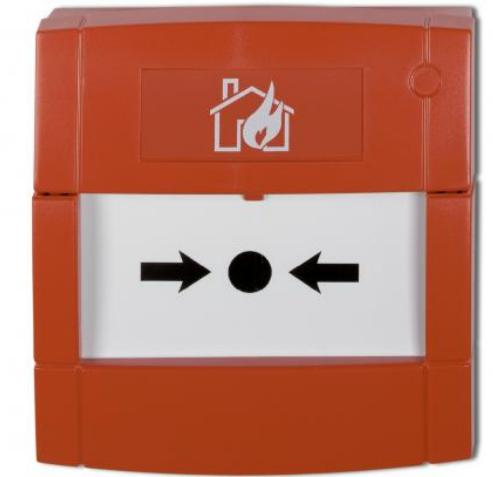

# DMN700R06-KIT

Produktblad

Installationsvänlig manuell brandlarmknapp

## DMN700R06-KIT

DMN700R är en enhet för manuell aktivering av brandlarm. Den är försedd med ett skyddslock och ett glas som krossas för aktivering. DMN700R är avsedd att användas tillsammans med UTC Fire & Securitys konventionella brandlarmsystem. DMN700R uppfyller kraven enligt EN54 och SBF1411:1 och är intygad av SBSC.

### Säker funktion

Brandlarmknappen är försedd med ett transparent skyddslock som förhindrar oavsilktlig aktivering. Då glaselementet krossas påverkas en mikroswitch och brandlarm utlöses. Glaset är försett med en skyddsfilm som förhindrar personskada. För återställning måste glaselementet bytas ut.

#### Testfunktion

För enkel kontroll av funktionen medlevereras en testnyckel.

### Montering

För enkel och snabb installation ''plug and play'' finns en jackbar plint, med två möjliga anslutningar, med eller utan larmmotstånd (560 ohm), för att underlätta installationen. DMN700R06-KIT levereras komplett med skyddslock, bakstycke, glaselement och testnyckel.

#### Fler utföranden

DMN700E är avsedd för utomhusmontage och uppfyller skydssklass IP67.

#### Standardprestanda

- EGodkänd
- ESäker funktion
- E Testfunktion
- EFler utföranden
- ELättinstallerad (Plug and Play)

# DMN700R06-KIT

Installationsvänlig manuell brandlarmknapp

# Tekniska data

| Material – standard | Noryl SE 1000      |
|---------------------|--------------------|
| Max resistiv last   | 2 A                |
| Seriemotstånd       | 560 Ohm            |
| Färg                | Röd - RAL nr. 3020 |
| Miljökrav           | -10° till +55 °C   |
| Skyddsklass         | IP24D              |

Order data

Artikelnummer Beskrivning

DMN700R06-KIT Installationsvänlig manuell brandlarmknapp

