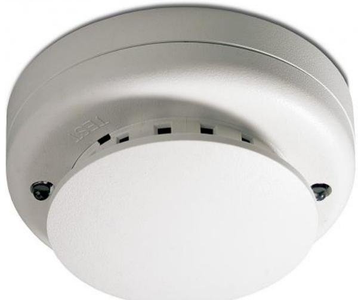

## DP2061N

Produktblad

Analog adresserbar rökdetektor med utgång för parallellind.

### Generellt

DP2061N är en 2000-serie adresserbar optisk detektor, avsedd för anslutning till Aritech FP1264/FP2000 och 2X-seriens brandcentraler. Detektorn har utbytbar rökkammare. Individuell adressering sker enkelt med hjälp av två roterande omkopplare på detektorn. Detektorn har utgång för parallellindikering.

#### Säker kommunikation

Kommunikation mellan detektor och centralapparat sker via ett driftsäker kodat protokoll. Förutom snabb kommunikation är protokollet stabilt och störokänsligt.

#### Standardprestanda

- ESäker kommunikation
- E Unik mätkammare
- EServicevänlig

- EEN54:7-godkänd och CPR-certifierad
# DP2061N

Analog adresserbar rökdetektor med utgång för parallellind.

## Tekniska data

| Drivspänning                   | 17 - 28 V DC                            |
|--------------------------------|-----------------------------------------|
| Strömförbrukning               |                                         |
| I vila vid 24 V                | <150mA                                  |
| Vid larm vid 24 V              | Lysdiod: 2 mA, 7-segments display: 2 mA |
| Larmindikering                 | Vit lysdiod (röd vid larm)              |
| Utgång för parallellindikering | 4 mA                                    |
| Luftfuktighet                  | 0 - 95%, icke kondenserande             |
| IP-klass                       | IP 43                                   |
| Mått                           | Ø 10 cm, H = 5 cm                       |

Order data

| Artikelnummer | Beskrivning                                                 |
|---------------|-------------------------------------------------------------|
| DP2061N       | Analog adresserbar rökdetektor med utgång för parallellind. |

