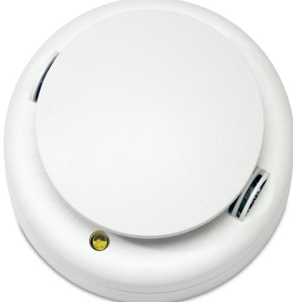
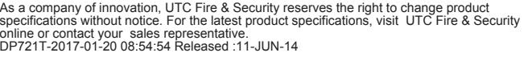

### Product Data Sheet

## DP721T

700 Series Conventional Multi Detector w/ Remote Indicator Output

#### Preventing false alarms with self diagnostics

All Aritech 700 series smoke detectors continuously monitor their sensitivity and operational status. Background drift is daily compensated to maintain the original calibrated sensitivity within the required limits.

Once a day the detector performs a full diagnostic test that includes dynamically testing the sensing chamber and internal electronics. If a detector drifts out of sensitivity range or fails the internal diagnostics test, this is reported back to the panel and indicated on the detector with a yellow fault LED.

#### Maintenance friendly sensitivity level test mode

The 700 Series photoelectric detectors include a sensitivity test mode that may be activated by simply holding a magnet near the detector's test point. This initiates a self-diagnostic routine and provides visual indication if service is required. This test mode allows field sensitivity testing without the requirement for external meters or test gas.

#### Field cleaning and service

The photoelectric sensing chamber unclips from the detector for easy field cleaning and service. During regular maintenance the detector cover can be removed, the optical chamber removed and replaced by a low cost, new chamber. On power up the detector auto-calibrates and returns to normal operating mode without any further intervention.

#### The right detector for the right job

For a truly fast and broad-spectrum detection the DP721RTA offers both optical and heat sensors. The interaction of both the smoke and heat algorithms ensure a quick response to both flaming and smouldering fires.

All bases are provided with an integral locking tab for extra security if required. Bases are equipped with a shorting bar between IN and OUT that opens when the head is installed and that may be manually restored when removing the head. This simplifies cable continuity testing.

#### Note:

The DP721RTA must not be used in applications requiring compliance with commercial or residential fire standards such as EN54-5/EN54-7/EN54-29/CEA4021/EN14604. Always ensure compliance with local codes and standards.

#### Standard Features

- EAutomatic self diagnostics: Dynamic full detector and sensitivity test
- E Manual self diagnostic with visual sensitivity indication
- E Field sensitivity testing without external meters
- EField exchangeable and disposable optical chamber
- EHigh false alarm immunity
- EFloating background with drift compensation
- ESeparate fire and fault LED
- E12 - 24 VDC operation
- EPolarity insensitive
- E Full range: optical, heat and optical/heat multi criteria sensor
- EEN54 approved and CPR certified

# DP721T

700 Series Conventional Multi Detector w/ Remote Indicator Output

### Specifications

| Operating voltage     | 8.5 - 33 VDC                |
|-----------------------|-----------------------------|
|                       |                             |
| Current consumption   |                             |
| Quiescent at 24 VDC   | 100 µA max.                 |
| In alarm at 24 VDC    | 60 mA                       |
| Alarm indication      | White LED (red alarm)       |
| Fault indication      | Yellow LED                  |
| Remote alarm output   | 30 mA                       |
| Relay models          | 2 A @ 30 VDC, 1 A @ 120 VAC |
| Humidity              | 0 - 95%, Non-condensing     |
| IP rating             | IP43                        |
| Operating temperature | -10°C to 60°C               |
| Sensitivity           | 10%/m (+1.6%, -3.3%)        |
| Heat specification    |                             |
| Ambient               | 25°C                        |
| R.O.R.                | NA                          |
| Fixed temp            | >40°C                       |
| Reset voltage         | 2.5 V max                   |
| Reset time            | 1 s                         |
| Dimensions            | 10 cm Ø, H = 5 cm           |

#### Ordering Information

| Part No. | Description                                                                |
|----------|----------------------------------------------------------------------------|
| DP721T   | 700 Series Conventional Multi Detector w/ Remote Indicator Output       |
|          |                                                                            |
| DB702    | 10 cm diameter base - 6 terminals                                          |
| DB702U   | 15 cm diameter base - 6 terminals                                          |
|          |                                                                            |
| AI672    | Optical Remote Indicator                                                   |
| AI673    | Optical and Accustical Remote Indicator                                    |
|          |                                                                            |
| 211      | Optical Replacement Chamber for 400, 500, 700 and 2000 Series Detectors |

