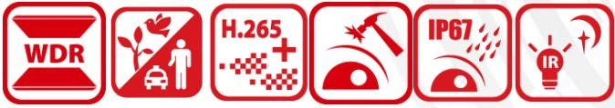
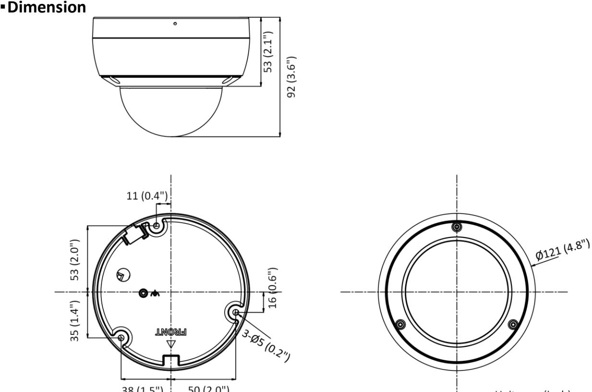

**DS-2CD2146G2-I(SU) 4 MP AcuSense Powered-by-DarkFighter Fixed Dome Network Camera**

Empowered by deep learning algorithms, Hikvision AcuSense technology brings human and vehicle targets classification alarms to front- and back-end devices. The system focuses on human and vehicle targets, vastly improving alarm efficiency and effectiveness.

- High quality imaging with 4 MP resolution
- Excellent low-light performance with powered-by-DarkFighter technology
- Clear imaging against strong backlight due to 120 dB true WDR technology
- Efficient H.265+ compression technology
- Focusing on human and vehicle targets classification based on deep learning
- Built-in microphone for real-time auto security(-SU)
- Water and dust resistant (IP67) and vandal-resistant (IK10)

## **Specification**

| Camera                 |                                                                  |  |  |  |  |  |
|------------------------|------------------------------------------------------------------|--|--|--|--|--|
| Image Sensor           | 1/3" Progressive Scan CMOS                                       |  |  |  |  |  |
| Min. Illumination      | Color: 0.003 Lux @ (F1.4, AGC ON)                                |  |  |  |  |  |
| Shutter Speed          | 1/3 s to 1/100,000 s                                             |  |  |  |  |  |
| Day & Night            | ICR Cut                                                          |  |  |  |  |  |
| Angle Adjustment       | Pan: 0° to 355°, tilt: 0° to 75°, rotate: 0° to 355°             |  |  |  |  |  |
| Slow Shutter           | Yes                                                              |  |  |  |  |  |
| P/N                    | P/N                                                              |  |  |  |  |  |
| Wide Dynamic Range     | 120 dB                                                           |  |  |  |  |  |
| Lens                   |                                                                  |  |  |  |  |  |
|                        | 2.8 mm, horizontal FOV 103°, vertical FOV 55°, diagonal FOV 123° |  |  |  |  |  |
| Focal Length & FOV     | 4 mm, horizontal FOV 83°, vertical FOV 45°, diagonal FOV 98°     |  |  |  |  |  |
|                        | 6 mm, horizontal FOV 53°, vertical FOV 28°, diagonal FOV 62°     |  |  |  |  |  |
| Aperture               | F1.4                                                             |  |  |  |  |  |
| Lens Mount             | M12                                                              |  |  |  |  |  |
| Iris Type              | Fixed                                                            |  |  |  |  |  |
| DORI                   |                                                                  |  |  |  |  |  |
|                        | 2.8 mm: D: 60.0 m, O: 23.8 m, R: 12.0 m, I: 6.0 m                |  |  |  |  |  |
| DORI                   | 4 mm: D: 80.0 m, O: 31.7 m, R: 16.0 m, I: 8.0 m                  |  |  |  |  |  |
|                        | 6 mm: D: 120.0 m, O: 47.6 m, R: 24.0 m, I: 12.0 m                |  |  |  |  |  |
| Illuminator            |                                                                  |  |  |  |  |  |
| IR Range               | Up to 30 m                                                       |  |  |  |  |  |
| IR Wavelength          | 850 nm                                                           |  |  |  |  |  |
| Smart Supplement Light | Yes                                                              |  |  |  |  |  |
| Supplement Light Type  | IR                                                               |  |  |  |  |  |
| Video                  |                                                                  |  |  |  |  |  |
| Max. Resolution        | 2688 x 1520                                                      |  |  |  |  |  |
| Main Stream            | 50 Hz: 25 fps (2688 × 1520, 1920 × 1080, 1280 × 720)             |  |  |  |  |  |
|                        | 60 Hz: 30 fps (2688 × 1520, 1920 × 1080, 1280 × 720)             |  |  |  |  |  |
| Sub-Stream             | 50 Hz: 25 fps (640 × 480, 640 × 360)                             |  |  |  |  |  |
|                        | 60 Hz: 30 fps (640 × 480, 640 × 360)                             |  |  |  |  |  |
| Third Stream           | 50 Hz: 10 fps (1920 × 1080, 1280 × 720, 640 × 480, 640 × 360)    |  |  |  |  |  |
|                        | 60 Hz: 10 fps (1920 × 1080, 1280 × 720, 640 × 480, 640 × 360)    |  |  |  |  |  |
|                        | *Third stream is supported under certain settings.               |  |  |  |  |  |
| Video Compression      | Main Stream: H.265/H.264/H.265+/H.264+                           |  |  |  |  |  |
|                        | Sub-Stream: H.265/H.264/MJPEG                                    |  |  |  |  |  |
|                        | Third Stream: H.265/H.264                                        |  |  |  |  |  |
|                        | *Third stream is supported under certain settings.               |  |  |  |  |  |
| Video Bit Rate         | 32 Kbps to 8 Mbps                                                |  |  |  |  |  |
| H.264 Type             | Baseline Profile/Main Profile/High Profile                       |  |  |  |  |  |
| H.265 Type             | Main Profile                                                     |  |  |  |  |  |
| H.264+                 | Main Stream supports                                             |  |  |  |  |  |
| H.265+                 | Main Stream supports                                             |  |  |  |  |  |

| Bit Rate Control            | CBR/VBR                                                                               |  |  |  |
|-----------------------------|---------------------------------------------------------------------------------------|--|--|--|
| Scalable Video Coding (SVC) | H.265 and H.264 support                                                               |  |  |  |
| Region of Interest (ROI)    | 1 fixed region for main stream and sub-stream                                         |  |  |  |
| Audio                       |                                                                                       |  |  |  |
| Environment Noise Filtering | -S: Yes                                                                               |  |  |  |
| Audio Sampling Rate         | -S: 8 kHz/16 kHz/32 kHz/44.1 kHz/48 kHz                                               |  |  |  |
| Audio Compression           | -S: G.711ulaw/G.711alaw/G.722.1/G.726/MP2L2/PCM/MP3/AAC                               |  |  |  |
|                             | -S: 64 Kbps (G.711ulaw/G.711alaw)/16 Kbps (G.722.1)/16 Kbps (G.726)/32 to 192 Kbps    |  |  |  |
| Audio Bit Rate              | (MP2L2)/8 to 320 Kbps (MP3)/16 to 64 Kbps (AAC)                                       |  |  |  |
| Network                     |                                                                                       |  |  |  |
| Simultaneous Live View      | Up to 6 channels                                                                      |  |  |  |
| API                         | Open Network Video Interface (PROFILE S, PROFILE G, PROFILE T), ISAPI, SDK            |  |  |  |
|                             | TCP/IP, ICMP, HTTP, HTTPS, FTP, DHCP, DNS, DDNS, RTP, RTSP, NTP, UPnP, SMTP,          |  |  |  |
| Protocols                   | IGMP, 802.1X, QoS, IPv4, IPv6, UDP, Bonjour, SSL/TLS, PPPoE, SNMP, ARP                |  |  |  |
| User/Host                   | Up to 32 users. 3 user levels: administrator, operator and user                       |  |  |  |
|                             | Password protection, complicated password, HTTPS encryption, IP address filter,       |  |  |  |
| Security                    | Security Audit Log, basic and digest authentication for HTTP/HTTPS, TLS 1.1/1.2, WSSE |  |  |  |
|                             | and digest authentication for Open Network Video Interface                            |  |  |  |
|                             | MicroSD/SDHC/SDXC card (256 GB) local storage, and NAS (NFS, SMB/CIFS), auto          |  |  |  |
|                             | network replenishment (ANR)                                                           |  |  |  |
| Network Storage             | Together with high-end Hikvision memory card, memory card encryption and health       |  |  |  |
|                             | detection are supported                                                               |  |  |  |
| Client                      | iVMS-4200, Hik-Connect, Hik-Central                                                   |  |  |  |
|                             | Plug-in required live view: IE 10+                                                    |  |  |  |
| Web Browser                 | Plug-in free live view: Chrome 57.0+, Firefox 52.0+                                   |  |  |  |
|                             | Local service: Chrome 57.0+, Firefox 52.0+                                            |  |  |  |
| Image                       |                                                                                       |  |  |  |
| SNR                         | ≥ 52 dB                                                                               |  |  |  |
| Day/Night Switch            | Day, Night, Auto, Schedule                                                            |  |  |  |
| Image Enhancement           | BLC, HLC, 3D DNR                                                                      |  |  |  |
| Image Parameters Switch     | Yes                                                                                   |  |  |  |
|                             | Rotate mode, saturation, brightness, contrast, sharpness, gain, white balance         |  |  |  |
| Image Settings              | adjustable by client software or web browser                                          |  |  |  |
| Interface                   |                                                                                       |  |  |  |
| Alarm                       | -S: 1 input, 1 output (max. 12 VDC, 30 mA)                                            |  |  |  |
| Audio                       | -S: 1 input (line in), two-core terminal block, max. input amplitude: 3.3 Vpp, input  |  |  |  |
|                             | impedance: 4.7 KΩ, interface type: non-equilibrium;                                   |  |  |  |
|                             | 1 output (line out), two-core terminal block, max. output amplitude: 3.3 Vpp, output  |  |  |  |
|                             | impedance: 100 Ω, interface type: non-equilibrium                                     |  |  |  |
| Built-in Microphone         | -U: Yes                                                                               |  |  |  |
| On-Board Storage            | Built-in memory card slot, support microSD/SDHC/SDXC card, up to 256 GB               |  |  |  |
| Hardware Reset              | Yes                                                                                   |  |  |  |
| Ethernet Interface          | 1 RJ45 10 M/100 M self-adaptive Ethernet port                                         |  |  |  |

| Event                               |                                                                                                                                                                                                                                                                                                                                                                  |  |  |  |  |
|-------------------------------------|------------------------------------------------------------------------------------------------------------------------------------------------------------------------------------------------------------------------------------------------------------------------------------------------------------------------------------------------------------------|--|--|--|--|
| Basic Event                         | Motion detection (human and vehicle targets classification), video tampering alarm, exception                                                                                                                                                                                                                                                                 |  |  |  |  |
| Smart Event                         | Scene change detection                                                                                                                                                                                                                                                                                                                                           |  |  |  |  |
| Deep Learning Function              |                                                                                                                                                                                                                                                                                                                                                                  |  |  |  |  |
| Face Capture                        | Yes                                                                                                                                                                                                                                                                                                                                                              |  |  |  |  |
| Perimeter Protection                | Line crossing detection, intrusion detection, region entrance detection, region exiting detection                                                                                                                                                                                                                                                             |  |  |  |  |
| General                             |                                                                                                                                                                                                                                                                                                                                                                  |  |  |  |  |
| Storage Conditions                  | -30 °C to 60 °C (-22 °F to 140 °F). Humidity 95% or less (non-condensing)                                                                                                                                                                                                                                                                                        |  |  |  |  |
| Startup and Operating Conditions | -30 °C to 60 °C (-22 °F to 140 °F). Humidity 95% or less (non-condensing)                                                                                                                                                                                                                                                                                        |  |  |  |  |
| Power Supply                        | 12 VDC ± 25%, reverse polarity protection PoE: 802.3af, class 3                                                                                                                                                                                                                                                                                               |  |  |  |  |
| Power Consumption and Current       | 12 VDC: 0.4 A, Max: 5 W PoE: (802.3af, 36 V-57 V), 0.20 A to 0.15 A, Max: 6.5 W                                                                                                                                                                                                                                                                               |  |  |  |  |
| Power Interface                     | Ø 5.5 mm coaxial power plug                                                                                                                                                                                                                                                                                                                                      |  |  |  |  |
| Camera Material                     | Metal upper cover and base                                                                                                                                                                                                                                                                                                                                       |  |  |  |  |
| Camera Dimension                    | Ø 121 × 92 mm (4.8" × 3.6")                                                                                                                                                                                                                                                                                                                                      |  |  |  |  |
| Package Dimension                   | 150 × 150 × 141 mm (5.9" × 5.9" × 5.6")                                                                                                                                                                                                                                                                                                                          |  |  |  |  |
| Camera Weight                       | Approx. 580 g (1.3 lb.)                                                                                                                                                                                                                                                                                                                                          |  |  |  |  |
| With Package Weight                 | Approx. 820 g (1.8 lb.)                                                                                                                                                                                                                                                                                                                                          |  |  |  |  |
| Linkage Method                      | Upload to NAS/memory card/FTP, notify surveillance center, trigger record, trigger capture, send email, audible warning                                                                                                                                                                                                                                       |  |  |  |  |
| Web Client Language                 | 33 languages English, Russian, Estonian, Bulgarian, Hungarian, Greek, German, Italian, Czech, Slovak, French, Polish, Dutch, Portuguese, Spanish, Romanian, Danish, Swedish, Norwegian, Finnish, Croatian, Slovenian, Serbian, Turkish, Korean, Traditional Chinese, Thai, Vietnamese, Japanese, Latvian, Lithuanian, Portuguese (Brazil), Ukrainian |  |  |  |  |
| General Function                    | Anti-flicker, heartbeat, mirror, privacy masks, flash log, password reset via email, pixel counter                                                                                                                                                                                                                                                            |  |  |  |  |
| Software Reset                      | Yes                                                                                                                                                                                                                                                                                                                                                              |  |  |  |  |
| Firmware Version                    | V5.5.111                                                                                                                                                                                                                                                                                                                                                         |  |  |  |  |
| Approval                            |                                                                                                                                                                                                                                                                                                                                                                  |  |  |  |  |
| EMC                                 | FCC (47 CFR Part 15, Subpart B); CE-EMC (EN 55032: 2015, EN 61000-3-2: 2014, EN 61000-3-3: 2013, EN 50130-4: 2011 +A1: 2014); RCM (AS/NZS CISPR 32: 2015); KC (KN 32: 2015, KN 35: 2015)                                                                                                                                                                   |  |  |  |  |
| Safety                              | UL (UL 60950-1); CB (IEC 60950-1:2005 + Am 1:2009 + Am 2:2013); CE-LVD (EN 60950-1:2005 + Am 1:2009 + Am 2:2013); LOA (IEC/EN 60950-1)                                                                                                                                                                                                                  |  |  |  |  |
| Environment                         | CE-RoHS (2011/65/EU); WEEE (2012/19/EU); Reach (Regulation (EC) No 1907/2006)                                                                                                                                                                                                                                                                                    |  |  |  |  |
| Protection                          | IP67 (IEC 60529-2013), IK10 (IEC 62262:2002)                                                                                                                                                                                                                                                                                                                     |  |  |  |  |

# **Available Model**

DS-2CD2146G2-I (2.8/4/6 mm) DS-2CD2146G2-ISU (2.8/4/6 mm)

## · Accessory

### ▪Optional

| DS-1276ZJ-SUS  | DS-1272ZJ-120 | DS-1275ZJ-SUS       | DS-1271ZJ-120 | DS-1280ZJ-DM46 |
|----------------|---------------|---------------------|---------------|----------------|
| Corner Mount   | Wall Mount    | Vertical Pole Mount | Pendant Mount | Junction Box   |
|                |               |                     |               |                |
| DS-1272ZJ-120B | DS-1253ZJ-M   |                     |               |                |
| Wall Mount     | Rain Shade    |                     |               |                |
|                |               |                     |               |                |

Distributed by

HIKVISION®

#### Headquarters

-

No.555 Qianmo Road, Binjiang District, Hangzhou 310051, China T +86-571-8807-5998 overseasbusiness@hikvision.com

Hikvision USA T +1-909-895-0400 sales.usa@hikvision.com

Hikvision Australia T +61-2-8599-4233 salesau@hikvision.com

Hikvision India T +91-22-28469900 sales@pramahikvision.com

Hikvision Canada T +1-866-200-6690 sales.canada(@hikvision.com

Hikvision Thailand T +662-275-9949 sales.thailand@hikvision.com Hikvision Europe T +31-23-5542770 sales.eu@hikvision.com

Hikvision Italy T +39-0438-6902 info.it@hikvision.com

Hikvision Brazil T +55 11 3318-0050 Latam.support@hikvision.com

Hikvision Turkey T +90 (216)521 7070- 7074 sales.tr@hikvision.com

Hikvision Malaysia T +601-7652-2413 sales.my@hikvision.com Hikvision UK & Ireland T +01628-902140 sales.uk@hikvision.com

Hikvision South Africa Tel: +27 (10) 0351172 sale.africa@hikvision.com

Hikvision France
T +33(0)1-85-330-450 info.fr@hikvision.com

Hikvision Kazakhstan T +7-727-9730667 nikia.panfilov@hikvision.ru

Hikvision Vietnam T +84-974270888 sales.vt@hikvision.com Hikvision UAE T +971-4-4432090 salesme@hikvision.com

Hikvision Singapore T +65-6684-4718 sg@hikvision.com

Hikvision Spain T +34-91-737-16-55 info.es@hikvision.com

Hikvision Tashkent T +99-87-1238-9438 uzb@hikvision.ru

Hikvision Hong Kong T +852-2151-1761 info.hk@hikvision.com Hikvision Russia
T +7-495-669-67-99 saleru@hikvision.com

Hikvision Korea T +82-(0)31-731-8817

sales.korea@hikvision.com Hikvision Poland T +48-22-460-01-50

info.pl@hikvision.com

Hikvision Indonesia T +62-21-2933759 Sales.Indonesia@hikvision.com

Hikvision Colombia sales.colombia@hikvision.com

© Hikvision Digital Technology Co., Ltd. 2020 | Data subject to change without notice |