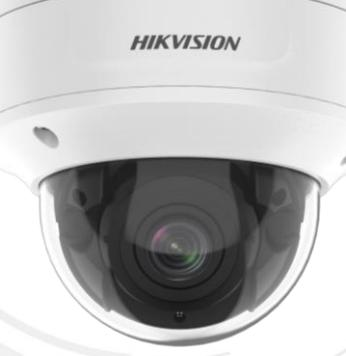
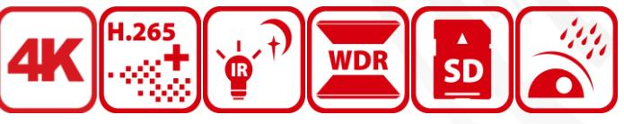
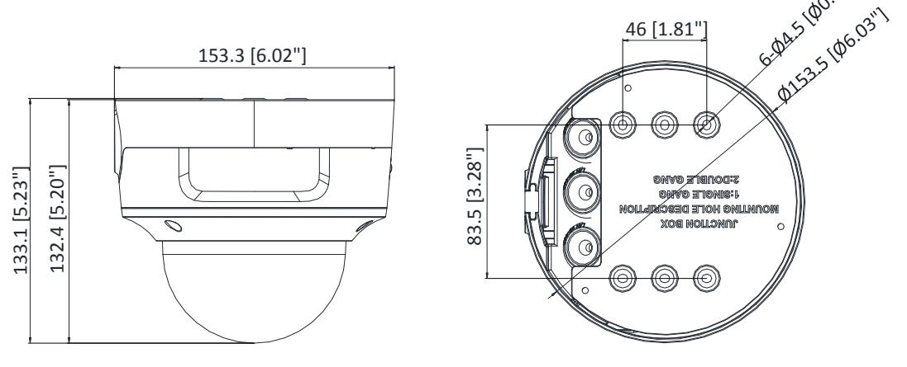
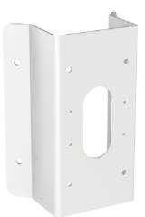
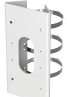
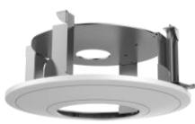
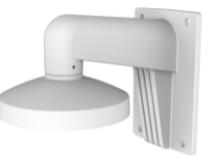
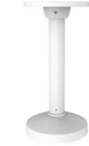
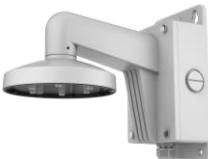

# **DS-2CD2786G2-IZS 8 MP IR Varifocal Dome Network Camera**

- 1/1.8" Progressive Scan CMOS
- 3840 × 2160 @ 20fps
- 2.8 to 12 mm varifocal lens
- 120dB WDR
- Powered by DarkFighter
- 
- H.265+, H.265, H.264+, H.264
- Built-in micro SD/SDHC/SDXC card slot, up to 256 GB
- IP66, IK10
- **Human and vehicle classification alarm** based on deep learning.

# **AcuSense**

Empowered by deep learning algorithms, Hikvision AcuSense technology brings human or vehicle target classification alarms to front- and back-end devices. The system can greatly reduce false alarms generated by targets other than humans or vehicles, vastly improving alarm efficiency and effectiveness.

# **Specifications**

| Camera                       |                                                                                              |  |
|------------------------------|----------------------------------------------------------------------------------------------|--|
| Image Sensor                 | 1/1.8" progressive scan CMOS                                                                 |  |
| Min. Illumination            | Color: 0.003 Lux @ (F1.4, AGC ON), 0 Lux with IR                                             |  |
| Shutter Speed                | 1/3s to 1/100,000s                                                                           |  |
| Slow Shutter                 | Yes                                                                                          |  |
| Wide Dynamic Range           | 120dB                                                                                        |  |
| Day & Night                  | IR Cut Filter                                                                                |  |
| Angle Adjustment             | Pan: 0° to 355°, tilt: 0° to 75°, rotate: 0° to 355°                                         |  |
| Power-off Memory             | Yes                                                                                          |  |
| Lens                         |                                                                                              |  |
| Focus                        | Auto                                                                                         |  |
| Lens Type & FOV              | 2.8 to 12 mm, horizontal FOV 108° to 45°, vertical FOV 58°to 25°, diagonal FOV 127°to 52° |  |
| Aperture                     | F1.4                                                                                         |  |
| Lens Mount                   | Φ14                                                                                          |  |
| Illuminator                  |                                                                                              |  |
| IR Range                     | up to 40 m                                                                                   |  |
| Wavelength                   | 850 nm                                                                                       |  |
| Smart Supplement Light       | Yes                                                                                          |  |
| Video                        |                                                                                              |  |
|                              |                                                                                              |  |
| Max. Resolution              | 3840 × 2160                                                                                  |  |
|                              | 50Hz: 20fps (3840 × 2160, 3072 × 1728), 25fps (2688 × 1520,1920 × 1080, 1280 × 720)          |  |
| Main Stream                  | 60Hz: 20fps (3840 × 2160, 3072 × 1728), 30fps (2688 × 1520,1920 × 1080, 1280 × 720)          |  |
|                              | 50Hz: 25fps (640 × 480, 640 × 360, 320 × 240)                                                |  |
| Sub-Stream                   | 60Hz: 30fps (640 × 480, 640 × 360, 320 × 240)                                                |  |
|                              | 50Hz: 25fps (1280 × 720, 640 × 480, 640 × 360, 320 × 240)                                    |  |
| Third Stream                 | 60Hz: 30fps (1280 × 720, 640 × 480, 640 × 360, 320 × 240)                                    |  |
|                              | Main stream: H.265+/H.264+/H.265/H.264                                                       |  |
| Video Compression            | Sub-stream: H.265/H.264/MJPEG                                                                |  |
|                              | Third stream: H.265/H.264                                                                    |  |
| Video Bit Rate               | 32 Kbps to 16 Mbps                                                                           |  |
| H.264 Type                   | Baseline Profile, Main Profile, High Profile                                                 |  |
| H.265 Type                   | Main Profile                                                                                 |  |
| Stream Type                  | Main stream/sub-stream/third stream                                                          |  |
| Scalable Video Coding (SVC)  | H.265 and H.264 support                                                                      |  |
| Region of Interest (ROI)     | 1 fixed region for each stream                                                               |  |
|                              | * When the main stream resolution is 3840 × 2160, max frame rate is 20 fps for all streams.  |  |
| Audio Audio Sampling Rate | 8 kHz,16 kHz,32 kHz,44.1 kHz,48 kHz                                                          |  |

| Audio Compression                                      | G.711/G.722.1/G.726/MP2L2/PCM/MP3                                                                                                                                                                                                                                                                                                                                                                                                                                                                                                                                                                                                                                                                                                                                                                   |  |
|--------------------------------------------------------|-----------------------------------------------------------------------------------------------------------------------------------------------------------------------------------------------------------------------------------------------------------------------------------------------------------------------------------------------------------------------------------------------------------------------------------------------------------------------------------------------------------------------------------------------------------------------------------------------------------------------------------------------------------------------------------------------------------------------------------------------------------------------------------------------------|--|
| Audio Bit Rate                                         | 64Kbps(G.711)/16Kbps(G.722.1)/16Kbps(G.726)/32-192Kbps(MP2L2)/8Kbps                                                                                                                                                                                                                                                                                                                                                                                                                                                                                                                                                                                                                                                                                                                                 |  |
|                                                        | 320Kbps(MP3)                                                                                                                                                                                                                                                                                                                                                                                                                                                                                                                                                                                                                                                                                                                                                                                        |  |
| Audio Type                                             | Mono sound                                                                                                                                                                                                                                                                                                                                                                                                                                                                                                                                                                                                                                                                                                                                                                                          |  |
| Network                                                |                                                                                                                                                                                                                                                                                                                                                                                                                                                                                                                                                                                                                                                                                                                                                                                                     |  |
| Simultaneous Live View                                 | Up to 6 channels                                                                                                                                                                                                                                                                                                                                                                                                                                                                                                                                                                                                                                                                                                                                                                                    |  |
| API                                                    | ONVIF (PROFILE S, PROFILE G), ISAPI, SDK                                                                                                                                                                                                                                                                                                                                                                                                                                                                                                                                                                                                                                                                                                                                                            |  |
| Protocols                                              | TCP/IP, ICMP, HTTP, HTTPS, FTP, DHCP, DNS, DDNS, RTP, RTSP, PPPoE, NTP, UPnP,                                                                                                                                                                                                                                                                                                                                                                                                                                                                                                                                                                                                                                                                                                                       |  |
|                                                        | SMTP, SNMP, IGMP, 802.1X, QoS, IPv6, UDP, Bonjour, SSL/TLS                                                                                                                                                                                                                                                                                                                                                                                                                                                                                                                                                                                                                                                                                                                                          |  |
| Smooth Streaming                                       | Yes                                                                                                                                                                                                                                                                                                                                                                                                                                                                                                                                                                                                                                                                                                                                                                                                 |  |
| User/Host                                              | Up to 32 users. 3 user levels: administrator, operator and user                                                                                                                                                                                                                                                                                                                                                                                                                                                                                                                                                                                                                                                                                                                                     |  |
|                                                        | Password protection, complicated password, HTTPS encryption, 802.1X authentication                                                                                                                                                                                                                                                                                                                                                                                                                                                                                                                                                                                                                                                                                                                  |  |
| Security                                               | (EAP-MD5), watermark, IP address filter, basic and digest authentication for                                                                                                                                                                                                                                                                                                                                                                                                                                                                                                                                                                                                                                                                                                                        |  |
|                                                        | HTTP/HTTPS, WSSE and digest authentication for ONVIF, TLS 1.2                                                                                                                                                                                                                                                                                                                                                                                                                                                                                                                                                                                                                                                                                                                                       |  |
| Network Storage                                        | MicroSD/SDHC/SDXC card (256 GB), local storage and NAS (NFS,SMB/CIFS), ANR                                                                                                                                                                                                                                                                                                                                                                                                                                                                                                                                                                                                                                                                                                                          |  |
| Client                                                 | iVMS-4200, Hik-Connect, Hik-Central                                                                                                                                                                                                                                                                                                                                                                                                                                                                                                                                                                                                                                                                                                                                                                 |  |
|                                                        | Plug-in required live view: IE8+, Chrome41.0-44, Firefox30.0-51, Safari8.0-11                                                                                                                                                                                                                                                                                                                                                                                                                                                                                                                                                                                                                                                                                                                       |  |
| Web Browser                                            | Plug-in free live view: Chrome 57.0+, Firefox 52.0+                                                                                                                                                                                                                                                                                                                                                                                                                                                                                                                                                                                                                                                                                                                                                 |  |
| Image                                                  |                                                                                                                                                                                                                                                                                                                                                                                                                                                                                                                                                                                                                                                                                                                                                                                                     |  |
| Day/Night Switch                                       | Day/Night/Auto/Schedule/Triggered by Alarm In                                                                                                                                                                                                                                                                                                                                                                                                                                                                                                                                                                                                                                                                                                                                                       |  |
| Image Enhancement                                      | BLC, HLC, 3D DNR                                                                                                                                                                                                                                                                                                                                                                                                                                                                                                                                                                                                                                                                                                                                                                                    |  |
|                                                        |                                                                                                                                                                                                                                                                                                                                                                                                                                                                                                                                                                                                                                                                                                                                                                                                     |  |
| Image Settings                                         | Saturation, brightness, contrast, sharpness, AGC, and white balance are adjustable by client software or web browser                                                                                                                                                                                                                                                                                                                                                                                                                                                                                                                                                                                                                                                                             |  |
|                                                        |                                                                                                                                                                                                                                                                                                                                                                                                                                                                                                                                                                                                                                                                                                                                                                                                     |  |
| Interface                                              |                                                                                                                                                                                                                                                                                                                                                                                                                                                                                                                                                                                                                                                                                                                                                                                                     |  |
| Alarm                                                  | 1 input, 1 output (max. 24 VDC, 1 A, 24 VAC, 1 A)                                                                                                                                                                                                                                                                                                                                                                                                                                                                                                                                                                                                                                                                                                                                                   |  |
| Audio                                                  | 1 input (line in), 3.5 mm three-connector, 1 output (line out), 3.5 mm three-connector                                                                                                                                                                                                                                                                                                                                                                                                                                                                                                                                                                                                                                                                                                              |  |
| On-board Storage                                       | Built-in micro SD slot, up to 256 GB                                                                                                                                                                                                                                                                                                                                                                                                                                                                                                                                                                                                                                                                                                                                                                |  |
| Hardware Reset                                         | Yes                                                                                                                                                                                                                                                                                                                                                                                                                                                                                                                                                                                                                                                                                                                                                                                                 |  |
| Communication Interface                                | 10M/100M self-adaptive Ethernet port                                                                                                                                                                                                                                                                                                                                                                                                                                                                                                                                                                                                                                                                                                                                                                |  |
|                                                        |                                                                                                                                                                                                                                                                                                                                                                                                                                                                                                                                                                                                                                                                                                                                                                                                     |  |
|                                                        |                                                                                                                                                                                                                                                                                                                                                                                                                                                                                                                                                                                                                                                                                                                                                                                                     |  |
|                                                        |                                                                                                                                                                                                                                                                                                                                                                                                                                                                                                                                                                                                                                                                                                                                                                                                     |  |
|                                                        |                                                                                                                                                                                                                                                                                                                                                                                                                                                                                                                                                                                                                                                                                                                                                                                                     |  |
|                                                        |                                                                                                                                                                                                                                                                                                                                                                                                                                                                                                                                                                                                                                                                                                                                                                                                     |  |
| General                                                |                                                                                                                                                                                                                                                                                                                                                                                                                                                                                                                                                                                                                                                                                                                                                                                                     |  |
|                                                        |                                                                                                                                                                                                                                                                                                                                                                                                                                                                                                                                                                                                                                                                                                                                                                                                     |  |
| Web Client Language                                    |                                                                                                                                                                                                                                                                                                                                                                                                                                                                                                                                                                                                                                                                                                                                                                                                     |  |
|                                                        |                                                                                                                                                                                                                                                                                                                                                                                                                                                                                                                                                                                                                                                                                                                                                                                                     |  |
|                                                        |                                                                                                                                                                                                                                                                                                                                                                                                                                                                                                                                                                                                                                                                                                                                                                                                     |  |
|                                                        |                                                                                                                                                                                                                                                                                                                                                                                                                                                                                                                                                                                                                                                                                                                                                                                                     |  |
|                                                        |                                                                                                                                                                                                                                                                                                                                                                                                                                                                                                                                                                                                                                                                                                                                                                                                     |  |
| General Function                                       |                                                                                                                                                                                                                                                                                                                                                                                                                                                                                                                                                                                                                                                                                                                                                                                                     |  |
| Smart Feature-Set Premier Protection Basic Event | Intrusion detection, line crossing detection, region entrance detection, region exiting detection (Human&Vehicle classification) Motion detection, video tampering alarm, exception (network disconnected, IP address conflict, illegal login, HDD full, HDD error), scene change detection 32 languages: English, Russian, Estonian, Bulgarian, Hungarian, Greek, German, Italian, Czech, Slovak, French, Polish, Dutch, Portuguese, Spanish, Romanian, Danish, Swedish, Norwegian, Finnish, Croatian, Slovenian, Serbian, Turkish, Korean, Traditional Chinese, Thai, Vietnamese, Japanese, Latvian, Lithuanian, Portuguese (Brazil) Mirror, password protection, privacy mask, watermark, IP address filter, one-key reset, anti-flicker, three streams, heartbeat |  |

| Software Reset        | Yes                                                                                  |
|-----------------------|--------------------------------------------------------------------------------------|
| Linkage Method        | Upload to FTP/NAS/memory card, notify surveillance center, send email, trigger alarm |
|                       | output, trigger recording, trigger capture, audible warning                          |
| Storage Conditions    | -30 °C to 60 °C (-22 °F to 140 °F), humidity 95% or less (non-condensing)            |
| Startup and Operating |                                                                                      |
| Conditions            | -30 °C to 60 °C (-22 °F to 140 °F), humidity 95% or less (non-condensing)            |
| Power Supply          | 12 VDC ± 25%, two-core terminal block; PoE: 802.3af, Class 3                         |
| Power Consumption and |                                                                                      |
| Current               | 12 VDC, 0.9 A, max. 10.8 W PoE: (802.3af, 36V to 57V), 0.4 A to 0.2 A, max. 12.9 W   |
| Power Interface       | 2-core terminal block                                                                |
| Material              | Metal                                                                                |
| Camera Dimension      | Φ153.5 × 133.2 mm (Φ6″ × 5.2″)                                                       |
| Package Dimension     | 244 × 174 × 173 mm (9.6" × 6.9" × 6.8")                                              |
| Camera Weight         | 1080 g (2.4 lb.)                                                                     |
| With Package Weight   | 1671 g (3.7 lb.)                                                                     |
| Approval              |                                                                                      |
| Protection            | Ingress protection: IP66 (IEC 60529-2013), IK10(IEC 62262:2002)                      |
| EMC                   | CE-EMC (EN 55032: 2015, EN 61000-3-2: 2014, EN 61000-3-3: 2013, EN 50130-4: 2011     |
|                       | +A1: 2014); RCM (AS/NZS CISPR 32: 2015); IC (ICES-003: Issue 6, 2016); KC (KN 32:    |
|                       | 2015, KN 35: 2015)                                                                   |
| Safety                | UL (UL 60950-1); CB (IEC 60950-1:2005 + Am 1:2009 + Am 2:2013); CE-LVD (EN 60950-    |
|                       | 1:2005 + Am 1:2009 + Am 2:2013); BIS (IS 13252(Part 1):2010+A1:2013+A2:2015); LOA    |
|                       | (IEC/EN 60950-1)                                                                     |
| Environment           | CE-RoHS (2011/65/EU); WEEE (2012/19/EU); Reach (Regulation (EC) No 1907/2006)        |

** Listed resolutions are only selectable options. It does not mean that all streams can work at their maximum resolution at the same time.*

## **Available Model**

DS-2CD2786G2-IZS (2.8 to 12 mm)

#### **Dimension**

Unit: mm (inch)

### Accessory

DS-1476ZJ-SUS Corner Mount

DS-1475ZJ-SUS Vertical pole mount

DS-1227ZJ-DM37 In-Ceiling Mount

DS-1473ZJ-155 Wall Mount

DS-1471ZJ-155 Pendant Mount

DS-1473ZJ-155B Wall Mount

Distributed by

-

HIKVISION®

Headquarters No.555 Qianmo Road, Binjiang District,

Hangzhou 310051, China T +86-571-8807-5998 overseasbusiness@hikvision.com

Hikvision USA T +1-909-895-0400 sales.usa@hikvision.com

Hikvision Australia T +61-2-8599-4233 salesau@hikvision.com

Hikvision India T +91-22-28469900 sales@pramahikvision.com

Hikvision Canada T +1-866-200-6690 sales.canada@hikvision.com

Hikvision Thailand T +662-275-9949 sales.thailand@hikvision.com

Hikvision Europe T +31-23-5542770 sales.eu@hikvision.com

Hikvision Italy T +39-0438-6902 info.it@hikvision.com

Hikvision Brazil 1 +52 IT 3318-0020 Latam.support@hikvision.com

Hikvision Turkey T +90 (216)521 7070- 7074 sales.tr(@hikvision.com

Hikvision Malaysia T +601-7652-2413 sales.my@hikvision.com

Hikvision UK & Ireland T +01628-902140 sales.uk@hikvision.com

Hikvision South Africa Tel: +27 (10) 0351172 sale.africa@hikvision.com

Hikvision France 1 +33(0)1-85-330-450 info.fr@hikvision.com

Hikvision Kazakhstan T +7-727-9730667 nikia.panfilov@hikvision.ru

Hikvision Vietnam T +84-974270888 sales.vt@hikvision.com

Hikvision UAE T +971-4-4432090 salesme@hikvision.com

Hikvision Singapore T +65-6684-4718 sg@hikvision.com

Hikvision Spain T +34-91-737-16-55 info.es@hikvision.com

Hikvision Tashkent
T +99-87-1238-9438 uzb@hikvision.ru

Hikvision Hong Kong 1 +852-2151-1761 info.hk@hikvision.com

Hikvision Russia T +7-495-669-67-99 saleru@hikvision.com

Hikvision Korea T +82-(0)31-731-8817 sales.korea@hikvision.com

Hikvision Poland 1 +48-22-460-01-20 info.pl@hikvision.com

Hikvision Indonesia T +62-21-2933759 Sales.Indonesia@hikvision.com

Hikvision Colombia sales.colombia@hikvision.com

© Hikvision Digital Technology Co., Ltd. 2020 | Data subject to change without notice |