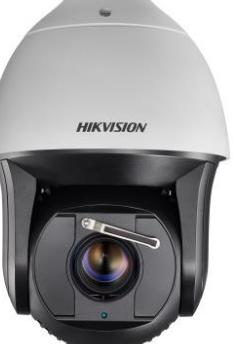
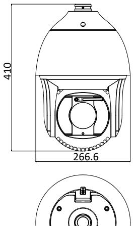
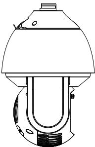

# **DS-2DF8225IX-AEL(W) 2MP 25× Network IR Speed Dome**

**@**

# 

Hikvision DS-2DF8225IX-AEL(W) 2MP 25× Network IR Speed Dome adopts 1/1.9" progressive scan CMOS chip. With the 25× optical zoom lens, the camera offers more details over expansive areas.

This series of cameras can be widely used for wide ranges of high-definition, such as the rivers, forests, roads, railways, airports, ports, squares, parks, scenic spots, stations and large venues, etc.

# **Key Features**

- 1/1.9" progressive scan CMOS
- Up to 1920 × 1080 resolution
- Min. Illumination Color: 0.002 Lux @(F1.5, AGC ON) B/W: 0.0002 Lux @(F1.5, AGC ON) 0 Lux with IR
- 25× optical zoom, 16× digital zoom
- 120dB WDR, 3D DNR, HLC, Smart IR
- 24 VAC & Hi-PoE
- Up to 200 m IR distance
- Support H.265+/H.265 video compression
- Support rapid focus
- Deep-learning-based target classification algorithm for auto-tracking 2.0 and perimeter protection

### **Specification**

| Camera Module         |                                                                                                                                                                                                                                        |  |  |  |
|-----------------------|----------------------------------------------------------------------------------------------------------------------------------------------------------------------------------------------------------------------------------------|--|--|--|
| Image Sensor          | 1/1.9" progressive scan CMOS                                                                                                                                                                                                           |  |  |  |
| Min. Illumination     | Color: 0.002 Lux @(F1.5, AGC ON) B/W: 0.0002 Lux @(F1.5, AGC ON) 0 Lux with IR                                                                                                                                                   |  |  |  |
| Shutter Time          | 1/1 s to 1/30,000 s                                                                                                                                                                                                                    |  |  |  |
| White Balance         | Auto/Manual/ATW (Auto-tracking White Balance)/Indoor/Outdoor/Fluorescent Lamp/Sodium Lamp                                                                                                                                           |  |  |  |
| AGC                   | Auto/Manual                                                                                                                                                                                                                            |  |  |  |
| Day & Night           | IR cut filter                                                                                                                                                                                                                          |  |  |  |
| Digital Zoom          | 16×                                                                                                                                                                                                                                    |  |  |  |
| Privacy Mask          | 24 programmable polygon privacy masks                                                                                                                                                                                                  |  |  |  |
| Focus Mode            | Auto/Semi-automatic/Manual                                                                                                                                                                                                             |  |  |  |
| 3D DNR                | Support                                                                                                                                                                                                                                |  |  |  |
| BLC                   | Support                                                                                                                                                                                                                                |  |  |  |
| HLC                   | Support                                                                                                                                                                                                                                |  |  |  |
| WDR                   | 120dB                                                                                                                                                                                                                                  |  |  |  |
| Optical Defog         | Support                                                                                                                                                                                                                                |  |  |  |
| EIS                   | Support                                                                                                                                                                                                                                |  |  |  |
| Regional Exposure     | Support                                                                                                                                                                                                                                |  |  |  |
| Regional Focus        | Support                                                                                                                                                                                                                                |  |  |  |
| Rapid Focus           | Support                                                                                                                                                                                                                                |  |  |  |
| Lens                  |                                                                                                                                                                                                                                        |  |  |  |
| Focal Length          | 5.7 mm to 142.5 mm, 25× Optical                                                                                                                                                                                                        |  |  |  |
| Zoom Speed            | Approx. 3.7 s (optical lens, wide-tele)                                                                                                                                                                                                |  |  |  |
| Field of View         | Horizontal field of view: 59.8° to 2.8° (wide-tele) Vertical field of view: 33.6° to 1.6° (wide-tele) Diagonal field of view: 68.6° to 3.2° (wide-tele)                                                                          |  |  |  |
| Working Distance      | 10 mm to 1500 mm (wide-tele)                                                                                                                                                                                                           |  |  |  |
| Aperture Range        | F1.5 to F3.4                                                                                                                                                                                                                           |  |  |  |
| PTZ                   |                                                                                                                                                                                                                                        |  |  |  |
| Movement Range (Pan)  | 360° endless                                                                                                                                                                                                                           |  |  |  |
| Pan Speed             | Configurable, from 0.1°/s to 210°/s, Preset Speed: 280°/s                                                                                                                                                                              |  |  |  |
| Movement Range (Tilt) | From -20° to 90°                                                                                                                                                                                                                       |  |  |  |
| Tilt Speed            | Configurable, from 0.1°/s to 150°/s, Preset Speed: 250°/s                                                                                                                                                                              |  |  |  |
| Proportional Zoom     | Support                                                                                                                                                                                                                                |  |  |  |
| Presets               | 300                                                                                                                                                                                                                                    |  |  |  |
| Patrol Scan           | 8 patrols, up to 32 presets for each patrol                                                                                                                                                                                            |  |  |  |
| Pattern Scan          | 4 pattern scans, record time over 10 minutes for each scan                                                                                                                                                                             |  |  |  |
| Power-off Memory:     | Support                                                                                                                                                                                                                                |  |  |  |
| Park Action           | Preset/Pattern Scan/Patrol Scan/Auto Scan/Tilt Scan/Random Scan/Frame Scan/Panorama Scan                                                                                                                                            |  |  |  |
| PTZ Status Display    | Support                                                                                                                                                                                                                                |  |  |  |
| Preset Freezing       | Support                                                                                                                                                                                                                                |  |  |  |
| Scheduled Task        | Preset/Pattern Scan/Patrol Scan/Auto Scan/Tilt Scan/Random Scan/Frame Scan/Panorama Scan/Dome Reboot/Dome Adjust/Aux Output                                                                                                         |  |  |  |
| Smart Features        |                                                                                                                                                                                                                                        |  |  |  |
| Perimeter Protection  | Intrusion, Line Crossing, Region Entrance, Region Exiting Support alarm triggering by specified target types (human and vehicle) Filtering out mistaken alarm caused by target types such as leaf, light, animal, and flag, etc. |  |  |  |

| Event Detection        | Face Detection, Audio Exception Detection                                                                                                                                                            |  |  |  |
|------------------------|------------------------------------------------------------------------------------------------------------------------------------------------------------------------------------------------------|--|--|--|
| Smart Tracking         | Manual Tracking, Auto Tracking (support tracking specified target types such as human and vehicle), Event Tracking                                                                                |  |  |  |
| Smart Record           | ANR (Automatic Network Replenishment), Dual-VCA                                                                                                                                                      |  |  |  |
| ROI                    | Support                                                                                                                                                                                              |  |  |  |
| IR                     |                                                                                                                                                                                                      |  |  |  |
| IR Distance            | 200 m                                                                                                                                                                                                |  |  |  |
| Smart IR               | Support                                                                                                                                                                                              |  |  |  |
| Network                |                                                                                                                                                                                                      |  |  |  |
| Max. Resolution        | 1920 × 1080                                                                                                                                                                                          |  |  |  |
| Main Stream            | 50Hz: 25fps (1920 × 1080, 1280 × 960, 1280 × 720) 50fps (1920 × 1080, 1280 × 960, 1280 × 720) 60Hz: 30fps (1920 × 1080, 1280 × 960, 1280 × 720) 60fps (1920 × 1080, 1280 × 960, 1280 × 720) |  |  |  |
| Sub-Stream             | 50Hz: 25fps (704 × 576, 640 × 480, 352 × 288) 60Hz: 30fps (704 × 480, 640 × 480, 352 × 240)                                                                                                       |  |  |  |
| Third Stream           | 50Hz: 25fps (1920 × 1080, 1280 × 960, 1280 × 720, 704 × 576, 640 × 480, 352 × 288) 60Hz: 30fps (1920 × 1080, 1280 × 960, 1280 × 720, 704 × 480, 640 × 480, 352 × 240)                             |  |  |  |
| ROI                    | Support                                                                                                                                                                                              |  |  |  |
| SVC                    | Support                                                                                                                                                                                              |  |  |  |
| Video Compression      | Main Stream: H.265+/H.265/H.264+/H.264 Sub-Stream: H.265/H.264/MJPEG Third Stream: H.265/H.264/MJPEG H.264 with Baseline/Main/High Profile                                                  |  |  |  |
| Audio compression      | G.711alaw/G.711ulaw/G.722.1/G.726/MP2L2/PCM                                                                                                                                                          |  |  |  |
| Protocols              | IPv4/IPv6, HTTP, HTTPS, 802.1x, Qos, FTP, SMTP, UPnP, SNMP, DNS, DDNS, NTP, RTSP, RTCP, RTP, TCP/IP, DHCP, PPPoE, Bonjour                                                                         |  |  |  |
| Simultaneous Live View | Up to 20 channels                                                                                                                                                                                    |  |  |  |
| User/Host              | Up to 32 users 3 levels: Administrator, Operator and User                                                                                                                                         |  |  |  |
| Security Measures      | User authentication (ID and PW), Host authentication (MAC address); HTTPS encryption; IEEE 802.1x port-based network access control; IP address filtering                                         |  |  |  |
| System Integration     |                                                                                                                                                                                                      |  |  |  |
| Alarm Interface        | 7-ch alarm input/2-ch alarm output                                                                                                                                                                   |  |  |  |
| Audio Interface        | 1-ch audio input (applicable microphone, plug-in power type), 2 to 2.4 V[p-p], 1 KΩ ± 10% 1-ch audio output, line level, impedance: 600 Ω                                                         |  |  |  |
| Alarm Linkage          | Alarm actions, such as Preset, Patrol Scan, Pattern Scan, Memory Card Video Record, Trigger Recording, Notify Surveillance Center, Upload to FTP/Memory Card/NAS, Send Email, etc.             |  |  |  |
| Network Interface      | 1 RJ45 10 M/100 M Ethernet Interface; Hi-PoE                                                                                                                                                         |  |  |  |
| CVBS                   | Support                                                                                                                                                                                              |  |  |  |
| RS-485                 | HIKVISION, Pelco-P, Pelco-D, self-adaptive                                                                                                                                                           |  |  |  |
| Storage                | Built-in memory card slot, support Micro SD/SDHC/SDXC, up to 256 GB; NAS (NPS, SMB/ CIPS), ANR                                                                                                    |  |  |  |
| API                    | Open-ended, support ONVIF, and CGI, support HIKVISION SDK and Third-Party Management Platform                                                                                                     |  |  |  |
| Client                 | iVMS-4200, iVMS-4500, iVMS-5200, Hik-Connect                                                                                                                                                         |  |  |  |
| Web Browser            | IE 8 to 11, Chrome 31.0 to 44, Firefox 30.0 to 51                                                                                                                                                    |  |  |  |
| General                |                                                                                                                                                                                                      |  |  |  |
| Power                  | 24 VAC (Max. 60 W) Hi-PoE (Max. 50 W)                                                                                                                                                             |  |  |  |
| Working Temperature    | Outdoor: -40°C to 70°C (-40°F to 158°F)                                                                                                                                                              |  |  |  |
| Working Humidity       | ≤ 90%                                                                                                                                                                                                |  |  |  |
| Protection Level       | IP67 Standard, IK10 (only supported by camera without wiper), TVS 6,000V Lightning                                                                                                                   |  |  |  |

|            | Protection, Surge Protection and Voltage Transient Protection |  |  |  |
|------------|---------------------------------------------------------------|--|--|--|
| Dimensions | Φ 266.6 mm × 410 mm (Φ10.50" × 16.14")                        |  |  |  |
| Weight     | Approx. 8 kg (17.64 lb)                                       |  |  |  |

# **Order Model**

DS-2DF8225IX-AEL, without wiper, 24 VAC & Hi-PoE DS-2DF8225IX-AELW, with wiper, 24 VAC & Hi-PoE

# **Dimensions**

Unit: mm

#### Accessories

|  |    | DS-1604ZJ            | Wall Mounting Bracket                            |  |  |
|--|----|----------------------|--------------------------------------------------|--|--|
|  |    | DS-1604ZJ-box        | Wall Mounting Bracket with Junction Box          |  |  |
|  |    | DS-1604ZJ-box-pole   | Vertical Pole Mounting Bracket with Junction Box |  |  |
|  |    | DS-1604ZJ-box-corner | Wall Mounting Bracket with Junction Box          |  |  |
|  |    | DS-1660ZJ            | Parapet Wall Mounting Bracket                    |  |  |
|  |    | DS-1619ZJ            | Gooseneck Mounting Bracket                       |  |  |
|  |    | DS-1661ZJ            | Pendant Mounting Bracket                         |  |  |
|  |    | DS-1662ZJ            | Pendant Mounting Bracket                         |  |  |
|  | DV | DS-1663ZJ            | Ceiling Mounting Bracket                         |  |  |
|  |    | DS-1667ZJ            | Extendable Pole for Pendant Mounting Bracket     |  |  |
|  |    | DS-1673ZJ            | Horizontal Pole Mounting Bracket                 |  |  |
|  |    | DS-1682ZJ            | Extendable Pole for Pendant Mounting Bracket     |  |  |
|  |    |                      |                                                  |  |  |

 Hikvision USA
 T +1-909-895-0400 sales.usa@hikvision.com

overseasbusiness@hikvision.com

Hikvision Italy
T +39-0438-6902 info.it@hikvision.com

Hikvision Singapore
T +65-6684-4718 sg@hikvision.com

Hikvision South Africa Tel: +27 (10) 0351172 sale.africa@hikvision.com Hikvision Europe
T +31-23-55-42-770 info.eu@hikvision.com

Hikvision France
T +33(0)1-85-330-450 info.fr@hikvision.com

Hikvision Oceania T +61-2-8599-4233 salesau@hikvision.com

Hikvision Hong Kong 1 +852-5151-1761

Hikvision Middle East
T +971-4-8816086 salesme@hikvision.com

Hikvision Spain
T +34-91-737-16-55 info.es@hikvision.com

Hikvision Canada T +1-909-895-0400 sales.usa@hikvision.com Hikvision Russia
T +7-495-669-67-99 saleru@hikvision.com

Hikvision Poland
T +48-22-460-01-50 poland@hikvision.com

Hikvision Korea T +82-31-731-8841 sales.korea@hikvision.com Hikvision India
T +91-22-28469900 sales@pramahikvision.com

Hikvision UK T +01628-902140 support.uk@hikvision.com

Hikvision Brazil 1 +55 11 3318-0050 Latam.support@hikvision.com

© Hikvision Digital Technology Co., Ltd. 2016 | Data subject to change without notice |

0505001071129