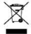
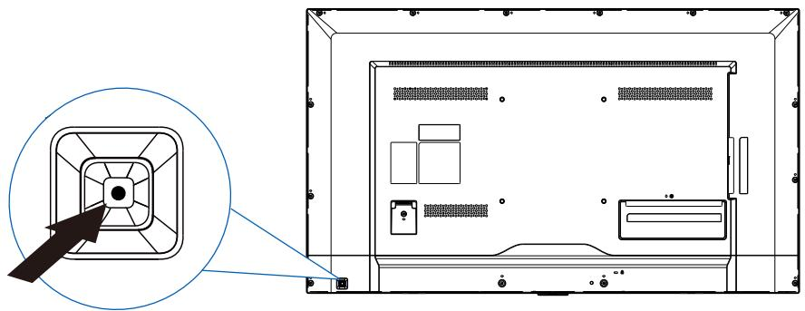
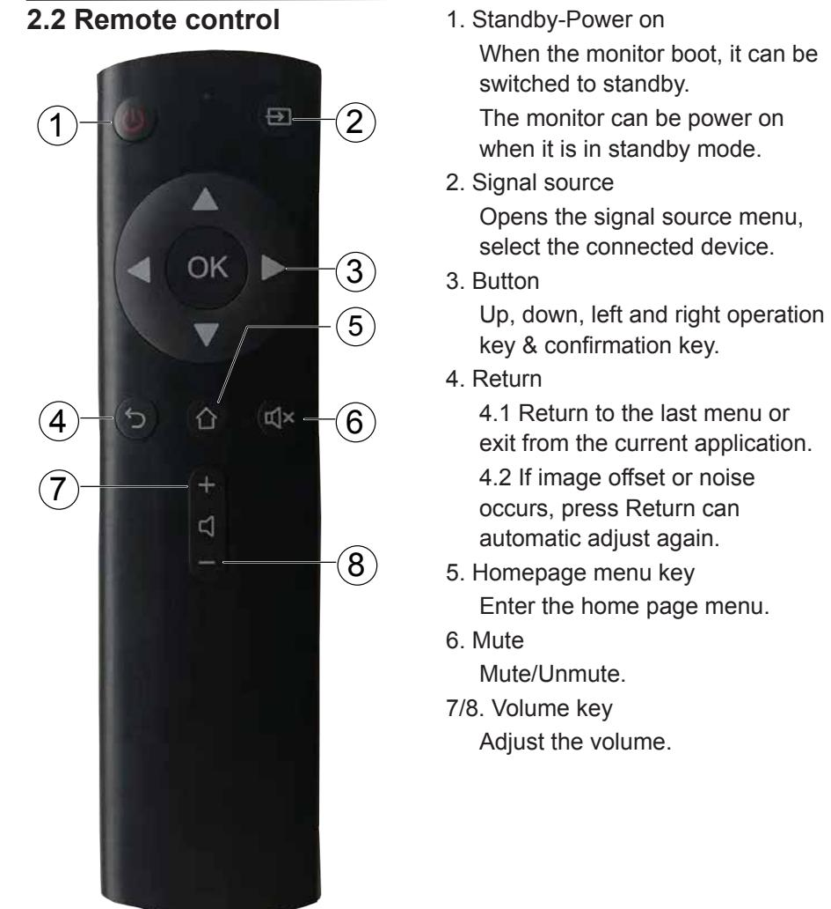
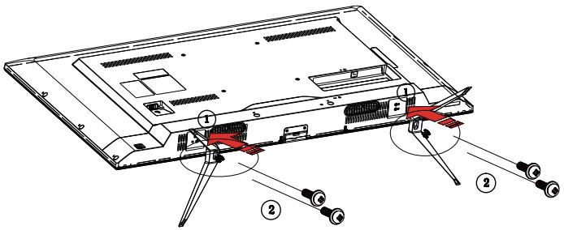
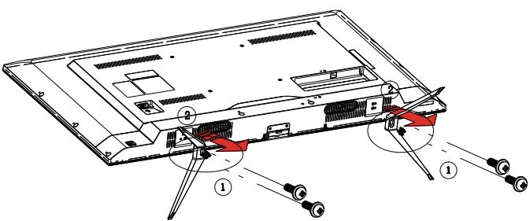
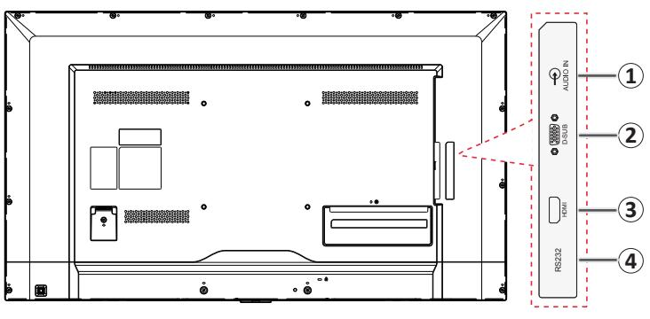
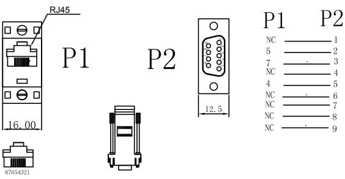
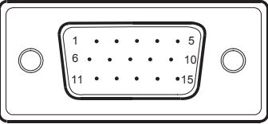
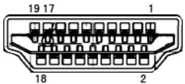

# DS-D5043QE

User Manual

#### **User Manual**

COPYRIGHT ©2019 Hangzhou Hikvision Digital Technology Co., Ltd.

#### **ALL RIGHTS RESERVED.**

Any and all information, including, among others, wordings, pictures, graphs are the properties of Hangzhou Hikvision Digital Technology Co., Ltd. or its subsidiaries (hereinafter referred to be "Hikvision"). This user manual (hereinafter referred to be "the Manual") cannot be reproduced, changed, translated, or distributed, partially or wholly, by any means, without the prior written permission of Hikvision. Unless otherwise stipulated, Hikvision does not make any warranties, guarantees or representations, express or implied, regarding to the Manual.

#### **About this Manual**

This Manual is applicable to the Monitor.

The Manual includes instructions for using and managing the product. Pictures, charts, images and all other information hereinafter are for description and explanation only. The information contained in the Manual is subject to change, without notice, due to firmware updates or other reasons. Please find the latest version in the company website (http://overseas.hikvision.com/en/).

Please use this user manual under the guidance of professionals.

#### **Trademarks Acknowledgement**

and other Hikvision's trademarks and logos are the properties of Hikvision in various jurisdictions. Other trademarks and logos mentioned below are the properties of their respective owners.

#### **Legal Disclaimer**

THE LATER PREVAILS.

TO THE MAXIMUM EXTENT PERMITTED BY APPLICABLE LAW, THE PRODUCT DESCRIBED, WITH ITS HARDWARE, SOFTWARE AND FIRMWARE, IS PROVIDED "AS IS", WITH ALL FAULTS AND ERRORS, AND HIKVISION MAKES NO WARRANTIES, EXPRESS OR IMPLIED, INCLUDING WITHOUT LIMITATION, MERCHANTABILITY, SATISFACTORY QUALITY, FITNESS FOR A PARTICULAR PURPOSE, AND NON-INFRINGEMENT OF THIRD PARTY. IN NO EVENT WILL HIKVISION, ITS DIRECTORS, OFFICERS, EMPLOYEES, OR AGENTS BE LIABLE TO YOU FOR ANY SPECIAL, CONSEQUENTIAL, INCIDENTAL, OR INDIRECT DAMAGES, INCLUDING, AMONG OTHERS, DAMAGES FOR LOSS OF BUSINESS PROFITS, BUSINESS INTERRUPTION, OR LOSS OF DATA OR DOCUMENTATION, IN CONNECTION WITH THE USE OF THIS PRODUCT, EVEN IF HIKVISION HAS BEEN ADVISED OF THE POSSIBILITY OF SUCH DAMAGES.

REGARDING TO THE PRODUCT WITH INTERNET ACCESS, THE USE OF PRODUCT SHALL BE WHOLLY AT YOUR OWN RISKS. HIKVISION SHALL NOT TAKE ANY RESPONSIBILITES FOR ABNORMAL OPERATION, PRIVACY LEAKAGE OR OTHER DAMAGES RESULTING FROM CYBER ATTACK, HACKER ATTACK, VIRUS INSPECTION, OR OTHER INTERNET SECURITY RISKS; HOWEVER, HIKVISION WILL PROVIDE TIMELY TECHNICAL SUPPORT IF REQUIRED.

SURVEILLANCE LAWS VARY BY JURISDICTION. PLEASE CHECK ALL RELEVANT LAWS IN YOUR JURISDICTION BEFORE USING THIS PRODUCT IN ORDER TO ENSURE THAT YOUR USE CONFORMS THE APPLICABLE LAW. HIKVISION SHALL NOT BE LIABLE IN THE EVENT THAT THIS PRODUCT IS USED WITH ILLEGITIMATE PURPOSES.

IN THE EVENT OF ANY CONFLICTS BETWEEN THIS MANUAL AND THE APPLICABLE LAW,

#### **Regulatory Information**

#### **FCC Information**

Please take attention that changes or modification not expressly approved by the party responsible for compliance could void the user's authority to operate the equipment.

**FCC compliance:** This equipment has been tested and found to comply with the limits for a Class A digital device, pursuant to part 15 of the FCC Rules. These limits are designed to provide reasonable protection against harmful interference when the equipment is operated in a commercial environment. This equipment generates, uses, and can radiate radio frequency energy and, if not installed and used in accordance with the instruction manual, may cause harmful interference to radio communications. Operation of this equipment in a residential area is likely to cause harmful interference in which case the user will be required to correct the interference at his own expense.

#### **FCC Conditions**

This device complies with part 15 of the FCC Rules. Operation is subject to the following two conditions:

1. This device may not cause harmful interference.

2. This device must accept any interference received, including interference that may cause undesired operation.

#### **EU Conformity Statement**

This product and - if applicable - the supplied accessories too are marked with "CE" and comply therefore with the applicable harmonized European standards listed under the EMC Directive 2014/30/EU, the LVD Directive 2014/35/EU, the RoHS Directive 2011/65/EU.

2012/19/EU (WEEE directive): Products marked with this symbol cannot be disposed of as unsorted municipal waste in the European Union. For proper recycling, return this product to your local supplier upon the purchase of

equivalent new equipment, or dispose of it at designated collection points. For more information see: www.recyclethis.info

2006/66/EC (battery directive): This product contains a battery that cannot be disposed of as unsorted municipal waste in the European Union. See the product documentation for specific battery information. The battery is marked

with this symbol, which may include lettering to indicate cadmium (Cd), lead (Pb), or mercury (Hg). For proper recycling, return the battery to your supplier or to a designated collection point. For more information see: www.recyclethis.info

#### **Industry Canada ICES-003 Compliance**

This device meets the CAN ICES-3 (A)/NMB-3(A) standards requirements.

To prevent injury, this apparatus must be securely attached to the floor/wall in accordance with the installation instructions.

# Applicable Models

This manual is applicable to the model: LCD Monitor.

## Symbol Conventions

The symbols that may be found in this document are defined as follows.

| Symbol | Description                                                                                                                                                           |  |  |
|--------|-----------------------------------------------------------------------------------------------------------------------------------------------------------------------|--|--|
|        | Provides additional information to emphasize or supplement important points of the main text.                                                                      |  |  |
|        | Indicates a potentially hazardous situation, which if not avoided, could result in equipment damage, data loss, performance degradation, or unexpected results. |  |  |
|        | Indicates a hazard with a high level of risk, which if not avoided, will result in death or serious injury.                                                        |  |  |

This is a class A product and may cause radio interference in which case the user may be required to take adequate measures.

WARNING: This equipment is compliant with Class A of EN55032/CISPR 32. In a residential environment this equipment may cause radio interference.

# 1. Safety instructions

#### Pixel feature

This liquid crystal display product has ultrahigh color resolution. While it's effective pixels are up to 99.999% or higher, it is still possible that a dark spot or a bright spot (red, green or blue) constantly appears on the screen. This is the structure property (within the general industrial standard) of the display rather than a fault.

#### Safety

Please read and understand all instructions before using the monitor safety

. Damage resulting from nonobservance of the instructions is not covered by the warranty.

Be careful of electric shock and fire!

- · Never make the monitor contact with rain or water. Never place a liquid container (e.g., a vase) near or on the monitor. Please disconnect the monitor's power immediately if a liquid is spilled on the monitor's surface or inside. Please contact the customer service center before using it again.
- · Never put a monitor, remote controller, or battery near an open flame or other heat source (including direct sunlight). In order to avoid flame spread, always keep candles or other open flames away from monitors, remote controls, and batteries.

- · Never insert any object into the ventilation slot or other openings on the monitor.
- · Please make sure that the power line is not taut. The tightening of the power line will loose the power connections and produce sparks.

Beware of short circuit or fire!

- · Do not expose the remote controller or battery in rain, water or overheated environment.
- · Please avoid pulling the plug. Loose power plugs may spark or cause fire.

Watch out for personal injury or monitor damage!

- · It is suggested that the monitor be carried by two people.
- · When installing the monitor on the stand, please use only the chassis provided. Firmly fix the frame on the monitor. Put the monitor on a flat, flat surface that can withstand the total weight of the monitor and the chassis.
- · When installing a monitor with wall mounting, please use only the wall mount bracket that can bear the weight of the monitor. Fix the wall mount mounting bracket on the wall that can withstand the total weight of the monitor and the wall mount bracket.

The company is not responsible for the accident, personal injury or loss caused by improper installation.

Be careful of hurting children!

Please follow the following precautions to avoid child injury due to monitor falling:

- · Never place the monitor on a surface covered with a cloth or other material that can be pulled.
- · Make sure that any part of the monitor is within the edge of the surface.
- · When placing a monitor on a high furniture (such as a bookcase), the furniture and monitor must be fixed to the wall or the appropriate support.
- · Tell children about the dangers of climbing furniture and touching monitors.

#### Beware of eating battery!

- · The remote control of this product contains batteries. There is a risk that children might eat the batteries. Please keep them out of reach of children.
Watch out for overheating!

- · Never install the monitor in the enclosed space. Always leave at least 4 inches or 10 centimeters of space around the monitor for ventilation. Make sure that curtains or other objects do not block the ventilation slot on the monitor.
Be careful! Don't break the monitor!

- · Before you connect the monitor to the power outlet, make sure that the power voltage matches the value printed on the back of the monitor. If the voltage is different, don't connect the monitor to the power outlet.
- · If the monitor is not used for a long time, please cut off the power supply.

Be careful of personal injury, fire or power line damage!

- · Do not put the monitor or any object on the power line.
- · As a disconnecting device, the power plug should be kept to operate conveniently.
- · When the power line is disconnected, always hold the plug instead of pulling the cable.
- · Before the thunderstorm comes, disconnect the monitor from the power outlet and the antenna. Never touch any part of a monitor, a power line, or an antenna in a thunderstorm.
- · The wired network antenna connected to the equipment must be isolated from the protective grounding, otherwise it may cause fire and other dangers!

Watch out for hearing impairment!

- · Avoid using headphones or earphones at high volume or for a long time.
#### Low temperature

- · If the monitor is transported below 5°C, please open the package of the monitor. Wait for the monitor to adapt to the room temperature, and then connect the monitor to the power outlet.
## 1.1 Screen maintenance

Before using the monitor, please read and understand all the instructions. Damage resulting from nonobservance of the instructions is not covered by the warranty.

- · Try to avoid still images. A still image means that an image stays on the screen for a long time. Still image may cause permanent damage to the monitor screen;
- · the monitor screen to cause image blur, afterimage, local traces, and the display is not within the scope of warranty
- · Don't display static images for more than 2 hours on the LCD monitor, because it will cause the screen image blur. In order to avoid this problem please reduce the brightness and contrast of the screen in the display of a still image.
- · When you watch 4:3 programs for a long time, you leave different marks on the left and right sides of the screen and the edges of the image, so please don't use this mode for a long time.
- · Image sticking may occur if playing video games or displaying still images for a long time. It is caused by screen burn. Please reduce brightness and contrast when appropriate.
- · Pull out the monitor plug before cleaning.
- · Use a soft dry cloth to wipe the monitor and frame. Do not use alcohol, chemicals or household cleaning agent cleaning monitor.
- · Watch out for damage to monitor screen! Do not use any object to contact, push, rub or tap the screen.
- · In order to avoid deformation and fading, please wipe water as soon as possible.

# 2. Operation Instructions

## **2.1 Control panel**

(The shape of the product will vary between models, please take the actual machine as the standard!)

| Power/ | Press the Power key in the shutdown state.                          |
|--------|---------------------------------------------------------------------|
| Input  | Short-press to select VGA/HDMI and long-press to shut it off in the |
|        | power-on state.                                                     |

# **3. Installation instructions**

## **Connect the base:**

## **Remove the base:**

#### **Note: The base is not equipped when the product leave the factory. Please consult the sales representative for the base.**

#### **Power Cord**

#### **Power Supply:**

- 1. Please use the power cord applicable to the local region.
- 2. The LCD is internally configured with a power board, capable of being used in regions with 100/120V AC or 220/240V AC voltage (It is not necessary to perform adjustments by yourself).

# **3.1 Control button and joint**

#### **Signal wire**

- Connect the VGA wire: Connect the 15 -pin VGA signal wire to the back of the display and the VGA port of the computer or other devices.
- Connect the HDMI wire: Connect the 19 -pin HDMI signal wire to the back of the display and the HDMI port of the computer or other devices.
- Connect power cord: Connect the power cord to the AC jack on the back of the display.

| 1. | Audio in                                  |
|----|-------------------------------------------|
| 2. | D-SUB                                     |
| 3. | HDMI signal input                         |
| 4. | RS232 (Serial port communication control) |

When RS232 port is connected for control, please use the adapter specified below and normal network cable to connect the 9-pin RS232 cable to the PC port and the network cable to the RS232 terminal of the surveillance camera.

## **3.2 How to adjust the settings**

- 1. Press the button " " to display the OSD options.
- 2. Press " " or " " to browse the menu items. After reversing out the required item, press the button " " to enter.
- 3. Press " " or " " again to browse the sub-menu. After reversing out the required item, press the button " " to make adjustments.
- 4. Press the button " " to save the adjustments and to exit. To adjust other settings, please repeat steps 2-4.

| Contrast   | Brightness | 50       |
|------------|------------|----------|
| Brightness |            | 100      |
| Eco Mode   |            | Standard |
| DCR        |            | Off      |
|            |            |          |
|            |            |          |

## **3.3 Adjust the image settings**

## **Description of the functions of control button:**

| Main menu item | Main menu picture | Sub-menu item | Sub menu | Description                                                                |
|----------------------|-------------------------|------------------|-------------|----------------------------------------------------------------------------|
| Brightness           |                         | Contrast         | -           | Comparison of digital regis ter                                         |
|                      |                         | Brightness       | -           | Backlight adjustment                                                       |
|                      |                         | Eco Mode         | Standard    | Standard mode                                                              |
|                      |                         |                  | Text        | Text mode                                                                  |
|                      |                         |                  | Internet    | Internet mode                                                              |
|                      |                         |                  | Game        | Game mode                                                                  |
|                      |                         |                  | Movie       | Movie mode                                                                 |
|                      |                         |                  | Sports      | Sports mode                                                                |
|                      |                         | DCR              | On          | Enable the DCR functions                                                   |
|                      |                         |                  | Off         | Disable the DCR functions                                                  |
| Image Setup       |                         | Clock            |             | Adjust the image "Clock" to reduce the noises on the vertical line   |
|                      |                         | Phase            |             | Adjust the image "Phase" to reduce the noises on the horizontal line |
|                      |                         | H. Position      |             | Adjust the horizontal posi tion of the image                            |
|                      |                         | V. Position      |             | Adjust the vertical position of the image                               |
|                      |                         | Image Ratio      | Wide 4:3 | Select the image ratio                                                     |

#### User's Manual

| Main menu item | Main menu picture | Sub-menu item | Sub menu         | Description                                                   |
|----------------------|-------------------------|------------------|---------------------|---------------------------------------------------------------|
| Color Temp.       |                         | Warm             |                     | Called back from EEPROM "Warn" setup                       |
|                      |                         | Normal           |                     | Called back from EEPROM "Normal" setup                     |
|                      |                         | Cold             |                     | Called back from EEPROM "Cold" setup                       |
|                      |                         | User             | Red                 | Red gain of the digital cache                              |
|                      |                         |                  | Green               | Green gain of the digital cache                            |
|                      |                         |                  | Blue                | Blue gain of the digital cache                             |
| OSD setup            |                         | H. Position      | -                   | Adjust the horizontal direc tion of the OSD.               |
|                      |                         | V. Position      | -                   | Adjust the vertical direction of the OSD.                  |
|                      |                         | Timeout          | -                   | Adjust the display time of the OSD.                        |
|                      |                         | Language         | -                   | Select a language for the OSD.                             |
| Extra                |                         | Input Select     | Auto/D-SUB/ HDMI | Select the input source.                                      |
|                      |                         | DDC/CI           | On or Off           | "On/Off DDC/CI" support ing functions                      |
|                      |                         | Reset            | Yes or No           | Reset the menu by default                                     |
|                      |                         | Information      | -                   | Display the information of the main image signal source |

## **3.4 Plug-and-play**

Plug-and-play DDC2B function

This display is configured with the VESA DDC2B function in accordance with the "VESA DDC standard". According to the different DDC use grades, the display can inform the host of its identification information and transmit other related information of the display function.

The DDC2B is a double data channel based on the IC communication protocol. The host can require the EDID information through the DDC2B.

In the case of no video input signal, the functions of this panel cannot be used. In order to normally operate the display, the video input signal is a must.

# **4. Technical support (common problems)**

| Problems                                                           | Feasible solution                                                                                                                                                                              |
|--------------------------------------------------------------------|------------------------------------------------------------------------------------------------------------------------------------------------------------------------------------------------|
| "Plug-and-play" function does not work                          | • Please check if the computer system is compatible with "Plug-and-play" function. • Please check if the display adapter is compatible with "Plug-and-play" function.     |
| Fuzzy image                                                        | • Please adjust the "Contrast" and "Brightness".                                                                                                                                         |
| Jitterbug or ripple                                                | • Remove electrical devices that can cause electric interference.                                                                                                                        |
| Lacking one of the elementary colors (red, green or blue)       | • Inspect the video connecting wire of the display, and determine if there is any pin bent.                                                                                           |
| Image deviation from the center of the display or size error | • Adjust to the horizonal or vertical position or press the hot key (auto).                                                                                                              |
| Flawed image color (the white color does not look white)        | • Please adjust the RGB color or select color temperature.                                                                                                                               |
| Poor brightness or contrast                                        | • When the display fades in brightness and affects the display function after being used for a period of time, please hand the display to a qualified repair center for repair. |
| The display has horizontal or vertical interference             | • Adjust "Frequency" or "Phase" or press Return on the remote control (Auto button).                                                                                                  |

"Clock" (pixel frequency) can control the pixels scanned by a single horizontal scanner. In the case of frequency error, vertical strips appear on the display, and an abnormal image ratio will be caused.

"Phase" can be used to adjust the phase of the pixel frequency signal. In the case of correcting the wrong phase, horizontal interference will appear in the brighter image.

## **4.1 Error information and feasible solution**

No signal

- 1. Please check if the signal wire is well connected. If the connector is loose, please fasten the screw on the joint.
- 2. Please check whether the connecting pin of the signal wire is damaged.

Does not support input signal

Incorrect display mode setup of the computer. Please refer to the display modes in the specification table to perform setting.

# **5. Appendix**

## 5.1 Specification

|                                       | Drive system                                | 43" TFT color LCD                                                                                                                     |  |
|---------------------------------------|---------------------------------------------|---------------------------------------------------------------------------------------------------------------------------------------|--|
| LCD panel                             | Dimension                                   | 108 cm diagonal line                                                                                                                  |  |
|                                       | Pixel distance                              | 0.49mm(H) × 0.49mm(V)                                                                                                                 |  |
|                                       | Video signal                                | Digital/analog                                                                                                                        |  |
| Input                                 | Horizontal frequency                     | 30kHz – 83kHz                                                                                                                         |  |
|                                       | Vertical frequency                          | 56 – 75Hz                                                                                                                             |  |
| Display color                         |                                             | 16.7M                                                                                                                                 |  |
| Maximum resolution                    |                                             | 1920 x 1080@60Hz                                                                                                                      |  |
| Plug-and-play                         |                                             | DDC 1/2B/CI or VESA DDC2B™                                                                                                            |  |
| Power consumption                  | Standby power consumption (standby)   | < 0.5W                                                                                                                                |  |
|                                       | Shutdown power consumption (shutdown) | < 0.5W                                                                                                                                |  |
|                                       | Startup power                               | 74W (max.)                                                                                                                            |  |
|                                       | consumption                                 | 50W (classic)                                                                                                                         |  |
| Input joint                           |                                             | 15-pin D-Sub, 19-pin HDMI                                                                                                             |  |
| Input video                           |                                             | Digital/analog                                                                                                                        |  |
| Maximum display dimension             |                                             | Horizontal: 940.896 mm Vertical: 529.254 mm                                                                                        |  |
| Power Supply                          |                                             | 100-240 VAC, 50/60Hz                                                                                                                  |  |
| Operating environmental conditions |                                             | Operating temperature: 0˚ to 40℃ Storage temperature: -20˚ to 60℃ Operating humidity: 10% to 85% Storage humidity: 5% to 80% |  |
|                                       |                                             | Without base: 968.18(W)x559.42(H) x76.8(D) mm                                                                                      |  |
| Dimension (W x H x D)                 |                                             | With base: 968.18(W)x623.52(H)                                                                                                        |  |
| Weight (net weight)                   |                                             | x258.2(D) mm 8.2kg                                                                                                                 |  |
|                                       |                                             |                                                                                                                                       |  |

## **5.2 Comparison table of the preset frequencies of the original factory**

### **PC mode resolution**

| Standard | Resolution  | Refresh rate |
|----------|-------------|--------------|
| VGA      | 640 × 480   | 60Hz         |
| SVGA     | 800 × 600   | 60Hz         |
| XGA      | 1024 × 768  | 60Hz         |
| WXGA     | 1280 × 720  | 60Hz         |
| SXGA     | 1280 × 1024 | 60Hz         |
| WXGA     | 1440 ×900   | 60Hz         |
| UXGA     | 1600 ×900   | 60Hz         |
| UXGA     | 1680 ×1050  | 60Hz         |
| HD1080   | 1920 ×1080  | 60Hz         |
| WXGA     | 1366 ×768   | 60Hz         |

#### **HDMI video mode resolution**

| Standard          | Resolution  | Refresh rate |
|-------------------|-------------|--------------|
| 1080 P 59.94/60Hz | 1920 × 1080 | 60Hz         |
| 1080 P 50Hz       | 1920 × 1080 | 50Hz         |
| 1080 P 29.97/30Hz | 1920 × 1080 | 30Hz         |
| 1080 P 25Hz       | 1920 × 1080 | 25Hz         |
| 1080 P 23.97/24Hz | 1920 × 1080 | 24Hz         |
| 720 P 50Hz 16:9   | 1280 × 720  | 50Hz         |
| 720 P 59.94/60Hz  | 1280 × 720  | 60Hz         |
| 576 P 50Hz 4:3    | 720 × 576   | 50Hz         |
| 576 P 50Hz 16:9   | 720 × 576   | 50Hz         |
| 480 P 59.94/60Hz  | 720 × 480   | 60Hz         |
| 480 P 59.94/60Hz  | 720 × 480   | 60Hz         |

# **5.3 Instructions of the joint pin**

## **15-Pin colorful display signal wire**

| Pin No. | Function     | Pin No. | Function                   |
|---------|--------------|---------|----------------------------|
| 1.      | Red          | 9.      | +5V Power supply           |
| 2.      | Green        | 10.     | Grounded                   |
| 3.      | Blue         | 11.     | Grounded                   |
| 4.      | Grounded     | 12.     | DDC-sequence data          |
| 5.      | Sensing wire | 13.     | Horizontal synchronization |
| 6.      | R-grounded   | 14.     | Vertical synchronization   |
| 7.      | G-grounded   | 15.     | DDC-sequence clock         |
| 8.      | B-grounded   |         |                            |

#### **19-Pin colorful display signal wire**

| Pin No. | Function          | Pin No. | Function                 |
|---------|-------------------|---------|--------------------------|
| 1.      | TMDS data 2+      | 11.     | TMDS clock cover         |
| 2.      | TMDS data 2 cover | 12.     | TMDS clock               |
| 3.      | TMDS data 2       | 13.     | CEC                      |
| 4.      | TMDS data 1+      | 14.     | Reserved                 |
|         |                   |         | (the device is not used) |
| 5.      | TMDS data 1 cover | 15.     | SCL                      |
| 6.      | TMDS data 1       | 16.     | SDA                      |
| 7.      | TMDS data 0+      | 17.     | DDC/CEC ground           |
| 8.      | TMDS data 0 cover | 18.     | +5V Power supply         |
| 9.      | TMDS data 0       | 19.     | Hot-plug test            |
| 10.     | TMDS clock +      |         |                          |

