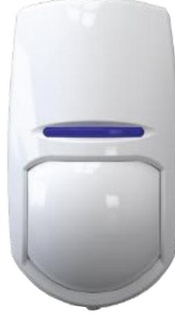

The DS-PD2-D10P-W is a flexible two-way wireless detector that utilizes microwave and PIR technology to ensure intruder catch performance is maintained even when the environment is hostile and there are fluctuations in temperature.

## **AVAILABLE MODEL**

DS-PD2-D10P-W

## **MAIN FEATURES**

- Microwave + PIR
- Pet Immunity up to 24kg
- Alarm: Tamper Alarm, Intruder Alarm
- Two-way Wireless Technology
- Signal Strength Indicators (SSI)

## **SPECIFICATION**

| Dual-Tech Detector       |                                      |
|--------------------------|--------------------------------------|
| Detection Range          | 10m, detection angle: 85°            |
| Detection Speed          | 0.3m/s ~ 3.0m/s                      |
| Transmission Range       | 800m in open space                   |
| Animal Immunity          | Up to 24kg                           |
| Transmission frequency   | 868MHz                               |
| Power Supply             | 2×CR123A, 3.0V, 2 years Battery life |
| Operation Temperature    | -10℃ ~ +40℃                       |
| Dimension(H*W*D)         | 117mm*69mm*59mm                      |
| Weight                   | 135g                                 |
| Installation Environment | Indoor                               |
| Installation Height      | 1.8m ~ 2.4m                          |

*Including 1 x Ceiling mounting bracket, 1 x Wall mounting bracket