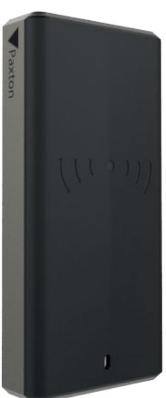
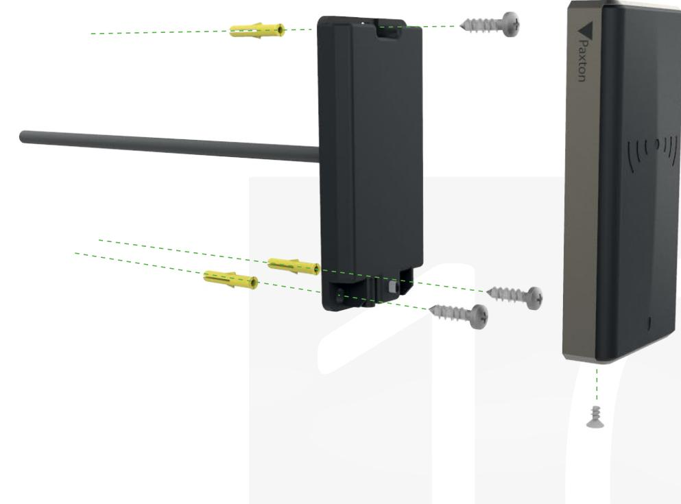

# Paxton10 Slimline-läsare

## Översikt

Vi fortsätter Paxtons gamla tradition genom att erbjuda ett brett utbud av läsartyper som passar alla applikationer - Slimline-läsaren har designats för att på ett diskret sätt passa in i alla interiörer samtidigt som installationen är mycket enkel tack vare den medföljande inkapslade kabeln på 5 m.

Trots att Slimline-läsaren har låg och kompakt profil innehåller den ändå alla funktioner man kan förvänta sig från en Paxton10-läsare. Den stöder alla typer av passerbrickor, däribland HID Prox®, Mifare®, Paxton och EM, samt Bluetooth för kommunikation med autentiseringsmetoder som stöder lång räcvkidd eller handsfree samt mobiltelefoner via Paxtonappen.

### Funktioner

- Flerformatsläsare som är kompatibel med Paxton,
- MIFARE ®, HID Prox, EM mm
- Gör det enkelt att använda de många olika typerna av passerbrickor på marknaden genom att stödja alla samtidigt
- Energisparläge med kapacitiv uppväckning
- Inbyggt stöd för lågenergi-Bluetooth för att kunna kommunicera med mobilen
- och bärbara enheter
- Enkel tvådelskonstruktion med inkapslad kabel på 4 m
- IP67-certifierad fyra sladdar

### Specifikationer

System

| Kompatibilitet med kodbrickor | Paxton, EM4100/02, Sony ®, FeliCa Lite-S  |
|-------------------------------|-------------------------------------------|
|                               | MIFARE® Classic, MIFARE® DESFire® EV1/EV2 |
|                               | MIFARE® Plus, MIFARE Ultralight®          |
|                               | MIFARE Ultralight C®, MIFARE Mini®, NFC®  |
|                               | Hitag2, HID® Prox 125kHz låg frekvens     |
|                               |                                           |

|  | El |  |
|--|----|--|

| Strömförbrukning | 1W (Max)    |
|------------------|----------------|
| Driftspänning    | 12V            |
| Strömförbrukning | 40mA (Passiv)  |
|                  | 100mA (Max) |

#### Kommunikation

| RFID-frekvens  | 125kHz & 13.56MHz        |
|----------------|--------------------------|
| Dataanslutning | RS485/Paxton10-protokoll |
| Bluetooth®     | 2.4 GHz                  |
|                |                          |

### Maskinvara

| Dimensioner (B x H x D)                             | 49mm x 104mm x 17.2mm |
|-----------------------------------------------------|-----------------------|
| Kabeltyp                                            | 22AWG, 4 tvinnat par  |
| Kabellängd                                          | 5m                    |
| Maxlängd på kabelförlängning (Dörrcentral > Läsare) | 100m                  |
| Ljud                                                | Piezo-klocka          |
| Färg                                                | Svart                 |
| Kapslingsmaterial                                   | PC+ABS                |
| Garanti                                             | 5-årig Paxtongaranti  |

#### Miljö

| Arbetstemperatur | -35°C - +66°C      |
|------------------|--------------------|
| IP-klass         | IP67               |
| IK-klass         | IK10               |
| Montering        | Endast ytmontering |