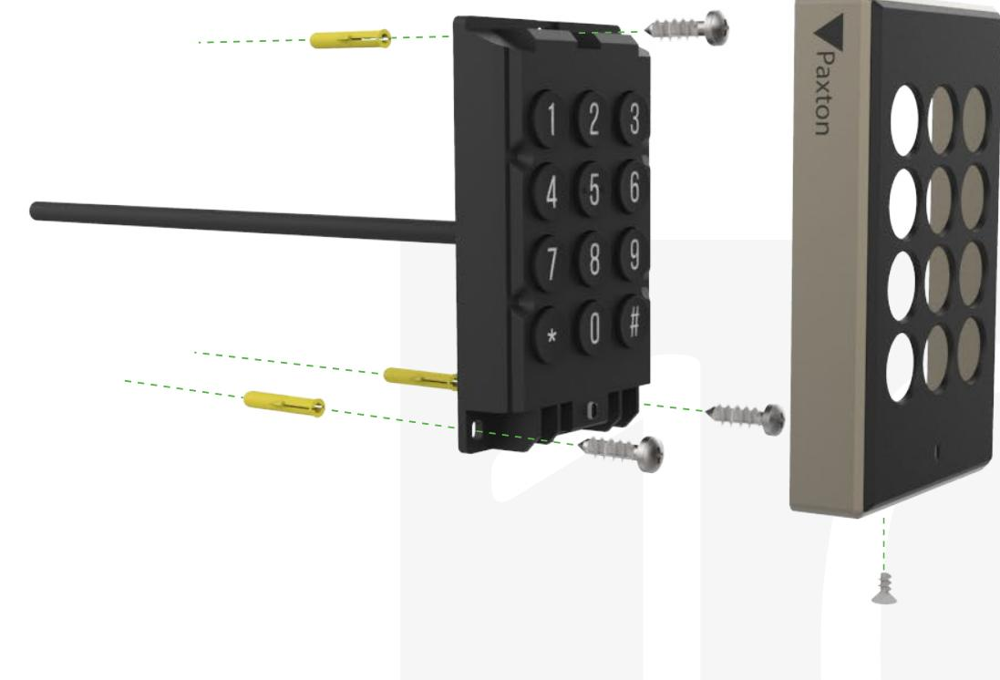
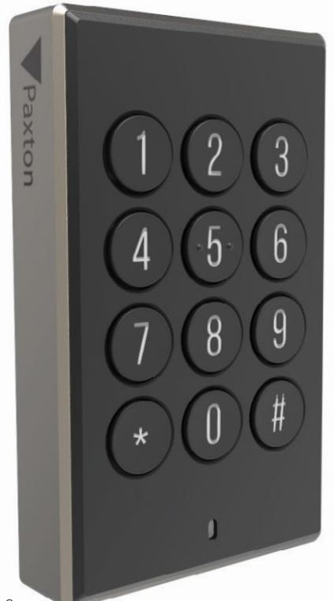

# Paxton10:s knappsatsläsare

## Översikt

Knappsatsläsaren gör att Paxton10-systemet får PIN- och kodstöd i elegant och enkel design med robust IP67-konstruktion.

Paxton10:s knappsatsläsare innehåller den allra senaste tekniken och stor mängd funktionalitet trots sitt beskedliga utförande. Den nya läsaren stöder alla större passerbrickor, däribland HID Prox®, Mifare®, Paxton och EM. Dessutom har den Bluetooth-kommunikation, vilket gör det möjligt att använda autentiseringsmetoder som stöder lång räckvidd eller handsfree samt mobiltelefoner via Paxton-appen.

Knappsatsläsaren har också LED-bakgrundsbelysning samtidigt som den använder minimalt med energi vid drift tack vare den inbyggda uppväckningsfunktionen.

## Funktioner

- Slitstark härdad silikonpanel
- Bakgrundsbelyst för enkel användning och identifiering i svagt ljus Gör det enkelt att använda de många olika typerna av passerbrickor på marknaden genom att stödja alla samtidigt
- Lästeknik i flerformat, vilket erbjuder kompatibilitet med Paxton, MIFARE, HID Prox®, EM och mer.
- Viloläge med låg effekt
- Inbyggt Bluetooth Smart och Low Energy-stöd för att möjliggöra kommunikation till mobila och bärbara enheter.
- Enkel 2-delad konstruktion med inkapslad 5m kabel ingår
- IP67 rankad
- Enkel installation med 4 sladdar

## Specifikationer

System

| Kompatibilitet med kodbrickor | Paxton, EM4100/02, Sony ®, FeliCa Lite-S  |
|-------------------------------|-------------------------------------------|
|                               | MIFARE® Classic, MIFARE® DESFire® EV1/EV2 |
|                               | MIFARE® Plus, MIFARE Ultralight®          |
|                               | MIFARE Ultralight C®, MIFARE Mini®, NFC®  |
|                               | Hitag2, HID® Prox 125kHz låg frekvens     |
|                               |                                           |

El

| Strömförbrukning | 1W    | (Max)    |
|------------------|-------|----------|
| Driftspänning    | 12V   |          |
| Strömförbrukning | 40mA  | (Passiv) |
|                  | 100mA | (Max)    |

### Kommunikation

| RFID-frekvens  | 125kHz & 13.56MHz        |
|----------------|--------------------------|
| Dataanslutning | RS485/Paxton10-protokoll |
| Bluetooth®     | 2.4GHz                   |

### Maskinvara

| Dimensioner (B x H x D)                             | 63.8mm x 104mm x 18.2mm |
|-----------------------------------------------------|-------------------------|
| Kabeltyp                                            | 22AWG, 4 tvinnat par    |
| Kabellängd                                          | 5m                      |
| Maxlängd på kabelförlängning (Dörrcentral > Läsare) | 100m                    |
| Ljud                                                | Piezo-klocka            |
| Färg                                                | Svart                   |
| Kapslingsmaterial                                   | PC+ABS                  |
| Garanti                                             | 5-årig Paxtongaranti    |

### Miljö

| Arbetstemperatur | -35°C - +66°C                |
|------------------|------------------------------|
| IP-klass         | IP67                         |
| IK-klass         | IK09                         |
| Montering        | Endast ytmontering           |
|                  | USA - adapter till bakstycke |