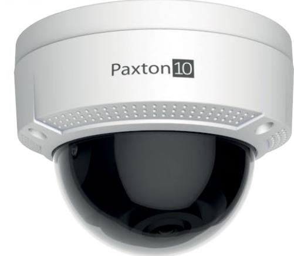
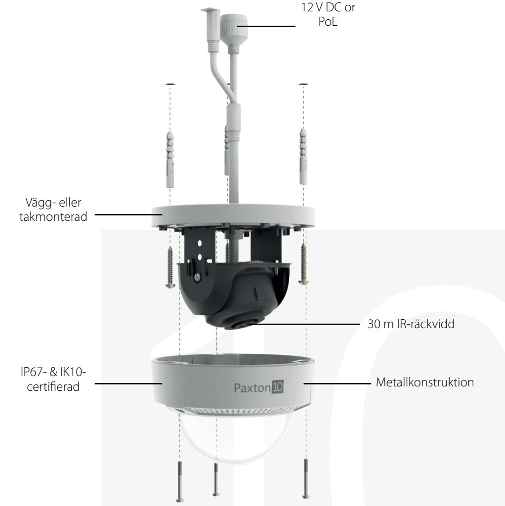
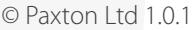

# Paxton10 kupolkamera i miniformat - 2,8 mm, 8 MP

# Översikt

Paxton10-kamerorna är särskilt framtagna för att fungera med Paxton10-systemet. På så sätt erbjuder de det enklaste, säkraste och mest flexibla installationsförfarandet. Varken NVR eller annan hårdvara krävs eftersom videomaterialet behandlas i kameran och kan lagras antingen på det förinstallerade SD-kortet på 128 GB eller skickas direkt till en nätverksplats.

Paxton10-kameran har också utmärkt prestanda vid dålig belysning, inbyggd IR, 4K-upplösning, PoE-strömförsörjning och täcks även av Paxtons 5-årsgaranti.

## Funktioner

- 8 MP sensor vid dålig belysning som kan spela in i upp till 4K
- SD-kort på 128 GB
- IP67-och IK10-certifiering
- Kan monteras antingen på vägg eller tak
- Kompat format
- 30 m IR-räckvidd
- 120 dB brett dynamiskt omfång
- 12V DC or PoE+
- 0,01 lux @ F1,2
- 2,8-12 mm fokallängd

### specifikationer

#### System

| Videoströmmar - Huvudström - Förval |           |
|-------------------------------------|-----------|
| Hög                                 |           |
| Upplösning                          | 4K        |
| Bildrutor per sekund                | 20fps     |
| Maximal bithastighet                | 12288kbps |
| Medel                               |           |
| Upplösning                          | 1080p     |
| Bildrutor per sekund                | 20fps     |
| Maximal bithastighet                | 3072kbps  |
| Låg                                 |           |
| Upplösning                          | 720p      |
| Bildrutor per sekund                | 15fps     |
| Maximal bithastighet                | 1536kbps  |
| Underström                          |           |
| Upplösning                          | 360p      |
| Bildrutor per sekund                | 10fps     |
| Maximal bithastighet                | 512kbps   |
| Ljudkompression                     | G711.u    |
| Bithastighet för ljud               | 64kbps    |
| Videokompression                    | H264      |
| Dag-/nattläge                       | Auto      |

El

| Strömförbrukning | 12v dc - 0,5A, Max 6,2W |
|------------------|-------------------------|
|                  | PoE: Max 9 W            |
| Driftspänning    | 12v DC ±25%             |
|                  | PoE 802.3af             |

#### Kommunikation

Maskinvara

| ONVIF | Nej |
|-------|-----|
| RTSP  | Nej |
| IP    | Ja  |

| Dimensioner (B x H x D) | Φ 111 × 82.4 mm                   |
|-------------------------|-----------------------------------|
| Vikt                    | 500g                              |
| SD-kort                 | Max 128 GB                        |
| Videoformat             | PAL/NTSC                          |
| Bildsensor              | 1/2-tums progressiv skanning CMOS |
| Fokallängd              | 2.8mm                             |
| Bländare                | F2.0                              |
|                         |                                   |

| Synfält                               | Horisontellt synfält: 102°         |
|---------------------------------------|------------------------------------|
| Justering i tre axlar (manuellt)      | Panorering: 0-355°, lutning: 0-75° |
|                                       | rotera: 0-355°                     |
| Material                              | Kropp: metall                      |
|                                       | Kupol: Plast                       |
| Garanti                               | 5-årig Paxtongaranti               |
| SD-kortspecifikationer (ingår)        |                                    |
| Lagringskapacitet:                    | 128GB                              |
| Läshastighet                          | 95MB/s                             |
| Skrivhastighet                        | 25 MB/s                            |
| Klass                                 | Klass 10, U1                       |
| Rekommenderade SD-kortspecifikationer |                                    |
| Lagringskapacitet:                    | 128 GB (maxgräns)                  |
| Korttyp                               | Micro SDXC                         |
| Klass                                 | UHS Klass 1                        |
| Minnestyp                             | MLC (Multi-Level cell)             |

Miljö

| Arbetstemperatur | -30°c to +60°c |
|------------------|----------------|
| IP-klass         | IP67           |
| IK-klass         | IK10           |
| Montering        | Vägg eller tak |

