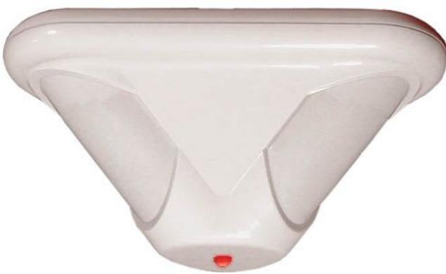
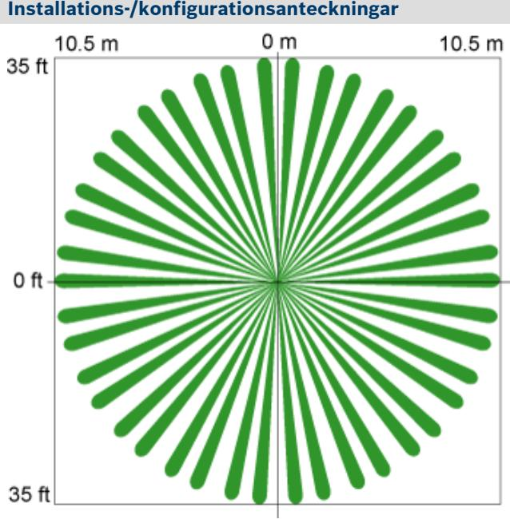
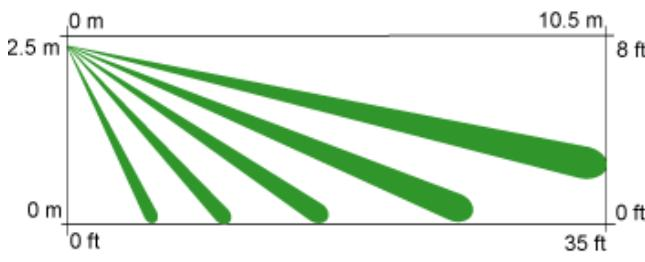

# **DS939 – PIR-detektor för takmontage**

- ▶ **Upp till 7,6 m monteringshöjd**
- ▶ **Justerbar optik för objektsanpassning av täckningsområde**
- ▶ **Ledad bottenplatta ger enkel installation**
- ▶ **Högeffektiv lysdiod och ljusledarsystem ger enkelt gångtest**
- ▶ **FSP-signalbehandling (First Step Processing)**
- ▶ **Täckningområde: 360° x 21 m**

Den takmonterade PIR-detektorn DS939 har ett rundstrålande täckningsområde på 21 m och kan användas i takhöjder upp till 7,6 m. Med tre separata individuellt justerbara PIR-sektioner ger DS939 en fullständig övervakning i alla monteringshöjder samt möjligheten att skräddarsy övervakningen för särskilda områden. I DS939 används flera patenterade signalbehandlingstekniker för bästa detekteringsförmåga utan att riskera falsklarm.

## **Funktioner**

## **Signalbehandling**

Använder passiv IR-teknik för att ge ett larmtillstånd när bevakningsområdet aktiveras. Larmsignalerna måste uppfylla krav enligt signalbehandlingen för att utlösa ett larm.

## **FSP-signalbehandling**

FSP-signalbehandlingen reagerar omedelbart på människor utan att funktionerna för att undvika falsklarm från andra källor försvinner. Genom att justera känsligheten baserat på signalens amplitud, polaritet, lutning och timing behöver installatören inte välja känslighetsnivå.

#### **Testfunktioner**

- Högeffektiv lysdiod och ljusledarsystem ger gångtestindikering synlig från vilken vinkel och monteringshöjd som helst.
- Med hjälp av larmminnesfunktionen kan larmindikering kvarhållas för enkel lokalisering av utlöst detektor.
- Genom fjärrstyrning av gångtestlysdioden aktiveras eller avaktiveras lysdioden med hjälp av en styrsignal utan att detektorn behöver öppnas.

## **Certifikat och godkännanden**

| Land   | Certifikat/listnummer                                              |
|--------|--------------------------------------------------------------------|
| Kanada | ULC-S306, larm för inbrottsdetektering certifierade för Ka nada |
| Europa | X Uppfyller EN50131-1 nivå 2                                    |
| USA    | UL639, larm för inbrottsdetektering c-UL-us                     |

**Uppifrån**

#### *Från sidan*

## **Täckningsinformation**

Täckningen är 360° x 21 m i diameter när detektorn är monterad vid 3,7 till 7,6 m.

Täckningen är 15 m i diameter när detektorn är monterad vid 3 m.

Täckningen är 12 m när detektorn är monterad vid 2,4 m.

Täckningsområdet består av 69 zoner indelade i 21 barriärer. Varje barriär är 11 m lång och 1,5 m bred vid 11 m. Barriärerna är indelade i tre grupper med sju i varje. Varje grupp har vertikal justering för anpassad täckning.

## **Tekniska specifikationer**

#### **Kapsling**

| Egenskaper: | Modulfästet och ledad bottenplatta ger enkel åtkomst till inställningskontakter och kablage. |
|-------------|-------------------------------------------------------------------------------------------------|
| Mått:       | 8,9 x 17,8 cm cm                                                                             |

## **Miljöspecifikationer**

| Drifttemperatur: | -40 till +49 °C För UL-certifierade installationer, 0 till +49 °C |
|------------------|----------------------------------------------------------------------|
| Känslighet       | Låg/hög-inställningar                                                |

Uppfyller miljöklass II (EN50130-5)

#### **Montering**

| Höjd:                          | 3 till 7,6 m rekommenderas                                                                                                 |  |
|--------------------------------|----------------------------------------------------------------------------------------------------------------------------|--|
| Plats:                         | Monteras direkt i taket.                                                                                                   |  |
| Intern riktnings justering: | Övervakning kan justeras ±10° horisontellt, +2° till -18° vertikalt.                                                    |  |
| Utgångar                       |                                                                                                                            |  |
| Larmrelä:                      | Ljudlöst form C-relä. Kontakter för 125 mA, 28 V DC, 3 W maximalt för likströmsresistiva belastningar.                  |  |
| Sabotage skydd:             | Normalt sluten (med locket på) sabotagekontakt. Ett vägg sabotageskydd ingår. Kontakter för 28 V DC, 125 mA, max 3 W |  |
| Strömspecifikationer           |                                                                                                                            |  |
| Strömför brukning:          | 12 mA viloläge, 39 mA i larm med lysdioder aktiverade                                                                      |  |

Spänning: 9–15 V DC

## **Beställningsinformation**

| DS939 – PIR-detektor för takmontage       | DS939 |
|-------------------------------------------|-------|
| Rundstrålande täckningsområde på 21 m och |       |
| kan användas i takhöjder upp till 7,6 m.  |       |

**Sweden:** Bosch Security Systems AB Vestagatan 2 416 64 Göteborg Phone: +46 31 722 5300 Fax: +46 31 722 5340 se.securitysystems@bosch.com www.boschsecurity.se

**Represented by**