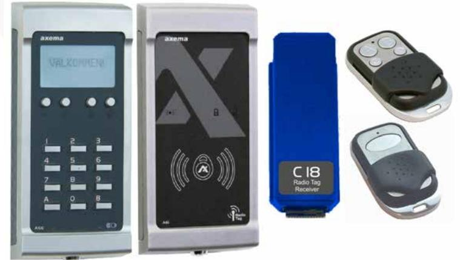
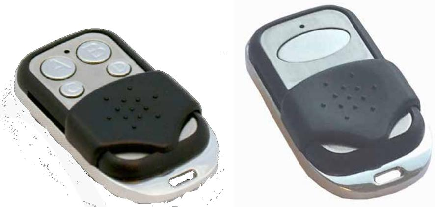
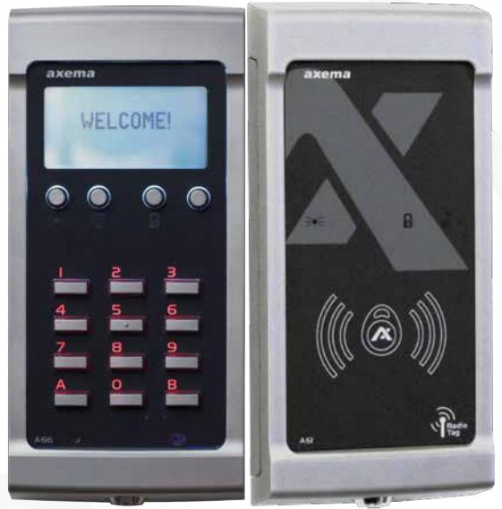
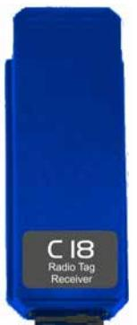
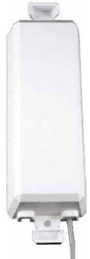

# Data Sheet

Updated 2018-11-17

# Radio

For remote opening of gates etc.

### Functions and application

A radio key in combination with a radio receiver can be used top remotely open doors and/ or control relays (C17). Radio receivers are available in C18, A61 and A66 (Stand -alone and VAKA)

## Radio keys

- l Radio key for C18, A66 and A61 with one or four buttons.
- l The radio keys have unique identities and is connected to persons in VAKA the same way as a card or tag. The radio keys can be time sensitive, black listed or given access to different doors.
- l Elegant design with sliding cover to prevent accidental button presses.
- l The communication between radio keys and receivers is encrypted to provide high protection against interception.
- l Range depending on surroundings (5-100 m).

| Attributes        | RN18-4   | RN18-1   |
|-------------------|----------|----------|
| No. of buttons    | 4        | 1        |
| IP classification | IP40     | IP40     |
| Frequency         | 868 Mhz  | 868 Mhz  |
| Article number    | 2-5000   | 2-5001   |
| E number          | E5870464 | E5870982 |

### A66 and A61

The readers A66 and A61 have receivers for Axema's radio keys

## C18 Radio Module

- l C18 is a plug in module with built in radio reciever for B27 The radio receiver allow gates and door to be opened remotely, for example, without stopping or getting out of a car.
- l With C18 and external antenna, 100 m reading distance can be accomplished, which results in convenient gate openings before the car has arrived.
- l C18 and RN18-4 can be configured to open different doors or control relays (C17) in the VAKA system using different buttons.

#### Attributes

#### Wall mounted antenna for C18

- l External antenna with 3 m cable, designed to be mounted on a wall outside.
- l Improves range.

| Article number | 2-3180   |
|----------------|----------|
| E number       | E5870457 |