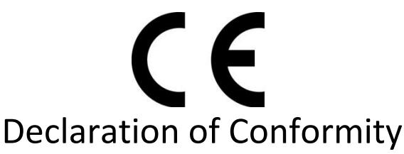

| Manufacturer:                        | Develco Products A/S                                   |
|--------------------------------------|--------------------------------------------------------|
|                                      | Tangen 6                                               |
|                                      | DK-8200, Aarhus N, Denmark                             |
| Declares that the following product: |                                                        |
| Product Name (market name)           | Panic Button                                           |
|                                      | Type(s) PBTZB-110                                      |
| Product description                  | Panic Button with ZigBee transmission. Battery driven. |
| Production Options                   | Third party manufacture allowed                        |
| Date of marking                      | 1th June 2019                                          |

In accordance with the directives:

| Radio Equipment Directive (RED) | 2014/53/EU                      |
|---------------------------------|---------------------------------|
| EMC Directive                   | 2014/30/EU                      |
| RoHS Directive                  | 2015/863/EU amending 2011/65/EU |
| REACH                           | 1907/2006/EU + 2016/1688        |

Is in compliance with the following harmonised standards & specifications:

| Frequency Emission | ETSI EN 300 328 V2.1.1     |
|--------------------|----------------------------|
| EMC                | EN 301 489-1 V2.2.3        |
|                    | EN 301 489-17 V3.2.2       |
| Product Safety     | EN 62368-1: 2014 +A11:2017 |
|                    | EN 62479:2010              |
| RoHS               | EN 50581:2012              |

| Canada – IC ID | 21398-PBTZB110                          |
|----------------|-----------------------------------------|
| RF Exposure    | RSS102 Issue 5 March                    |
| Radio Spectrum | RSS-247 Issue 2, February 2017          |
|                | RSS-Gen Issue 5, March 2019 Amendment 1 |

| US – FCC ID    | 2AHNM-PBTZB110                   |
|----------------|----------------------------------|
| SAR Exposure   | 47 CFR Part 2.1093               |
| Radio Spectrum | 47 CFR Part 15, Subpart C 15.247 |

European Contact details: Develco Products A/S Tangen 6, DK-8200, Aarhus N, Denmark Email: info@develcoproducts.com

_______________________

Karsten Ries CEO Date: 19/8-2020