## **Installation Guide**

The world's favourite lock

## Congratulations on purchasing your new Yale Doorman digital door lock

You have just purchased the most convenient and secure digital door lock on the market.

Yale has been a leader and pioneer in the residential door lock market since 1843 when Linus Yale first patented his revolutionary designs for a cylinder lock.

Ever since then Yale has been developing innovative new locking solutions around the World that meet the needs of todays busy house holds.

Yale understands the importance of combining the peace of mind that comes from having a proven high security lock with the benefits of having a genuinely convenient locking solution. Your Yale Doorman Digital Door lock has been rigorously tested in the severest weather conditions and has been developed in accordance with the exacting Scandinavia door lock standards.

With our hectic and demanding lifestyles Yale knows how important it is that locking your home is made as easy and convenient as possible. Yale Doorman has been designed with you in mind, whether you just want the freedom not to have to carry a key or you want the ability to quickly and easily control who can or can't enter your home.

We are convinced that once you have experienced the flexibility and convenience of your new Digital door lock you will never want to go back to carrying a bunch of keys again.

Welcome to the world of Yale Doorman Digital door locks – unlock your life.

Tryck in låset i dörren, se bifogad mall så det stämmer med din dörr

Skyv låsen inn i døren, pass på at kabel kommer ut av øverste hull på innsiden

- Tryck in låset i dörren, se bifogad mall så det stämmer med din dörr
- Insert the lock to the door, see attached template

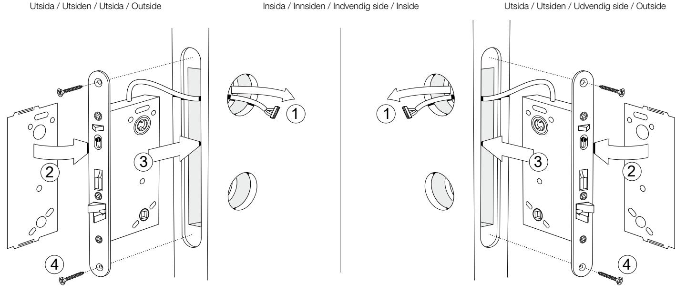

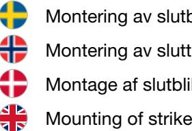

Montering av slutbleck Montering av sluttstykke i karm Montage af slutblik

Placering av slutbleck i förhållande till låshus Plassering mellom sluttstykke og låskasse Placering af slutblik i forhold til låsekasse Positioning of strike in relation to lock

Ställ in för vänsterdörr

Innstilling for venstre hengslet dør

Indstilling for venstre dør

Set for left door

4 3

1 1

2 2

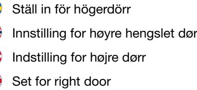

2 2

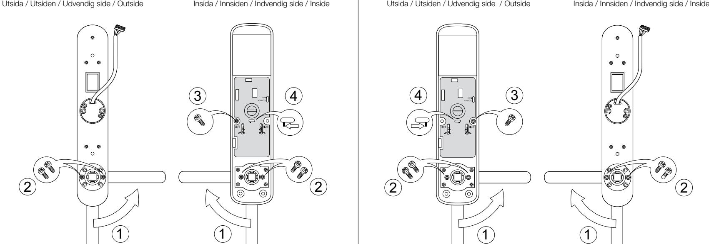

Sätt dit utsidan

Sett på plass

- Placer det udvendige skilt på døren med den dobbelt klæbende tape
Mount the outside

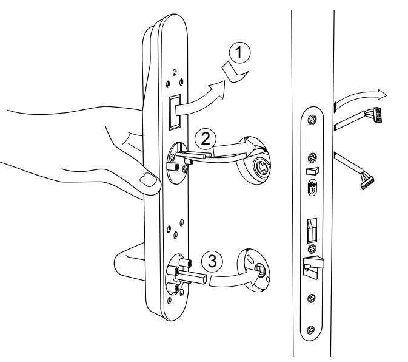

Skruva ihop utsidan med insidans plåt

- Skru sammen utvendig skilt med innvendig monteringsplate
- Skru det udvendige skilt sammen med den indvendige montage plade
- Fasten the outside with the inside plate

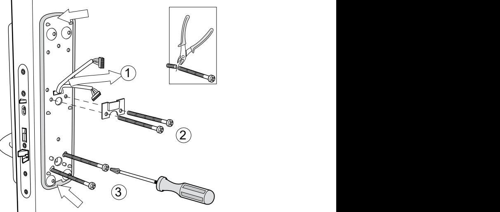

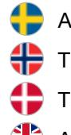

Anpassa vredpinnen

- Tilpass lengde på medbringer
- Tilpas vrider pinden
- Adjust the length of the follower

Koppla in sladdarna på insidan Koble til kabler på innvendig skilt

Isæt kabler på indersiden

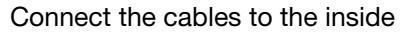

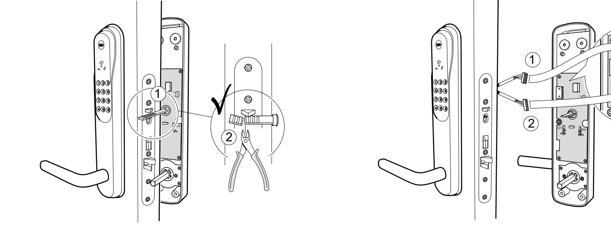

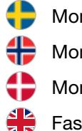

Montera fast insidan

Montere innvendig skilt

Monter det indvendige skilt med medfølgende skruer

Fasten the inside

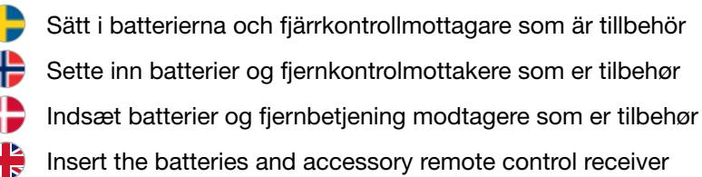

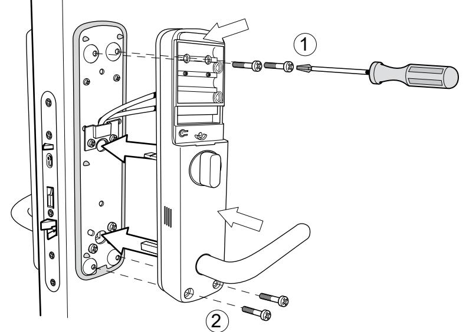

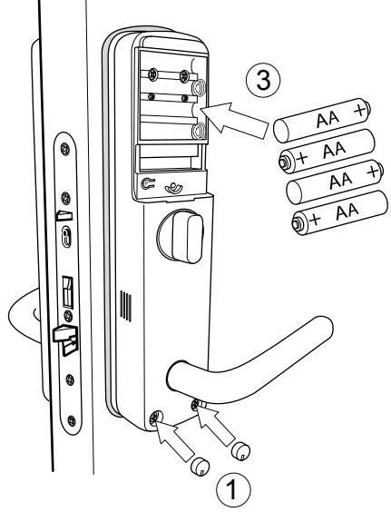

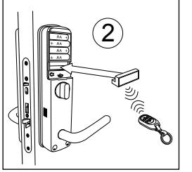

Registrera kod Legge inn masterkoden Programmer masterkode Register code

P

P

Card-key"s"

Card-key"s"

Sprogindstilling

Sprogindstilling

Lås døren fra

Lås døren fra

udvendig side

udvendig side

Lås døren fra

Lås døren fra

indvendig side

indvendig side

Ready program

Ready program

Master

Master

key-code

key-code

Ready program

Ready program

6 - 12 digit key code

Confirm program

Confirm program

Confirm program

Confirm program

Program key-code

Program key-code

6 - 12 digit key code

Identify card-key"s"

Identify card-key"s"

Slå koden, 6-12 siffror Legg inn masterkoden, 6-12 sifferr Indtast ny masterkode, 6-12 cifre Enter your code, 6-12 digits

P P

P P

Bekräfta med **P** knappen Bekreft med **P** knappen Bekræft med **P** knappen Confirm with the **P** button

> +# +#

> +# +#

+# +#

+# +#

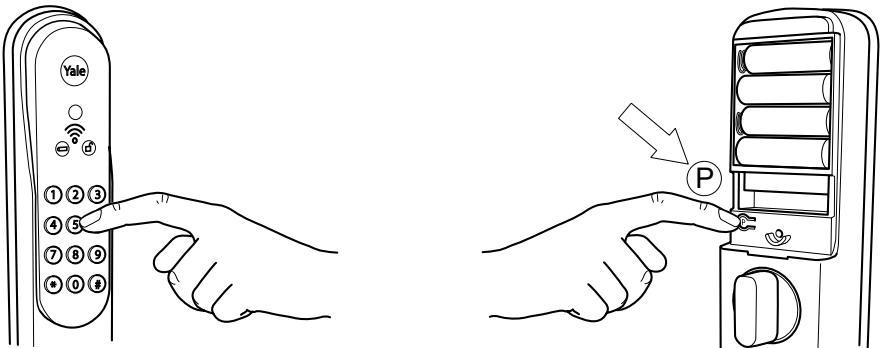

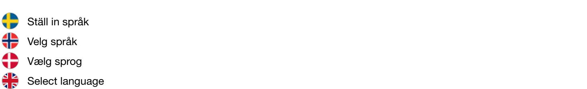

Tryck # kod (6-12 siffror) # Trykk # masterkoden (6-12 siffer) # Tryk # efterfulgt af masterkode (6-12 cifre), bekræft med # Push # code (6-12 digits) #

P

P

P

Tryck 1 (språkinställningar) bekräfta med # Trykk 1 (språkinstilling) bekreft med # Tryk 1 for sprogindstillinger, bekræft med # Push 1 (language settings) confirm with #

P P

Tryck 3 för svenska, bekräfta med # Trykk 2 for Norsk språk, bekreft med # Tryk 1 for Dansk, bekræft med # Tryck 4 för engelska, bekräfta med #

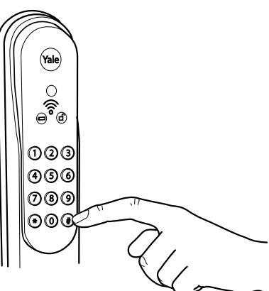

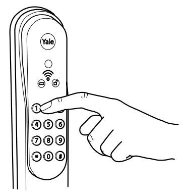

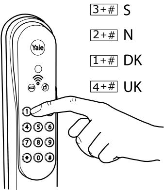

+# +#

+# +#

3 2 1

4

P

P

P

Card-key"s"

Card-key"s"

Card-key"s"

Sprogindstilling

Sprogindstilling

Sprogindstilling

Lås døren fra

Lås døren fra

Lås døren fra

udvendig side

udvendig side

udvendig side

Lås døren fra

Lås døren fra

Lås døren fra

indvendig side

indvendig side

indvendig side

Ready program

Ready program

Ready program

Master

Master

Master

key-code

key-code

key-code

Ready program

Ready program

Ready program

6 - 12 digit key code

Confirm program

Confirm program

Confirm program

Confirm program

Confirm program

Confirm program

Program key-code

6 - 12 digit key code

Program key-code

6 - 12 digit key code

Program key-code

Identify card-key"s"

Identify card-key"s"

Identify card-key"s"

Skruva fast luckan

Skru på batterideksel

Skru batteridækslet fast med medfølgende unbraco nøgle

Fasten the battery cover

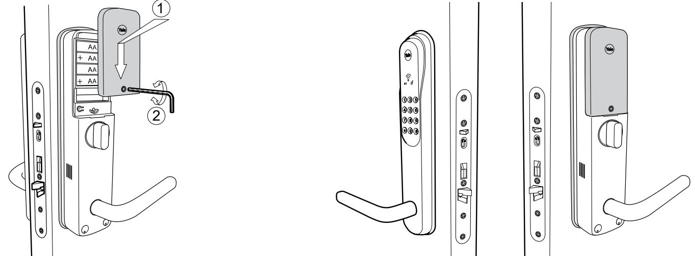

För ytterligare programmeringar och inställning, se Quick Guide. / For flere programmeringer og innstillinger, se Quick Guide. For yderligere programmering og indstillinger, se Quick Guide. / For more information about programming and installation, see Quick Guide.

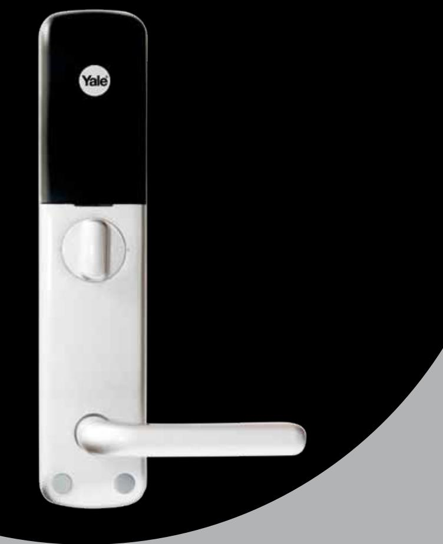

## The world's favourite lock

**YALE,** *with its unique global reach and range of products, is the world's favorite lock – the preferred solution for securing your home, family and personal belongings.*

**ASSA ABLOY** *is the global leader in door opening solutions, dedicated to satisfying end-user needs for security, safety and convenience*.

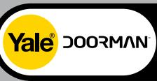