### TS 93 B:

Användningsområde:

Dörrstängare TS 93 B med justerbar stängningsstyrka från 2-5 EN, för dörrbladsmontage på gångjärnssidan och karmmontage på anslagssidan.

# Färgval:

Silvereloxerad, vit och specialfärg.

# Garanti:

2 års garanti från produktionsdatum. Produktionsdatum finns under täckkåpan på ena kortsidan av dörrstängaren.

# Placering av dörrstängare:

Vi rekommenderar att alla dörrstängare monteras på insidan av dörren, om dörrstängaren måste monteras på utsidan måste den monteras under tak så att den inte utsätts för regn och snö.

Maximal temperaturvariation som dörrstängaren klarar är -20 grader till +40 grader. Varierande temperatur medför att dörren stänger långsamt när det är kallt och snabbt när det är varmt.

# Underhåll:

- Kontroll av skruvarna som fäster dörrstängare och glidskena vid dörren/karmen.
- Kontrollera eventuellt oljeläckage på stängarhuset.
- Kontroll av skruvarna som förbinder dörrstängare och arm.
- Kontrollera att dörren stänger tillfredsställande och att den går lätt i karmen och att låsmekanismen fungerar tillfredsställande.
- Justera stängningshastighet och tillslag enligt kap itlet om montering och justering av TS 93 B i Montörs handboken.

# Underhållsfrekvens:

1-2 gånger om året. Används dörren mycket 2 gånger, används dörren lite, 1 gång.

Rekommenderat underlag för dörrstängare/glidskena: Förstärkt metall, aluminium, massivt trä, monteringsplatta eller vinkelkonsol.

Reservdelar:

Dörrstängare, täckkåpa, glidskena, arm, glidkloss.

Köp av dörrstängare och reservdelar: Reservdelar och nya dörrstängare kan köpas hos våra återförsäljare.

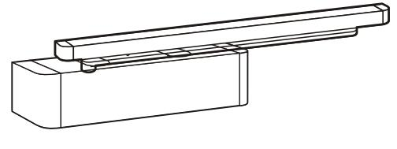

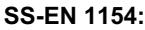

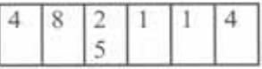

# TS 93 G:

Användningsområde:

Dörrstängare TS 93 G med justerbar stängningsstyrka från 2-5 EN, för dörrbladsmontage på anslagssidan och karmmontage på gångjärnssidan.

## Färgval:

Silvereloxerad, vit och specialfärg.

#### Garanti:

2 års garanti från produktionsdatum. Produktionsdatum finns under täckkåpan på ena kortsidan av dörrstängaren.

# Placering av dörrstängare:

Vi rekommenderar att alla dörrstängare monteras på insidan av dörren, om dörrstängare måste montera på utsidan så måste den monteras under tak så att den inte utsätts för regn och snö. Maximal temperaturvariation som dörrstängaren klarar är -20 grader till +40 grader. Varierande temperatur medför att dörren stänger långsamt när det är kallt och snabbt när det är varmt.

### Underhåll:

- Kontroll av skruvarna som fäster dörrstängare och glidskenan vid dörren/karmen.
- Kontrollera eventuellt oljeläckage på stängarhuset.
- Kontroll av skruvarna som förbinder dörrstängare och arm.
- Kontrollera att dörren stänger tillfredsställande och att den går lätt i karmen och att låsmekanismen fungerar tillfredsställande.
- Justera stängningshastighet och tillslag enligt kapitlet om montering och reglering av TS 93 G i Montörshandboken.

Underhållsfrekvens:

1-2 gånger per år. 2 gånger om dörren används mycket och om den används lite, 1 gång.

Rekommenderat underlag för dörrstängare/glidskena: Förstärkt metall, aluminium, massivt trä, monteringsplatta eller vinkelkonsol.

Reservdelar: Dörrstängare, täckkåpa, glidskena, arm, glidkloss.

Köp av dörrstängare och reservdelar: Reservdelar och nya dörrstängare kan köpas hos våra återförsäljare.

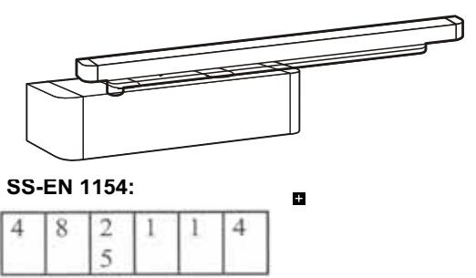

### TS 93 B:

Användningsområde:

Dörrstängare TS 93 B med justerbar stängningsstyrka från 5-7 EN, för dörrbladsmontage på gångjärnssidan och karmmontage på anslagssidan.

# Färgval:

Silvereloxerad, vit och specialfärg.

### Garanti:

2 års garanti från produktionsdatum. Produktionsdatum finns under täckkåpan på ena kortsidan av dörrstängaren.

### Placering av dörrstängare:

Vi rekommenderar att alla dörrstängare monteras på insidan av dörren, om dörrstängaren måste monteras på utsidan måste den monteras under tak så att den inte utsätts för regn och snö. Maximal temperaturvariation som dörrstängaren klarar är -20 grader till +40 grader. Varierande temperatur medför att dörren stänger långsamt när det är kallt och snabbt när det är varmt.

### Underhåll:

- Kontroll av skruvarna som fäster dörrstängare och glidskena vid dörren/karmen.
- Kontrollera eventuellt oljeläckage på stängarhuset.
- Kontroll av skruvarna som förbinder dörrstängare och arm.
- Kontrollera att dörren stänger tillfredsställande och att den går lätt i karmen och att låsmekanismen fungerar tillfredsställande.
- Justera stängningshastighet och tillslag enligt kapitlet om montering och reglering av TS 93 B i Montörs handboken.

Underhållsfrekvens:

1-2 gånger om året. 2 gånger om dörren används mycket och 1 gång om dörren används lite.

Rekommenderat underlag för dörrstängare/glidskena: Förstärkt metall, aluminium, massivt trä, monteringsplatta eller vinkelkonsol.

Reservdelar:

Dörrstängare, täckkåpa, glidskena, arm, glidkloss.

Köp av dörrstängare och reservdelar: Reservdelar och nya dörrstängare kan köpas hos våra återförsäljare.

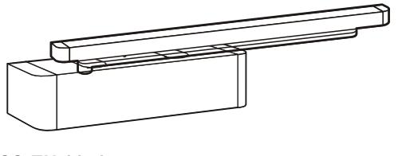

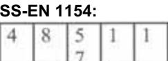

### TS 93 G:

Användningsområde:

Dörrstängare TS 93 G med justerbar stängningsstyrka från 5-7 EN, för dörrbladsmontage på anslagssidan och för karmmontage på gångjärnssidan.

### Färgval:

Silvereloxerad, vit och specialfärg.

#### Garanti:

2 års garanti från produktionsdatum. Produktionsdatum finns under täckkåpan på ena kortsidan av dörrstängaren.

# Placering av dörrstängare:

Vi rekommenderar att alla dörrstängare monteras på insidan av dörren, om dörrstängaren måste monteras på utsidan måste den monteras under tak så att dörrstängaren inte utsätts för regn och snö. Maximal temperaturvariation som dörrstängaren klarar är -20 grader till +40 grader. Varierande temperatur medför att dörren stänger långsamt när det är kallt och snabbt när det är varmt.

### Underhåll:

- Kontroll av skruvarna som fäster dörrstängare och glid skena vid dörren/karmen.
- Kontrollera eventuellt oljeläckage på stängarhuset.
- Kontroll av skruvarna som förbinder dörrstängare och arm.
- Kontrollera att dörren stänger tillfredsställande och att den går lätt i karmen och att låsmekanismen fungerar tillfredsställande.
- Justera stängningshastighet och tillslag enligt kapitlet om montering och reglering av TS 93 G i Montörs handboken.

Underhållsfrekvens:

1-2 gånger per år. 2 gånger om dörren används mycket och 1 gång om dörren används lite.

Rekommenderat underlag för dörrstängare/glidskena: Förstärkt metall, aluminium, massivt trä, monteringsplatta eller vinkelkonsol.

Reservdelar:

Dörrstängare, täckkåpa, glidskena, arm, glidkloss.

Köp av dörrstängare och reservdelar: Reservdelar och nya dörrstängare kan köpas hos våra återförsäljare.

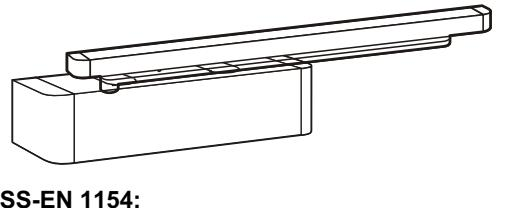

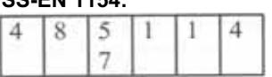

## G 92 / 93 N:

Användningsområde:

Glidskena för användning till alla varianter av TS 93 och TS 92.

Färgval: Silvereloxerad, vit och specialfärg.

Garanti:

2 års garanti från produktionsdatum.

Placering av G 92 / 93 N:

Vi rekommenderar att glidskenan monteras parallellt med dörrstängaren och att montaget sker enligt kapitlet om montering och reglering i Montörshandboken.

Underhåll:

- Kontroll av skruvarna som fäster armen till dörr stängaren och glidskenan vid dörren/karmen.
- Kontrollera eventuellt slitage på glidkloss/glid skena.
- Kontroll av skruvarna som förbinder dörrstängare och arm.
- Smörjmedel, olja eller fett får inte användas i glidskenan, då detta medför uppsamling av smuts i glidskenan.

Underhållsfrekvens:

1-2 gånger per år. 2 gånger om dörren används mycket och 1 gång om den används lite.

Rekommenderat underlag för glidskena: Förstärkt metall, aluminium, massivt trä, monteringsplatta eller vinkelkonsol.

Reservdelar:

Glidskena, arm, ändkåpa, glidkloss.

Köp av glidskenor och reservdelar: Reservdelar och nya glidskenor kan köpas hos våra återförsäljare.

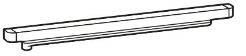

#### G 93 EMF:

# Användningsområde:

Glidskena för användning till alla varianter av TS 93 för användning på enflygliga branddörrar som ska stå uppställda med en signal från brandlarmet.

Färgval: Silvereloxerad, vit och specialfärg.

Garanti: 2 års garanti från produktionsdatum.

#### Placering av G 93 EMF:

Vi rekommenderar att glidskenan monteras parallellt med dörrstängaren och att montaget sker enligt kapitlet om montering och reglering i Montörshandboken.

### Underhåll:

- Kontroll av skruvarna som fäster armen på dörr stängaren och glidskenan på dörren/karmen.
- Kontrollera eventuellt slitage på glidklossar/glid skenan.
- Kontroll av skruvarna som förbinder dörrstängare och arm.
- Kontrollera att drifts-spänningen inte ligger utan för produktens normer 24V DC +/- 15%.
- Smörjmedel, olja eller fett får inte användas i glid skenan, då detta medför att smuts samlas i glid skenan.

### Underhållsfrekvens:

1-2 gånger per år. Används dörren mycket 2 gånger och om den används lite 1 gång.

Rekommenderat underlag för glidskena: Förstärkt metall, aluminium, massivt trä, monteringsplatta eller vinkelkonsol.

Reservdelar:

Glidskena, arm, täckkåpa, ändkåpa, glidkloss och uppställningsenhet.

Köp av reservdelar:

Reservdelar och nya glidskenor kan köpas hos våra återförsäljare.

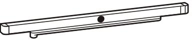

### G 93 GSR:

Användningsområde:

Glidskena för användning till TS 93 B och TS 93 vridlager för koordinering av dubbelflygliga dörrar. Glidskenan ska monteras på gångjärnssidan.

# Färgval: Silvereloxerat, vit och specialfärg.

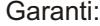

2 års garanti från produktionsdatum.

#### Placering av G 93 GSR:

Vi rekommenderar att glidskenan monteras parallellt med dörrstängaren och att montaget sker enligt kapitlet om montering och reglering i Montörshandboken.

### Underhåll:

- Kontroll av skruvarna som fäster armarna på dörr stängaren och glidskenan på karmen.
- Kontrollera eventuellt slitage på glidklossar och glidskenor.
- Kontroll av skruvarna som förbinder dörrstängaren och armen.
- Kontrollera att dörren stänger tillfredsställande och att den går lätt i karmen och att låsmekanismen fungerar tillfredsställande.
- Justering av stängningshastighet och tillslag enligt kapitlet om montering och reglering av dörrstängare i Montörshandboken.
- Kontrollera att dörrarna stänger i rätt ordning.
- Smörjmedel, olja eller fett får inte användas i glid-
- skenan då detta samlar smuts i glidskenan.

#### Underhållsfrekvens:

1-2 gånger per år. 2 gånger om dörren används mycket och 1 gång om den används lite.

Rekommenderat underlag för glidskenan: Förstärkt metall, aluminium, massivt trä, monteringsplatta eller vinkelkonsol.

Reservdelar: Glidskena, arm, täckkåpa, glidkloss och koordinatorstång.

Köp av reservdelar: Reservdelar och nya glidskenor kan köpas hos våra återförsäljare.

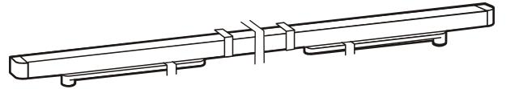

### G 93 GSR EMF 1 - EMF 2 - EMF 1G:

Användningsområde:

Glidskena för användning ihop med TS 93 B för koordinering och uppställning av dubbelflygliga dörrar. Glidskenan ska monteras på gångjärnssidan.

Färgval:

Silvereloxerad, vit och specialfärg.

Garanti:

2 års garanti från produktionsdatum.

# Placering av G 93 GSR EMF:

Vi rekommenderar att glidskenan monteras parallellt med dörrstängaren och att montaget sker enligt kapitlet om montering och justering i Montörshandboken.

#### Underhåll:

- Kontroll av skruvarna som fäster armen på dörrstängaren och glidskenan på karmen.

- Kontrollera eventuellt slitage på glidklossar och glidskenor.
- Kontroll av skruvarna som förbinder dörrstängare och arm.

- Kontrollera att dörrarna stänger tillfredsställande och att de går lätt i karmen och att låsmekanismen fungerar tillfredsställande.

- Justering av stängningshastighet och tillslag enligt kapitlet om montering och justering av dörrstängare i Montörshandboken.

- Kontrollera att dörrarna stänger i rätt ordning.
- Smörjmedel, olja eller fett får inte användas i glidskenan då detta medför att smuts samlas i glidskenan.

- Kontrollera att driftsspänningen inte ligger utanför produktens normer 24 V DC +/- 15%.

### Underhållsfrekvens:

1-2 gånger per år. 2 gånger om dörren används mycket och 1 gång om den används lite.

Rekommenderat underlag för glidskena:

Förstärkt metall, aluminium, massivt trä, monteringsplatta eller vinkelkonsol.

Reservdelar:

Glidskena, arm, täckkåpa, glidkloss, koordinatorstång och uppställningsenhet

Köp av reservdelar:

Reservdelar och nya glidskenor kan köpas hos våra återförsäljare.

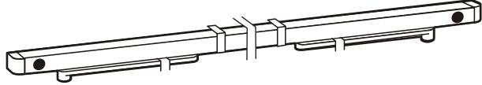